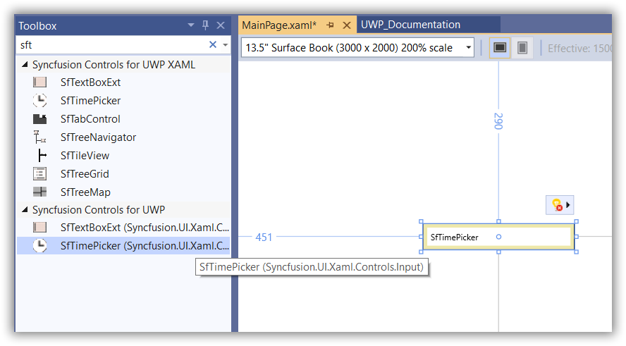
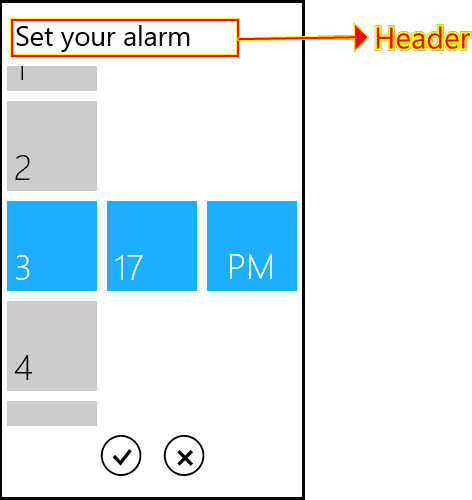

# Getting Started with UWP TimePicker (SfTimePicker)

This section provides a quick overview for working with [SfTimePicker](https://help.syncfusion.com/cr/uwp/Syncfusion.UI.Xaml.Controls.Input.SfTimePicker.html) control.

## Assembly deployment
Refer to the [control dependencies](https://help.syncfusion.com/uwp/control-dependencies#sftimepicker) section to get the list of assemblies or NuGet package that needs to be added as a reference to use the [SfTimePicker](https://help.syncfusion.com/cr/uwp/Syncfusion.UI.Xaml.Controls.Input.SfTimePicker.html) control in any application.

## Creating Application with SfTimePicker control
In this walk through, user will create a UWP application that contains [SfTimePicker](https://help.syncfusion.com/cr/uwp/Syncfusion.UI.Xaml.Controls.Input.SfTimePicker.html) control.
1. [Creating project](#Creating-the-project)
2. [Adding control via designer](#Adding-control-via-designer)
3. [Adding control manually in XAML](#Adding-control-manually-in-XAML)
4. [Adding control manually in C#](#Adding-control-manually-in-C#)

## Creating project 
Below section provides detailed information to create new project in Visual Studio to display [SfTimePicker](https://help.syncfusion.com/cr/uwp/Syncfusion.UI.Xaml.Controls.Input.SfTimePicker.html) control.

## Adding control via designer
The [SfTimePicker](https://help.syncfusion.com/cr/uwp/Syncfusion.UI.Xaml.Controls.Input.SfTimePicker.html) control can be added to the application by dragging it from Toolbox and dropping it in designer. The required assembles will be added automatically.

## Adding control manually in XAML

In order to add [SfTimePicker](https://help.syncfusion.com/cr/uwp/Syncfusion.UI.Xaml.Controls.Input.SfTimePicker.html) control manually in XAML, do the below steps,

1. Add the below required assembly references to the project,

    * Syncfusion.SfInput.UWP
    * Syncfusion.SfShared.UWP

2. Include the namespace for Syncfusion.SfInput.UWP assembly in MainPage.XAML.





<Page xmlns="http://schemas.microsoft.com/winfx/2006/xaml/presentation"

xmlns:x="http://schemas.microsoft.com/winfx/2006/xaml"

xmlns:syncfusion="using:Syncfusion.UI.Xaml.Controls.Input">





3. Now add the [SfTimePicker](https://help.syncfusion.com/cr/uwp/Syncfusion.UI.Xaml.Controls.Input.SfTimePicker.html) control in MainPage.XAML.





 <syncfusion:SfTimePicker x:Name="timePicker" VerticalAlignment="Center" HorizontalAlignment="Center" Width="250" Height="50" />





## Adding control manually in C#

In order to add [SfTimePicker](https://help.syncfusion.com/cr/uwp/Syncfusion.UI.Xaml.Controls.Input.SfTimePicker.html) control manually in C#, do the below steps,

1. Add the below required assembly references to the project,

    * Syncfusion.SfInput.UWP
    * Syncfusion.SfShared.UWP

2. Import SfTimePicker namespace **Syncfusion.UI.Xaml.Controls.Input**.

3. Create SfTimePicker control instance and add it to the page.





SfTimePicker timePicker1 = new SfTimePicker()
{
    Height = 50,
    Width = 250,
    HorizontalAlignment = HorizontalAlignment.Center,
    VerticalAlignment = VerticalAlignment.Center
};





Dim timePicker1 As SfTimePicker = New SfTimePicker() With {
    .Height = 50,
    .Width = 250,
    .HorizontalAlignment = HorizontalAlignment.Center,
    .VerticalAlignment = VerticalAlignment.Center
}





## Customizing the time format

The format of time in [SfTimePicker](https://help.syncfusion.com/cr/uwp/Syncfusion.UI.Xaml.Controls.Input.SfTimePicker.html) can be be customized by using [FormatString](https://help.syncfusion.com/cr/uwp/Syncfusion.UI.Xaml.Controls.Input.SfTimePicker.html#Syncfusion_UI_Xaml_Controls_Input_SfTimePicker_FormatString) property.





<syncfusion:SfTimePicker Height="30" Width="200" 
                         HorizontalAlignment="Center" VerticalAlignment="Center"
                         FormatString="HH:mm:ss" />




timePicker1.FormatString = "HH:mm:ss";





timePicker1.FormatString = "HH:mm:ss"





## Customize SfTimeSelector Header

You can customize the [SfTimeSelector](https://help.syncfusion.com/cr/uwp/Syncfusion.UI.Xaml.Controls.Input.SfTimeSelector.html) in [SfTimePicker](https://help.syncfusion.com/cr/uwp/Syncfusion.UI.Xaml.Controls.Input.SfTimePicker.html) control using [SelectorStyle](https://help.syncfusion.com/cr/uwp/Syncfusion.UI.Xaml.Controls.Input.SfTimePicker.html#Syncfusion_UI_Xaml_Controls_Input_SfTimePicker_SelectorStyle) property.





<syncfusion:SfTimePicker Height="30" Width="200" 
                         HorizontalAlignment="Center" VerticalAlignment="Center">
    <syncfusion:SfTimePicker.SelectorStyle>
        
    </syncfusion:SfTimePicker.SelectorStyle>
</syncfusion:SfTimePicker>





