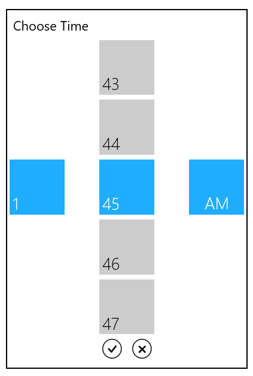

# SelectorItem Customization in UWP TimePicker (SfTimePicker)

## SelectorItemWidth and SelectorItemHeight

The item size in the SfTimeSelector control can be changed by setting the SelectorItemWidth and SelectorItemHeight properties.

## SelectorItemSpacing

The SelectorItemSpacing property provides the space between the items in SfTimeSelector.

## SelectorItemCount

The SelectorItemCount property is used to specify the number of items to be used in SfTimeSelector.

The following code sample shows the usage of the SelectorItemWidth, SelectorItemHeight, SelectorItemSpacing, and SelectorItemCount properties. 





<Grid Background="{StaticResource ApplicationPageBackgroundThemeBrush}">

            <syncfusion:SfTimePicker VerticalAlignment="Center" x:Name="timePicker"

                Width="200" SelectorItemWidth="100"

                SelectorItemHeight="100"

                SelectorItemSpacing="50"

                SelectorItemCount="4"/>

</Grid>









timePicker.SelectorItemHeight = 100;
timePicker.SelectorItemWidth = 100;
timePicker.SelectorItemCount = 5;
timePicker.SelectorItemSpacing = 40;





timePicker.SelectorItemHeight = 100
timePicker.SelectorItemWidth = 100
timePicker.SelectorItemCount = 5
timePicker.SelectorItemSpacing = 40





The output is displayed in the following image:

