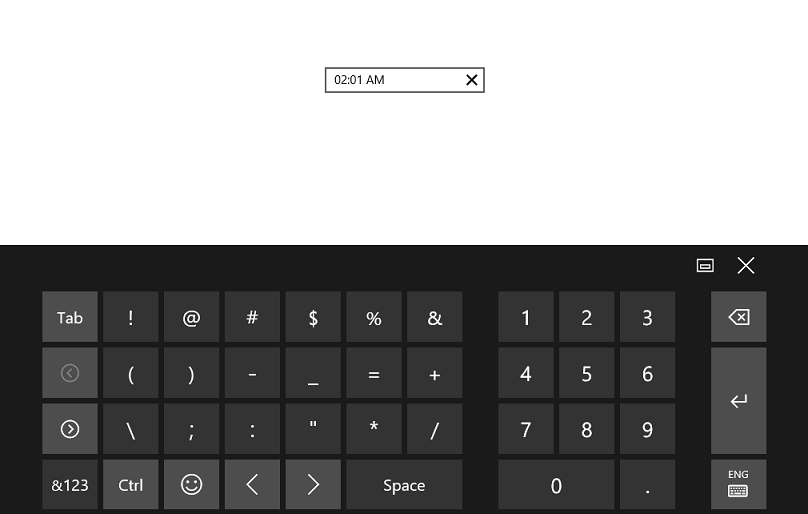

# Setting Null Value in UWP TimePicker (SfTimePicker)

AllowNull property can be used to set the SfTimePicker value to Null. When this property is enabled along with the Value property whose value is Null, then the SfTimePicker control will not display any value 

The following code example and screen shot illustrate the usage of the AllowNull property.



<Grid Background="{StaticResource ApplicationPageBackgroundThemeBrush}">

<syncfusion:SfTimePicker VerticalAlignment="Center" Width="200" Value="{x:Null}" AllowNull="true"/>

</Grid>



## Setting the Input Scope for the On-Screen Keyboard

To set the input scope of the on-screen keyboard, use the InputScope property. When the InputScope property set to Number, only the numeric keypad will be visible in the on-screen keyboard. The following code example and screen shot illustrate this property.

N>  The AllowInlineEditing property must be set to `true` for this property to take effect.



<Grid Background="{StaticResource ApplicationPageBackgroundThemeBrush}">

<syncfusion:SfTimePicker VerticalAlignment="Center" Width="200"

AllowInlineEditing="true" InputScope="Number"/>

</Grid>


