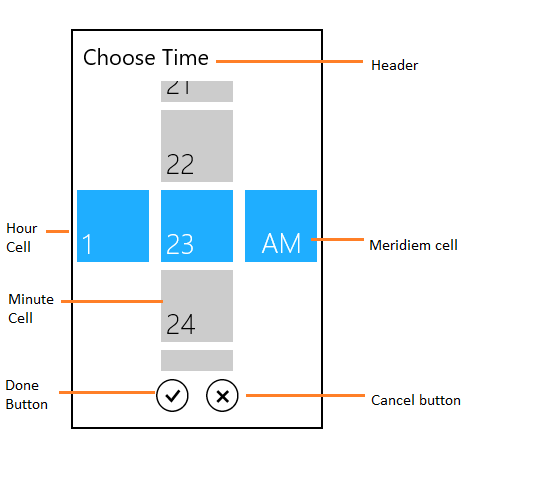
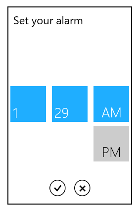
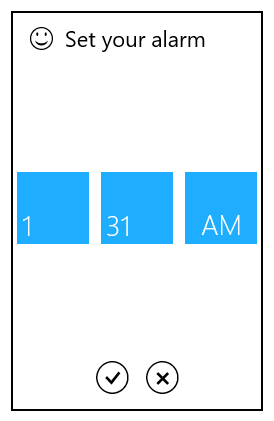
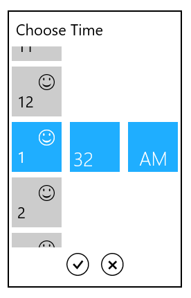
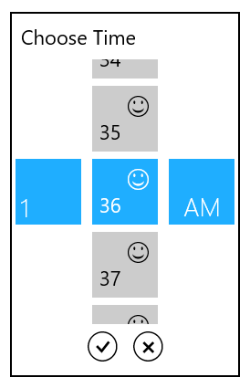
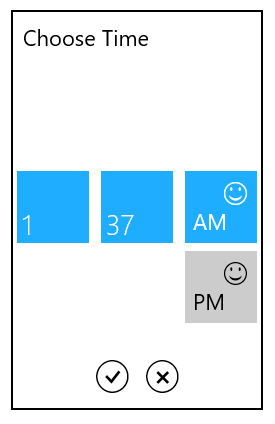
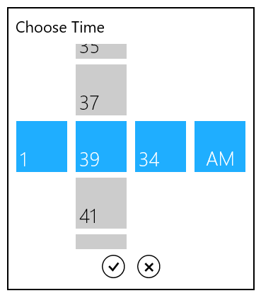
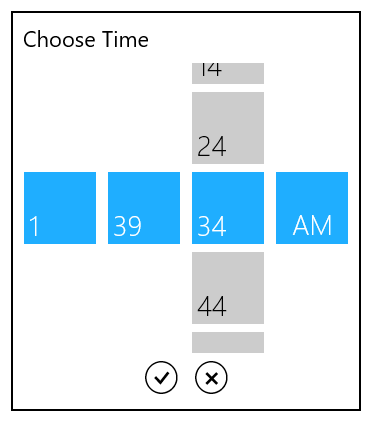

# SfTimeSelector in UWP TimePicker (SfTimePicker)

The SfTimeSelector control opens inside the popup window.

The visual elements of the time selector can be customized using the SelectorStyle property.

## Header

The Header property defines the top part of the time selector.


<syncfusion:SfTimePicker VerticalAlignment="Center"

                       HorizontalAlignment="Center"

                       Width="200">

       <syncfusion:SfTimePicker.SelectorStyle>

                

       </syncfusion:SfTimePicker.SelectorStyle>

</syncfusion:SfTimePicker >



## HeaderTemplate

The HeaderTemplate property is used to decorate the header.


<syncfusion:SfTimePicker VerticalAlignment="Center" 

                               HorizontalAlignment="Center"

                               Width="200">

            <syncfusion:SfTimePicker.SelectorStyle>

                

            </syncfusion:SfTimePicker.SelectorStyle>        </syncfusion:SfTimePicker>



## Cell template

The CellTemplate property is used to decorate the selection box with custom visuals. 

N>  The DataContext of Selection box is Syncfusion.UI.Xaml.Primitives.DateTimeWrapper.

## HourCellTemplate

The HourCellTemplate property is used to decorate the hour cell selection box.



<syncfusion:SfTimePicker VerticalAlignment="Center"

                               HorizontalAlignment="Center"

                               Width="200">

            <syncfusion:SfTimePicker.SelectorStyle>

                

            </syncfusion:SfTimePicker.SelectorStyle>         </syncfusion:SfTimePicker>



## MinuteCellTemplate

The MinuteCellTemplate property is used to decorate the minute cell selection box.



       

       <syncfusion:SfTimePicker VerticalAlignment="Center"

                               HorizontalAlignment="Center"

                               Width="200">

            <syncfusion:SfTimePicker.SelectorStyle>

                

            </syncfusion:SfTimePicker.SelectorStyle>        </syncfusion:SfTimePicker>



## MeridiemCellTemplate

The MeridiemCellTemplate property is used to decorate the meridiem cell selection box. 


<syncfusion:SfTimePicker VerticalAlignment="Center"

                               HorizontalAlignment="Center"

                               Width="200">

            <syncfusion:SfTimePicker.SelectorStyle>

                

            </syncfusion:SfTimePicker.SelectorStyle>        </syncfusion:SfTimePicker>   



## Setting Incremental Values

To set minute and second values in the SfTimeSelector with incremental values, use the MinuteInterval and SecondsInterval properties respectively.

### MinuteInterval

The MinuteInterval property is used to set the interval for minute values in the SfTimeSelector.

### SecondsInterval

The SecondsInterval property is used to set the interval for second values in the SfTimeSelector.





<syncfusion:SfTimeSelector FormatString="hh:mm:ss tt" MinuteInterval="2" SecondsInterval="10"/>









SfTimeSelector timeSelector = new SfTimeSelector();

timeSelector.FormatString = "hh:mm:ss tt";

timeSelector.MinuteInterval = 2;

timeSelector.SecondsInterval = 10;





Dim timeSelector As New SfTimeSelector()

timeSelector.FormatString = "hh:mm:ss tt"

timeSelector.MinuteInterval = 2

timeSelector.SecondsInterval = 10





