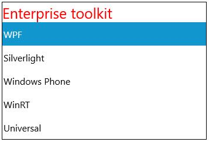
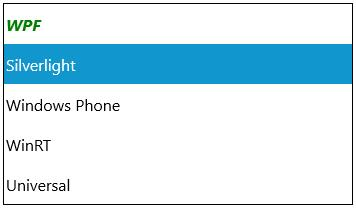
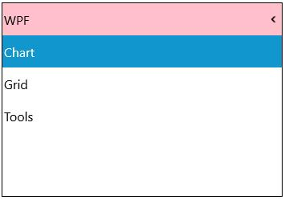
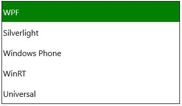

# Appearance and Styling in UWP Tree Navigator (SfTreeNavigator)

## Customizing TreeNavigator Header

`HeaderTemplate` property of SfTreeNavigator is used to apply a customized template for `SfTreeNavigator` header.





<navigation:SfTreeNavigator>

<navigation:SfTreeNavigator.HeaderTemplate>

<DataTemplate>

<TextBlock Text="{Binding}" Foreground="Red"/>

</DataTemplate>

</navigation:SfTreeNavigator.HeaderTemplate>

<navigation:SfTreeNavigatorItem Header="WPF"/>

<navigation:SfTreeNavigatorItem Header="Silverlight" />

<navigation:SfTreeNavigatorItem Header="Windows Phone"/>

<navigation:SfTreeNavigatorItem Header="WinRT"/>

<navigation:SfTreeNavigatorItem Header="Universal"/>

</navigation:SfTreeNavigator>





`HeaderStyle` property of SfTreeNavigator is used to customize the `SfTreeNavigator` header.





<navigation:SfTreeNavigator>

<navigation:SfTreeNavigator.HeaderStyle>

                      

</navigation:SfTreeNavigator.HeaderStyle>

<navigation:SfTreeNavigatorItem Header="WPF"/>

<navigation:SfTreeNavigatorItem Header="Silverlight" />

<navigation:SfTreeNavigatorItem Header="Windows Phone"/>

<navigation:SfTreeNavigatorItem Header="WinRT"/>

<navigation:SfTreeNavigatorItem Header="Universal"/>

</navigation:SfTreeNavigator>





## TreeNavigatorItem Header Template

`HeaderTemplate` property of `SfTreeNavigatorItem` is used to apply a customized template for `SfTreeNavigator` header.





<navigation:SfTreeNavigator>

<navigation:SfTreeNavigatorItem Header="WPF">

<navigation:SfTreeNavigatorItem.HeaderTemplate>

<DataTemplate>

<TextBlock Text="{Binding}" FontStyle="Italic"
           FontWeight="Bold" Foreground="Green"/>

</DataTemplate>

</navigation:SfTreeNavigatorItem.HeaderTemplate>

</navigation:SfTreeNavigatorItem>

<navigation:SfTreeNavigatorItem Header="Silverlight" />

<navigation:SfTreeNavigatorItem Header="Windows Phone"/>

<navigation:SfTreeNavigatorItem Header="WinRT"/>

<navigation:SfTreeNavigatorItem Header="Universal"/>

</navigation:SfTreeNavigator>





## Customizing TreeNavigatorItem Header

The stacked headers in Extended navigation mode can be styled as follows:





<Page.Resources>

</Page.Resources>

<navigation:SfTreeNavigator NavigationMode="Extended">            

<navigation:SfTreeNavigatorItem Header="WPF">

<navigation:SfTreeNavigatorItem Header="Chart"/>

<navigation:SfTreeNavigatorItem Header="Grid"/>

<navigation:SfTreeNavigatorItem Header="Tools"/>

</navigation:SfTreeNavigatorItem>                                            

<navigation:SfTreeNavigatorItem Header="Silverlight" />

<navigation:SfTreeNavigatorItem Header="Windows Phone"/>

<navigation:SfTreeNavigatorItem Header="WinRT"/>

<navigation:SfTreeNavigatorItem Header="Universal"/>

</navigation:SfTreeNavigator>





## Customizing the control Hot-spot

`AccentBrush` property is used to change the selected item background color.





<navigation:SfTreeNavigator Width="350" VerticalAlignment="Center"
                            HorizontalAlignment="Center" x:Name="treeNavigator">            

<navigation:SfTreeNavigatorItem Header="WPF" AccentBrush="Green"/>               

<navigation:SfTreeNavigatorItem Header="Silverlight" />

<navigation:SfTreeNavigatorItem Header="Windows Phone"/>

<navigation:SfTreeNavigatorItem Header="WinRT"/>

<navigation:SfTreeNavigatorItem Header="Universal"/>

</navigation:SfTreeNavigator>





