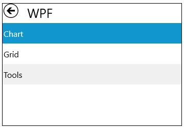
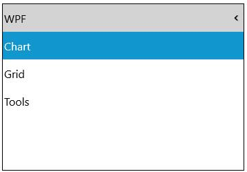

# Navigation Mode in UWP Tree Navigator (SfTreeNavigator)

`SfTreeNavigator` supports two different modes to support navigation. They are:

* Default 
* Extended

## Default Expansion

The header of current hierarchy level item is displayed at the top of the `SfTreeNavigator` with a back button. This back button is used to navigate back towards the root from current level.





<navigation:SfTreeNavigator NavigationMode="Default" x:Name="treeNavigator">

<navigation:SfTreeNavigatorItem Header="WPF">

<navigation:SfTreeNavigatorItem Header="Chart"/>

<navigation:SfTreeNavigatorItem Header="Grid"/>

<navigation:SfTreeNavigatorItem Header="Tools"/>

</navigation:SfTreeNavigatorItem>

<navigation:SfTreeNavigatorItem Header="Silverlight" />

<navigation:SfTreeNavigatorItem Header="Windows Phone"/>

<navigation:SfTreeNavigatorItem Header="WinRT"/>

<navigation:SfTreeNavigatorItem Header="Universal"/>

</navigation:SfTreeNavigator>









treeNavigator.NavigationMode = Syncfusion.UI.Xaml.Controls.Navigation.NavigationMode.Default;





treeNavigator.NavigationMode = Syncfusion.UI.Xaml.Controls.Navigation.NavigationMode.Default





## Stacked Expansion

The header of each level from root to current level is stacked one after another at the top of the `SfTreeNavigator`. Clicking on the stacked header, navigates to the corresponding level.





<navigation:SfTreeNavigator NavigationMode="Extended" x:Name="treeNavigator">

<navigation:SfTreeNavigatorItem Header="WPF">

<navigation:SfTreeNavigatorItem Header="Chart"/>

<navigation:SfTreeNavigatorItem Header="Grid"/>

<navigation:SfTreeNavigatorItem Header="Tools"/>

</navigation:SfTreeNavigatorItem>

<navigation:SfTreeNavigatorItem Header="Silverlight" />

<navigation:SfTreeNavigatorItem Header="Windows Phone"/>

<navigation:SfTreeNavigatorItem Header="WinRT"/>

<navigation:SfTreeNavigatorItem Header="Universal"/>

</navigation:SfTreeNavigator>









treeNavigator.NavigationMode = Syncfusion.UI.Xaml.Controls.Navigation.NavigationMode.Extended;





treeNavigator.NavigationMode = Syncfusion.UI.Xaml.Controls.Navigation.NavigationMode.Extended





