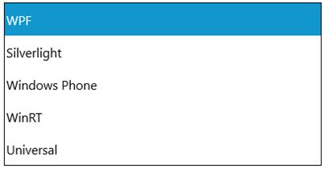
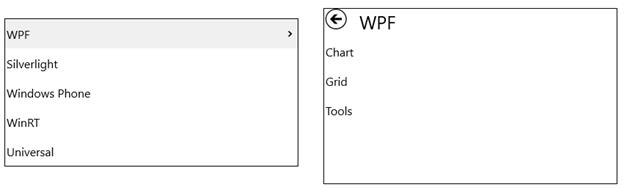

# Populating Items in UWP Tree Navigator (SfTreeNavigator)

`SfTreeNavigatorItem` are added as items of SfTreeNavigator. Items can be added using `Items` or `ItemSource` property.

## Adding Items

`SfTreeNavigator` accepts `SfTreeNavigatorItem` as its children when added directly. Here five `SfTreeNavigatorItems` are added as the children of SfTreeNavigator. Adding items as follows display items with blank header.





<navigation:SfTreeNavigator>

<navigation:SfTreeNavigatorItem/>

<navigation:SfTreeNavigatorItem/>

<navigation:SfTreeNavigatorItem/>

<navigation:SfTreeNavigatorItem/>

<navigation:SfTreeNavigatorItem/>

</navigation:SfTreeNavigator>









SfTreeNavigator treeNavigator = new SfTreeNavigator();

treeNavigator.Items.Add(new SfTreeNavigatorItem());

treeNavigator.Items.Add(new SfTreeNavigatorItem());

treeNavigator.Items.Add(new SfTreeNavigatorItem());

treeNavigator.Items.Add(new SfTreeNavigatorItem());

treeNavigator.Items.Add(new SfTreeNavigatorItem());





Dim treeNavigator As New SfTreeNavigator()

treeNavigator.Items.Add(New SfTreeNavigatorItem())

treeNavigator.Items.Add(New SfTreeNavigatorItem())

treeNavigator.Items.Add(New SfTreeNavigatorItem())

treeNavigator.Items.Add(New SfTreeNavigatorItem())

treeNavigator.Items.Add(New SfTreeNavigatorItem())





## Setting Header

`Header` property helps to set the header for `SfTreeNavigatorItem`. Tree navigator item can be selected by clicking on its header.





<navigation:SfTreeNavigator>

<navigation:SfTreeNavigatorItem Header="WPF"/>

<navigation:SfTreeNavigatorItem Header="Silverlight"/>

<navigation:SfTreeNavigatorItem Header="Windows Phone"/>

<navigation:SfTreeNavigatorItem Header="WinRT"/>

<navigation:SfTreeNavigatorItem Header="Universal"/> 

</navigation:SfTreeNavigator>









SfTreeNavigator treeNavigator = new SfTreeNavigator();

treeNavigator.Items.Add(new SfTreeNavigatorItem () { 
Header = "WPF" });

treeNavigator.Items.Add(new SfTreeNavigatorItem () { 
Header = "Silverlight"});

treeNavigator.Items.Add(new SfTreeNavigatorItem () { 
Header = "Windows Phone" });

treeNavigator.Items.Add(new SfTreeNavigatorItem () { 
Header = "WinRT"});

treeNavigator.Items.Add(new SfTreeNavigatorItem () { 
Header = "Universal"});





Dim treeNavigator As New SfTreeNavigator()

treeNavigator.Items.Add(New SfTreeNavigatorItem() With {.Header = "WPF"})

treeNavigator.Items.Add(New SfTreeNavigatorItem() With {.Header = "Silverlight"})

treeNavigator.Items.Add(New SfTreeNavigatorItem() With {.Header = "Windows Phone"})

treeNavigator.Items.Add(New SfTreeNavigatorItem() With {.Header = "WinRT"})

treeNavigator.Items.Add(New SfTreeNavigatorItem() With {.Header = "Universal"})





## Adding SubItems

`Items` property helps to add sub items for `SfTreeNavigatorItem`. `SfTreeNavigatorItem` is an ItemsControl so that a collection of tree navigator items can be added to it. Sub items are viewable only after it is navigated to next level.





<navigation:SfTreeNavigator>

<navigation:SfTreeNavigatorItem Header="WPF">

<navigation:SfTreeNavigatorItem Header="Chart"/>

<navigation:SfTreeNavigatorItem Header="Grid"/>

<navigation:SfTreeNavigatorItem Header="Tools"/>

</navigation:SfTreeNavigatorItem>

<navigation:SfTreeNavigatorItem Header="Silverlight"/>

<navigation:SfTreeNavigatorItem Header="Windows Phone"/>

<navigation:SfTreeNavigatorItem Header="WinRT"/>

<navigation:SfTreeNavigatorItem Header="Universal"/> 

</navigation:SfTreeNavigator>









SfTreeNavigator treeNavigator = new SfTreeNavigator();

SfTreeNavigatorItem WPF = new SfTreeNavigatorItem () { 
Header = "WPF" };

WPF.Items.Add(new SfTreeNavigatorItem () { 
Header = "Chart" });

WPF.Items.Add(new SfTreeNavigatorItem () { 
Header = "Grid" });

WPF.Items.Add(new SfTreeNavigatorItem () { 
Header = "Tools" });

treeNavigator.Items.Add(WPF);

treeNavigator.Items.Add(new SfTreeNavigatorItem () { 
Header = "Silverlight"});

treeNavigator.Items.Add(new SfTreeNavigatorItem () { 
Header = "Windows Phone" });

treeNavigator.Items.Add(new SfTreeNavigatorItem () { 
Header = "WinRT"});

treeNavigator.Items.Add(new SfTreeNavigatorItem () { 
Header = "Universal"});





Dim treeNavigator As New SfTreeNavigator()

Dim WPF As New SfTreeNavigatorItem() With {.Header = "WPF"}

WPF.Items.Add(New SfTreeNavigatorItem() With {.Header = "Chart"})

WPF.Items.Add(New SfTreeNavigatorItem() With {.Header = "Grid"})

WPF.Items.Add(New SfTreeNavigatorItem() With {.Header = "Tools"})

treeNavigator.Items.Add(WPF)

treeNavigator.Items.Add(New SfTreeNavigatorItem() With {.Header = "Silverlight"})

treeNavigator.Items.Add(New SfTreeNavigatorItem() With {.Header = "Windows Phone"})

treeNavigator.Items.Add(New SfTreeNavigatorItem() With {.Header = "WinRT"})

treeNavigator.Items.Add(New SfTreeNavigatorItem() With {.Header = "Universal"})





## Using ItemsSource

### Adding Items

`SfTreeNavigator` accepts any business object collection to be bound to its `ItemsSource` property. 

1.Create a model





public class TreeModel : NotificationObject

{

public TreeModel()

{

Models = new ObservableCollection<TreeModel>();

}

private string header;

public string Header

{

get { return header; }

set

{

header = value;

RaisePropertyChanged("Header");

}

}
private ObservableCollection<TreeModel> models;

public ObservableCollection<TreeModel> Models

{

get { return models; }

set { models = value; }

}

}





Public Class TreeModel
	
	Inherits NotificationObject

Public Sub New()

Models = New ObservableCollection(Of TreeModel)()

End Sub

Private header_Renamed As String

Public Property Header() As String

Get
	Return header_Renamed
End Get

Set(ByVal value As String)

header_Renamed = value

RaisePropertyChanged("Header")

End Set

End Property

Private models_Renamed As ObservableCollection(Of TreeModel)

Public Property Models() As ObservableCollection(Of TreeModel)

Get
	Return models_Renamed
End Get

Set(ByVal value As ObservableCollection(Of TreeModel))
	models_Renamed = value
End Set

End Property

End Class





2.Create a collection of model





private List<TreeModel> models;

public List<TreeModel> Models

{

get { return models; }

set { models = value; }

}





Private models_Renamed As List(Of TreeModel)

Public Property Models() As List(Of TreeModel)

Get
	Return models_Renamed
End Get

Set(ByVal value As List(Of TreeModel))
	models_Renamed = value
End Set

End Property





3.Populate the collection





public TreeViewModel()

{

Models = new List<TreeModel>();

TreeModel win = new TreeModel() { Header = "WinRT (XAML)" };

TreeModel metroStudio = new TreeModel() { Header = "Metro Studio" };

TreeModel win_chart = new TreeModel() { Header = "Chart" };

TreeModel win_tools = new TreeModel() { Header = "Tools" };

win.Models.Add(win_chart);

win.Models.Add(win_tools);

Models.Add(win);

Models.Add(metroStudio);

}





Public Sub New()

Models = New List(Of TreeModel)()

Dim win As New TreeModel() With {.Header = "WinRT (XAML)"}

Dim metroStudio As New TreeModel() With {.Header = "Metro Studio"}

Dim win_chart As New TreeModel() With {.Header = "Chart"}

Dim win_tools As New TreeModel() With {.Header = "Tools"}

win.Models.Add(win_chart)

win.Models.Add(win_tools)

Models.Add(win)

Models.Add(metroStudio)

End Sub





4.Set the DataContext for control and bind the Models collection to `ItemsSource` property of `SfTreeNavigator` control





<navigation:SfTreeNavigator ItemsSource="{Binding Models}"/>





TreeNavigator items need a template to render so `SfTreeNavigator` control is populated as follows:

### Setting Header for items

Header can be displayed by setting ItemTemplate. Setting DataTemplate does not allow to navigate to sub items.





<navigation:SfTreeNavigator ItemsSource="{Binding Models}">     

<navigation:SfTreeNavigator.ItemTemplate>

<DataTemplate>

<TextBlock Text="{Binding Header}"/>

</DataTemplate>

</navigation:SfTreeNavigator.ItemTemplate>

</navigation:SfTreeNavigator>





### Adding SubItems

Sub-items can be viewed only if the item template is HierarchicalDataTemplate rather than DataTemplate. HierarchicalDataTemplate class is available in Syncfusion.UI.Xaml.Primitives namespace.





<Page xmlns:primitives="using:Syncfusion.UI.Xaml.Primitives"

xmlns:navigation="using:Syncfusion.UI.Xaml.Controls.Navigation">

<Page.DataContext>

<local:TreeViewModel/>

</Page.DataContext>

<Grid>

<navigation:SfTreeNavigator ItemsSource="{Binding Models}">

<navigation:SfTreeNavigator.ItemTemplate>

<primitives:HierarchicalDataTemplate ItemsSource="{Binding Models}">

<DataTemplate>

<TextBlock Text="{Binding Header}"/>

</DataTemplate>

</primitives:HierarchicalDataTemplate>

</navigation:SfTreeNavigator.ItemTemplate>

</navigation:SfTreeNavigator>

</Grid>

</Page>





