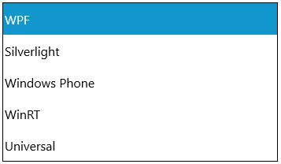

# Selecting Items in UWP Tree Navigator (SfTreeNavigator)

TreeNavigator items can be selected in one or more ways as give below:

## Selecting item using SelectedItem

`SelectedItem` property is used to select an item using its instance and it can be set as follows:





<navigation:SfTreeNavigator x:Name="treeNavigator" SelectedItem="wpf">

<navigation:SfTreeNavigatorItem Header="WPF" x:Name="wpf"/>

<navigation:SfTreeNavigatorItem Header="Silverlight"/>

<navigation:SfTreeNavigatorItem Header="Windows Phone"/>

<navigation:SfTreeNavigatorItem Header="WinRT"/>

<navigation:SfTreeNavigatorItem Header="Universal"/>

</navigation:SfTreeNavigator>









treeNavigator.SelectedItem = WPF;





treeNavigator.SelectedItem = WPF





## Selecting item by change IsSelected

`IsSelected` property is used to check whether an item is selected or not. An item can also be selected as follows:





<navigation:SfTreeNavigator>

<navigation:SfTreeNavigatorItem Header="WPF" IsSelected="True" x:Name="wpf"/>

<navigation:SfTreeNavigatorItem Header="Silverlight"/>

<navigation:SfTreeNavigatorItem Header="Windows Phone"/>

<navigation:SfTreeNavigatorItem Header="WinRT"/>

<navigation:SfTreeNavigatorItem Header="Universal"/>

</navigation:SfTreeNavigator>









wpf.IsSelected = true;





wpf.IsSelected = True





## Select Item though code-behind

Select method is used to select an item with its instance and it can be used as follows:





<navigation:SfTreeNavigator x:Name="treeNavigator">

<navigation:SfTreeNavigatorItem Header="WPF" x:Name="wpf"/>

<navigation:SfTreeNavigatorItem Header="Silverlight"/>

<navigation:SfTreeNavigatorItem Header="Windows Phone"/>

<navigation:SfTreeNavigatorItem Header="WinRT"/>

<navigation:SfTreeNavigatorItem Header="Universal"/>

</navigation:SfTreeNavigator>









treeNavigator.Select(wpf);





treeNavigator.Select(wpf)





## Retrieving the selected hierarchical level

DrillDownItem is used to get the instance of an item that holds the items in current hierarchical level. It is a read only property containing `SfTreeNavigator` itself as DrillDownItem when no item is selected.





<navigation:SfTreeNavigator x:Name="treeNavigator">

<navigation:SfTreeNavigatorItem Header="WPF"/>

<navigation:SfTreeNavigatorItem Header="Silverlight"/>

<navigation:SfTreeNavigatorItem Header="Windows Phone"/>

<navigation:SfTreeNavigatorItem Header="WinRT"/>

<navigation:SfTreeNavigatorItem Header="Universal"/>

</navigation:SfTreeNavigator>









private void treeNavigator_Loaded(object sender, RoutedEventArgs e)

{

HeaderedItemsControl item = treeNavigator.DrillDownItem;

}





Private Sub treeNavigator_Loaded(ByVal sender As Object, ByVal e As RoutedEventArgs)

Dim item As HeaderedItemsControl = treeNavigator.DrillDownItem

End Sub





## Notifying selection changed

SelectionChanged event is used to notify whenever a selection change takes place. The event is hooked as follows:





<navigation:SfTreeNavigator x:Name="treeNavigator" SelectionChanged="treeNavigator_SelectionChanged">

<navigation:SfTreeNavigatorItem Header="WPF"/>

<navigation:SfTreeNavigatorItem Header="Silverlight"/>

<navigation:SfTreeNavigatorItem Header="Windows Phone"/>

<navigation:SfTreeNavigatorItem Header="WinRT"/>

<navigation:SfTreeNavigatorItem Header="Universal"/>

</navigation:SfTreeNavigator>









private void treeNavigator_SelectionChanged(object sender, SelectionChangedEventArgs e)

{

}





Private Sub treeNavigator_SelectionChanged(ByVal sender As Object, ByVal e As SelectionChangedEventArgs)

End Sub





## Notifying click on item

ItemClicked event is used to notify whenever an item is clicked. It is fired for both mouse left button and right button click. The event arguments are 

ItemPosition – The (x,y) point where SfTreeNavigator item is clicked

MouseMode – Determines whether left or right mouse button click

The event is hooked as follows:





<navigation:SfTreeNavigator x:Name="treeNavigator">

<navigation:SfTreeNavigatorItem Header="WPF" ItemClicked="SfTreeNavigatorItem_ItemClicked"/>

<navigation:SfTreeNavigatorItem Header="Silverlight"/>

<navigation:SfTreeNavigatorItem Header="Windows Phone"/>

<navigation:SfTreeNavigatorItem Header="WinRT"/>

<navigation:SfTreeNavigatorItem Header="Universal"/>

</navigation:SfTreeNavigator>









private void SfTreeNavigatorItem_ItemClicked(object Sender, Syncfusion.UI.Xaml.Controls.Navigation.ItemClickEventArgs args)

{

}





Private Sub SfTreeNavigatorItem_ItemClicked(ByVal Sender As Object, ByVal args As Syncfusion.UI.Xaml.Controls.Navigation.ItemClickEventArgs)

End Sub





## Navigate thorough code-behind

SfTreeNavigator.GoBack() method is used to navigate a hierarchical level back in the tree if applicable. 





treeNavigator.GoBack();





treeNavigator.GoBack()





