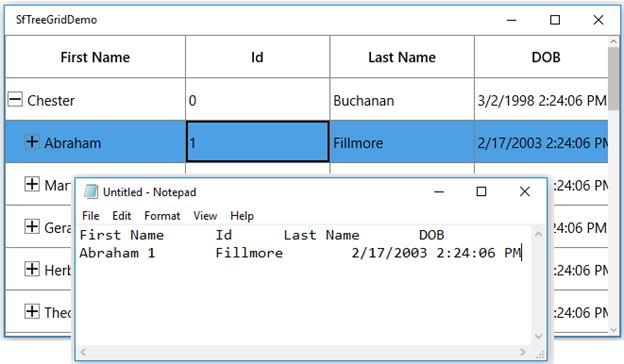
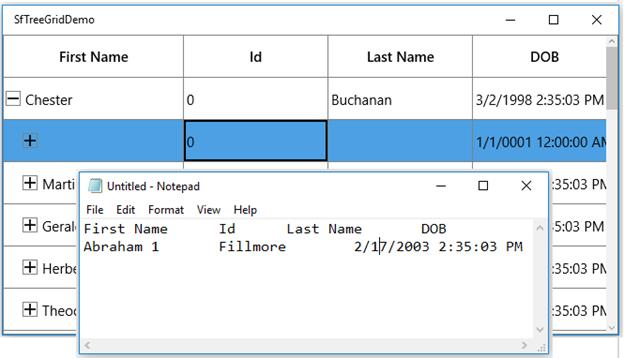
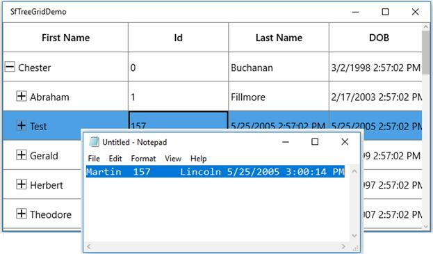
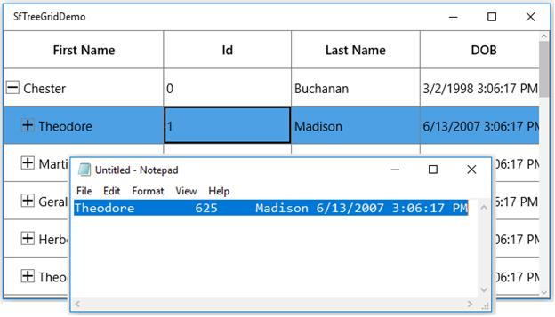

# Clipboard Operations in UWP TreeGrid (SfTreeGrid)

SfTreeGrid provides support to the clipboard operations such as cut, copy, and paste the data within control and between other applications such as Notepad and Excel. The clipboard operations of copy and paste are enabled by default. You can copy the selected nodes/cells from tree grid by clicking `Ctrl+C` and can paste the content from [Clipboard](https://msdn.microsoft.com/en-us/library/system.windows.clipboard.aspx) to tree grid by clicking `Ctrl+V`.

## Copy

The copy operation works based on the [GridCopyOption](https://help.syncfusion.com/cr/uwp/Syncfusion.UI.Xaml.Grid.SfGridBase.html#Syncfusion_UI_Xaml_Grid_SfGridBase_GridCopyOption) property.

GridCopyOption provides the following options:

* [None](https://help.syncfusion.com/cr/uwp/Syncfusion.UI.Xaml.Grid.GridCopyOption.html): Disables copy in tree grid.

* [CopyData](https://help.syncfusion.com/cr/uwp/Syncfusion.UI.Xaml.Grid.GridCopyOption.html): Enables copy in tree grid.

* [IncludeHeaders](https://help.syncfusion.com/cr/uwp/Syncfusion.UI.Xaml.Grid.GridCopyOption.html): Copies column header along with data.

* [IncludeFormat](https://help.syncfusion.com/cr/uwp/Syncfusion.UI.Xaml.Grid.GridCopyOption.html): Copies the display text with format instead of actual value.

* [IncludeHiddenColumn](https://help.syncfusion.com/cr/uwp/Syncfusion.UI.Xaml.Grid.GridCopyOption.html): Copies hidden column to clipboard.

You can use the IncludeHeaders, IncludeFormat, and IncludeHiddenColumn options along with the CopyData option.



<syncfusion:SfTreeGrid Name="treeGrid"
                                       AutoExpandMode="RootNodesExpanded"
                                       AutoGenerateColumns="False" 
                                       GridCopyOption="CopyData,IncludeHeaders" 
                                       ChildPropertyName="Children"
                                       ColumnSizer="Star"
                                       ExpanderColumn="FirstName"
                                       ItemsSource="{Binding PersonDetails}"
                                       NavigationMode="Row">




this.treeGrid.GridCopyOption = GridCopyOption.CopyData | GridCopyOption.IncludeHeaders;




## Paste

The paste operation works based on the [GridPasteOption](https://help.syncfusion.com/cr/uwp/Syncfusion.UI.Xaml.Grid.SfGridBase.html#Syncfusion_UI_Xaml_Grid_SfGridBase_GridPasteOption) property.

GridPasteOption provides the following options:

* [None](https://help.syncfusion.com/cr/uwp/Syncfusion.UI.Xaml.Grid.GridPasteOption.html): Disables paste in tree grid.

* [PasteData](https://help.syncfusion.com/cr/uwp/Syncfusion.UI.Xaml.Grid.GridPasteOption.html): Enables paste in tree grid. When an incompatible value is pasted into a record/cell, the pasting operation is skipped for that particular record/cell.

* [ExcludeFirstLine](https://help.syncfusion.com/cr/uwp/Syncfusion.UI.Xaml.Grid.GridPasteOption.html): Pastes data copied with `IncludeHeaders` copy option.

* [IncludeHiddenColumn](https://help.syncfusion.com/cr/uwp/Syncfusion.UI.Xaml.Grid.GridPasteOption.html): Pastes the values in hidden columns also.

You can use the ExcludeFirstLine and IncludeHiddenColumn options along with the PasteData option.



<syncfusion:SfTreeGrid Name="treeGrid"
                                       AutoExpandMode="RootNodesExpanded"
                                       AutoGenerateColumns="False" 
                                       NavigationMode="Cell"
                                       ChildPropertyName="Children"
                                       ColumnSizer="Star" 
                                       GridCopyOption="CopyData,IncludeHeaders"
                                       GridPasteOption="PasteData,ExcludeFirstLine" 
                                       ExpanderColumn="FirstName"
                                       ItemsSource="{Binding PersonDetails}"
                                       >



this.treeGrid.GridCopyOption = GridCopyOption.CopyData | GridCopyOption.IncludeHeaders;

this.treeGrid.GridPasteOption = GridPasteOption.PasteData | GridPasteOption.ExcludeFirstLine;




## Cut

The cut operation works based on the [GridCopyOption](https://help.syncfusion.com/cr/uwp/Syncfusion.UI.Xaml.Grid.SfGridBase.html#Syncfusion_UI_Xaml_Grid_SfGridBase_GridCopyOption) property.

GridCopyOption provides the following options:

* [None](https://help.syncfusion.com/cr/uwp/Syncfusion.UI.Xaml.Grid.GridCopyOption.html): Disables cut in tree grid.

* [CutData](https://help.syncfusion.com/cr/uwp/Syncfusion.UI.Xaml.Grid.GridCopyOption.html) – Enables cut in tree grid.

* [IncludeHeaders](https://help.syncfusion.com/cr/uwp/Syncfusion.UI.Xaml.Grid.GridCopyOption.html):Copies column header along with data.

* [IncludeFormat](https://help.syncfusion.com/cr/uwp/Syncfusion.UI.Xaml.Grid.GridCopyOption.html): Cuts the display text with format instead of actual value.

* [IncludeHiddenColumn](https://help.syncfusion.com/cr/uwp/Syncfusion.UI.Xaml.Grid.GridCopyOption.html): Copies hidden column also to clipboard.

You can use the IncludeHeaders, IncludeFormat, and IncludeHiddenColumn options along with CutData option.



<syncfusion:SfTreeGrid Name="treeGrid"
                                       GridCopyOption="CutData,IncludeHeaders"                                                                                
                                       ChildPropertyName="Children"
                                       ColumnSizer="Star"
                                       ExpanderColumn="FirstName"
                                       ItemsSource="{Binding PersonDetails}"
                                       NavigationMode="Row">



this.treeGrid.GridCopyOption = GridCopyOption.CutData | GridCopyOption.IncludeHeaders;



## Events

### CopyContent

The [CopyContent](https://help.syncfusion.com/cr/uwp/Syncfusion.UI.Xaml.TreeGrid.SfTreeGrid.html) event occurs when copy/cut the cells in tree grid. [GridCopyPasteEventArgs](https://help.syncfusion.com/cr/uwp/Syncfusion.UI.Xaml.Grid.GridCopyPasteEventArgs.html) provides information for to the `CopyContent` event. You can cancel copy operation by handling this event.



this.treeGrid.CopyContent += TreeGrid_CopyContent;

private void TreeGrid_CopyContent(object sender, GridCopyPasteEventArgs e)
{
    if (((e.OriginalSender as SfTreeGrid).SelectedItem as PersonInfo).Id == 1094)
        e.Handled = true;
}




### PasteContent

The [PasteContent](https://help.syncfusion.com/cr/uwp/Syncfusion.UI.Xaml.TreeGrid.SfTreeGrid.html) event occurs when paste the clipboard value into tree grid. [GridCopyPasteEventArgs](https://help.syncfusion.com/cr/uwp/Syncfusion.UI.Xaml.Grid.GridCopyPasteEventArgs.html) provides information to the PasteContent event. You can cancel the paste operation by handling this event.



this.treeGrid.PasteContent += TreeGrid_PasteContent;

private void TreeGrid_PasteContent(object sender, GridCopyPasteEventArgs e)
{
    if (((e.OriginalSender as SfTreeGrid).SelectedItem as PersonInfo).Id == 1094)
        e.Handled = true;
}




### CopyCellContent

The [CopyGridCellContent](https://help.syncfusion.com/cr/uwp/Syncfusion.UI.Xaml.TreeGrid.SfTreeGrid.html) event occurs when a cell is being copied/cut. [TreeGridCopyPasteCellEventArgs](https://help.syncfusion.com/cr/uwp/Syncfusion.UI.Xaml.TreeGrid.TreeGridCopyPasteCellEventArgs.html) provides information to the CopyGridCellContent event, which has the following members:

* [ClipBoardValue](https://help.syncfusion.com/cr/uwp/Syncfusion.UI.Xaml.TreeGrid.TreeGridCopyPasteCellEventArgs.html#Syncfusion_UI_Xaml_TreeGrid_TreeGridCopyPasteCellEventArgs_ClipBoardValue): Returns cell value.

* [Column](https://help.syncfusion.com/cr/uwp/Syncfusion.UI.Xaml.TreeGrid.TreeGridCopyPasteCellEventArgs.html#Syncfusion_UI_Xaml_TreeGrid_TreeGridCopyPasteCellEventArgs_Column): Returns corresponding GridColumn of a cell.

* [RowData](https://help.syncfusion.com/cr/uwp/Syncfusion.UI.Xaml.TreeGrid.TreeGridCopyPasteCellEventArgs.html#Syncfusion_UI_Xaml_TreeGrid_TreeGridCopyPasteCellEventArgs_RowData): Returns corresponding RowData of a cell.

* [OriginalSender](https://help.syncfusion.com/cr/uwp/Syncfusion.UI.Xaml.Grid.GridCancelEventArgs.html#Syncfusion_UI_Xaml_Grid_GridCancelEventArgs_OriginalSender): Returns SfTreeGrid.

You can change the text copied to clipboard by changing the ClipBoardValue.



this.treeGrid.CopyCellContent += TreeGrid_CopyCellContent;

private void TreeGrid_CopyCellContent(object sender, TreeGridCopyPasteCellEventArgs e)
{
            
}




The following code example changes the clipboard value to 100 instead of cell value 1094 in tree grid.



private void TreeGrid_CopyCellContent(object sender, TreeGridCopyPasteCellEventArgs e)
{
    if (e.Column.MappingName == "Id" && (e.RowData as PersonInfo).Id == 1)
        e.ClipBoardValue = 100;
}



The following code example demonstrates how to handle the copy operation when MappingName of a Column is Id.



private void TreeGrid_CopyCellContent(object sender, TreeGridCopyPasteCellEventArgs e)
{
    if (e.Column.MappingName == "Id")
        e.Handled = true;
}



### PasteCellContent

The [PasteGridCellContent](https://help.syncfusion.com/cr/uwp/Syncfusion.UI.Xaml.TreeGrid.SfTreeGrid.html) event occurs when a cell is being pasted. [TreeGridCopyPasteCellEventArgs](https://help.syncfusion.com/cr/uwp/Syncfusion.UI.Xaml.TreeGrid.TreeGridCopyPasteCellEventArgs.html) provides information to the `PasteGridCellContent` event, which has the following members:

* [ClipBoardValue](https://help.syncfusion.com/cr/uwp/Syncfusion.UI.Xaml.TreeGrid.TreeGridCopyPasteCellEventArgs.html#Syncfusion_UI_Xaml_TreeGrid_TreeGridCopyPasteCellEventArgs_ClipBoardValue): Returns the clipboard value of a particular cell.

* [Column](https://help.syncfusion.com/cr/uwp/Syncfusion.UI.Xaml.TreeGrid.TreeGridCopyPasteCellEventArgs.html#Syncfusion_UI_Xaml_TreeGrid_TreeGridCopyPasteCellEventArgs_Column): Returns the corresponding GridColumn of a cell.

* [RowData](https://help.syncfusion.com/cr/uwp/Syncfusion.UI.Xaml.TreeGrid.TreeGridCopyPasteCellEventArgs.html#Syncfusion_UI_Xaml_TreeGrid_TreeGridCopyPasteCellEventArgs_RowData): Returns the corresponding RowData of a cell.

* [OriginalSender](https://help.syncfusion.com/cr/uwp/Syncfusion.UI.Xaml.Grid.GridCancelEventArgs.html#Syncfusion_UI_Xaml_Grid_GridCancelEventArgs_OriginalSender): Returns SfTeeGrid.

You can paste the text to tree grid by changing the ClipBoardValue.



this.treeGrid.PasteCellContent += TreeGrid_PasteCellContent;

private void TreeGrid_PasteCellContent(object sender, TreeGridCopyPasteCellEventArgs e)
{
            
}




The following code example changes the clipboard value to Test instead of clipboard value Martin.



private void TreeGrid_PasteCellContent(object sender, TreeGridCopyPasteCellEventArgs e)
{
    if (e.Column.MappingName == "FirstName" && (e.RowData as PersonInfo).FirstName == "Martin")
        e.ClipBoardValue = "Test";
}




The following code example demonstrates how to handle the paste operation when MappingName of column is Id.



private void TreeGrid_PasteCellContent(object sender, TreeGridCopyPasteCellEventArgs e)
{
    if (e.Column.MappingName == "Id")
        e.Handled = true;
}




## Handle the clipboard operations programmatically

### Copy the node programmatically

Copy the selected nodes in tree grid using the [Copy](https://help.syncfusion.com/cr/uwp/Syncfusion.UI.Xaml.TreeGrid.TreeGridCutCopyPaste.html#Syncfusion_UI_Xaml_TreeGrid_TreeGridCutCopyPaste_Copy) method in [TreeGridCutCopyPaste](https://help.syncfusion.com/cr/uwp/Syncfusion.UI.Xaml.TreeGrid.TreeGridCutCopyPaste.html) of tree grid.




this.treeGrid.TreeGridCopyPaste.Copy();




Copy a record by selecting the record using the [MoveCurrentCell](https://help.syncfusion.com/cr/uwp/Syncfusion.UI.Xaml.TreeGrid.TreeGridRowSelectionController.html#Syncfusion_UI_Xaml_TreeGrid_TreeGridRowSelectionController_MoveCurrentCell_Syncfusion_UI_Xaml_ScrollAxis_RowColumnIndex_System_Boolean_) method and [Copy](https://help.syncfusion.com/cr/uwp/Syncfusion.UI.Xaml.TreeGrid.TreeGridCutCopyPaste.html#Syncfusion_UI_Xaml_TreeGrid_TreeGridCutCopyPaste_Copy) method in [TreeGridCopyPaste](https://help.syncfusion.com/cr/uwp/Syncfusion.UI.Xaml.TreeGrid.TreeGridCutCopyPaste.html) of tree grid.



RowColumnIndex rowColumnIndex = new RowColumnIndex();
rowColumnIndex.RowIndex = 2;
rowColumnIndex.ColumnIndex = 2;
this.treeGrid.SelectionController.MoveCurrentCell(rowColumnIndex);
this.treeGrid.TreeGridCopyPaste.Copy();




Copy multiple records by selecting a group of records using the SelectRows method and [Copy](https://help.syncfusion.com/cr/uwp/Syncfusion.UI.Xaml.TreeGrid.TreeGridCutCopyPaste.html#Syncfusion_UI_Xaml_TreeGrid_TreeGridCutCopyPaste_Copy) method in [TreeGridCutCopyPaste](https://help.syncfusion.com/cr/uwp/Syncfusion.UI.Xaml.TreeGrid.TreeGridCutCopyPaste.html) of tree grid.



this.treeGrid.SelectionController.SelectRows(2, 10);
this.treeGrid.TreeGridCopyPaste.Copy();




### Paste to tree grid programmatically

Paste the clipboard value into tree grid using the [Paste](https://help.syncfusion.com/cr/uwp/Syncfusion.UI.Xaml.TreeGrid.TreeGridCutCopyPaste.html#Syncfusion_UI_Xaml_TreeGrid_TreeGridCutCopyPaste_Paste) method in [TreeGridCutCopyPaste](https://help.syncfusion.com/cr/uwp/Syncfusion.UI.Xaml.TreeGrid.TreeGridCutCopyPaste.html) of tree grid.



this.treeGrid.TreeGridCopyPaste.Paste();




Paste the clipboard value into selected record by selecting the record using the MoveCurrentCell method and `Paste` method in [TreeGridCutCopyPaste](https://help.syncfusion.com/cr/uwp/Syncfusion.UI.Xaml.TreeGrid.TreeGridCutCopyPaste.html) of tree grid.



RowColumnIndex rowColumnIndex = new RowColumnIndex();
rowColumnIndex.RowIndex = 1;
rowColumnIndex.ColumnIndex = 1;
this.treeGrid.SelectionController.MoveCurrentCell(rowColumnIndex);
this.treeGrid.TreeGridCopyPaste.Paste();




### Cut from tree grid programmatically

Cut the selected records/cells in tree grid using the [Cut](https://help.syncfusion.com/cr/uwp/Syncfusion.UI.Xaml.TreeGrid.TreeGridCutCopyPaste.html#Syncfusion_UI_Xaml_TreeGrid_TreeGridCutCopyPaste_Cut) method in [TreeGridCutCopyPaste](https://help.syncfusion.com/cr/uwp/Syncfusion.UI.Xaml.TreeGrid.TreeGridCutCopyPaste.html) of tree grid.



this.treeGrid.TreeGridCopyPaste.Cut();



Cut the entire record in tree grid by selecting whole tree grid using the [SelectAll](https://help.syncfusion.com/cr/uwp/Syncfusion.UI.Xaml.TreeGrid.TreeGridRowSelectionController.html#Syncfusion_UI_Xaml_TreeGrid_TreeGridRowSelectionController_SelectAll) method and `Cut` method in [TreeGridCutCopyPaste](https://help.syncfusion.com/cr/uwp/Syncfusion.UI.Xaml.TreeGrid.TreeGridCutCopyPaste.html) of tree grid.



this.treeGrid.SelectionController.SelectAll();
this.treeGrid.TreeGridCopyPaste.Cut();



## Customize copy paste behavior

The tree grid processes the clipboard operations in the [TreeGridCutCopyPaste](https://help.syncfusion.com/cr/uwp/Syncfusion.UI.Xaml.TreeGrid.TreeGridCutCopyPaste.html) class. You can customize the default copy paste behaviors by overriding the TreeGridCutCopyPaste class and set it to `SfTreeGrid.TreeGridCopyPaste`.



public class CustomCopyPaste : TreeGridCutCopyPaste
{
    public CustomCopyPaste(SfTreeGrid sfTreeGrid) : base(sfTreeGrid)
    {
    }
}



public MainWindow()
{
    InitializeComponent();
    this.treeGrid.TreeGridCopyPaste = new CustomCopyPaste(this.treeGrid);
}




### Paste a record into selected rows

By default, you can copy a row and paste it into another row in tree grid. The following code example shows how to copy a row and paste it into all the selected rows by overriding the [PasteRow](https://help.syncfusion.com/cr/uwp/Syncfusion.UI.Xaml.TreeGrid.TreeGridCutCopyPaste.html#Syncfusion_UI_Xaml_TreeGrid_TreeGridCutCopyPaste_PasteRow_System_Object_System_Object_) method in the [TreeGridCutCopyPaste](https://help.syncfusion.com/cr/uwp/Syncfusion.UI.Xaml.TreeGrid.TreeGridCutCopyPaste.html) class.



public class CustomCopyPaste : TreeGridCutCopyPaste
{
    public CustomCopyPaste(SfTreeGrid sfTreeGrid) : base(sfTreeGrid)
    {
    }

    protected override void PasteRow(object clipboardContent, object selectedRecords)
    {
        var text = Clipboard.GetText();
        string[] clipBoardText = Regex.Split(text, @"\r\n");

        //Get the clipBoardText and check if the clipBoardText is more than one row

        //means call the base.

        if (clipBoardText.Count() > 1)
        {
            base.PasteRow(clipboardContent, selectedRecords);
            return;
        }

        var selectedRecord = this.TreeGrid.SelectedItems;

        for (int i = 0; i < selectedRecord.Count; i++)
        {
            //Get the selected records for paste the copied row.
            selectedRecords = selectedRecord[i];

            //Call the PasteRow method with clipboardContent and selectedRecords
            base.PasteRow(clipboardContent, selectedRecords);
        }
    }
}




### Select pasted records

By default, after pasting the clipboard value to tree grid, the selection is maintained in previously selected records. The following code example shows how to select the pasted records by overriding the [PasteRow](https://help.syncfusion.com/cr/uwp/Syncfusion.UI.Xaml.TreeGrid.TreeGridCutCopyPaste.html#Syncfusion_UI_Xaml_TreeGrid_TreeGridCutCopyPaste_PasteRow_System_Object_System_Object_) method in the [TreeGridCutCopyPaste](https://help.syncfusion.com/cr/uwp/Syncfusion.UI.Xaml.TreeGrid.TreeGridCutCopyPaste.html) class.



public class CustomCopyPaste : TreeGridCutCopyPaste
{
    public CustomCopyPaste(SfTreeGrid sfTreeGrid) : base(sfTreeGrid)
    {

    }
    protected override void PasteRow(object clipboardContent, object selectedRecords)
    {
        base.PasteRow(clipboardContent, selectedRecords);

        //Added the selected record to list
        this.TreeGrid.SelectedItems.Add(selectedRecords);
    }
}




### Create new records when pasting

By default, when paste the clipboard value to tree grid, it changes the values of the already existing records. The following code example shows how to add the copied records as new rows in tree grid by overriding the [PasteRows](https://help.syncfusion.com/cr/uwp/Syncfusion.UI.Xaml.TreeGrid.TreeGridCutCopyPaste.html#Syncfusion_UI_Xaml_TreeGrid_TreeGridCutCopyPaste_PasteRows_System_Object_) method in the [TreeGridCutCopyPaste](https://help.syncfusion.com/cr/uwp/Syncfusion.UI.Xaml.TreeGrid.TreeGridCutCopyPaste.html) class.



public class CustomCopyPaste : TreeGridCutCopyPaste
{
    public CustomCopyPaste(SfTreeGrid sfTreeGrid) : base(sfTreeGrid)
    {

    }

    protected override void PasteRows(object clipBoardRows)
    {
        var copiedRecord = (string[])clipBoardRows;
        int copiedRecordsCount = copiedRecord.Count();

        //Based on the clipboard count added the new record for paste

        if (copiedRecordsCount > 0)
        {
            //Get the viewModel for adding the record
            var record = this.TreeGrid.DataContext as ViewModel;

            for (int i = 0; i < copiedRecordsCount; i++)
            {
                //Create the new instance for Model, for adding the new record
                PersonInfo entity = new PersonInfo();

                for (int j = 0; j < this.TreeGrid.Columns.Count; j++)
                {
                    string[] values = Regex.Split(copiedRecord[i], @"\t");

                    //Adding the new record by using PasteToCell method by passing the 

                    //created data, particular column, and clipboard value
                    this.PasteCell(entity, this.TreeGrid.Columns[j], values[j]);
                }

                //Added the pasted record in collection
                record.PersonDetails.Add(entity);
            }
        }
    }
}




### Paste data by custom column order

The data can be pasted only from the first column, by default. However, you can paste the copied data anywhere in the grid by deriving a new class from [TreeGridCutCopyPaste](https://help.syncfusion.com/cr/uwp/Syncfusion.UI.Xaml.TreeGrid.TreeGridCutCopyPaste.html) and overriding the [PasteRow](https://help.syncfusion.com/cr/uwp/Syncfusion.UI.Xaml.TreeGrid.TreeGridCutCopyPaste.html#Syncfusion_UI_Xaml_TreeGrid_TreeGridCutCopyPaste_PasteRow_System_Object_System_Object_) virtual method.



public class CustomCopyPaste : TreeGridCutCopyPaste
{
    public CustomCopyPaste(SfTreeGrid sfTreeGrid) : base(sfTreeGrid)
    {

    }

    protected override void PasteRow(object clipboardContent, object selectedRecords)
    {
        // Splits the row into number of cells using \t.
        clipboardContent = Regex.Split(clipboardContent.ToString(), @"\t");
        var copyValue = (string[])clipboardContent;
           
            int columnIndex = 0;
            //Gets the currentCell column index.
            var index = this.TreeGrid.SelectionController.CurrentCellManager.CurrentCell.ColumnIndex;
            foreach (var column in TreeGrid.Columns)
            {
                if (index >= TreeGrid.Columns.Count)
                    return;
                if (copyValue.Count() <= this.TreeGrid.Columns.IndexOf(column))
                    break;
                // Calls the PasteToCell method and passes the copied data and pastes the column index.
                PasteCell(selectedRecords, this.TreeGrid.Columns[index], copyValue[columnIndex]);
                index++;
                columnIndex++;
            }
        }
}



