# ColumnTypes in UWP TreeGrid (SfTreeGrid)

SfTreeGrid provides support for various built-in column types. Each column has its own properties and renderer to handle different types of data. 
You can also add or override existing columns and renderers as you need.

<table>
<tr>
<th>
Column Type
</th>
<th>
Renderer 
</th>
<th>
Description
</th>
</tr>
<tr>
<td>
{{'[TreeGridTextColumn](https://help.syncfusion.com/cr/uwp/Syncfusion.UI.Xaml.TreeGrid.TreeGridTextColumn.html#"")'| markdownify }}
</td>
<td>
{{'[TreeGridCellTextBoxRenderer](https://help.syncfusion.com/cr/uwp/Syncfusion.UI.Xaml.TreeGrid.Cells.TreeGridCellTextBoxRenderer.html#"")'| markdownify }}
</td>
<td>
Use to display the string data. 
</td>
</tr>
<tr>
<td>
{{'[TreeGridNumericColumn](https://help.syncfusion.com/cr/uwp/Syncfusion.UI.Xaml.TreeGrid.TreeGridNumericColumn.html#"")'| markdownify }}
</td>
<td>
{{'[TreeGridCellNumericRenderer](https://help.syncfusion.com/cr/uwp/Syncfusion.UI.Xaml.TreeGrid.Cells.TreeGridCellNumericRenderer.html#"")'| markdownify }}
</td>
<td>
Use to display the numeric data.
</td>
</tr>
<tr>
<td>
{{'[TreeGridDateTimeColumn](https://help.syncfusion.com/cr/uwp/Syncfusion.UI.Xaml.TreeGrid.TreeGridDateTimeColumn.html#"")'| markdownify }}
</td>
<td>
{{'[TreeGridCellDateTimeRenderer](https://help.syncfusion.com/cr/uwp/Syncfusion.UI.Xaml.TreeGrid.Cells.TreeGridCellDateTimeRenderer.html#"")'| markdownify }}
</td>
<td>
Use to display the date time value.
</td>
</tr>
<tr>
<td>
{{'[TreeGridComboBoxColumn](https://help.syncfusion.com/cr/uwp/Syncfusion.UI.Xaml.TreeGrid.TreeGridComboBoxColumn.html#"")'| markdownify }}
</td>
<td>
{{'[TreeGridCellComboBoxRenderer](https://help.syncfusion.com/cr/uwp/Syncfusion.UI.Xaml.TreeGrid.Cells.TreeGridCellComboBoxRenderer.html#"")'| markdownify }}
</td>
<td>
Use to display the IEnumerable data using ComboBox.
</td>
</tr>
<tr>
<td>
{{'[TreeGridCheckBoxColumn](https://help.syncfusion.com/cr/uwp/Syncfusion.UI.Xaml.TreeGrid.TreeGridCheckBoxColumn.html#"")'| markdownify }}
</td>
<td>
{{'[TreeGridCellCheckBoxRenderer](https://help.syncfusion.com/cr/uwp/Syncfusion.UI.Xaml.TreeGrid.Cells.TreeGridCellCheckBoxRenderer.html#"")'| markdownify }}
</td>
<td>
Use to display the boolean type data.
</td>
</tr>
<tr>
<td>
{{'[TreeGridHyperlinkColumn](https://help.syncfusion.com/cr/uwp/Syncfusion.UI.Xaml.TreeGrid.TreeGridHyperlinkColumn.html#"")'| markdownify }}
</td>
<td>
{{'[TreeGridCellHyperLinkRenderer](https://help.syncfusion.com/cr/uwp/Syncfusion.UI.Xaml.TreeGrid.Cells.TreeGridCellHyperlinkRenderer.html#"")'| markdownify }}
</td>
<td>
Use to display the URI data.
</td>
</tr>
<tr>
<td>
{{'[TreeGridTemplateColumn](https://help.syncfusion.com/cr/uwp/Syncfusion.UI.Xaml.TreeGrid.TreeGridTemplateColumn.html#"")'| markdownify }}
</td>
<td>
{{'[TreeGridCellTemplateRenderer](https://help.syncfusion.com/cr/uwp/Syncfusion.UI.Xaml.TreeGrid.Cells.TreeGridCellTemplateRenderer.html#"")'| markdownify }}
</td>
<td>
Use to display the custom template-specified content.
</td>
</tr>
</table>

## TreeGridColumn

TreeGridColumn is an abstract class provides base functionalities for all the column types in SfTreeGrid. 

### Mapping column to particular property

Column can be bound to a property in data object using [TreeGridColumn.MappingName](https://help.syncfusion.com/cr/uwp/Syncfusion.UI.Xaml.Grid.GridColumnBase.html#Syncfusion_UI_Xaml_Grid_GridColumnBase_MappingName) property. In addition, it supports to format or bind different property for display and edit mode separately via [TreeGridColumn.DisplayBinding](https://help.syncfusion.com/cr/uwp/Syncfusion.UI.Xaml.Grid.GridColumnBase.html#Syncfusion_UI_Xaml_Grid_GridColumnBase_DisplayBinding) and [TreeGridColumn.ValueBinding](https://help.syncfusion.com/cr/uwp/Syncfusion.UI.Xaml.Grid.GridColumnBase.html#Syncfusion_UI_Xaml_Grid_GridColumnBase_ValueBinding). 

When you set `MappingName`, `DisplayBinding` and `ValueBinding` are created based on `MappingName`, if these properties are not defined explicitly. 

You can use `DisplayBinding` property to format the column in display, by setting `Converter` property of `Binding`.



<syncfusion:TreeGridTextColumn DisplayBinding="{Binding Salary,
                                                        Converter={StaticResource converter}}"
                                HeaderText="Salary"
                                MappingName="Salary" />


public class DisplayBindingConverter : IValueConverter
{

    public object Convert(object value, Type targetType, object parameter, string language)
    {
        return string.Format("{0:C2}", value);
    }

    public object ConvertBack(object value, Type targetType, object parameter, string language)
    {
        return value;
    }
}



In the below screenshot, `Salary` column display value is formatted to currency by setting `DisplayBinding` property.

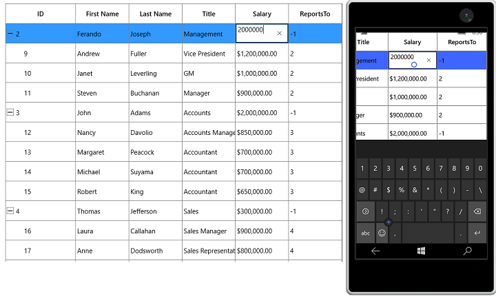

By default, Columns handling the data operations (sorting) based on `MappingName` property.

### CellTemplate in TreeGridColumn

You can load any UWP control in the display mode for all columns by setting [TreeGridColumn.CellTemplate](https://help.syncfusion.com/cr/uwp/Syncfusion.UI.Xaml.Grid.GridColumnBase.html#Syncfusion_UI_Xaml_Grid_GridColumnBase_CellTemplate) property. In edit mode, corresponding editor will be loaded based on column type. 

In the below code snippet, `TreeGridNumericColumn` is loaded with `ProgressBar` and `TextBlock`. When you start editing `DoubleTextBox` will be loaded as Editor.



<syncfusion:SfTreeGrid Name="treeGrid"
                AllowEditing="True"
                AutoExpandMode="AllNodesExpanded"
                AutoGenerateColumns="False"
                ChildPropertyName="ReportsTo"
                ItemsSource="{Binding Employees}"
                ParentPropertyName="ID">
    <syncfusion:SfTreeGrid.Columns>
        <syncfusion:TreeGridNumericColumn MappingName="Salary">
            <syncfusion:TreeGridNumericColumn.CellTemplate>
                <DataTemplate>
                    <Grid>
                        <ProgressBar x:Name="progressBar"
                                Height="50"
                                Background="Transparent"
                                BorderThickness="0"
                                Maximum="5000000"
                                Minimum="0"
                                Visibility="Visible"
                                Value="{Binding Path=Salary}" />
                        <TextBlock HorizontalAlignment="Right"
                            VerticalAlignment="Center"
                            Text="{Binding Path=Salary}"
                            TextAlignment="Center" />
                    </Grid>
                </DataTemplate>
            </syncfusion:TreeGridNumericColumn.CellTemplate>
        </syncfusion:TreeGridNumericColumn>
    </syncfusion:SfTreeGrid.Columns>
</syncfusion:SfTreeGrid>



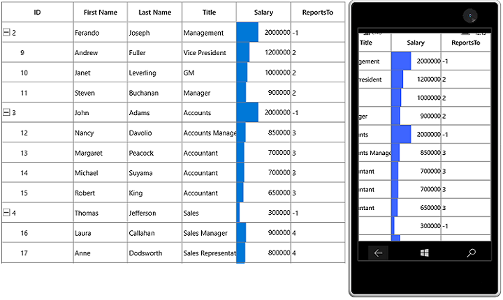

`CellTemplate` is not support by [TreeGridHyperlinkColumn](https://help.syncfusion.com/cr/uwp/Syncfusion.UI.Xaml.TreeGrid.TreeGridHyperlinkColumn.html) and [TreeGridCheckboxColumn](https://help.syncfusion.com/cr/uwp/Syncfusion.UI.Xaml.TreeGrid.TreeGridCheckBoxColumn.html) columns.

#### Reusing same DataTemplate for multiple columns

By default, underlying record is `DataContext` for CellTemplate. So you have to define, template for each column to display values based on `MappingName`. 

You can use the same [DataTemplate](https://msdn.microsoft.com/en-us/library/windows/apps/windows.ui.xaml.datatemplate.aspx) for all columns to display value based on MappingName by setting [TreeGridColumn.SetCellBoundValue](https://help.syncfusion.com/cr/uwp/Syncfusion.UI.Xaml.Grid.GridColumnBase.html#Syncfusion_UI_Xaml_Grid_GridColumnBase_SetCellBoundValue)  property to `true`. Setting `SetCellBoundValue` to true, changes the DataContext for CellTemplate to `DataContextHelper` which has the following members,

* `Value` - Return the value base on `MappingName`.
* `Record` - Returns the underlying data object.



<Page.Resources>
    <DataTemplate x:Key="cellTemplate">
        <TextBlock Margin="3,0,0,0"
                    Foreground="Red"
                    Text="{Binding Path=Value}" />
    </DataTemplate>
</Page.Resources>
<syncfusion:SfTreeGrid Name="treeGrid"
                        AutoExpandMode="AllNodesExpanded"
                        ChildPropertyName="ReportsTo"
                        ItemsSource="{Binding Employees}"
                        ParentPropertyName="ID">
    <syncfusion:SfTreeGrid.Columns>
        <syncfusion:TreeGridTextColumn CellTemplate="{StaticResource cellTemplate}"
                                        HeaderText="ID"
                                        MappingName="ID"
                                        SetCellBoundValue="True"
                                        TextAlignment="Left" />
        <syncfusion:TreeGridTextColumn HeaderText="First Name" MappingName="FirstName" />
        <syncfusion:TreeGridTextColumn CellTemplate="{StaticResource cellTemplate}"
                                        HeaderText="Last Name"
                                        MappingName="LastName"
                                        SetCellBoundValue="True" />
    </syncfusion:SfTreeGrid.Columns>
</syncfusion:SfTreeGrid>



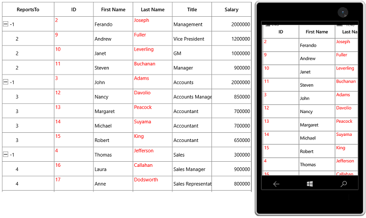

#### Setting CellTemplate based on custom logic using TemplateSelector

`TreeGridColumn` provides support to choose different[DataTemplate](https://msdn.microsoft.com/en-us/library/windows/apps/windows.ui.xaml.datatemplate.aspx) based on underlying data object using [TreeGridColumn.CellTemplateSelector](https://help.syncfusion.com/cr/uwp/Syncfusion.UI.Xaml.Grid.GridColumnBase.html#Syncfusion_UI_Xaml_Grid_GridColumnBase_CellTemplateSelector) property.  

For example, two different templates loaded alternatively in `Salary` column. 



<Application.Resources>
    <local:CustomCellTemplateSelector x:Key="cellTemplateSelector" />

    <DataTemplate x:Key="DefaultTemplate">
        <TextBlock Foreground="Red"
                    Text="{Binding Path=Salary}"
                    TextAlignment="Center" />
    </DataTemplate>

    <DataTemplate x:Key="AlternateTemplate">
        <TextBlock Foreground="Green"
                    Text="{Binding Path=Salary}"
                    TextAlignment="Center" />
    </DataTemplate>
        
</Application.Resources>



Below code returns the `DefaultTemplate` and `AlternateTemplate` based on Salary’s value.



public class CustomCellTemplateSelector:DataTemplateSelector
{

    protected override DataTemplate SelectTemplateCore(object item, DependencyObject container)
    {

        if (item == null)
            return null;
        var data = item as EmployeeInfo;

        if (data.Salary < 1000000)
            return App.Current.Resources["AlternateTemplate"] as DataTemplate;

        else
            return App.Current.Resources["DefaultTemplate"] as DataTemplate;
    }
}



In the below code, the custom template selector set to `TreeGridColumn.CellTemplateSelector`.



<syncfusion:SfTreeGrid Name="treeGrid"
                        AutoExpandMode="AllNodesExpanded"
                        ChildPropertyName="ReportsTo"
                        ItemsSource="{Binding Employees}"
                        ParentPropertyName="ID">
    <syncfusion:SfTreeGrid.Columns>
        <syncfusion:TreeGridNumericColumn CellTemplateSelector="{StaticResource cellTemplateSelector}"
                                          MappingName="Salary"/>
    </syncfusion:SfTreeGrid.Columns>
</syncfusion:SfTreeGrid>



N> Non-Editable columns does not support `CellTemplate`.

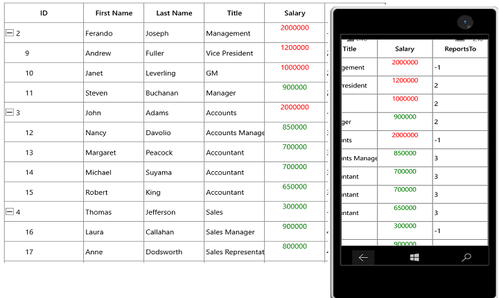

#### Binding ViewModel properties with CellTemplate

You can bind properties in ViewModel with the controls in CellTemplate.
 
Below command defined in ViewModel is bound to `Button` inside `CellTemplate`. Below code, denote the base command.



public class BaseCommand : ICommand
{
    #region Fields
    readonly Action<object> _execute;
    readonly Predicate<object> _canExecute;
    public event EventHandler CanExecuteChanged;
    #endregion

    #region Constructors
    /// 

    /// Creates a new command that always execute.
    /// 

    /// <param name="execute">The execution logic.</param>

    public BaseCommand(Action<object> execute)
        : this(execute, null)
    {
    }
    /// 

    /// Creates a new command.
    /// 

    /// <param name="execute">The execution logic.</param>
    /// <param name="canExecute">The execution status logic.</param>

    public BaseCommand(Action<object> execute, Predicate<object> canExecute)
    {

        if (execute == null)
            throw new ArgumentNullException("execute");
        _execute = execute;
        _canExecute = canExecute;
    }

    #endregion        
    bool ICommand.CanExecute(object parameter)
    {
        return _canExecute == null ? true : _canExecute(parameter);
    }

    void ICommand.Execute(object parameter)
    {
        _execute(parameter);
    }                
}



Below code, defines the command for `Button` in `ViewModel`.



public class ViewModel
{    
    private BaseCommand deleteRecord;

    public BaseCommand DeleteRecord
    {
        get
        {

            if (deleteRecord == null)
                deleteRecord = new BaseCommand(OnDeleteRecordClicked, OnCanDelete);
            return deleteRecord;
        }
    }

    private static bool OnCanDelete(object obj)
    {
        return true;
    }

    private void OnDeleteRecordClicked(object obj)
    {

        //TODO ACTION.
    }
}



In the below code, Button inside CellTemplate bound to the command in ViewModel. 



<syncfusion:SfTreeGrid Name="treeGrid"
                        AutoExpandMode="AllNodesExpanded"
                        ChildPropertyName="ReportsTo"
                        ItemsSource="{Binding Employees}"
                        ParentPropertyName="ID">

    <syncfusion:SfTreeGrid.Columns>
        <syncfusion:TreeGridTextColumn HeaderText="ID" MappingName="ID">
            <syncfusion:TreeGridTextColumn.CellTemplate>
                <DataTemplate>
                    <Button Command="{Binding DeleteRecord,
                                        Source={StaticResource viewModel}}"
                            CommandParameter="{Binding}" 
                            HorizontalAlignment="Stretch" 
                            VerticalAlignment="Stretch"
                            Content="Delete" />
                                   <!--or-->
                     <Button Command="{Binding DataContext.DeleteRecord,
                                              ElementName=treeGrid}"
                                     CommandParameter="{Binding}"
                                     Content="Delete" />
                </DataTemplate>
            </syncfusion:TreeGridTextColumn.CellTemplate>
        </syncfusion:TreeGridTextColumn>
    </syncfusion:SfTreeGrid.Columns>
</syncfusion:SfTreeGrid>



### Data Formatting

`TreeGridColumn` supports to format the data using[Converter](https://msdn.microsoft.com/en-us/library/windows/apps/windows.ui.xaml.data.binding.converter.aspx# "") properties, by defining `TreeGridColumn.DisplayBinding` and `TreeGridColumn.ValueBinding`. `TreeGridColumn.DisplayBinding` formats the data in display mode. `TreeGridColumn.ValueBinding` formats the data in edit mode.

#### Format column using Converter

You can format the column using `Converter` property by defining `DisplayBinding`. 



<Page.Resources>
    <local:CurrencyFormatConverter x:Key="converter" />
</Page.Resources>

<syncfusion:SfTreeGrid Name="treeGrid"
                AutoExpandMode="AllNodesExpanded"
                ChildPropertyName="ReportsTo"
                ItemsSource="{Binding Employees}"
                ParentPropertyName="ID">

    <syncfusion:SfTreeGrid.Columns>
        <syncfusion:TreeGridTextColumn DisplayBinding="{Binding Salary,
                                                                Converter={StaticResource converter}}"
                                        HeaderText="Salary"
                                        MappingName="Salary" />
    </syncfusion:SfTreeGrid.Columns>
</syncfusion:SfTreeGrid>





public class CurrencyFormatConverter : IValueConverter
{

    public object Convert(object value, Type targetType, object parameter, string language)
    {
        return string.Format("{0:C2}", value);
    }

    public object ConvertBack(object value, Type targetType, object parameter, string language)
    {
        return value;
    }
}



When column is auto-generated, you can set the `Converter` by handling [AutoGeneratingColumn](https://help.syncfusion.com/cr/uwp/Syncfusion.UI.Xaml.TreeGrid.SfTreeGrid.html) event



treeGrid.AutoGeneratingColumn += TreeGrid_AutoGeneratingColumn;

private void TreeGrid_AutoGeneratingColumn(object sender, TreeGridAutoGeneratingColumnEventArgs e)
{

    if (e.Column.MappingName == "Salary")
    {

        if (e.Column is TreeGridNumericColumn)
        {
            e.Column = new TreeGridTextColumn() { MappingName = "Salary" };
        }
        e.Column.DisplayBinding = new Binding() { Path = new PropertyPath(e.Column.MappingName), Converter = new CurrencyFormatConverter() };
    }
}



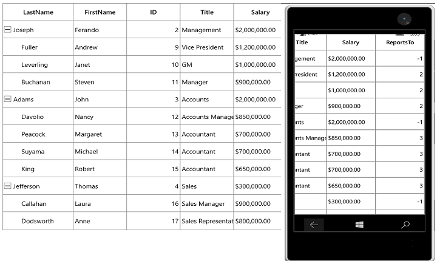

### Styling TreeGridColumn

`TreeGridColumn` support to customize the style of particular column using [TreeGridColumn.CellStyle](https://help.syncfusion.com/cr/uwp/Syncfusion.UI.Xaml.Grid.GridColumnBase.html#Syncfusion_UI_Xaml_Grid_GridColumnBase_CellStyle) property.
 
#### Change the font setting

You can change the font settings such as `FontSize`, `FontFamily`, `FontWeight` etc. by writing style of TargetType `TreeGridCell` or `TreeGridColumn.CellStyle` property.



<syncfusion:SfTreeGrid Name="treeGrid"
                        AutoExpandMode="AllNodesExpanded"
                        AutoGenerateColumns="True"
                        ChildPropertyName="ReportsTo"
                        ItemsSource="{Binding Employees}"
                        ParentPropertyName="ID">

    <syncfusion:SfTreeGrid.Columns>
        <syncfusion:TreeGridTextColumn HeaderText="First Name" MappingName="FirstName">
            <syncfusion:TreeGridTextColumn.CellStyle>
                
            </syncfusion:TreeGridTextColumn.CellStyle>
        </syncfusion:TreeGridTextColumn>
    </syncfusion:SfTreeGrid.Columns>
</syncfusion:SfTreeGrid>



When column is auto-generated, you can style the column by handling `AutoGeneratingColumn` event



<Page.Resources>
        
            
</Page.Resources>





treeGrid.AutoGeneratingColumn += TreeGrid_AutoGeneratingColumn;

private void TreeGrid_AutoGeneratingColumn(object sender, TreeGridAutoGeneratingColumnEventArgs e)
{

    if (e.Column.MappingName == "FirstName")
    {
         e.Column.CellStyle=this.Resources["cellStyle"] as Style;
    }
}



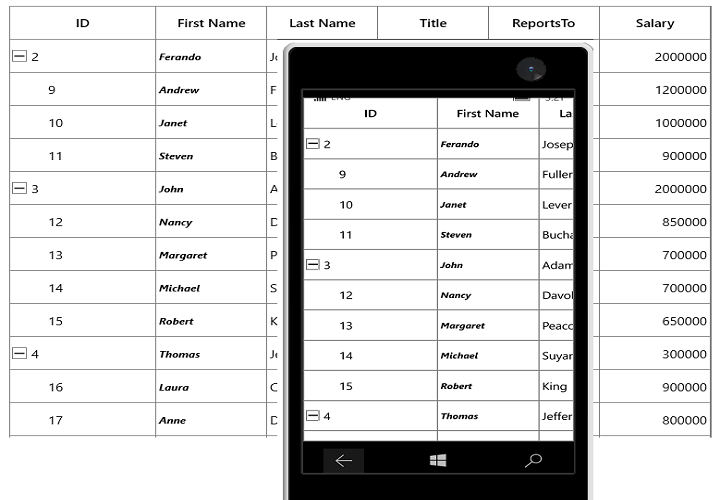

#### Styles based on custom logic

You can apply the styles to columns based on certain condition using `TreeGridColumn.CellStyleSelector` property.

Below code creates two different styles by TargetType `TreeGridCell`.



<Application.Resources>
    
    
</Application.Resources>



In the below code, returns the style based on `ID` value. Using `Container` you can format the columns data based on `TreeGridCell`.



public class CustomCellStyleSelector : StyleSelector
{
    protected override Style SelectStyleCore(object item, DependencyObject container)
    {
        var treeGridCell = container as TreeGridCell;
        var mappingName = treeGridCell.ColumnBase.TreeGridColumn.MappingName;
        var record = treeGridCell.DataContext;
        var cellValue = record.GetType().GetProperty(mappingName).GetValue(record);

        if (mappingName.Equals("ID"))
        {

            if (Convert.ToInt16(cellValue)%3==0)
                return App.Current.Resources["cellStyle1"] as Style;

            else
                return App.Current.Resources["cellStyle2"] as Style;
        }
        return base.SelectStyle(item, container);
    }
}



Below code, sets the customized style selector to `TreeGridColumn.CellStyleSelector` property.



<Page.Resources>
    <local:CustomCellStyleSelector x:Key="cellStyleSelector">
</Page.Resources>
<syncfusion:SfTreeGrid Name="treeGrid"
                        AutoExpandMode="AllNodesExpanded"
                        AutoGenerateColumns="True"
                        ChildPropertyName="ReportsTo"
                        ItemsSource="{Binding Employees}"
                        ParentPropertyName="ID">
    <syncfusion:SfTreeGrid.Columns>
        <syncfusion:TreeGridTextColumn MappingName="ID" 
                                       CellStyleSelector="{StaticResource cellStyleSelector}" />
    </syncfusion:SfTreeGrid.Columns>



When column is auto-generated, you can style the column by handling `AutoGeneratingColumn` event



treeGrid.AutoGeneratingColumn += TreeGrid_AutoGeneratingColumn;

private void TreeGrid_AutoGeneratingColumn(object sender, TreeGridAutoGeneratingColumnEventArgs e)
{

    if (e.Column.MappingName == "ID")
    {
        e.Column.CellStyleSelector = new CustomCellStyleSelector();
    }
}



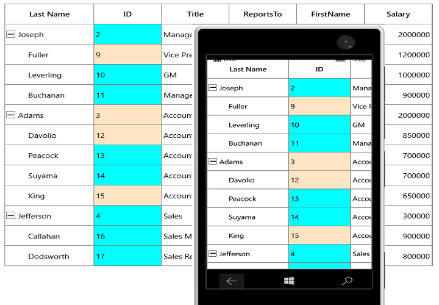

### UI Interaction

#### Hide Column

You can hide or unhide the particular column programmatically by setting [TreeGridColumn.IsHidden](https://help.syncfusion.com/cr/uwp/Syncfusion.UI.Xaml.Grid.GridColumnBase.html#Syncfusion_UI_Xaml_Grid_GridColumnBase_IsHidden) property. For allowing end-user to hide or unhide column in UI refer Resizing Columns section.

#### Disable column

You can disable column by setting [TreeGridColumn.AllowFocus](https://help.syncfusion.com/cr/uwp/Syncfusion.UI.Xaml.Grid.GridColumnBase.html#Syncfusion_UI_Xaml_Grid_GridColumnBase_AllowFocus) property. Therefore, that column can’t be selected or edited. 

### Width, alignment and padding settings

#### Width

The width of `TreeGridColumn` can be changed by setting `Width` property. Column width set based on [TreeGridColumn.MinimumWidth](https://help.syncfusion.com/cr/uwp/Syncfusion.UI.Xaml.Grid.GridColumnBase.html#Syncfusion_UI_Xaml_Grid_GridColumnBase_MinimumWidth) and [TreeGridColumn.MaximumWidth](https://help.syncfusion.com/cr/uwp/Syncfusion.UI.Xaml.Grid.GridColumnBase.html#Syncfusion_UI_Xaml_Grid_GridColumnBase_MaximumWidth) properties.

N> If the `TreeGridColumn.Width` is defined explicitly takes priority than `TreeGridColumn.ColumnSizer`.

#### Padding

TreeGridColumn allows you to the change the padding of cell content by setting `Padding` property. 

#### Alignment

TreeGridColumn allows you to change the alignment of `TreeGridCell` and `TreeGridHeaderCellControl` content using `TextAlignment`, `VerticalAlignment` and `HorizontalHeaderContentAlignment` properties.

## TreeGridTextColumnBase

[TreeGridTextColumnBase](https://help.syncfusion.com/cr/uwp/Syncfusion.UI.Xaml.TreeGrid.TreeGridTextColumnBase.html) is the abstract class derived from `TreeGridColumn`. The following columns are derived from the `TreeGridTextColumnBase`.

1. TreeGridTextColumn

2. TreeGridDateTimeColumn

3. TreeGridNumericColumn

4. TreeGridTemplateColumn

### TreeGridTextColumnBase properties

* Text trimming - You can [trim](https://msdn.microsoft.com/en-us/library/windows/apps/windows.ui.xaml.texttrimming.aspx) the column’s data using [TextTrimming](https://help.syncfusion.com/cr/uwp/Syncfusion.UI.Xaml.TreeGrid.TreeGridTextColumnBase.html#Syncfusion_UI_Xaml_TreeGrid_TreeGridTextColumnBase_TextTrimming) property.

* Text wrapping - You can [wrap](https://msdn.microsoft.com/en-us/library/windows/apps/windows.ui.xaml.textwrapping.aspx) the column’s data using [TextWrapping](https://help.syncfusion.com/cr/uwp/Syncfusion.UI.Xaml.TreeGrid.TreeGridTextColumnBase.html#Syncfusion_UI_Xaml_TreeGrid_TreeGridTextColumnBase_TextWrapping) property. 



<syncfusion:SfTreeGrid Name="treeGrid"                               
                AutoExpandMode="AllNodesExpanded"
                AutoGenerateColumns="True"
                ChildPropertyName="ReportsTo"
                ItemsSource="{Binding Employees}"
                ParentPropertyName="ID">

    <syncfusion:SfTreeGrid.Columns>
        <syncfusion:TreeGridTextColumn HeaderText="First Name" 
                                       MappingName="FirstName"  
                                       Width="60" 
                                       TextTrimming="CharacterEllipsis" 
                                       TextWrapping="Wrap"/>
    </syncfusion:SfTreeGrid.Columns>
</syncfusion:SfTreeGrid>



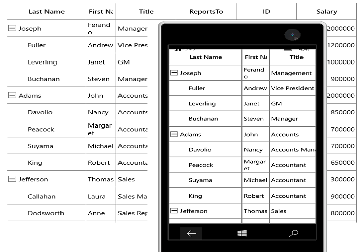

## TreeGridTextColumn

`TreeGridTextColumn` derived from `TreeGridTextColumnBase` which hosts `TextBox` in edit mode.



<syncfusion:SfTreeGrid Name="treeGrid"   
                AutoGenerateColumns="False"
                ChildPropertyName="ReportsTo"
                ItemsSource="{Binding Employees}"
                ParentPropertyName="ID">

    <syncfusion:SfTreeGrid.Columns>
        <syncfusion:TreeGridTextColumn HeaderText="First Name" 
                                       MappingName="FirstName"  
                                      />
    </syncfusion:SfTreeGrid.Columns>
</syncfusion:SfTreeGrid>


treeGrid.Columns.Add(new TreeGridTextColumn()
{
    MappingName = "FirstName",
    HeaderText = "First Name"
});



### Spell check while editing

You can enable spell check in TreeGridTextColumn using `IsSpellCheckEnabled` property.



<syncfusion:TreeGridTextColumn HeaderText="First Name" 
                               IsSpellCheckEnabled="True"
                               MappingName="FirstName"  />


this.treeGrid.Columns.Add(new TreeGridTextColumn() { MappingName = "FirstName", HeaderText = "First Name", IsSpellCheckEnabled = true });



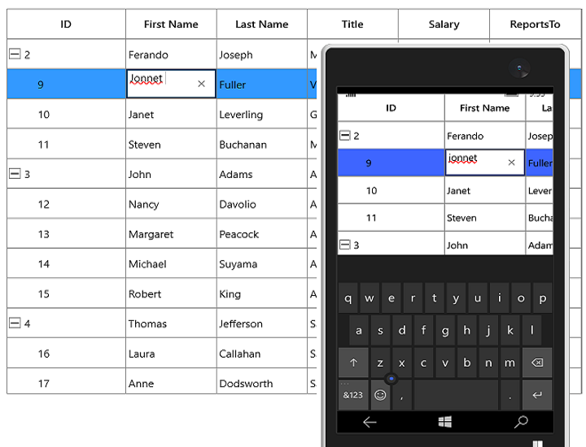

## TreeGridNumericColumn

[TreeGridNumericColumn](https://help.syncfusion.com/cr/uwp/Syncfusion.UI.Xaml.TreeGrid.TreeGridNumericColumn.html) derived from `TreeGridTextColumnBase` which displays columns data as numeric. It hosts `SfNumericTextBox` in editing mode.



<syncfusion:SfTreeGrid Name="treeGrid"   
                       AutoGenerateColumns="False"
                       ChildPropertyName="ReportsTo"
                       ItemsSource="{Binding Employees}"
                       ParentPropertyName="ID">

    <syncfusion:SfTreeGrid.Columns>
        <syncfusion:TreeGridNumericColumn MappingName="Salary" />
    </syncfusion:SfTreeGrid.Columns>
</syncfusion:SfTreeGrid>


  treeGrid.Columns.Add(new TreeGridNumericColumn() { MappingName = "Salary" });



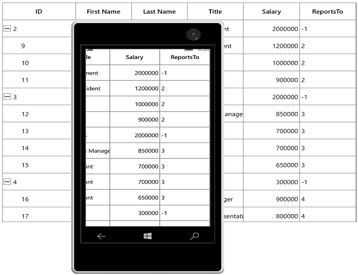

### Data formatting

`TreeGridNumericColumn` allows you to format the numeric data by specifying the[predefined format specifier](https://msdn.microsoft.com/en-us/library/dwhawy9k.aspx)  or  [custom numeric format strings](https://msdn.microsoft.com/en-us/library/0c899ak8.aspx) into [TreeGridNumericColumn.FormatString](https://help.syncfusion.com/cr/uwp/Syncfusion.UI.Xaml.TreeGrid.TreeGridNumericColumn.html#Syncfusion_UI_Xaml_TreeGrid_TreeGridNumericColumn_FormatString) property. 


<syncfusion:TreeGridNumericColumn  MappingName="Salary" 
                                   FormatString="C" />


treeGrid.Columns.Add(new TreeGridNumericColumn()
{
    MappingName = "Salary", FormatString = "C"
});



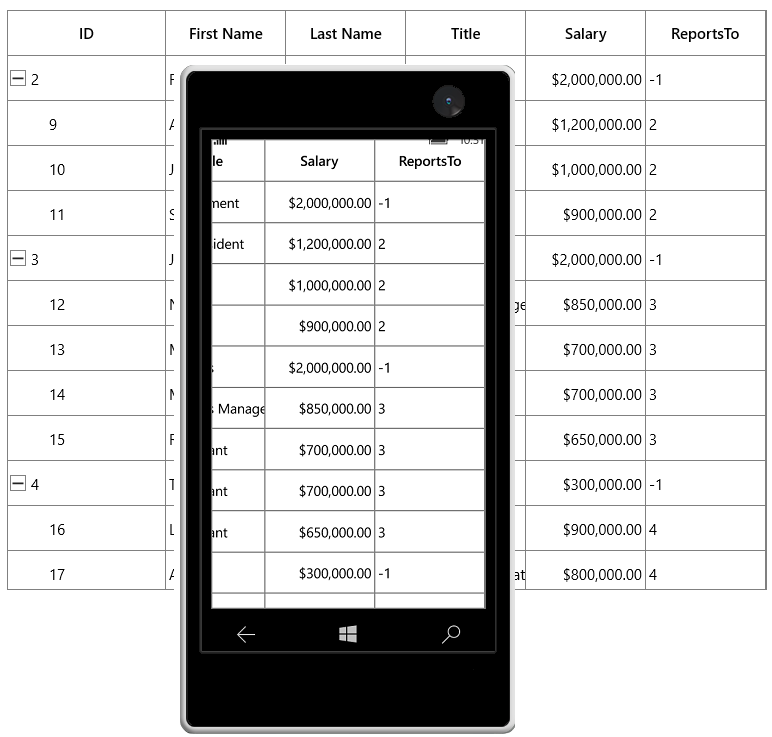

### Null value support

TreeGridNumericColumn provides support to restrict or allow null value in columns based on [AllowNull](https://help.syncfusion.com/cr/uwp/Syncfusion.UI.Xaml.TreeGrid.TreeGridNumericColumn.html#Syncfusion_UI_Xaml_TreeGrid_TreeGridNumericColumn_AllowNull) property. Instead of displaying null values, you can display hint text using [Watermark](https://help.syncfusion.com/cr/uwp/Syncfusion.UI.Xaml.TreeGrid.TreeGridNumericColumn.html#Syncfusion_UI_Xaml_TreeGrid_TreeGridNumericColumn_WaterMark) property. 

The `Watermark` property won’t work, when the ` AllowNull` is `false`.



<syncfusion:TreeGridNumericColumn  MappingName="Salary" 
                                   AllowNull="True" 
                                   WaterMark="Enter Salary value" />





treeGrid.Columns.Add(new TreeGridNumericColumn()
{
    MappingName = "Salary",
    AllowNull = true,
    WaterMark="Enter Salary value"

});



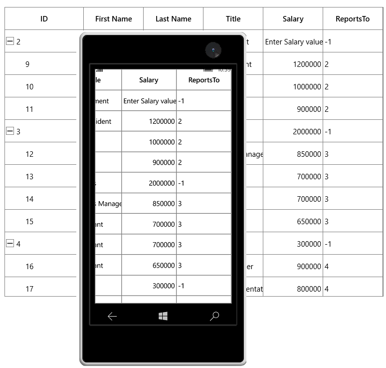

### Parsing Mode

You can bind either `Decimal` or `Double` values with TreeGridNumericColumn by using [ParsingMode](https://help.syncfusion.com/cr/uwp/Syncfusion.UI.Xaml.TreeGrid.TreeGridNumericColumn.html#Syncfusion_UI_Xaml_TreeGrid_TreeGridNumericColumn_ParsingMode) property. The default parsing mode is `Double`.

## TreeGridDateTimeColumn

[TreeGridDateTimeColumn](https://help.syncfusion.com/cr/uwp/Syncfusion.UI.Xaml.TreeGrid.TreeGridDateTimeColumn.html) derived from `TreeGridTextColumnBase` and it displays columns data as date time. It hosts `SfDatePicker` element in editing mode.


<syncfusion:SfTreeGrid Name="treeGrid"                               
                        ChildPropertyName="ReportsTo"
                        ItemsSource="{Binding Employees}"
                        ParentPropertyName="ID">

    <syncfusion:SfTreeGrid.Columns>
        <syncfusion:TreeGridDateTimeColumn MappingName="DOB" 
                            HeaderText="Employee DOB"/>
    </syncfusion:SfTreeGrid.Columns>
</syncfusion:SfTreeGrid>


treeGrid.Columns.Add(new TreeGridDateTimeColumn()
{
    MappingName = "DOB",
    HeaderText = "Employee DOB"
});



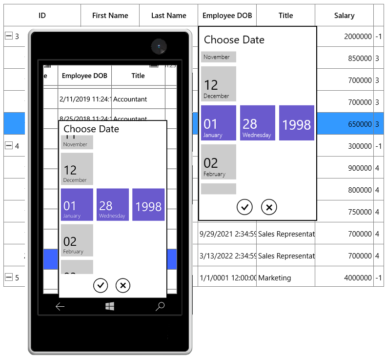

### Formatting date time value

You can format the date time value by specifying the [predefined format specifier](https://msdn.microsoft.com/en-us/library/az4se3k1.aspx) into [TreeGridDateTimeColumn.FormatString](https://help.syncfusion.com/cr/uwp/Syncfusion.UI.Xaml.TreeGrid.TreeGridDateTimeColumn.html#Syncfusion_UI_Xaml_TreeGrid_TreeGridDateTimeColumn_FormatString) property. 



<syncfusion:TreeGridDateTimeColumn MappingName="DOB" 
                                   HeaderText="Employee DOB"
                                   FormatString="f"/>


treeGrid.Columns.Add(new TreeGridDateTimeColumn()
{
    MappingName = "DOB",
    HeaderText = "Employee DOB",
    FormatString="f"
});



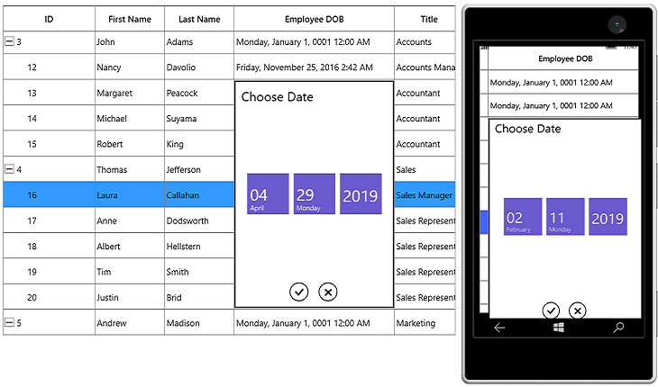

When the predefined format specifier does not meet your requirement, you can set the [custom date and time format strings](https://msdn.microsoft.com/en-us/library/8kb3ddd4.aspx) into `FormatString` property.



<syncfusion:TreeGridDateTimeColumn HeaderText="Employee DOB"
                                   MappingName="DOB"
                                   FormatString="yyyy/dd/MM"
                                   SelectorFormatString="yyyy/dd/MM" />


treeGrid.Columns.Add(new TreeGridDateTimeColumn()
{
    MappingName = "DOB",
    HeaderText = "Employee DOB",
    FormatString = "yyyy/dd/MM",
    SelectorFormatString = "yyyy/dd/MM"
});



### Editing support 

By default, the user can input the date time value by selecting through date selector. You can allow users to input or delete the date time value from the keyboard by setting [AllowInlineEditing](https://help.syncfusion.com/cr/uwp/Syncfusion.UI.Xaml.TreeGrid.TreeGridDateTimeColumn.html#Syncfusion_UI_Xaml_TreeGrid_TreeGridDateTimeColumn_AllowInlineEditing) to `true`.

### Setting input scope for On-Screen Keyboard

You can set the input scope for On-Screen Keyboard using `InputScope` property when `AllowInlineEditing` is set to `true`.



<syncfusion:TreeGridDateTimeColumn HeaderText="Employee DOB"
                                   MappingName="DOB"
                                   InputScope="Number"
                                   AllowInlineEditing="True"/>


treeGrid.Columns.Add(new TreeGridDateTimeColumn()
{
    MappingName = "DOB",
    HeaderText = "Employee DOB",
    AllowInlineEditing=true,
    InputScope=InputScopeNameValue.Number
});



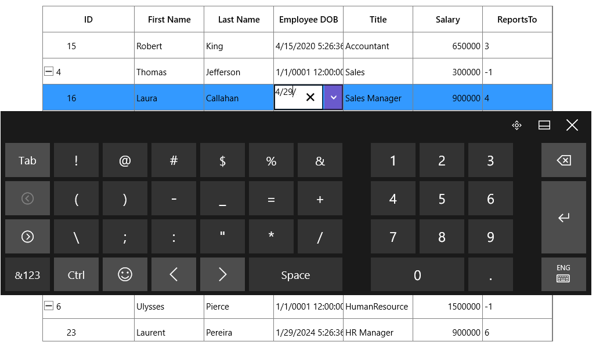

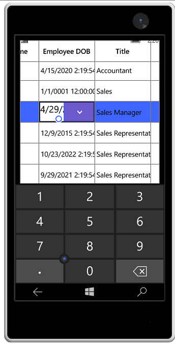

### Null value support

`TreeGridDateTimeColumn` provides support to restrict or allow null value in columns based on [AllowNullValue](https://help.syncfusion.com/cr/uwp/Syncfusion.UI.Xaml.TreeGrid.TreeGridDateTimeColumn.html#Syncfusion_UI_Xaml_TreeGrid_TreeGridDateTimeColumn_AllowNullValue) property. Instead of displaying null values, you can display hint text using [Watermark](https://help.syncfusion.com/cr/uwp/Syncfusion.UI.Xaml.TreeGrid.TreeGridDateTimeColumn.html#Syncfusion_UI_Xaml_TreeGrid_TreeGridDateTimeColumn_WaterMark) property.

The `Watermark` property won’t work, when the `AllowNullValue` is `false`.



<syncfusion:TreeGridDateTimeColumn HeaderText="Employee DOB"
                                   MappingName="DOB" 
                                   AllowNullValue="True" 
                                   WaterMark="Enter employee DOB"/>


treeGrid.Columns.Add(new TreeGridDateTimeColumn()
{
    MappingName = "DOB",
    HeaderText = "Employee DOB",
    AllowNullValue=true,
    WaterMark="Enter employee DOB"
});



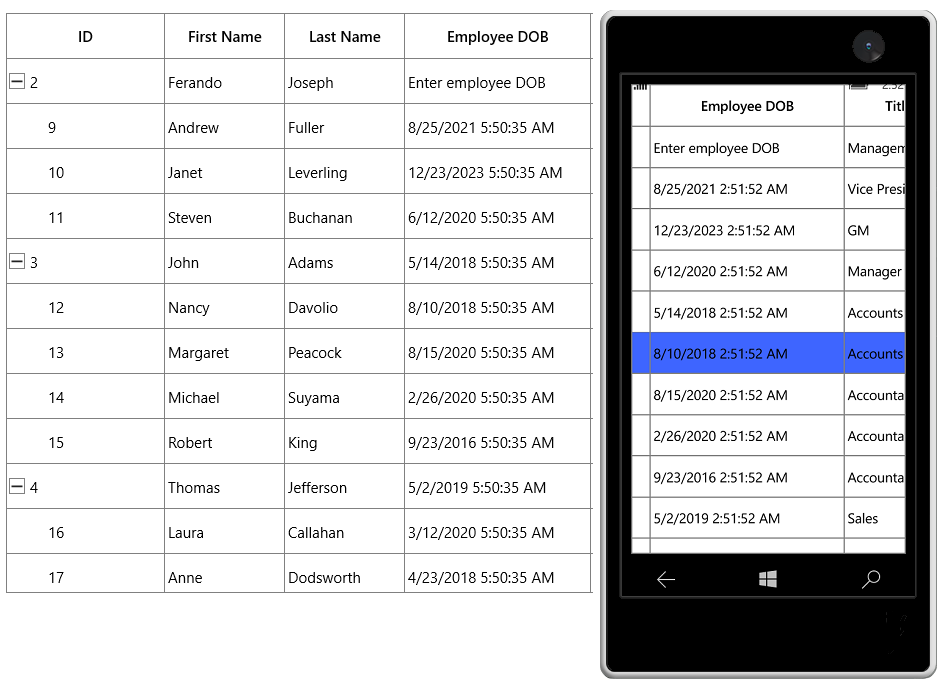

### Setting date time value range

You can restrict and display the input value with in the range using [MinDate](https://help.syncfusion.com/cr/uwp/Syncfusion.UI.Xaml.TreeGrid.TreeGridDateTimeColumn.html#Syncfusion_UI_Xaml_TreeGrid_TreeGridDateTimeColumn_MinDate) and [MaxDate](https://help.syncfusion.com/cr/uwp/Syncfusion.UI.Xaml.TreeGrid.TreeGridDateTimeColumn.html#Syncfusion_UI_Xaml_TreeGrid_TreeGridDateTimeColumn_MaxDate) properties.



DateTime minDate = new DateTime(2015 , 2 , 2);
public DateTime MinDate
{
    get { return minDate; }
    set { minDate = value; RaisePropertyChanged("MinDate"); }
}

DateTime maxDate = new DateTime(2015 , 5 , 5);
public DateTime MaxDate
{
    get { return maxDate; }
    set { maxDate = value; RaisePropertyChanged("MaxDate"); }
}



<Page.Resources>
    <local:ViewModel x:Key="viewModel" />
</Page.Resources>

<syncfusion:TreeGridDateTimeColumn HeaderText="Employee DOB"
                                   MappingName="DOB" 
                                   MinDate="{Binding MinDate,Source={StaticResource viewModel}}"
                                   MaxDate="{Binding MaxDate,Source={StaticResource viewModel}}"/>



### Dropdown customization

You can hide or unhide the dropdown button by using [ShowDropDownButton](https://help.syncfusion.com/cr/uwp/Syncfusion.UI.Xaml.TreeGrid.TreeGridDateTimeColumn.html#Syncfusion_UI_Xaml_TreeGrid_TreeGridDateTimeColumn_ShowDropDownButton) property. The height of dropdown can be changed using [DropDownHeight](https://help.syncfusion.com/cr/uwp/Syncfusion.UI.Xaml.TreeGrid.TreeGridDateTimeColumn.html#Syncfusion_UI_Xaml_TreeGrid_TreeGridDateTimeColumn_DropDownHeight) property. 



<syncfusion:TreeGridDateTimeColumn HeaderText="Employee DOB"
                                   MappingName="DOB" 
                                   ShowDropDownButton="False"
                                   DropDownHeight="200"/>


treeGrid.Columns.Add(new TreeGridDateTimeColumn()
            {
                MappingName = "DOB",
                ShowDropDownButton = false,
                DropDownHeight = 200
            });



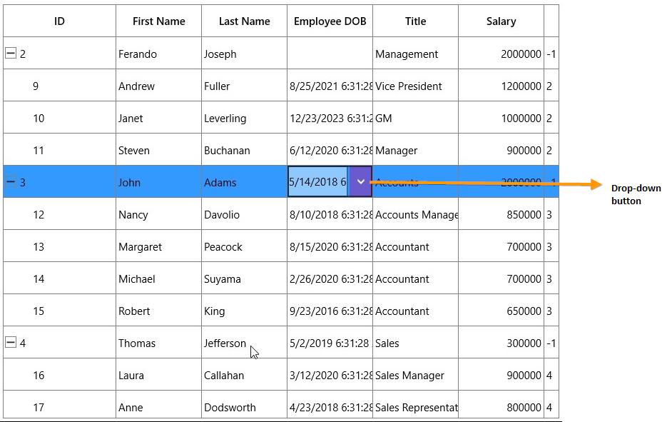

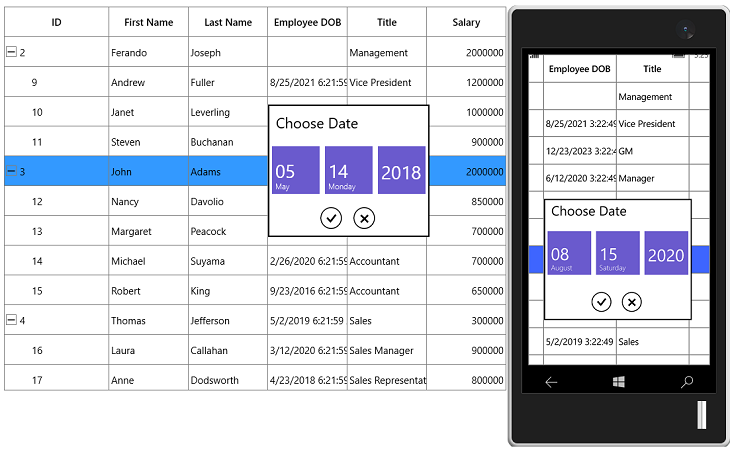

### Styling

You can style the SelectorItem with solid color using `[AccentBrush](https://help.syncfusion.com/cr/uwp/Syncfusion.UI.Xaml.TreeGrid.TreeGridDateTimeColumn.html#Syncfusion_UI_Xaml_TreeGrid_TreeGridDateTimeColumn_AccentBrush)` property.



<syncfusion:TreeGridDateTimeColumn HeaderText="Employee DOB"
                                   MappingName="DOB" 
                                   AccentBrush="LawnGreen"/>


treeGrid.Columns.Add(new TreeGridDateTimeColumn()
{
    MappingName = "DOB",
    HeaderText = "Employee DOB",
    AccentBrush = new SolidColorBrush(Colors.LawnGreen)
});



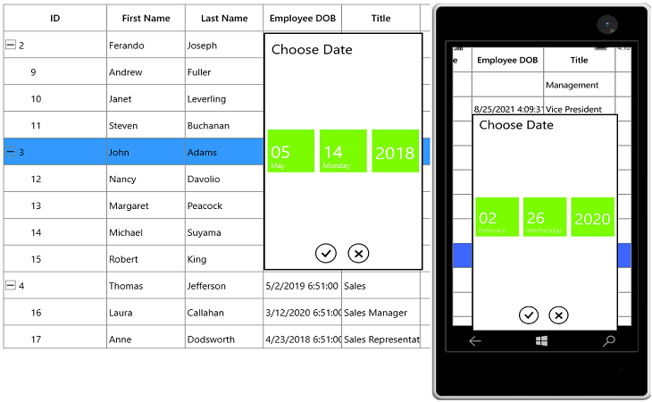

### SelectorItem customization

#### Height and width customization

The height and width of SelectorItem can be customized using [SelectorItemWidth](https://help.syncfusion.com/cr/uwp/Syncfusion.UI.Xaml.TreeGrid.TreeGridDateTimeColumn.html#Syncfusion_UI_Xaml_TreeGrid_TreeGridDateTimeColumn_SelectorItemWidth) and [SelectorItemHeight](https://help.syncfusion.com/cr/uwp/Syncfusion.UI.Xaml.TreeGrid.TreeGridDateTimeColumn.html#Syncfusion_UI_Xaml_TreeGrid_TreeGridDateTimeColumn_SelectorItemHeight) property.



<syncfusion:TreeGridDateTimeColumn HeaderText="Employee DOB"
                                   MappingName="DOB" 
                                   SelectorItemHeight="65"
                                   SelectorItemWidth="120"/>


treeGrid.Columns.Add(new TreeGridDateTimeColumn()
{
    MappingName = "DOB",
    HeaderText = "Employee DOB",
    SelectorItemHeight = 65,
    SelectorItemWidth = 120
});



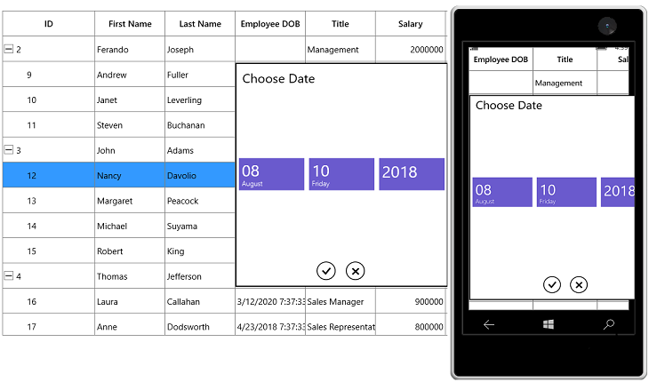

#### SelectorItem formatting

you can specify the format for the selector using [SelectorFormatString](https://help.syncfusion.com/cr/uwp/Syncfusion.UI.Xaml.TreeGrid.TreeGridDateTimeColumn.html#Syncfusion_UI_Xaml_TreeGrid_TreeGridDateTimeColumn_SelectorFormatString) property.



<syncfusion:TreeGridDateTimeColumn HeaderText="Employee DOB"
                                   MappingName="DOB"
                                   SelectorFormatString="yyyy/dd/MM" />


treeGrid.Columns.Add(new TreeGridDateTimeColumn()
{
    MappingName = "DOB",
    HeaderText = "Employee DOB",
    SelectorFormatString = "yyyy/dd/MM"
});



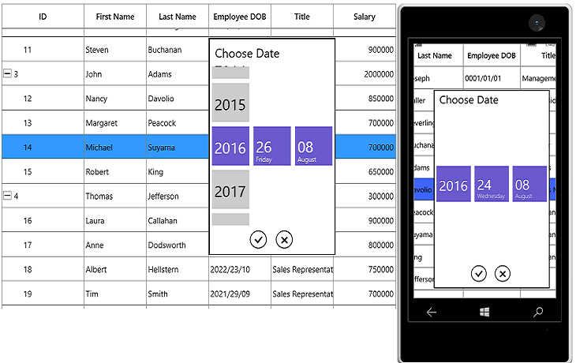

#### Spacing and count customization

You can customize the space between date, month and year selector items using [SelectorItemSpacing](https://help.syncfusion.com/cr/uwp/Syncfusion.UI.Xaml.TreeGrid.TreeGridDateTimeColumn.html#Syncfusion_UI_Xaml_TreeGrid_TreeGridDateTimeColumn_SelectorItemSpacing) property.
You can restrict the number of item to displayed in selector using [SelectorItemCount](https://help.syncfusion.com/cr/uwp/Syncfusion.UI.Xaml.TreeGrid.TreeGridDateTimeColumn.html#Syncfusion_UI_Xaml_TreeGrid_TreeGridDateTimeColumn_SelectorItemCount) property and 



<syncfusion:TreeGridDateTimeColumn HeaderText="Employee DOB"
                                   MappingName="DOB" 
                                   SelectorItemSpacing="20"
                                   SelectorItemCount="5"/>



treeGrid.Columns.Add(new TreeGridDateTimeColumn()
{
    MappingName = "DOB",
    HeaderText = "Employee DOB",
    SelectorItemSpacing=20,
    SelectorItemCount=5
});



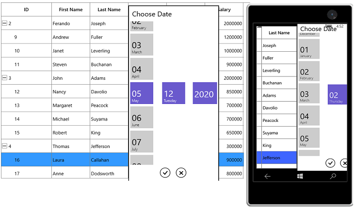

## TreeGridCheckBoxColumn

[TreeGridCheckBoxColumn](https://help.syncfusion.com/cr/uwp/Syncfusion.UI.Xaml.TreeGrid.TreeGridCheckBoxColumn.html) derived from `TreeGridColumn` and it used display and edit `Boolean` type data. It hosts `CheckBox` element as `TreeGridCell` content.




<syncfusion:SfTreeGrid Name="treeGrid"
                        ChildPropertyName="ReportsTo"
                        ItemsSource="{Binding Employees}"
                        ParentPropertyName="ID">

    <syncfusion:SfTreeGrid.Columns>
        <syncfusion:TreeGridCheckBoxColumn MappingName="AvailabilityStatus"/>
    </syncfusion:SfTreeGrid.Columns>
</syncfusion:SfTreeGrid>


treeGrid.Columns.Add(new TreeGridCheckBoxColumn()
{
    MappingName = "AvailabilityStatus",
    HeaderText = "Available Status"
});



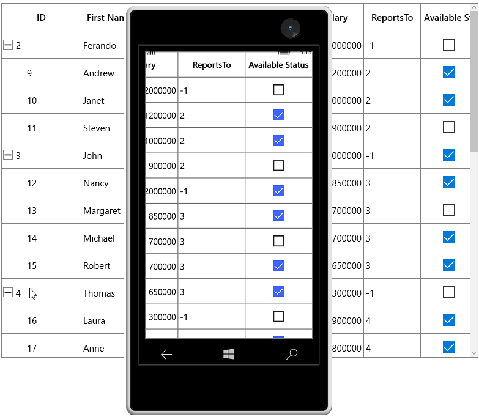

`TreeGridCheckBoxColumn` allows you to customize check box state and its alignment.

* [IsThreeState](https://help.syncfusion.com/cr/uwp/Syncfusion.UI.Xaml.TreeGrid.TreeGridCheckBoxColumn.html#Syncfusion_UI_Xaml_TreeGrid_TreeGridCheckBoxColumn_IsThreeState) - By default, the `TreeGridCheckBoxColumn` has `Checked` and `Unchecked**`** state. You can enable another `Intermediate` state setting `IsThreeState` property to `true`.

* [HorizontalAlignment](https://help.syncfusion.com/cr/uwp/Syncfusion.UI.Xaml.TreeGrid.TreeGridCheckBoxColumn.html#Syncfusion_UI_Xaml_TreeGrid_TreeGridCheckBoxColumn_HorizontalAlignment) - You can change the horizontal alignment of CheckBox using `HorizontalAlignment` property.  

## TreeGridTemplateColumn

[TreeGridTemplateColumn](https://help.syncfusion.com/cr/uwp/Syncfusion.UI.Xaml.TreeGrid.TreeGridTemplateColumn.html) derived from `TreeGridTextColumnBase` and it displays the template-specified cell content. You can load any UWP control in the display mode for all columns by setting `CellTemplate` and `EditTemplate` properties.



xmlns:sync="using:Syncfusion.UI.Xaml.Grid"
xmlns:syncfusion="using:Syncfusion.UI.Xaml.TreeGrid"

<syncfusion:SfTreeGrid Name="treeGrid"
                ChildPropertyName="ReportsTo"
                ItemsSource="{Binding Employees}"
                ParentPropertyName="ID">

    <syncfusion:SfTreeGrid.Columns>
        <syncfusion:TreeGridTemplateColumn MappingName="FirstName" HeaderText="First Name">
            <syncfusion:TreeGridTemplateColumn.CellTemplate>
                <DataTemplate>
                    <TextBlock Text="{Binding FirstName}"/>
                </DataTemplate>
            </syncfusion:TreeGridTemplateColumn.CellTemplate>
            <syncfusion:TreeGridTemplateColumn.EditTemplate>
                <DataTemplate>
                    <TextBox Text="{Binding FirstName}"
                                sync:FocusManagerHelper.FocusedElement="True"/>
                </DataTemplate>
            </syncfusion:TreeGridTemplateColumn.EditTemplate>
        </syncfusion:TreeGridTemplateColumn>
    </syncfusion:SfTreeGrid.Columns>
</syncfusion:SfTreeGrid>


StringBuilder sb1 = new StringBuilder();
sb1.Append("<DataTemplate xmlns=\"http://schemas.microsoft.com/winfx/2006/xaml/presentation\">");
sb1.Append("<TextBlock Text=\"{Binding FirstName}\" />");
sb1.Append("</DataTemplate>");
DataTemplate cellTemplate = (DataTemplate)XamlReader.Load(sb1.ToString());

StringBuilder sb2 = new StringBuilder();
sb2.Append("<DataTemplate xmlns=\"http://schemas.microsoft.com/winfx/2006/xaml/presentation\">");
sb2.Append("<TextBox Text=\"{Binding FirstName, Mode=TwoWay}\" />");
sb2.Append("</DataTemplate>");
DataTemplate editTemplate = (DataTemplate)XamlReader.Load(sb2.ToString());

this.treeGrid.Columns.Add(new TreeGridTemplateColumn()
{
    MappingName = "FirstName",
    CellTemplate = cellTemplate,
    EditTemplate = editTemplate
});



### Keyboard interaction for UIElement loaded inside CellTemplate

You can allow `UIElement` loaded inside `CellTemplate` to handle keyboard interaction by setting `[FocusManagerHelper.WantsKeyInput](https://help.syncfusion.com/cr/uwp/Syncfusion.UI.Xaml.Grid.FocusManagerHelper.html#Syncfusion_UI_Xaml_Grid_FocusManagerHelper_WantsKeyInputProperty)` attached property to `TreeGridColumn`. You can use this when loading edit element in CellTemplate. 

In this case SfTreeGrid handles the below key operations and other keys are handled by UIElement loaded inside `CellTemplate`. 



<syncfusion:TreeGridTemplateColumn MappingName="FirstName" 
                                    sync:FocusManagerHelper.WantsKeyInput="True" 
                                    HeaderText="First Name">
    <syncfusion:TreeGridTemplateColumn.CellTemplate>
        <DataTemplate>
            <TextBlock Text="{Binding FirstName}"/>
        </DataTemplate>
    </syncfusion:TreeGridTemplateColumn.CellTemplate>                
</syncfusion:TreeGridTemplateColumn>



### Setting focus to particular element inside Template when cell gets activated or edited

You can allow logical focus to specific UIElement loaded inside `EditTemplate` or `CellTemplate` by setting `[FocusManagerHelper.FocusedElement](https://help.syncfusion.com/cr/uwp/Syncfusion.UI.Xaml.Grid.FocusManagerHelper.html#Syncfusion_UI_Xaml_Grid_FocusManagerHelper_FocusedElementProperty)` attached property. 

You can use this property to start editing the template column value as like normal column when the user gets into edit mode.



xmlns:sync="using:Syncfusion.UI.Xaml.Grid"
xmlns:syncfusion="using:Syncfusion.UI.Xaml.TreeGrid"

<syncfusion:SfTreeGrid Name="treeGrid"
                ChildPropertyName="ReportsTo"
                ItemsSource="{Binding Employees}"
                ParentPropertyName="ID">

    <syncfusion:SfTreeGrid.Columns>
        <syncfusion:TreeGridTemplateColumn MappingName="FirstName" HeaderText="First Name">
            <syncfusion:TreeGridTemplateColumn.CellTemplate>
                <DataTemplate>
                    <TextBlock Text="{Binding FirstName}"/>
                </DataTemplate>
            </syncfusion:TreeGridTemplateColumn.CellTemplate>
            <syncfusion:TreeGridTemplateColumn.EditTemplate>
                <DataTemplate>
                    <TextBox Text="{Binding FirstName}"
                                sync:FocusManagerHelper.FocusedElement="True"/>
                </DataTemplate>
            </syncfusion:TreeGridTemplateColumn.EditTemplate>
        </syncfusion:TreeGridTemplateColumn>
    </syncfusion:SfTreeGrid.Columns>
</syncfusion:SfTreeGrid>



### Binding CellTemplate and EditTemplate based on MappingName

By default, underlying record is `DataContext` for CellTemplate. So you have to define, template for each column to display values based on `MappingName`. 

You can use the same [DataTemplate](https://msdn.microsoft.com/en-us/library/windows/apps/windows.ui.xaml.datatemplate.aspx) for all columns to display value based on MappingName by setting `SetCellBoundValue` property to `true`. Setting `SetCellBoundValue` to `true`, changes the DataContext for CellTemplate to `DataContextHelper` which has the following members,

* `Value` - Return the value base on `MappingName`.
* `Record` - Returns the underlying data object.

N> EditTemplate support available only for TreeGridTemplateColumn.



<syncfusion:SfTreeGrid Name="treeGrid"
                        AllowEditing="True"
                        AutoExpandMode="RootNodesExpanded"
                        AutoGenerateColumns="False"
                        ChildPropertyName="ReportsTo"
                        ItemsSource="{Binding Employees}"
                        ParentPropertyName="ID">

    <syncfusion:SfTreeGrid.Columns>
        <syncfusion:TreeGridTemplateColumn HeaderText="First Name"
                                        MappingName="FirstName"
                                        SetCellBoundValue="True">
            <syncfusion:TreeGridTemplateColumn.CellTemplate>
                <DataTemplate>
                    <Grid>
                        <TextBlock Text="{Binding FirstName}" />
                    </Grid>
                </DataTemplate>
            </syncfusion:TreeGridTemplateColumn.CellTemplate>
            <syncfusion:TreeGridTemplateColumn.EditTemplate>
                <DataTemplate>
                    <Grid>
                        <TextBox sync:FocusManagerHelper.FocusedElement="True" Text="{Binding FirstName}" />
                    </Grid>
                </DataTemplate>
            </syncfusion:TreeGridTemplateColumn.EditTemplate>
        </syncfusion:TreeGridTemplateColumn>
    </syncfusion:SfTreeGrid.Columns>
</syncfusion:SfTreeGrid>



### Sets EditTemplate based on custom logic

`TreeGridTemplateColumn` provides support to load different edit elements based on underlying data object using [TreeGridTemplateColumn.EditTemplateSelector](https://help.syncfusion.com/cr/uwp/Syncfusion.UI.Xaml.TreeGrid.TreeGridTemplateColumn.html#Syncfusion_UI_Xaml_TreeGrid_TreeGridTemplateColumn_EditTemplateSelector) property.

Below code returns the `DefaultTemplate` and `AlternateTemplate` based on ID’s value.



<DataTemplate x:Key="DefaultCellTemplate">
    <TextBlock VerticalAlignment="Center"
               Foreground="Red"
               Text="{Binding Path=ID}"
               TextAlignment="Center" />
</DataTemplate>

<DataTemplate x:Key="AlternateCellTemplate">
    <TextBlock VerticalAlignment="Center"
               Foreground="Green"
               Text="{Binding Path=ID}"
               TextAlignment="Center" />
</DataTemplate>

<DataTemplate x:Key="DefaultEditTemplate">
    <TextBox Height="45"
             VerticalAlignment="Center"
             Foreground="Red"
             Text="{Binding Path=ID}"
             TextAlignment="Center" />
</DataTemplate>

<DataTemplate x:Key="AlternateEditTemplate">
    <TextBox Height="45"
             VerticalAlignment="Center"
             Foreground="Green"
             Text="{Binding Path=ID}"
             TextAlignment="Center" />
</DataTemplate>


public class CustomCellTemplateSelector : DataTemplateSelector
{
    protected override DataTemplate SelectTemplateCore(object item, DependencyObject container)
    {

        if (item == null)
            return null;

        var data = item as EmployeeInfo;

        if (data.ID % 2 == 0)
            return App.Current.Resources["AlternateCellTemplate"] as DataTemplate;

        else
            return App.Current.Resources["DefaultCellTemplate"] as DataTemplate;
    }
}

public class CustomEditTemplateSelector : DataTemplateSelector
{

    protected override DataTemplate SelectTemplateCore(object item, DependencyObject container)
    {

        if (item == null)
            return null;

        var data = item as EmployeeInfo;

        if (data.ID % 2 == 0)
            return App.Current.Resources["AlternateEditTemplate"] as DataTemplate;

        else
            return App.Current.Resources["DefaultEditTemplate"] as DataTemplate;
    }
}



In the below code, custom template selector set to `TreeGridTemplateColumn.EditTemplateSelector`.



<Page.Resources>
    <local:ViewModel x:Key="viewModel" />
    <local:CustomCellTemplateSelector x:Key="cellTemplateSelector" />
    <local:CustomEditTemplateSelector x:Key="editTemplateSelector" />
</Page.Resources>

<syncfusion:SfTreeGrid Name="treeGrid"
            AllowEditing="True"
            AutoExpandMode="RootNodesExpanded"
            AutoGenerateColumns="False"
            ChildPropertyName="ReportsTo"
            ItemsSource="{Binding Employees}"
            ParentPropertyName="ID">

    <syncfusion:SfTreeGrid.Columns>
        <syncfusion:TreeGridTemplateColumn CellTemplateSelector="{StaticResource cellTemplateSelector}"
                                EditTemplateSelector="{StaticResource editTemplateSelector}"
                                HeaderText="Employee ID"
                                MappingName="ID" />
    </syncfusion:SfTreeGrid.Columns>
</syncfusion:SfTreeGrid>



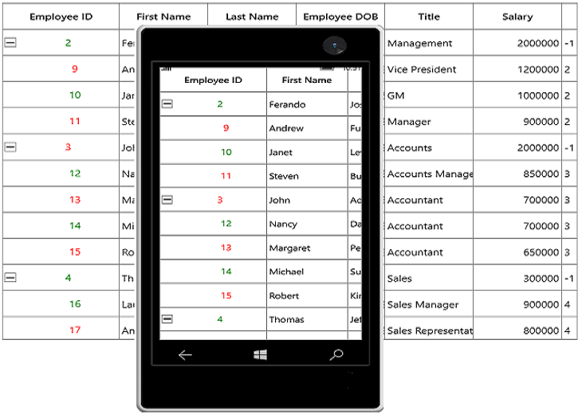

## TreeGridComboBoxColumn

[TreeGridComboBoxColumn](https://help.syncfusion.com/cr/uwp/Syncfusion.UI.Xaml.TreeGrid.TreeGridComboBoxColumn.html) derived from `TreeGridColumn` which hosts `ComboBox` as edit element. The data source to ComboBox can be set by using `[TreeGridComboBoxColumn.ItemsSource](https://help.syncfusion.com/cr/uwp/Syncfusion.UI.Xaml.TreeGrid.TreeGridComboBoxColumn.html#Syncfusion_UI_Xaml_TreeGrid_TreeGridComboBoxColumn_ItemsSource) property.

By default, `TreeGridComboBoxColumn` displays the value using `MappingName` property. You can set [DisplayMemberPath](https://help.syncfusion.com/cr/uwp/Syncfusion.UI.Xaml.TreeGrid.TreeGridComboBoxColumn.html#Syncfusion_UI_Xaml_TreeGrid_TreeGridComboBoxColumn_DisplayMemberPath) which denotes the path to a value on the source object (TreeGridComboBoxColumn.ItemsSource) to serve as the visual representation of object. You can set the `SelectedValuePath` which denotes the path to get the SelectedValue from the SelectedItem. 



<syncfusion:SfTreeGrid x:Name="treeGrid"                              
                        AutoGenerateColumns="False"
                        ChildPropertyName="Children"                             
                        ItemsSource="{Binding EmployeeDetails}">
    <syncfusion:SfTreeGrid.Columns>
        <syncfusion:TreeGridComboBoxColumn ItemsSource="{Binding CityCollection, Source={StaticResource viewModel}}" 
                                            MappingName="City" />
    </syncfusion:SfTreeGrid.Columns>
</syncfusion:SfTreeGrid>


treeGrid.Columns.Add(new TreeGridComboBoxColumn()
{
    MappingName = "City",
    ItemsSource = viewModel.CityCollection
});



SfTreeGrid triggers, `CurrentCellDropDownSelectionChanged` event, when the SelectedValue is changed. [CurrentCellDropDownSelectionChangedEventArgs](https://help.syncfusion.com/cr/uwp/Syncfusion.UI.Xaml.Grid.CurrentCellDropDownSelectionChangedEventArgs.html) of [CurrentCellDropDownSelectionChanged](https://help.syncfusion.com/cr/uwp/Syncfusion.UI.Xaml.TreeGrid.SfTreeGrid.html) event provides the information about the changed cell value. 

`SelectedIndex` property returns the index of selected item.

`SelectedItem**`** property returns the selected item from drop down list.

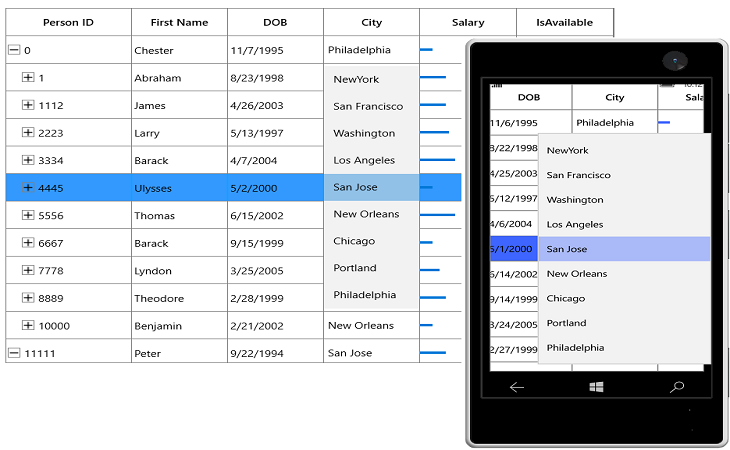

### Improving dropdown opening time

You can improve the drop-down opening time on loading by setting [VirtualizingStackPanel](https://msdn.microsoft.com/en-us/library/windows/apps/windows.ui.xaml.controls.virtualizingstackpanel.aspx) as [ItemsPanelTemplate](https://msdn.microsoft.com/en-us/library/windows/apps/windows.ui.xaml.controls.itemspaneltemplate.aspx) of `ComboBox`, when the large number of items loaded in it.



<Page.Resources>
    
</Page.Resources>



### Opening dropdown popup in single-click

You can open the drop down within single click by setting [ComboBox.IsDropDownOpen](https://msdn.microsoft.com/en-us/library/windows/apps/windows.ui.xaml.controls.combobox.isdropdownopen.aspx) property to `true` in `OnInitializeEditElement`method by overriding existing renderer.
Below code, creates `TreeGridCellComboBoxRendererExt` to set `IsDropDownOpen` property. Replace the default renderer with created renderer in [SfTreeGrid.CellRenderers](https://help.syncfusion.com/cr/uwp/Syncfusion.UI.Xaml.TreeGrid.SfTreeGrid.html#Syncfusion_UI_Xaml_TreeGrid_SfTreeGrid_CellRenderers) collection.



treeGrid.CellRenderers.Remove("ComboBox");
treeGrid.CellRenderers.Add("ComboBox", new TreeGridCellComboBoxRendererExt());

public class TreeGridCellComboBoxRendererExt : TreeGridCellComboBoxRenderer
{

    public override void OnInitializeEditElement(TreeDataColumnBase dataColumn, ComboBox uiElement, object dataContext)
    {
        base.OnInitializeEditElement(dataColumn, uiElement, dataContext);
        uiElement.IsDropDownOpen = true;
    }
}



N> This is applicable when `SfTreeGrid.EditTrigger` is `OnTap`

### Loading Different ItemSource for each row of TreeGridComboBoxColumn

You can load the different ItemsSource to each row of TreeGridComboBoxColumn by setting  [SfTreeGrid.ItemsSourceSelector](https://help.syncfusion.com/cr/uwp/Syncfusion.UI.Xaml.TreeGrid.TreeGridComboBoxColumn.html#Syncfusion_UI_Xaml_TreeGrid_TreeGridComboBoxColumn_ItemsSourceSelector) property. 

### Implementing IItemsSourceSelector

`ItemsSourceSelector` needs to implement [IItemsSourceSelector](https://help.syncfusion.com/cr/uwp/Syncfusion.UI.Xaml.Grid.IItemsSourceSelector.html) interface which requires you to implement [GetItemsSource](https://help.syncfusion.com/cr/uwp/Syncfusion.UI.Xaml.Grid.IItemsSourceSelector.html#Syncfusion_UI_Xaml_Grid_IItemsSourceSelector_GetItemsSource_System_Object_System_Object_) method which receives the below parameters,
<ul>
<li> <b>Record</b> – data object associated with row.</li>
<li> <b>Data Context</b>  – Data context of data grid.</li>
</ul>

In the below code, ItemsSource for ShipCity column returned based on ShipCountry column value using the record and data context of data grid passed to `GetItemsSource` method.




<Page.Resources>
    <local:ItemsSourceSelector x:Key="itemsSourceSelector"/>
</Page.Resources>

<syncfusion:SfTreeGrid x:Name="treeGrid"         
						AllowEditing="True"
						AutoGenerateColumns="False"
						ChildPropertyName="Children"
						ItemsSource="{Binding OrderDetails}"
						ColumnSizer="Star">
    <syncfusion:SfTreeGrid.Columns>
        <syncfusion:TreeGridComboBoxColumn MappingName="ShipCountry"  ItemsSource="{Binding Path=DataContext.CountryList, ElementName=treeGrid}"/>
        <syncfusion:TreeGridComboBoxColumn  HeaderText="ShipCity" DisplayMemberPath="ShipCityName"
                                        ItemsSourceSelector="{StaticResource itemSourceSelector}"
                                        MappingName="ShipCityID" SelectedValuePath="ShipCityID"/>
    </syncfusion:SfTreeGrid.Columns>
</syncfusion:SfTreeGrid>


/// 

/// Implementation class for ItemsSourceSelector interface
/// 

public class ItemsSourceSelector : IItemsSourceSelector
{
    public IEnumerable GetItemsSource(object record, object dataContext)
    {
        if (record == null)
            return null;
  
        var orderDetails = record as OrderDetails;
        var countryName = orderDetails.ShipCountry;
  
        var viewModel = dataContext as ViewModel;
  
        //Returns ShipCity collection based on ShipCountry.
        if (viewModel.ShipCities.ContainsKey(countryName))
        {
            ObservableCollection<ShipCityDetails> shipCities = null;
            viewModel.ShipCities.TryGetValue(countryName, out shipCities);
            return shipCities.ToList();
        }
        return null;
    }
}



The following screenshot illustrates the different ShipCity ItemsSource bound to each row of the ComboBox based on the Country Name.

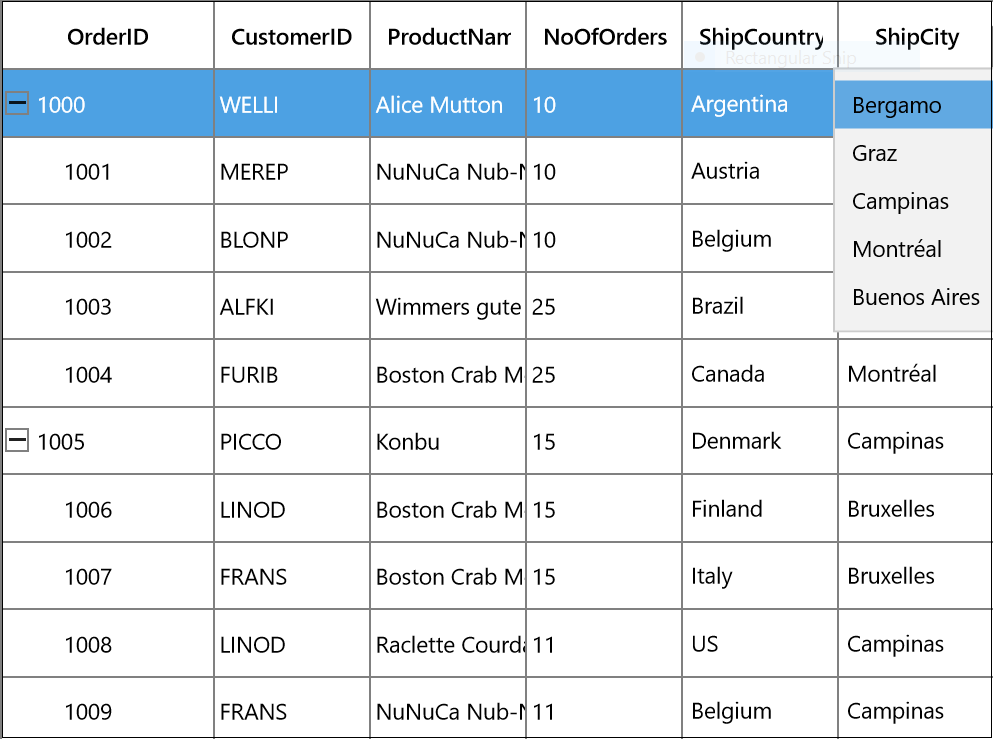

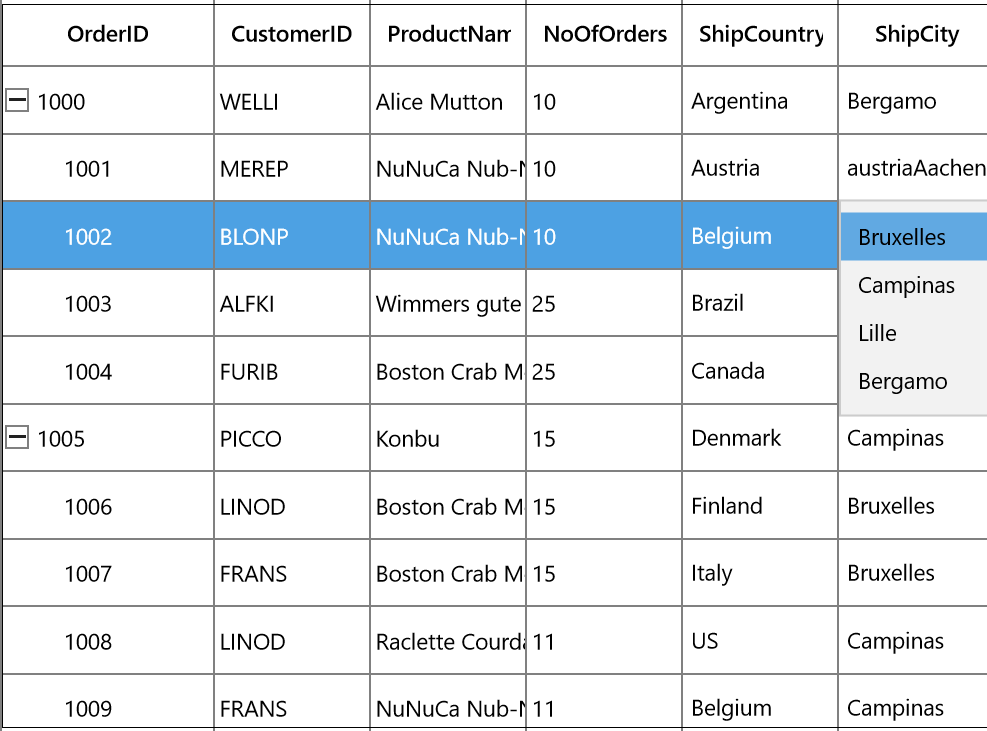

You can download the sample from [here](http://www.syncfusion.com/downloads/support/directtrac/general/ze/ComboBoxColumnsUWP748006862.zip).

## TreeGridHyperlinkColumn

[TreeGridHyperlinkColumn](https://help.syncfusion.com/cr/uwp/Syncfusion.UI.Xaml.TreeGrid.TreeGridHyperlinkColumn.html) derived from `TreeGridTextColumn` and it displays columns data as hyperlink. It hosts `HyperlinkButton` element as `TreeGridCell` content.



<syncfusion:SfTreeGrid x:Name="treeGrid"
                        AutoExpandMode="RootNodesExpanded"
                        AllowEditing="True"
                        AutoGenerateColumns="False"
                        ChildPropertyName="Children"
                        ItemsSource="{Binding EmployeeDetails}">
    <syncfusion:SfTreeGrid.Columns>
        <syncfusion:TreeGridHyperlinkColumn MappingName="City" />
    </syncfusion:SfTreeGrid.Columns>
</syncfusion:SfTreeGrid>


treeGrid.Columns.Add(new TreeGridHyperlinkColumn()
{
    MappingName = "City",
    HeaderText ="City"
});



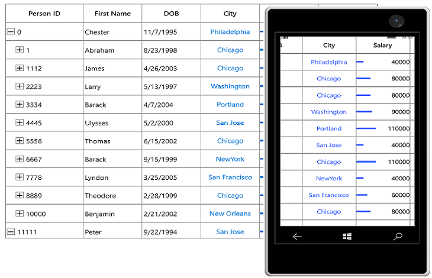

You can allow end-user to navigate the `Uri` when the cell value contains valid `Uri` address or using [CurrentCellRequestNavigate](https://help.syncfusion.com/cr/uwp/Syncfusion.UI.Xaml.TreeGrid.SfTreeGrid.html) event. The `CurrentCellRequestNavigate` occurs when the current cell in `TreeGridHyperLinkColumn` is clicked for navigation.  

[CurrentCellRequestNavigateEventArgs](https://help.syncfusion.com/cr/uwp/Syncfusion.UI.Xaml.Grid.CurrentCellRequestNavigateEventArgs.html) of `CurrentCellRequestNavigate` event provide information about the hyperlink triggered this event. [CurrentCellRequestNavigateEventArgs.NavigateText](https://help.syncfusion.com/cr/uwp/Syncfusion.UI.Xaml.Grid.CurrentCellRequestNavigateEventArgs.html#Syncfusion_UI_Xaml_Grid_CurrentCellRequestNavigateEventArgs_NavigateText) returns the value using `ValueBinding` or `MappingName` to navigate. 



treeGrid.CurrentCellRequestNavigate += TreeGrid_CurrentCellRequestNavigate;  
                             
private async void TreeGrid_CurrentCellRequestNavigate(object sender, Syncfusion.UI.Xaml.Grid.CurrentCellRequestNavigateEventArgs args)
{
    var URI = string.Format("https://en.wikipedia.org/wiki/" + args.NavigateText);
    Windows.System.Launcher.LaunchUriAsync(new Uri(URI));
}



### Cancel the navigation

You can cancel the navigation when clicking hyperlink by setting [CurrentCellRequestNavigateEventArgs.Handled](https://help.syncfusion.com/cr/uwp/Syncfusion.UI.Xaml.Grid.CurrentCellRequestNavigateEventArgs.html#Syncfusion_UI_Xaml_Grid_CurrentCellRequestNavigateEventArgs_Handled) to `false`. 



treeGrid.CurrentCellRequestNavigate += TreeGrid_CurrentCellRequestNavigate;  
                             
private async void TreeGrid_CurrentCellRequestNavigate(object sender, Syncfusion.UI.Xaml.Grid.CurrentCellRequestNavigateEventArgs args)
{
   args.Handled = true;
}



### Customize Hyperlink

#### Change the alignment

You can change the horizontal alignment of `TreeGridHyperlinkColumn` using `HorizontalAlignment` property.

#### Change the foreground color

You can change the foreground color of `TreeGridHyperlinkColumn` by writing the style with target type `HyperlinkButton`.







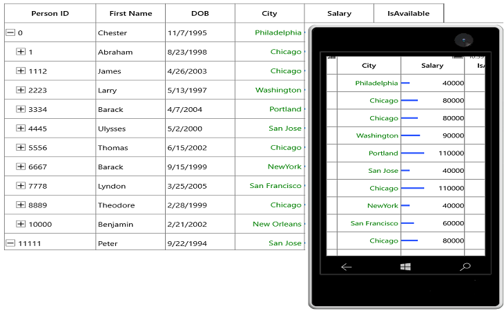

## Custom column support

SfTreeGrid allows you to create your own column by overriding predefined column type or creating a new custom column.

### Creating column from existing column

You can create your own column by overriding the predefined column types in SfTreeGrid.

For example, the `TreeGridDateTimeColumn` loads the `DateTime` value by default. If you want to display [DateTimeOffset](https://msdn.microsoft.com/en-us/library/system.datetimeoffset.aspx) value, you can create a new column by overriding the `TreeGridDateTimeColumn` class.

In the below code snippet, converter created to format the DateTimeOffSet value to DateTime by defining `ValueBinding` (edit) and `DisplayBinding` (non-edit).



public class DateTimeOffsetFormatConverter : IValueConverter
{
    private TreeGridDateTimeOffsetColumn cachedColumn;

    public DateTimeOffsetFormatConverter(TreeGridDateTimeOffsetColumn column)
    {
        cachedColumn = column;
    }

    public object Convert(object value, Type targetType, object parameter, string language)
    {
        value = ((DateTimeOffset)value).DateTime;
        var column = cachedColumn as TreeGridDateTimeColumn;

        if (value == null || DBNull.Value == value)
        {

            if (column.AllowNullValue && column.MaxDate != System.DateTime.MaxValue && column.WaterMark == string.Empty)
                return column.MaxDate;

            if (column.AllowNullValue && column.WaterMark != string.Empty)
                return column.WaterMark;

            if (column.MaxDate != System.DateTime.MaxValue)
                return column.MaxDate;
        }
        DateTime _columnValue;

        _columnValue = (DateTime)value;

        if (_columnValue < column.MinDate)
            _columnValue = column.MinDate;

        if (_columnValue > column.MaxDate)
            _columnValue = column.MaxDate;

        return _columnValue.ToString(column.FormatString, CultureInfo.CurrentUICulture);
    }

    public object ConvertBack(object value, Type targetType, object parameter, string language)
    {
        throw new NotImplementedException();
    }
}

public class DateTimeOffsetToDateTimeConverter : IValueConverter
{

    public object Convert(object value, Type targetType, object parameter, string language)
    {

        if (value == null)
            return null;

        return value != null ? ((DateTimeOffset)value).DateTime : DateTime.Now;

    }

    public object ConvertBack(object value, Type targetType, object parameter, string language)
    {
 
        if (value == null)
            return null;

        return value != null ? (new DateTimeOffset((DateTime)value)) : new DateTimeOffset(DateTime.Now);

    }
}



In the below code snippet, `TreeGridDateTimeOffsetColumn` column created from `TreeGridDateTimeColumn`.



public class TreeGridDateTimeOffsetColumn : TreeGridDateTimeColumn
{
 
    protected override void SetDisplayBindingConverter()
    {
 
        if ((DisplayBinding as Binding).Converter == null)
            (DisplayBinding as Binding).Converter = new DateTimeOffsetFormatConverter(this);

        if ((ValueBinding as Binding).Converter == null)
            (ValueBinding as Binding).Converter = new DateTimeOffsetToDateTimeConverter();
    }
}



In the below code snippet, created `TreeGridDateTimeOffsetColumn` added to `SfTreeGrid.Columns` collection and specify the full date-time pattern in `FormatString` as `F`. Since the `ShortDate` is the default pattern of `TreeGridDateTimeColumn`.



<local:TreeGridDateTimeOffsetColumn HeaderText="Employee DOB" 
                                    MappingName="DOB"
                                    FormatString="F" />



### Customize column renderer

SfTreeGrid allows you to customize the column related operations like key navigation and UI related interactions by overriding the corresponding renderer associated with the column. Each column has its own renderer with set of virtual methods for handling the column level operations. 
Below table lists the available cell types for unbound row and its renderers.
<table>
<tr>
<th>
Column Name
</th>
<th>
Renderer
</th>
<td>
Cell Type
</td>
</tr>
<tr>
<td>
{{'[TreeGridTextColumn](https://help.syncfusion.com/cr/uwp/Syncfusion.UI.Xaml.TreeGrid.TreeGridTextColumn.html#"")'| markdownify }}
</td>
<td>
{{'[TreeGridCellTextBoxRenderer](https://help.syncfusion.com/cr/uwp/Syncfusion.UI.Xaml.TreeGrid.Cells.TreeGridCellTextBoxRenderer.html#"")'| markdownify }}
</td>
<td>
TextBox
</td>
</tr>
<tr>
<td>
{{'[TreeGridNumericColumn](https://help.syncfusion.com/cr/uwp/Syncfusion.UI.Xaml.TreeGrid.TreeGridNumericColumn.html#"")'| markdownify }}
</td>
<td>
{{'[TreeGridCellNumericRenderer](https://help.syncfusion.com/cr/uwp/Syncfusion.UI.Xaml.TreeGrid.Cells.TreeGridCellNumericRenderer.html#"")'| markdownify }}
</td>
<td>
Numeric
</td>
</tr>
<tr>
<td>
{{'[TreeGridCheckBoxColumn](https://help.syncfusion.com/cr/uwp/Syncfusion.UI.Xaml.TreeGrid.TreeGridCheckBoxColumn.html#"")'| markdownify }}
</td>
<td>
{{'[TreeGridCheckBoxCellRenderer](https://help.syncfusion.com/cr/uwp/Syncfusion.UI.Xaml.TreeGrid.Cells.TreeGridCellCheckBoxRenderer.html#"")'| markdownify }}
</td>
<td>
CheckBox
</td>
</tr>
<tr>
<td>
{{'[TreeGridTemplateColumn](https://help.syncfusion.com/cr/uwp/Syncfusion.UI.Xaml.TreeGrid.TreeGridTemplateColumn.html#"")'| markdownify }}
</td>
<td>
{{'[TreeGridCellTemplateRenderer](https://help.syncfusion.com/cr/uwp/Syncfusion.UI.Xaml.TreeGrid.Cells.TreeGridCellTemplateRenderer.html#"")'| markdownify }}
</td>
<td>
Template
</td>
</tr>
<tr>
<td>
{{'[TreeGridComboBoxColumn](https://help.syncfusion.com/cr/uwp/Syncfusion.UI.Xaml.TreeGrid.TreeGridComboBoxColumn.html#"")'| markdownify }}
</td>
<td>
{{'[TreeGridCellComboBoxRenderer](https://help.syncfusion.com/cr/uwp/Syncfusion.UI.Xaml.TreeGrid.Cells.TreeGridCellComboBoxRenderer.html#"")'| markdownify }}
</td>
<td>
ComboBox
</td>
</tr>
<tr>
<td>
{{'[TreeGridDateTimeColumn](https://help.syncfusion.com/cr/uwp/Syncfusion.UI.Xaml.TreeGrid.TreeGridDateTimeColumn.html#"")'| markdownify }}
</td>
<td>
{{'[TreeGridCellDateTimeRenderer](https://help.syncfusion.com/cr/uwp/Syncfusion.UI.Xaml.TreeGrid.Cells.TreeGridCellDateTimeRenderer.html#"")'| markdownify }}
</td>
<td>
DateTime
</td>
</tr>
<tr>
<td>
{{'[TreeGridHyperlinkColumn](https://help.syncfusion.com/cr/uwp/Syncfusion.UI.Xaml.TreeGrid.TreeGridHyperlinkColumn.html#"")'| markdownify }}
</td>
<td>
{{'[TreeGridCellHyperlinkRenderer](https://help.syncfusion.com/cr/uwp/Syncfusion.UI.Xaml.TreeGrid.Cells.TreeGridCellHyperlinkRenderer.html#"")'| markdownify }}
</td>
<td>
HyperlinkButton
</td>
</tr>
</table>

Below code, creates the `TreeGridCellTextBoxRendererExt` to change the fore ground of `FirstName` column and replacing created renderer to `CellRenderers`.



treeGrid.CellRenderers.Remove("TextBox");
treeGrid.CellRenderers.Add("TextBox",new TreeGridCellTextBoxRendererExt());

public class TreeGridCellTextBoxRendererExt : TreeGridCellTextBoxRenderer
{
 
    public override void OnInitializeDisplayElement(TreeDataColumnBase dataColumn, TextBlock uiElement, object dataContext)
    {
        base.OnInitializeDisplayElement(dataColumn, uiElement, dataContext);

        if (dataColumn.TreeGridColumn.MappingName.Equals("FirstName"))
            uiElement.Foreground = new SolidColorBrush(Colors.Blue);
    }

    public override void OnUpdateDisplayBinding(TreeDataColumnBase dataColumn, TextBlock uiElement, object dataContext)
    {
        base.OnUpdateDisplayBinding(dataColumn, uiElement, dataContext);

        if (dataColumn.TreeGridColumn.MappingName.Equals("FirstName"))
            uiElement.Foreground = new SolidColorBrush(Colors.Blue);
    }
}



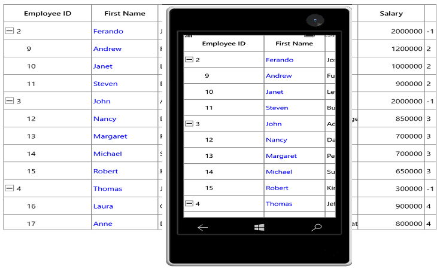

### Create the renderer of existing column

You can change the renderer of existing column by removing the predefined cell type value from `CellRenderers` collection and add the newly derived renderer from [TreeGridVirtualizingCellRenderer](https://help.syncfusion.com/cr/uwp/Syncfusion.UI.Xaml.TreeGrid.Cells.TreeGridVirtualizingCellRenderer-2.html).

Below code creates the new `TreeGridComboBoxRenderer` with `SfComboBox` as edit element for `TreeGridComboBoxColumn` and replacing created renderer to `CellRenderers`.



treeGrid.CellRenderers.Remove("ComboBox");
treeGrid.CellRenderers.Add("ComboBox", new TreeGridComboBoxRendererExt());

public class TreeGridComboBoxRendererExt : TreeGridVirtualizingCellRenderer<ContentControl, SfComboBox>
{

    public TreeGridComboBoxRendererExt()
    {
    }

    /// 

    /// Create new display element.
    /// 

    /// <returns></returns>

    protected override ContentControl OnCreateDisplayUIElement()
    {
        return new ContentControl();
    }

    /// 

    /// Create new edit element.
    /// 

    /// <returns></returns>
 
    protected override SfComboBox OnCreateEditUIElement()
    {
        return new SfComboBox();
    }

    /// 

    /// Initialize binding for display element.
    /// 

    /// <param name="dataColumn"></param>
    /// <param name="uiElement"></param>
    /// <param name="dataContext"></param>
 
    public override void OnInitializeDisplayElement(TreeDataColumnBase dataColumn, ContentControl uiElement, object dataContext)
    {
        SetDisplayBinding(uiElement, dataColumn.TreeGridColumn, dataContext);
    }

    /// 

    /// custom binding for display element.
    /// 

    /// <param name="element"></param>
    /// <param name="column"></param>
    /// <param name="dataContext"></param>

    private static void SetDisplayBinding(ContentControl element, TreeGridColumn column, object dataContext)
    {
        var comboBoxColumn = (TreeGridComboBoxColumn)column;
        var binding = new Binding
        {
            Path = new PropertyPath(comboBoxColumn.MappingName),
            Mode = BindingMode.TwoWay,
            UpdateSourceTrigger = UpdateSourceTrigger.PropertyChanged,
            Converter = (comboBoxColumn.DisplayBinding as Binding).Converter,
        };
        element.SetBinding(ContentControl.ContentProperty, binding);
    }

    /// 

    /// Update binding for display element.
    /// 

    /// <param name="dataColumn"></param>
    /// <param name="uiElement"></param>
    /// <param name="dataContext"></param>

    public override void OnUpdateDisplayBinding(TreeDataColumnBase dataColumn, ContentControl uiElement, object dataContext)
    {
        SetDisplayBinding(uiElement, dataColumn.TreeGridColumn, dataContext);
    }

    /// 

    /// Initialize binding for edit element.
    /// 

    /// <param name="dataColumn"></param>
    /// <param name="uiElement"></param>
    /// <param name="dataContext"></param>
 
    public override void OnInitializeEditElement(TreeDataColumnBase dataColumn, SfComboBox uiElement, object dataContext)
    {
        SetEditBinding(uiElement, dataColumn.TreeGridColumn, dataContext);
    }

    /// 

    /// Update binding for edit element.
    /// 

    /// <param name="dataColumn"></param>
    /// <param name="uiElement"></param>
    /// <param name="dataContext"></param>
 
    public override void OnUpdateEditBinding(TreeDataColumnBase dataColumn, SfComboBox element, object dataContext)
    {
        SetEditBinding(element, dataColumn.TreeGridColumn, dataContext);
    }

    /// 

    /// custom binding for display element.
    /// 

    /// <param name="element"></param>
    /// <param name="column"></param>
    /// <param name="dataContext"></param>

    private static void SetEditBinding(SfComboBox element, TreeGridColumn column, object dataContext)
    {
        var comboboxColumn = (TreeGridComboBoxColumn)column;
        var binding = new Binding
        {
            Source = dataContext,
            Path = new PropertyPath(comboboxColumn.MappingName),
            Mode = BindingMode.TwoWay,
            UpdateSourceTrigger = UpdateSourceTrigger.PropertyChanged,
        };
        element.SetBinding(SfComboBox.SelectedValueProperty, binding);

        var itemsSourceBinding = new Binding { Path = new PropertyPath("ItemsSource"), Mode = BindingMode.TwoWay, Source = comboboxColumn };
        element.SetBinding(SfComboBox.ItemsSourceProperty, itemsSourceBinding);

        var displayMemberBinding = new Binding { Path = new PropertyPath("DisplayMemberPath"), Mode = BindingMode.TwoWay, Source = comboboxColumn };
        element.SetBinding(SfComboBox.DisplayMemberPathProperty, displayMemberBinding);

        var selectedValuePathBinding = new Binding { Path = new PropertyPath("SelectedValuePath"), Mode = BindingMode.TwoWay, Source = comboboxColumn };
        element.SetBinding(SfComboBox.SelectedValuePathProperty, selectedValuePathBinding);

        var itemTemplateBinding = new Binding { Path = new PropertyPath("ItemTemplate"), Mode = BindingMode.TwoWay, Source = comboboxColumn };
        element.SetBinding(SfComboBox.ItemTemplateProperty, itemTemplateBinding);
        }

    /// 

    /// Let Renderer decide whether the parent grid should be allowed to handle keys and prevent
    /// the key event from being handled by the visual UIElement for this renderer. 
    /// 

    /// <param name="e">A <see cref="KeyRoutedEventArgs" /> object.</param>
    /// <returns>
    /// True if the parent grid should be allowed to handle keys; false otherwise.
    /// </returns>  

    protected override bool ShouldGridTryToHandleKeyDown(KeyRoutedEventArgs e)
    {

        if (!HasCurrentCellState || !IsInEditing)
            return true;

        switch (e.Key)
        {
            case VirtualKey.End:
            case VirtualKey.Home:
            case VirtualKey.Enter:
            case VirtualKey.Escape:
                return !((SfComboBox)CurrentCellRendererElement).IsDropDownOpen;

            case VirtualKey.Down:
            case VirtualKey.Up:
            case VirtualKey.Left:
            case VirtualKey.Right:
                return !((SfComboBox)CurrentCellRendererElement).IsDropDownOpen;
        }
        return base.ShouldGridTryToHandleKeyDown(e);
    }

    /// 

    /// Gets the control value.
    /// 

  
    public override object GetControlValue()
    {
  
        if (!HasCurrentCellState)
            return base.GetControlValue();

        return CurrentCellRendererElement.GetValue(IsInEditing ? SfComboBox.SelectedValueProperty : ContentControl.ContentProperty);
    }

    /// 

    /// Sets the control value.
    /// 

    /// <param name="value">The value.</param>

    public override void SetControlValue(object value)
    {

        if (!HasCurrentCellState)
            return;

        if (IsInEditing)
            ((SfComboBox)CurrentCellRendererElement).SelectedValue = value;

        else
            throw new Exception("Value cannot be Set for Unloaded Editor");
    }
}



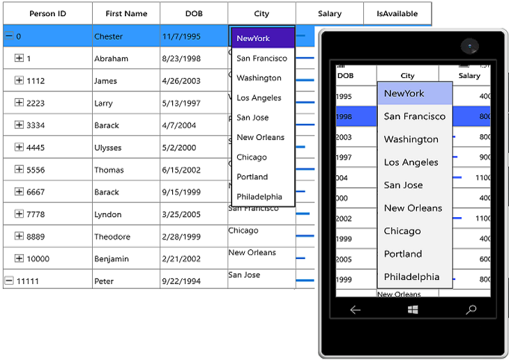

## How To

### Restrict the input content length

You can restrict the range of input using `MaxLength` property on `TreeGridColumn` in below ways.

* Using Converter property in [DisplayBinding](https://help.syncfusion.com/cr/uwp/Syncfusion.UI.Xaml.Grid.GridColumnBase.html#Syncfusion_UI_Xaml_Grid_GridColumnBase_DisplayBinding) and [ValueBinding](https://help.syncfusion.com/cr/uwp/Syncfusion.UI.Xaml.Grid.GridColumnBase.html#Syncfusion_UI_Xaml_Grid_GridColumnBase_ValueBinding) 

* Using control style 

* Overriding existing cell types

#### Using Converter

You can restrict the length of user input in both display and edit element using `Converter` using `DisplayBinding` and `ValueBinding`.



<Page.Resources>
    <local:MaxLengthConverter x:Key="maxLengthConverter"/>
</Page.Resources>

<syncfusion:SfTreeGrid x:Name="treeGrid"
                AutoExpandMode="RootNodesExpanded"
                AllowEditing="True"
                AutoGenerateColumns="False"
                ChildPropertyName="Children"
                ItemsSource="{Binding EmployeeDetails}">
    <syncfusion:SfTreeGrid.Columns>
        <syncfusion:TreeGridTextColumn HeaderText="First Name" 
                                        MappingName="FirstName"
                                        DisplayBinding="{Binding FirstName,Converter={StaticResource maxLengthConverter}}" 
                                        ValueBinding="{Binding FirstName,Converter={StaticResource maxLengthConverter}}" />
    </syncfusion:SfTreeGrid.Columns>
</syncfusion:SfTreeGrid>


public class MaxLengthConverter : IValueConverter
{

    public object Convert(object value, Type targetType, object parameter, string language)
    {

        // Define max length for column.
        int maxLength = 5;

        // Get the ColumnValue
        var columnValue = System.Convert.ToString(value);

        if (columnValue.Length < maxLength)
            return columnValue;

        else
            return columnValue.Substring(0, maxLength);
    }

    public object ConvertBack(object value, Type targetType, object parameter, string language)
    {
        return value;
    }
}



#### Using control style 

You can set the `MaxLength` property in edit mode by writing style of TargetType edit element of the corresponding column.
N> TextBlock does not have the MaxLength property. Therefore, you can use the converter to format in display.



<Page.Resources>
    
</Page.Resources>

<syncfusion:SfTreeGrid x:Name="treeGrid"
        AutoExpandMode="RootNodesExpanded"
        AllowEditing="True"
        AutoGenerateColumns="False"
        ChildPropertyName="Children"
        ItemsSource="{Binding EmployeeDetails}">
    <syncfusion:SfTreeGrid.Columns>
        <syncfusion:TreeGridTextColumn HeaderText="First Name" MappingName="FirstName" />
    </syncfusion:SfTreeGrid.Columns>
</syncfusion:SfTreeGrid>



#### Overriding existing cell types

You can set the `MaxLength` property to the edit element of the particular column by overriding existing cell types. 
Below code, overrides the `OnInitializeEditElement` method of the corresponding renderer and set the `MaxLength` to the UIElement and add the renderer to [STreeGrid.CellRenderers](https://help.syncfusion.com/cr/uwp/Syncfusion.UI.Xaml.TreeGrid.SfTreeGrid.html#Syncfusion_UI_Xaml_TreeGrid_SfTreeGrid_CellRenderers) collection.



treeGrid.CellRenderers.Remove("TextBox");
treeGrid.CellRenderers.Add("TextBox", new TreeGridCellTextBoxRendererExt());

public class TreeGridCellTextBoxRendererExt : TreeGridCellTextBoxRenderer
{

    public override void OnInitializeEditElement(TreeDataColumnBase dataColumn, TextBox uiElement, object dataContext)
    {

        if (dataColumn.TreeGridColumn != null && dataColumn.TreeGridColumn.MappingName == "FirstName")
        {
            uiElement.MaxLength = 7;
        }

        else
        {
            uiElement.MaxLength = 0;
        }
        base.OnInitializeEditElement(dataColumn, uiElement, dataContext);
    }
}


