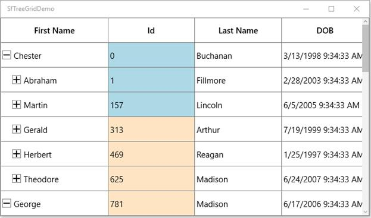
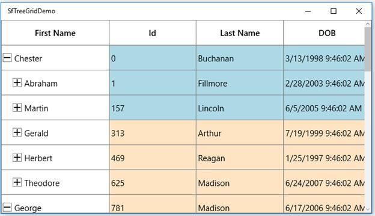
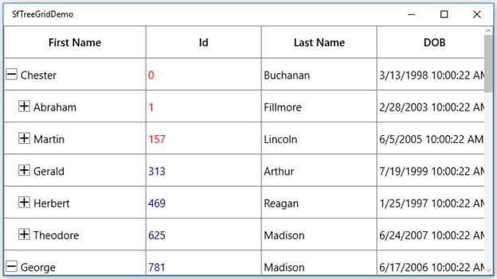
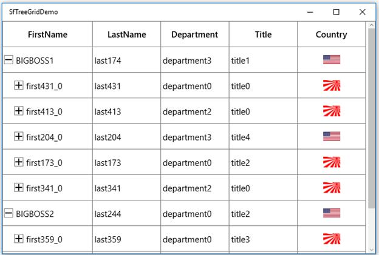
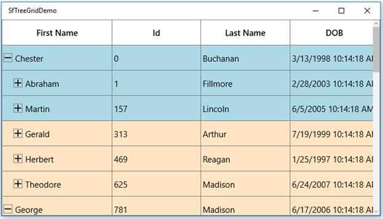
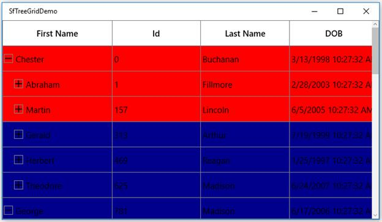
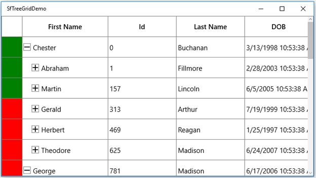

# Conditional Styling in UWP TreeGrid (SfTreeGrid)

You can style the treegrid and its inner elements conditionally based on data in three ways,

1. Using Converter
2. Using Data Triggers
3. Using StyleSelector

<table>
<tr>
<td>
{{'**Styling ways**'| markdownify }}
</td>
<td>
{{'**Performance details**'| markdownify }}
</td>
</tr>
<tr>
<td>
Converter
</td>
<td>
Provide good performance when compared other two ways.
</td>
</tr>
<tr>
<td>
Trigger
</td>
<td>
When compared to converter, performance is slow while styling more number of columns or rows.
</td>
</tr>
<tr>
<td>
StyleSelector
</td>
<td>
It affects scrolling performance while styling more number of columns based on number of columns visible.
</td>
</tr>
</table>

## Cells

### Style cells using converter

The record cells ([TreeGridCell](https://help.syncfusion.com/cr/uwp/Syncfusion.UI.Xaml.TreeGrid.TreeGridCell.html)) can be customized conditionally by changing its property value based on cell value or data object using converter.

Here, grid cell background is changed using converter, where converter returns the value based on ID property of underlying record.



xmlns:utils="using:Syncfusion.UI.Xaml.Utils"
<Page.Resources>;
   <local:StyleConverter x:Key="converter"/>
</Page.Resources>
<syncfusion:TreeGridTextColumn MappingName="Id" TextAlignment="Left">
         <syncfusion:TreeGridTextColumn.CellStyle>
                
</Page.Resources>


internal class StyleConverter : IValueConverter
    {
        public object Convert(object value, Type targetType, object parameter, string language)
        {
            var input = value as PersonInfo;
            //custom condition is checked based on data.
            if (input.Id < 300)
                return new SolidColorBrush(Colors.LightBlue);
            else if (input.Id > 300 && input.Id < 2000)
                return new SolidColorBrush(Colors.Bisque);
            else
                return DependencyProperty.UnsetValue;
        }
        public object ConvertBack(object value, Type targetType, object parameter, string language)
        {
            throw new NotImplementedException();
        }
   }



### Style cells using style selector

The record cells ([TreeGridCell](https://help.syncfusion.com/cr/uwp/Syncfusion.UI.Xaml.TreeGrid.TreeGridCell.html)) can be customized conditionally based on data by setting [SfTreeGrid.CellStyleSelector ](https://help.syncfusion.com/cr/uwp/Syncfusion.UI.Xaml.TreeGrid.SfTreeGrid.html#Syncfusion_UI_Xaml_TreeGrid_SfTreeGrid_CellStyleSelectorProperty)property and the particular column record cells can be customized by setting [GridColumn.CellStyleSelector ](https://help.syncfusion.com/cr/uwp/Syncfusion.UI.Xaml.TreeGrid.SfTreeGrid.html#Syncfusion_UI_Xaml_TreeGrid_SfTreeGrid_CellStyleSelectorProperty)property and you can get the container as TreeGridCell in the StyleSelector.



<Application.Resources>
       
        
</Application.Resources>


public class SelectorClass : StyleSelector
{
    protected override Style SelectStyleCore(object item, DependencyObject container)
    {
        var data = item as PersonInfo;
        if (data != null && ((container as TreeGridCell).ColumnBase.TreeGridColumn.MappingName == "Id"))
        {
            //custom condition is checked based on data.
            if (data.Id < 300)
                return App.Current.Resources["redCellStyle"] as Style;
            return App.Current.Resources["blueCellStyle"] as Style;
        }
        return base.SelectStyleCore(item, container);
    }
}



### Add image to cell

You can add image to cell by using TreeGridTemplateColumn,



<syncfusion:TreeGridTemplateColumn HeaderText="Country" MappingName="ImageLink">
       <syncfusion:TreeGridTemplateColumn.CellTemplate>
            <DataTemplate>
                   <Grid>
                      <Image Width="30"
                             Height="20"
                             Source="{Binding ImageLink,
                                                        Converter={StaticResource converter}}" />
                   </Grid>
           </DataTemplate>
     </syncfusion:TreeGridTemplateColumn.CellTemplate>
 </syncfusion:TreeGridTemplateColumn>


public object Convert(object value, Type targetType, object parameter, string language)
{
    string imageName = value.ToString();
    if (imageName=="US.jpg")
    {
        Uri uri = new Uri("ms-appx:///Images/US.jpg");
        BitmapImage image = new BitmapImage(uri);
        return image;
    }
    else if(imageName=="UK.jpg")
    {
        Uri uri1 = new Uri("ms-appx:///Images/UK.jpg");
        BitmapImage image = new BitmapImage(uri1);
        return image;
    }
    else
    {
        Uri uri1 = new Uri("ms-appx:///Images/Japan.jpg");
        BitmapImage image = new BitmapImage(uri1);
        return image;
    }
}
public object ConvertBack(object value, Type targetType, object parameter, string language)
{
    throw new NotImplementedException();
}



You can download the sample [here](https://github.com/SyncfusionExamples/how-to-load-images-in-a-cell-in-wpf-and-uwp-treegrid/tree/master/UWP).

## Rows

### Style rows using converter

The record rows ([TreeGridRowControl ](]https://help.syncfusion.com/cr/uwp/Syncfusion.UI.Xaml.TreeGrid.TreeGridRowControl.html)) can be customized conditionally by changing its property value based on ‘cell value’ or ‘data object’ by using converter, where converter returns the value based on underlying record.



<Page.Resources>
        <local:StyleConverter x:Key="converter"/>

        
</Page.Resources>


internal class StyleConverter : IValueConverter
{
    public object Convert(object value, Type targetType, object parameter, string language)
    {
        var input = value as PersonInfo;
        //custom condition is checked based on data.
        if (input.Id < 300)
            return new SolidColorBrush(Colors.LightBlue);
        else if (input.Id > 300 && input.Id < 2000)
            return new SolidColorBrush(Colors.Bisque);
        else
            return DependencyProperty.UnsetValue;
    }
    public object ConvertBack(object value, Type targetType, object parameter, string language)
    {
        throw new NotImplementedException();
    }
}



### Style rows using style selector

The record rows ([TreeGridRowControl](https://help.syncfusion.com/cr/uwp/Syncfusion.UI.Xaml.TreeGrid.TreeGridRowControl.html)) can be customized conditionally based on data by setting [SfTreeGrid.RowStyleSelector ](https://help.syncfusion.com/cr/uwp/Syncfusion.UI.Xaml.TreeGrid.SfTreeGrid.html#Syncfusion_UI_Xaml_TreeGrid_SfTreeGrid_RowStyleSelectorProperty)property and you can get the container as TreeGridRowControl in StyleSelector.



<Application.Resources>
        <local:SelectorClass x:Key="rowStyleSelector" />
        
        
</Application.Resources>


public class SelectorClass : StyleSelector
{
    protected override Style SelectStyleCore(object item, DependencyObject container)
    {
        var row = (item as TreeDataRowBase).RowData;
        var data = row as PersonInfo;
        if (data.Id < 300)
            return App.Current.Resources["rowStyle1"] as Style;
        return App.Current.Resources["rowStyle2"] as Style;
        return base.SelectStyleCore(item, container);
    }
}



## Row Header

The appearance of row header ([TreeGridRowHeaderCell](https://help.syncfusion.com/cr/uwp/Syncfusion.UI.Xaml.TreeGrid.TreeGridHeaderCell.html)) can be customized conditionally by changing its property value based on ‘cell value’ or ‘data object’ by using converter,where converter returns the value based on Underlying record.



<syncfusion:ChromelessWindow.Resources>
        <local:StyleConverter x:Key="converter"/>
        
</syncfusion:ChromelessWindow.Resources>


internal class StyleConverter : IValueConverter
{
    public object Convert(object value, Type targetType, object parameter, string language)
    {
        var data = value as PersonInfo;
        //custom condition is checked.
        if (data.Id < 300)
            return new SolidColorBrush(Colors.Green);
        else
            return new SolidColorBrush(Colors.Red);
    }
    public object ConvertBack(object value, Type targetType, object parameter, string language)
    {
        throw new NotImplementedException();
    }
}



