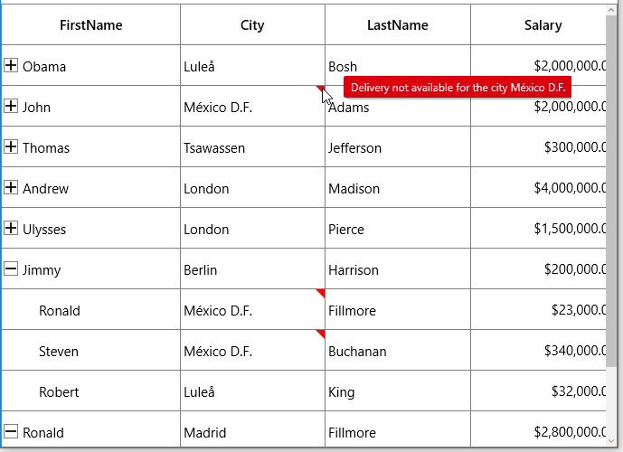
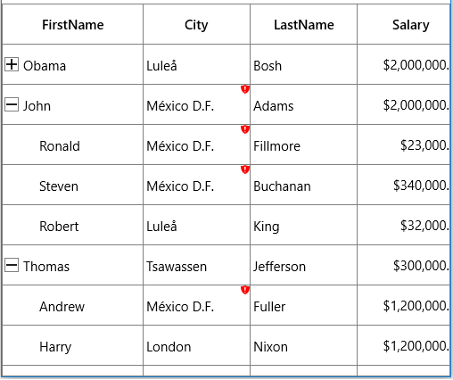
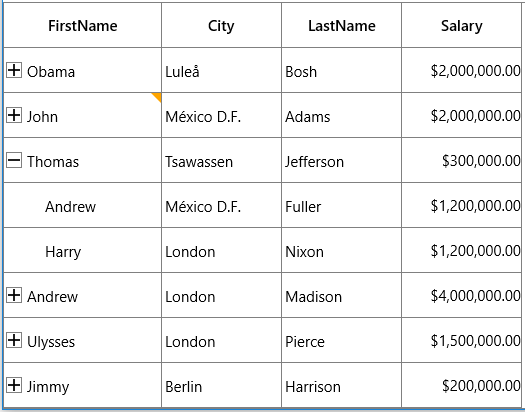
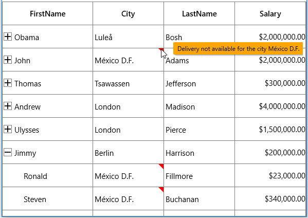
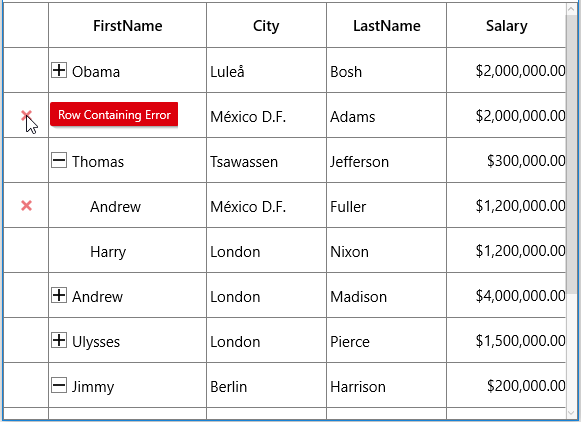
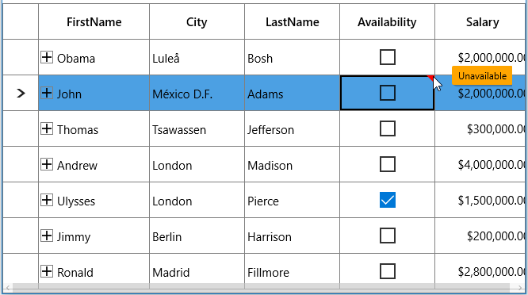

# Data Validation in UWP TreeGrid (SfTreeGrid)

SfTreeGrid allows you to validate the data and display hints in case of validation is not passed. In case of invalid data, error icon is displayed at the top right corner of [TreeGridCell](https://help.syncfusion.com/cr/uwp/Syncfusion.UI.Xaml.TreeGrid.TreeGridCell.html). When mouse over the error icon, error information will be displayed in tooltip.

## Built-in validations

Built-in validations through INotifyDataErrorInfo and Data annotation attributes, can be enabled by setting[SfTreeGrid.GridValidationMode](https://help.syncfusion.com/cr/uwp/Syncfusion.UI.Xaml.Grid.SfGridBase.html#Syncfusion_UI_Xaml_Grid_SfGridBase_GridValidationMode) or [TreeGridColumn.GridValidationMode](https://help.syncfusion.com/cr/uwp/Syncfusion.UI.Xaml.Grid.GridColumnBase.html#Syncfusion_UI_Xaml_Grid_GridColumnBase_GridValidationMode) properties. `TreeGridColumn.GridValidationMode` takes priority than ` SfTreeGrid.GridValidationMode`.

* `GridValidation.InView` - displays error icons and tips alone.
* `GridValidation.None` - disables built-in validation support.

### Built-in validation using INotifyDataErrorInfo

You can validate the data by implementing the [INotifyDataErrorInfo](https://msdn.microsoft.com/en-us/library/system.componentmodel.inotifydataerrorinfo(v=vs.110).aspx) interface in model class.



public class OrderInfo : INotifyDataErrorInfo
{
    private string city;

    public string City
    {
        get { return city; }
        set { city = value; }
    }

    public System.Collections.IEnumerable GetErrors(string propertyName)
    {

        if (!propertyName.Equals("City"))
            return null;
        List<string> errors = new List<string>();    

        if (this.City.Contains("Mexico D.F."))
            errors.Add("Delivery not available for the city " + this.City);

        return errors;
    }

    [Display(AutoGenerateField = false)]

    public bool HasErrors
    {
        get
        {            
            return false;
        }
    }
    public event EventHandler<DataErrorsChangedEventArgs> ErrorsChanged;
}



Enable built-in validation support by setting `SfTreeGrid.GridValidationMode` or `TreeGridColumn.GridValidationMode` property `InView`.



<syncfusion:SfTreeGrid Name="treeGrid"
                       ChildPropertyName="Children"
                       GridValidationMode="InView"
                       ItemsSource="{Binding PersonDetails}" />


treeGrid.GridValidationMode = GridValidationMode.InView;



### Built-in validation using Data Annotation

You can validate the data using data annotation attributes by setting `SfTreeGrid.GridValidationMode` or `TreeGridColumn.GridValidationMode` property to `InView`.

#### Using different annotations

The numeric type like int, double, decimal properties can be validated using [Range attributes](https://msdn.microsoft.com/en-us/library/system.componentmodel.dataannotations.rangeattribute.aspx).



private int orderID;
[Range(1001, 1005, ErrorMessage = "OrderID between 1001 and 1005 alone processed")]        

public int OrderID
{
    get { return orderID; }
    set { orderID = value; }
}

private decimal price;
[Range(typeof(decimal),"12","20")]

public decimal Price
{
    get { return price; }
    set { price = value; }
}



The string type property can be validated using [Required](https://msdn.microsoft.com/en-us/library/system.componentmodel.dataannotations.requiredattribute.aspx), [String Length attributes](https://msdn.microsoft.com/en-us/library/system.componentmodel.dataannotations.stringlengthattribute.aspx)



private string shippingCity;
[Required]

public string ShipCity
{
    get { return shippingCity; }
    set { shippingCity = value; }
}

private string customerName;
[StringLength(17)]

public string CustomerName
{
    get { return customerName; }
    set { customerName = value; }
}



The data that has heterogeneous type (combination of number, special character) can be validated using [RegularExpressions](https://msdn.microsoft.com/en-us/library/system.componentmodel.dataannotations.regularexpressionattribute.aspx).



[RegularExpressionAttribute(@"^[a-zA-Z]{1,40}$", ErrorMessage="Numbers and special characters not allowed")]

public string CustomerID
{
    get { return customerId; }
    set { customerId = value; }
}



## Custom validation through events

You can validate the cells and rows using [CurrentCellValidating](https://help.syncfusion.com/cr/uwp/Syncfusion.UI.Xaml.TreeGrid.SfTreeGrid.html) and [RowValidating](https://help.syncfusion.com/cr/uwp/Syncfusion.UI.Xaml.TreeGrid.SfTreeGrid.html) events. SfTreeGrid will not allow user to edit other cell / row if validation is failed.

### Cell Validation

You can validate the cells using [CurrentCellValidating](https://help.syncfusion.com/cr/uwp/Syncfusion.UI.Xaml.TreeGrid.SfTreeGrid.html) event when the cell is edited. `CurrentCellValidating` event occurs when the edited cell tries to commit the data or lose the focus.

[TreeGridCurrentCellValidatingEventArgs](https://help.syncfusion.com/cr/uwp/Syncfusion.UI.Xaml.TreeGrid.TreeGridCurrentCellValidatingEventArgs.html) provides information to `CurrentCellValidating` event for validating the cell. ` 
`TreeGridCurrentCellValidatingEventArgs.NewValue` returns the edited value and you can set the validation status using `CurrentCellValidatingEventArgs.IsValid` property.



treeGrid.CurrentCellValidating += TreeGrid_CurrentCellValidating;

private void TreeGrid_CurrentCellValidating(object sender, Syncfusion.UI.Xaml.TreeGrid.TreeGridCurrentCellValidatingEventArgs e)
{

    if (e.NewValue.ToString().Equals("1004"))
    {
        e.IsValid = false;
        e.ErrorMessage = "OrderID 1004 is invalid";
    }
}



[SfTreeGrid.CurrentCellValidated](https://help.syncfusion.com/cr/uwp/Syncfusion.UI.Xaml.TreeGrid.SfTreeGrid.html) event triggered when the cell has finished validating with valid data.



treeGrid.CurrentCellValidated += TreeGrid_CurrentCellValidated;

private void TreeGrid_CurrentCellValidated(object sender, Syncfusion.UI.Xaml.TreeGrid.TreeGridCurrentCellValidatedEventArgs e)
{
}



### Row Validation

You can validate the row using [RowValidating](https://help.syncfusion.com/cr/uwp/Syncfusion.UI.Xaml.TreeGrid.SfTreeGrid.html) event when the cell is edited. The `RowValidating` event occurs when the edited cells tries to commit the row data or lose the focus.

[TreeGridRowValidatingEventArgs](https://help.syncfusion.com/cr/uwp/Syncfusion.UI.Xaml.TreeGrid.TreeGridRowValidatingEventArgs.html) provides information to `RowValidating` event for validating row. 
`RowValidatingEventArgs.RowData` returns the edited value and you can set the validation status using `RowValidatingEventArgs.IsValid` property.



treeGrid.RowValidating += TreeGrid_RowValidating;

private void TreeGrid_RowValidating(object sender, Syncfusion.UI.Xaml.TreeGrid.TreeGridRowValidatingEventArgs e)
{
    var data = e.RowData.GetType().GetProperty("FirstName").GetValue(e.RowData);

    if (data.ToString().Equals("Andrew"))
    {
        e.IsValid = false;
        e.ErrorMessages.Add("FirstName", "FirstName Andrew is invalid");
    }
}



[SfTreeGrid.RowValidated](https://help.syncfusion.com/cr/uwp/Syncfusion.UI.Xaml.TreeGrid.SfTreeGrid.html) event triggered when the row has finished validating with valid row data.



treeGrid.RowValidated += TreeGrid_RowValidated;

void treeGrid_RowValidated(object sender, TreeGridRowValidatedEventArgs e)
{
}



## Error icon and tip customization

### Customizing error icon

You can customize the error icon by editing `TreeGridCell` control template. If you want to customize the error icon in expander column, you need to edit the control template of [TreeGridExpanderCell](https://help.syncfusion.com/cr/uwp/Syncfusion.UI.Xaml.TreeGrid.TreeGridExpanderCell.html).

#### Change the shape of error icon

You can change the validation error template shape of the `TreeGridCell` by changing the `Data` property of the path in the PART_InValidCellBorder of TreeGridCell.



<Page.Resources>
        <ResourceDictionary>
            <ResourceDictionary.MergedDictionaries>
                <ResourceDictionary Source="ms-appx:///Syncfusion.SfGrid.UWP/Control/Themes/Generic.xaml" />
            </ResourceDictionary.MergedDictionaries>
            
        </ResourceDictionary>
</Page.Resources>



#### Change the color of error icon

You can change the validation error template color of the `TreeGridCell` by changing the `Fill` property of the path in the PART_InValidCellBorder of `TreeGridCell`. Here, validation error template color of the TreeGridExpanderCell is changed.



<Page.Resources>
    <ResourceDictionary>
        <ResourceDictionary.MergedDictionaries>
            <ResourceDictionary Source="ms-appx:///Syncfusion.SfGrid.UWP/Control/Themes/Generic.xaml" />
        </ResourceDictionary.MergedDictionaries>
        <local:BoolToVisibilityConverter x:Key="VisibilityConverter" />
        
    </ResourceDictionary>
</Page.Resources>


public class BoolToVisibilityConverter : IValueConverter
{     
    public object Convert(object value, Type targetType, object parameter, string language)
    {

        if ((bool)value)
            return Visibility.Visible;
        return Visibility.Collapsed;
    }
    
    public object ConvertBack(object value, Type targetType, object parameter, string language)
    {

        if ((Visibility)value == Visibility.Visible)
            return true;
        return false;
    }
}



### Customizing error tip

You can customize the error tip by editing the style of `ValidationToolTipTemplate`. Get the style of `ValidationToolTipTemplate` by editing the `TreeGridCell` style.

#### Change the background and foreground color of error tip

You can change the error tip background color by setting `Background` property of the border in `ValidationToolTipTemplate`. The error tip foreground color can be changed by setting `Foreground` property of the `TextBlock` in `ValidationToolTipTemplate`.



<ControlTemplate x:Key="ValidationToolTipTemplate">
    <Grid x:Name="PART_ToolTipPresenter"
          Margin="5,0"
          Opacity="0"
          RenderTransformOrigin="0,0">
        <Grid.RenderTransform>
            <TranslateTransform x:Name="Transform" X="-25" />
        </Grid.RenderTransform>

        <Border Margin="4,4,-4,-4"
            Background="#052A2E31"
            CornerRadius="5" />
        <Border Margin="3,3,-3,-3"
            Background="#152A2E31"
            CornerRadius="4" />
        <Border Margin="2,2,-2,-2"
            Background="#252A2E31"
            CornerRadius="3" />
        <Border Margin="1,1,-1,-1"
            Background="#352A2E31"
            CornerRadius="2" />

        <Border Background="Orange" CornerRadius="2" />
            <Border CornerRadius="2">
                <TextBlock MaxWidth="250"
                    Margin="8,4,8,4"
                   Foreground="Black"
                   Text="{TemplateBinding Tag}"
                   TextWrapping="Wrap"
                   UseLayoutRounding="false" />
        </Border>
        <VisualStateManager.VisualStateGroups>
            <VisualStateGroup x:Name="OpenStates">
                <VisualStateGroup.Transitions>
                    <VisualTransition GeneratedDuration="0" />
                    <VisualTransition GeneratedDuration="0:0:0.2" To="Opened">
                    <Storyboard>
                    <DoubleAnimation Duration="0:0:0.2"
                         Storyboard.TargetName="Transform"
                         Storyboard.TargetProperty="X"
                         To="0">
                        <DoubleAnimation.EasingFunction>
                        <BackEase Amplitude=".3" EasingMode="EaseOut" />
                        </DoubleAnimation.EasingFunction>
                    </DoubleAnimation>
                    <DoubleAnimation Duration="0:0:0.2"
                        Storyboard.TargetName="PART_ToolTipPresenter"
                         Storyboard.TargetProperty="Opacity"
                         To="1" />
                    </Storyboard>
                    </VisualTransition>
                </VisualStateGroup.Transitions>
                <VisualState x:Name="Closed">
                <Storyboard>
                    <DoubleAnimation Duration="0"
                         Storyboard.TargetName="PART_ToolTipPresenter"
                         Storyboard.TargetProperty="Opacity"
                         To="0" />
                </Storyboard>
                </VisualState>
                <VisualState x:Name="Opened">
                    <Storyboard>
                        <DoubleAnimation Duration="0"
                         Storyboard.TargetName="Transform"
                         Storyboard.TargetProperty="X"
                         To="0" />
                        <DoubleAnimation Duration="0"
                         Storyboard.TargetName="PART_ToolTipPresenter"
                         Storyboard.TargetProperty="Opacity"
                         To="1" />
                    </Storyboard>
                </VisualState>
            </VisualStateGroup>
        </VisualStateManager.VisualStateGroups>
    </Grid>
</ControlTemplate>



## Showing error details in RowHeader

SfTreeGrid supports to show the error information in row header by setting INotifyDataErrorInfo.HasErrors. By default, error message “Row Containing Error” will be displayed.  You can change this by changing `RowErrorMessage` in the `resx` file.



[Display(AutoGenerateField = false)]

public bool HasErrors
{
    get
    {
 
        if (this.City.Contains("Mexico D.F."))
            return true;
        return false;
    }
}



## Validation with Checkbox column

SfTreeGrid doesn’t support to validate the [TreeGridCheckBoxColumn](https://help.syncfusion.com/cr/uwp/Syncfusion.UI.Xaml.TreeGrid.TreeGridCheckBoxColumn.html) through validating events. You can validate the check box column value by setting [TreeGridValidationHelper.IsCurrentCellValidated](https://help.syncfusion.com/cr/uwp/Syncfusion.UI.Xaml.TreeGrid.TreeGridValidationHelper.html#Syncfusion_UI_Xaml_TreeGrid_TreeGridValidationHelper_IsCurrentCellValidated) and [TreeGridValidationHelper.IsCurrentRowValidated](https://help.syncfusion.com/cr/uwp/Syncfusion.UI.Xaml.TreeGrid.TreeGridValidationHelper.html#Syncfusion_UI_Xaml_TreeGrid_TreeGridValidationHelper_IsCurrentRowValidated) static properties by calling [SetCurrentRowValidated](https://help.syncfusion.com/cr/uwp/Syncfusion.UI.Xaml.TreeGrid.TreeGridValidationHelper.html#Syncfusion_UI_Xaml_TreeGrid_TreeGridValidationHelper_SetCurrentRowValidated_System_Boolean_) and [SetCurrentCellValidated](https://help.syncfusion.com/cr/uwp/Syncfusion.UI.Xaml.TreeGrid.TreeGridValidationHelper.html#Syncfusion_UI_Xaml_TreeGrid_TreeGridValidationHelper_SetCurrentCellValidated_System_Boolean_) methods from [TreeGridValidationHelper](https://help.syncfusion.com/cr/uwp/Syncfusion.UI.Xaml.TreeGrid.TreeGridValidationHelper.html).



using Syncfusion.UI.Xaml.TreeGrid.Helpers;

treeGrid.CurrentCellValueChanged += TreeGrid_CurrentCellValueChanged;

private void TreeGrid_CurrentCellValueChanged(object sender, Syncfusion.UI.Xaml.TreeGrid.TreeGridCurrentCellValueChangedEventArgs e)
{
    int columnIndex = this.treeGrid.ResolveToGridVisibleColumnIndex(e.RowColumnIndex.ColumnIndex);

    //We are enabling the RowValidating, CellValidating event if the changes happen in GridCheckBoxColumn

    if (this.treeGrid.Columns[columnIndex].CellType == "CheckBox")
    {
        this.treeGrid.GetValidationHelper().SetCurrentRowValidated(false);
        this.treeGrid.GetValidationHelper().SetCurrentCellValidated(false);
    }
}

treeGrid.CurrentCellValidating += TreeGrid_CurrentCellValidating;

private void TreeGrid_CurrentCellValidating(object sender, Syncfusion.UI.Xaml.TreeGrid.TreeGridCurrentCellValidatingEventArgs e)
{

    if (!(bool)e.NewValue)
    {
        e.IsValid = false;
        e.ErrorMessage = "Unavailable";
    }
}

treeGrid.RowValidating += TreeGrid_RowValidating;

private void TreeGrid_RowValidating(object sender, Syncfusion.UI.Xaml.TreeGrid.TreeGridRowValidatingEventArgs e)
{
    var status = e.RowData.GetType().GetProperty("Availability").GetValue(e.RowData);

    if (!(bool)status)
    {
        e.IsValid = false;
        e.ErrorMessages.Add("Availability", "Unavailable");
    }
}



**Limitations**

* Non-editable columns will not support custom validation except[TreeGridCheckBoxColumn](https://help.syncfusion.com/cr/uwp/Syncfusion.UI.Xaml.TreeGrid.TreeGridCheckBoxColumn.html).
* [CurrentCellValidating](https://help.syncfusion.com/cr/uwp/Syncfusion.UI.Xaml.TreeGrid.SfTreeGrid.html) event will not be triggered for [TreeGridTemplateColumn](https://help.syncfusion.com/cr/uwp/Syncfusion.UI.Xaml.TreeGrid.TreeGridTemplateColumn.html).
