# Export To Excel in UWP TreeGrid (SfTreeGrid)

SfTreeGrid provides support to export the data to Excel file. This also provides support to export the headers and stacked headers. This maintains the sorting and filtering process when exporting.

The following assemblies should be added for exporting a tree grid to Excel:-

* Syncfusion.SfGridConverter.UWP
* Syncfusion.XlsIO.UWP

For NuGet package, install [Syncfusion.DataGridExcelExport.UWP](https://www.nuget.org/packages/Syncfusion.DataGridExcelExport.UWP) package. For more details refer this [UG link](https://help.syncfusion.com/uwp/control-dependencies#exporting-treegrid-to-excel-pdf-and-csv).

You can export the tree grid to Excel by using the [ExportToExcel](https://help.syncfusion.com/cr/uwp/Syncfusion.UI.Xaml.TreeGrid.Converter.TreeGridExcelExportExtension.html#Syncfusion_UI_Xaml_TreeGrid_Converter_TreeGridExcelExportExtension_ExportToExcel_Syncfusion_UI_Xaml_TreeGrid_SfTreeGrid_Syncfusion_UI_Xaml_TreeGrid_Converter_TreeGridExcelExportingOptions_) extension method present in [Syncfusion.UI.Xaml.TreeGrid.Converter](https://help.syncfusion.com/cr/uwp/Syncfusion.UI.Xaml.TreeGrid.Converter.html) namespace.



using Syncfusion.UI.Xaml.TreeGrid.Converter;
var options = new TreeGridExcelExportingOptions();
options.ExcelVersion = ExcelVersion.Excel2013;
var excelEngine = treeGrid.ExportToExcel(options);
var workBook = excelEngine.Excel.Workbooks[0];
StorageFile storageFile = await KnownFolders.SavedPictures.CreateFileAsync("Sample" + ".xlsx", CreationCollisionOption.ReplaceExisting);

if (storageFile != null)
    await workBook.SaveAsAsync(storageFile);



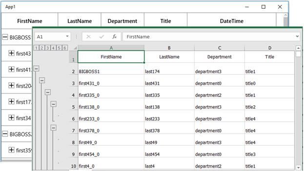

N> SfTreeGrid exports data to Excel using XlsIO.

## Export options

The exporting operation can be customized by passing [TreeGridExcelExportingOptions](https://help.syncfusion.com/cr/uwp/Syncfusion.UI.Xaml.TreeGrid.Converter.TreeGridExcelExportingOptions.html) instance as an argument to the [ExportToExcel ](https://help.syncfusion.com/cr/uwp/Syncfusion.UI.Xaml.TreeGrid.Converter.TreeGridExcelExportExtension.html#Syncfusion_UI_Xaml_TreeGrid_Converter_TreeGridExcelExportExtension_ExportToExcel_Syncfusion_UI_Xaml_TreeGrid_SfTreeGrid_Syncfusion_UI_Xaml_TreeGrid_Converter_TreeGridExcelExportingOptions_)method.

### Change export mode

By default, the actual value will only be exported to Excel. To export the display text, set the [TreeGridExportMode](https://help.syncfusion.com/cr/uwp/Syncfusion.UI.Xaml.TreeGrid.Converter.TreeGridExcelExportingOptions.html#Syncfusion_UI_Xaml_TreeGrid_Converter_TreeGridExcelExportingOptions_TreeGridExportMode) property as `Text`.



var options = new TreeGridExcelExportingOptions();
options.ExcelVersion = ExcelVersion.Excel2013;
options.TreeGridExportMode = TreeGridExportMode.Text;
var excelEngine = treeGrid.ExportToExcel(options);
var workBook = excelEngine.Excel.Workbooks[0];
StorageFile storageFile = await KnownFolders.SavedPictures.CreateFileAsync("Sample" + ".xlsx", CreationCollisionOption.ReplaceExisting);

if (storageFile != null)
    await workBook.SaveAsAsync(storageFile);



### Export without outlines	

By default, all the children in the tree grid will be exported in expanded state. You can disable the outlines in Excel by setting the [AllowOutliningGroups](https://help.syncfusion.com/cr/uwp/Syncfusion.UI.Xaml.TreeGrid.Converter.TreeGridExcelExportingOptions.html#Syncfusion_UI_Xaml_TreeGrid_Converter_TreeGridExcelExportingOptions_AllowOutliningGroups) property to `false` in [TreeGridExcelExportingOptions](https://help.syncfusion.com/cr/uwp/Syncfusion.UI.Xaml.TreeGrid.Converter.TreeGridExcelExportingOptions.html).



var options = new TreeGridExcelExportingOptions();
options.ExcelVersion = ExcelVersion.Excel2013;
options.AllowOutliningGroups = false;
var excelEngine = treeGrid.ExportToExcel(options);
var workBook = excelEngine.Excel.Workbooks[0];
StorageFile storageFile = await KnownFolders.SavedPictures.CreateFileAsync("Sample" + ".xlsx", CreationCollisionOption.ReplaceExisting);

if (storageFile != null)
    await workBook.SaveAsAsync(storageFile);



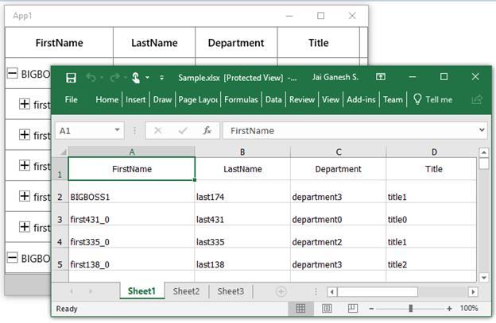

### Exclude columns when exporting

By default, all the columns (including hidden columns) in the tree grid will be exported to Excel. To exclude some columns, use [ExcludeColumns](https://help.syncfusion.com/cr/uwp/Syncfusion.UI.Xaml.TreeGrid.Converter.TreeGridExcelExportingOptions.html#Syncfusion_UI_Xaml_TreeGrid_Converter_TreeGridExcelExportingOptions_ExcludeColumns) field in [TreeGridExcelExportingOptions](https://help.syncfusion.com/cr/uwp/Syncfusion.UI.Xaml.TreeGrid.Converter.TreeGridExcelExportingOptions.html) class.



var options = new TreeGridExcelExportingOptions();
options.ExcelVersion = ExcelVersion.Excel2013;
options.ExcludeColumns.Add("FirstName");
options.ExcludeColumns.Add("LastName");
var excelEngine = treeGrid.ExportToExcel(options);
var workBook = excelEngine.Excel.Workbooks[0];
StorageFile storageFile = await KnownFolders.SavedPictures.CreateFileAsync("Sample" + ".xlsx", CreationCollisionOption.ReplaceExisting);

if (storageFile != null)
    await workBook.SaveAsAsync(storageFile);


Here, the columns having FirstName and LastName as MappingName are excluded when exporting.

### Excel version

When exporting to Excel, you can specify the Excel version by using the [ExcelVersion](https://help.syncfusion.com/cr/uwp/Syncfusion.UI.Xaml.TreeGrid.Converter.TreeGridExcelExportingOptions.html#Syncfusion_UI_Xaml_TreeGrid_Converter_TreeGridExcelExportingOptions_ExcelVersion) property.



var options = new TreeGridExcelExportingOptions();
options.ExcelVersion = ExcelVersion.Excel2013;
var excelEngine = treeGrid.ExportToExcel(options);
var workBook = excelEngine.Excel.Workbooks[0];
StorageFile storageFile = await KnownFolders.SavedPictures.CreateFileAsync("Sample" + ".xlsx", CreationCollisionOption.ReplaceExisting);

if (storageFile != null)
    await workBook.SaveAsAsync(storageFile);



### Export stacked headers to Excel

You can export the stacked headers to Excel by setting the [ExportStackedHeaders](https://help.syncfusion.com/cr/uwp/Syncfusion.UI.Xaml.TreeGrid.Converter.TreeGridExcelExportingOptions.html#Syncfusion_UI_Xaml_TreeGrid_Converter_TreeGridExcelExportingOptions_ExportStackedHeaders) property to `true`.



var options = new TreeGridExcelExportingOptions();
options.ExcelVersion = ExcelVersion.Excel2013;
options.ExportStackedHeaders = true;
var excelEngine = treeGrid.ExportToExcel(options);
var workBook = excelEngine.Excel.Workbooks[0];
StorageFile storageFile = await KnownFolders.SavedPictures.CreateFileAsync("Sample" + ".xlsx", CreationCollisionOption.ReplaceExisting);

if (storageFile != null)
    await workBook.SaveAsAsync(storageFile);



### Export hyper-link to Excel

You can export the hyper-link to Excel by setting the [CanExportHyperLink](https://help.syncfusion.com/cr/uwp/Syncfusion.UI.Xaml.TreeGrid.Converter.TreeGridExcelExportingOptions.html#Syncfusion_UI_Xaml_TreeGrid_Converter_TreeGridExcelExportingOptions_CanExportHyperLink) property to `true`.



var options = new TreeGridExcelExportingOptions();
options.ExcelVersion = ExcelVersion.Excel2013;
options.CanExportHyperLink = true;
var excelEngine = treeGrid.ExportToExcel(options);
var workBook = excelEngine.Excel.Workbooks[0];
StorageFile storageFile = await KnownFolders.SavedPictures.CreateFileAsync("Sample" + ".xlsx", CreationCollisionOption.ReplaceExisting);

if (storageFile != null)
    await workBook.SaveAsAsync(storageFile);



The default value of the `CanExportHyperLink` property is `true`.

### Export column width to Excel

You can export the columns with its actual width by setting the [ExportColumnWidth](https://help.syncfusion.com/cr/uwp/Syncfusion.UI.Xaml.TreeGrid.Converter.TreeGridExcelExportingOptions.html#Syncfusion_UI_Xaml_TreeGrid_Converter_TreeGridExcelExportingOptions_ExportColumnWidth) property to `true`.



var options = new TreeGridExcelExportingOptions();
options.ExcelVersion = ExcelVersion.Excel2013;
options.ExportColumnWidth = true;
var excelEngine = treeGrid.ExportToExcel(options);
var workBook = excelEngine.Excel.Workbooks[0];
StorageFile storageFile = await KnownFolders.SavedPictures.CreateFileAsync("Sample" + ".xlsx", CreationCollisionOption.ReplaceExisting);

if (storageFile != null)
    await workBook.SaveAsAsync(storageFile);



The default value of the `ExportColumnWidth` property is `true`.

### Export with customized row height

You can export the tree grid to Excel with customized row height by using the [DefaultRowHeight](https://help.syncfusion.com/cr/uwp/Syncfusion.UI.Xaml.TreeGrid.Converter.TreeGridExcelExportingOptions.html#Syncfusion_UI_Xaml_TreeGrid_Converter_TreeGridExcelExportingOptions_DefaultRowHeight) property.



var options = new TreeGridExcelExportingOptions();
options.ExcelVersion = ExcelVersion.Excel2013;
options.DefaultRowHeight = 60;
var excelEngine = treeGrid.ExportToExcel(options);
var workBook = excelEngine.Excel.Workbooks[0];
StorageFile storageFile = await KnownFolders.SavedPictures.CreateFileAsync("Sample" + ".xlsx", CreationCollisionOption.ReplaceExisting);

if (storageFile != null)
    await workBook.SaveAsAsync(storageFile);




### Export without grid lines

You can export the tree grid to Excel without grid lines by setting the [IsGridLinesVisible](https://help.syncfusion.com/cr/uwp/Syncfusion.UI.Xaml.TreeGrid.Converter.TreeGridExcelExportingOptions.html#Syncfusion_UI_Xaml_TreeGrid_Converter_TreeGridExcelExportingOptions_IsGridLinesVisible) property to `false`.



var options = new TreeGridExcelExportingOptions();
options.ExcelVersion = ExcelVersion.Excel2013;
options.IsGridLinesVisible = true;
var excelEngine = treeGrid.ExportToExcel(options);
var workBook = excelEngine.Excel.Workbooks[0];
StorageFile storageFile = await KnownFolders.SavedPictures.CreateFileAsync("Sample" + ".xlsx", CreationCollisionOption.ReplaceExisting);

if (storageFile != null)
    await workBook.SaveAsAsync(storageFile);




The default value of the `IsGridLinesVisible` property is `true`.

### Export with indent column

You can export the tree grid to Excel with indent column to denote the nodes level by setting the [AllowIndentColumn](https://help.syncfusion.com/cr/uwp/Syncfusion.UI.Xaml.TreeGrid.Converter.TreeGridExcelExportingOptions.html#Syncfusion_UI_Xaml_TreeGrid_Converter_TreeGridExcelExportingOptions_AllowIndentColumn) property to `true`.



var options = new TreeGridExcelExportingOptions();
options.ExcelVersion = ExcelVersion.Excel2013;
options.AllowIndentColumn = true;
var excelEngine = treeGrid.ExportToExcel(options);
var workBook = excelEngine.Excel.Workbooks[0];
StorageFile storageFile = await KnownFolders.SavedPictures.CreateFileAsync("Sample" + ".xlsx", CreationCollisionOption.ReplaceExisting);

if (storageFile != null)
    await workBook.SaveAsAsync(storageFile);



The default value of the `AllowIndentColumn` property is `false`.

### Change the node expand state in Excel

You can change the node expanding state in Excel by using the [NodeExpandMode](https://help.syncfusion.com/cr/uwp/Syncfusion.UI.Xaml.TreeGrid.Converter.TreeGridExcelExportingOptions.html#Syncfusion_UI_Xaml_TreeGrid_Converter_TreeGridExcelExportingOptions_NodeExpandMode) property.



var options = new TreeGridExcelExportingOptions();
options.ExcelVersion = ExcelVersion.Excel2013;
options.NodeExpandMode = NodeExpandMode.CollapseAll;
var excelEngine = treeGrid.ExportToExcel(options);
var workBook = excelEngine.Excel.Workbooks[0];
StorageFile storageFile = await KnownFolders.SavedPictures.CreateFileAsync("Sample" + ".xlsx", CreationCollisionOption.ReplaceExisting);

if (storageFile != null)
    await workBook.SaveAsAsync(storageFile);




### Change start row and column index when exporting

You can export the data to specified row and column index in the worksheet, by setting the [ExcelStartRowIndex ](https://help.syncfusion.com/cr/uwp/Syncfusion.UI.Xaml.TreeGrid.Converter.TreeGridExcelExportingOptions.html#Syncfusion_UI_Xaml_TreeGrid_Converter_TreeGridExcelExportingOptions_ExcelStartRowIndex) and [ExcelStartColumnIndex](https://help.syncfusion.com/cr/uwp/Syncfusion.UI.Xaml.TreeGrid.Converter.TreeGridExcelExportingOptions.html#Syncfusion_UI_Xaml_TreeGrid_Converter_TreeGridExcelExportingOptions_ExcelStartColumnIndex) properties.



var options = new TreeGridExcelExportingOptions();
options.ExcelVersion = ExcelVersion.Excel2013;
options.ExcelStartColumnIndex = 3;
options.ExcelStartRowIndex = 3;
var excelEngine = treeGrid.ExportToExcel(options);
var workBook = excelEngine.Excel.Workbooks[0];
StorageFile storageFile = await KnownFolders.SavedPictures.CreateFileAsync("Sample" + ".xlsx", CreationCollisionOption.ReplaceExisting);

if (storageFile != null)
    await workBook.SaveAsAsync(storageFile);



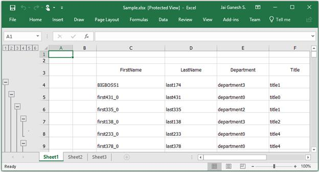

## Save options

### Save Excel as stream

After exporting to Excel, you can save the exported workbook as stream by using the [SaveAsAsync](https://help.syncfusion.com/cr/uwp/Syncfusion.XlsIO.IWorkbook.html#Syncfusion_XlsIO_IWorkbook_SaveAsAsync_System_IO_Stream_) method.



var options = new TreeGridExcelExportingOptions();
options.ExcelVersion = ExcelVersion.Excel2013;
var excelEngine = treeGrid.ExportToExcel(options);
IWorkbook workBook = excelEngine.Excel.Workbooks[0];
FileStream stream = null;
string directory = @"Pictures\output5.xlsx";
await Task.Run(() =>
{
    stream = new FileStream(directory, FileMode.Create);
});
await workBook.SaveAsAsync(stream);
workBook.Close();
excelEngine.Dispose();



### Save Excel using FileSavePicker with MessageDialog

After exporting to Excel, you can save the exported workbook by opening the [MessageDialog](https://msdn.microsoft.com/library/windows/apps/br208674).



var options = new TreeGridExcelExportingOptions();
options.ExcelVersion = ExcelVersion.Excel2013;
var excelEngine = treeGrid.ExportToExcel(options);
IWorkbook workBook = excelEngine.Excel.Workbooks[0];
var savePicker = new FileSavePicker
{
    SuggestedStartLocation = PickerLocationId.Desktop,
    SuggestedFileName = "Sample"
};

if (workBook.Version == ExcelVersion.Excel97to2003)
    savePicker.FileTypeChoices.Add("Excel File (.xls)", new List<string>() { ".xls" });

else
    savePicker.FileTypeChoices.Add("Excel File (.xlsx)", new List<string>() { ".xlsx" });
var storageFile = await savePicker.PickSaveFileAsync();

if (storageFile != null)
    await workBook.SaveAsAsync(storageFile);
var messageDialog = new MessageDialog("Do you want to view the Document?", "File has been created successfully.");
var yesCmd = new UICommand("Yes");
var noCmd = new UICommand("No");
messageDialog.Commands.Add(yesCmd);
messageDialog.Commands.Add(noCmd);
var cmd = await messageDialog.ShowAsync();

if (cmd == yesCmd)
{

    // Launch the saved file
    bool success = await Windows.System.Launcher.LaunchFileAsync(storageFile);
}

workBook.Close();
excelEngine.Dispose();



## Open the saved Excel file

You can open the saved workbook using [FileOpenPicker](https://msdn.microsoft.com/en-us/library/windows/apps/windows.storage.pickers.fileopenpicker.aspx).



var options = new TreeGridExcelExportingOptions();
options.ExcelVersion = ExcelVersion.Excel2013;
var excelEngine = treeGrid.ExportToExcel(options);
IWorkbook workBook = excelEngine.Excel.Workbooks[0];
StorageFile storageFile = await KnownFolders.SavedPictures.CreateFileAsync("Sample" + ".xlsx", CreationCollisionOption.ReplaceExisting);

if (storageFile != null)
    await workBook.SaveAsAsync(storageFile);
FileOpenPicker openPicker = new FileOpenPicker();
openPicker.FileTypeFilter.Add(".xlsx");
openPicker.SuggestedStartLocation = PickerLocationId.PicturesLibrary;
StorageFile file = await openPicker.PickSingleFileAsync();
await Windows.System.Launcher.LaunchFileAsync(storageFile);



## Export to XML

You can save the exported workbook as Xml file by using the [SaveAsXmlAsync](https://help.syncfusion.com/cr/uwp/Syncfusion.XlsIO.IWorkbook.html#Syncfusion_XlsIO_IWorkbook_SaveAsXmlAsync_System_IO_Stream_Syncfusion_XlsIO_ExcelXmlSaveType_) method.



var options = new TreeGridExcelExportingOptions();
options.ExcelVersion = ExcelVersion.Excel2013;
var excelEngine = treeGrid.ExportToExcel(options);
IWorkbook workBook = excelEngine.Excel.Workbooks[0];
StorageFile storageFile = await KnownFolders.SavedPictures.CreateFileAsync("Sample", CreationCollisionOption.ReplaceExisting);
if (storageFile != null)
    await workBook.SaveAsXmlAsync(storageFile, ExcelXmlSaveType.MSExcel);



## Export to CSV

You can save the exported workbook as CSV by using the `SaveAsAsync` method.



var options = new TreeGridExcelExportingOptions();
options.ExcelVersion = ExcelVersion.Excel2013;
var excelEngine = treeGrid.ExportToExcel(options);
var workBook = excelEngine.Excel.Workbooks[0];
var savePicker = new FileSavePicker
{
    SuggestedStartLocation = PickerLocationId.Desktop,
    SuggestedFileName = "Sample"
};
savePicker.FileTypeChoices.Add("Excel File (.csv)", new List<string>() { ".csv" });
var storageFile = await savePicker.PickSaveFileAsync();
await workBook.SaveAsAsync(storageFile, ",");
await Windows.System.Launcher.LaunchFileAsync(storageFile);
excelEngine.Dispose();



Similarly, you can also save the exported worksheet to CSV. Refer to the [XlsIO documentation.](http://help.syncfusion.com/file-formats/xlsio/working-with-excel-worksheet#save-worksheet-as-csv)

## Customize row height and column width 

After exporting the data to Excel, you can set different row heights and column widths for the columns.



var options = new TreeGridExcelExportingOptions();
options.ExcelVersion = ExcelVersion.Excel2013;
var excelEngine = treeGrid.ExportToExcel(options);
IWorkbook workBook = excelEngine.Excel.Workbooks[0];
workBook.Worksheets[0].SetRowHeight(2, 50);
workBook.Worksheets[0].SetColumnWidth(2, 50);
StorageFile storageFile = await KnownFolders.SavedPictures.CreateFileAsync("Sample" + ".xlsx", CreationCollisionOption.ReplaceExisting);

if (storageFile != null)
    await workBook.SaveAsAsync(storageFile);



## Customize cell appearance when exporting

You can customize the cells by using the [CellsExportingEventHandler](https://help.syncfusion.com/cr/wpf/Syncfusion.UI.Xaml.Grid.Converter.ExcelExportingOptions.html#Syncfusion_UI_Xaml_Grid_Converter_ExcelExportingOptions_ChildExportingEventHandler) in `ExcelExportingOptions`.

### Cell styling based on cell type in Excel

You can customize the cell styles based on the cell type by using the [ExportingEventHandler](https://help.syncfusion.com/cr/uwp/Syncfusion.UI.Xaml.TreeGrid.Converter.TreeGridExcelExportingOptions.html#Syncfusion_UI_Xaml_TreeGrid_Converter_TreeGridExcelExportingOptions_ExportingEventHandler) property.



var options = new TreeGridExcelExportingOptions();
options.ExcelVersion = ExcelVersion.Excel2013;
options.ExportingEventHandler = ExportingHandler;
var excelEngine = treeGrid.ExportToExcel(options);
var workBook = excelEngine.Excel.Workbooks[0];
StorageFile storageFile = await KnownFolders.SavedPictures.CreateFileAsync("Sample" + ".xlsx", CreationCollisionOption.ReplaceExisting);

if (storageFile != null)
    await workBook.SaveAsAsync(storageFile);

private static void ExportingHandler(object sender, TreeGridExcelExportingEventArgs e)
{
    if (e.CellType == TreeGridCellType.HeaderCell)
    {
        e.Style.ColorIndex = ExcelKnownColors.Blue;
        e.Handled = true;
    }

    else if (e.CellType == TreeGridCellType.RecordCell)
    {
        e.Style.ColorIndex = ExcelKnownColors.Sky_blue;
        e.Handled = true;
    }
}



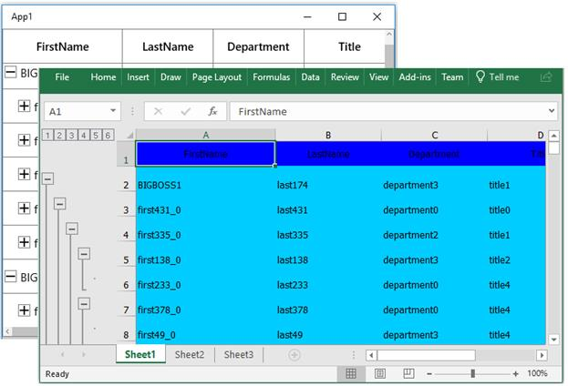

### Customize the exporting content to Excel 

You can customize the cell values when exporting to Excel by using the [CellsExportingEventHandler](https://help.syncfusion.com/cr/uwp/Syncfusion.UI.Xaml.TreeGrid.Converter.TreeGridExcelExportingOptions.html#Syncfusion_UI_Xaml_TreeGrid_Converter_TreeGridExcelExportingOptions_CellsExportingEventHandler) property in  [TreeGridExcelExportingOptions](https://help.syncfusion.com/cr/uwp/Syncfusion.UI.Xaml.TreeGrid.Converter.TreeGridExcelExportingOptions.html).



var options = new TreeGridExcelExportingOptions();
options.ExcelVersion = ExcelVersion.Excel2013;
options.CellsExportingEventHandler = cellExportingHandler;
var excelEngine = treeGrid.ExportToExcel(options);
var workBook = excelEngine.Excel.Workbooks[0];
StorageFile storageFile = await KnownFolders.SavedPictures.CreateFileAsync("Sample" + ".xlsx", CreationCollisionOption.ReplaceExisting);

if (storageFile != null)
    await workBook.SaveAsAsync(storageFile);
private static void CellExportingHandler(object sender, TreeGridCellExcelExportingEventArgs e)
{
    // Based on the column mapping name and the cell type, we can change the cell 
    //values while exporting to excel.
    if (e.CellType == TreeGridCellType.RecordCell && e.ColumnName == "IsClosed")
    {
        //if the cell value is True, "Y" will be displayed else "N" will be displayed.

        if (e.CellValue.Equals(true))
            e.Range.Cells[0].Value = "Y";

        else
            e.Range.Cells[0].Value = "N";
        e.Handled = true;
    }
}



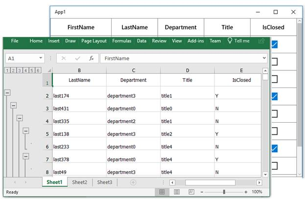

Here, the cell values changed for the `IsClosed` column are based on the custom condition.

### Change row style in Excel based on data

You can customize the rows based on the record values by using the the [CellsExportingEventHandler](https://help.syncfusion.com/cr/uwp/Syncfusion.UI.Xaml.TreeGrid.Converter.TreeGridExcelExportingOptions.html#Syncfusion_UI_Xaml_TreeGrid_Converter_TreeGridExcelExportingOptions_CellsExportingEventHandler).



var options = new TreeGridExcelExportingOptions();
options.ExcelVersion = ExcelVersion.Excel2013;
options.AllowOutliningGroups = false;
options.CellsExportingEventHandler = CellExportingHandler;
var excelEngine = treeGrid.ExportToExcel(options);
var workBook = excelEngine.Excel.Workbooks[0];
workBook.SaveAs("Sample.xlsx");

private void cellExportingHandler(object sender, TreeGridCellExcelExportingEventArgs e)
{
    if ((e.Node == null))
        return;
    var record = e.Node as EmployeeInfo;

    if (record.Title == "title0")
    {
        e.Range.CellStyle.ColorIndex = ExcelKnownColors.Green;
        e.Range.CellStyle.Font.Color = ExcelKnownColors.White;
    }
}



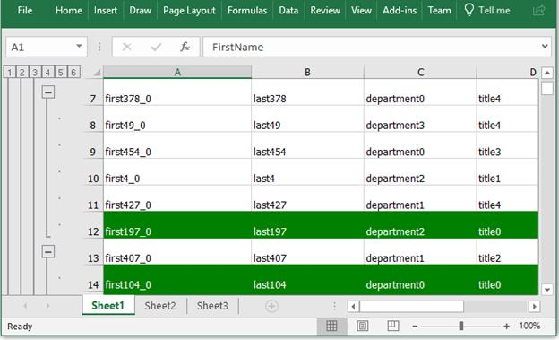

### Customize the cells based on column name

You can customize the cells based on the [GridCellExcelExportingEventArgs.ColumnName](https://help.syncfusion.com/cr/wpf/Syncfusion.UI.Xaml.Grid.Converter.GridCellExcelExportingEventArgs.html#Syncfusion_UI_Xaml_Grid_Converter_GridCellExcelExportingEventArgs_ColumnName) property in [CellsExportingEventHandler](https://help.syncfusion.com/cr/uwp/Syncfusion.UI.Xaml.TreeGrid.Converter.TreeGridExcelExportingOptions.html#Syncfusion_UI_Xaml_TreeGrid_Converter_TreeGridExcelExportingOptions_CellsExportingEventHandler).



var options = new TreeGridExcelExportingOptions();
options.ExcelVersion = ExcelVersion.Excel2013;
options.AllowOutliningGroups = false;
options.CellsExportingEventHandler = CellExportingHandler;
var excelEngine = treeGrid.ExportToExcel(options);
var workBook = excelEngine.Excel.Workbooks[0];
workBook.SaveAs("Sample.xlsx");

private static void CellExportingHandler(object sender, TreeGridCellExcelExportingEventArgs e)
{
    if (e.ColumnName != "ID")
        return;

    e.Range.CellStyle.Font.Size = 12;
    e.Range.CellStyle.Font.Color = ExcelKnownColors.Pink;
    e.Range.CellStyle.Font.FontName = "Segoe UI";
}



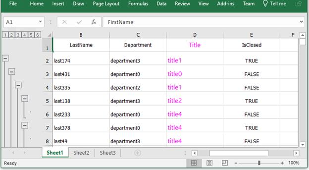

## Customize exported workbooks and worksheets

The tree grid can be exported to Excel by using [XlsIO](http://help.syncfusion.com/file-formats/xlsio/overview). You can refer to [XlsIO documentation](http://help.syncfusion.com/file-formats/xlsio/working-with-excel-worksheet) for manipulating workbooks and sheets after exporting.

### Set borders

You can set the borders to Excel cells by directly accessing worksheet after exporting the data.



var options = new TreeGridExcelExportingOptions();
options.ExcelVersion = ExcelVersion.Excel2013;
var excelEngine = treeGrid.ExportToExcel(options);
var workBook = excelEngine.Excel.Workbooks[0];
workBook.Worksheets[0].UsedRange.BorderInside(ExcelLineStyle.Dash_dot, ExcelKnownColors.Black);
workBook.Worksheets[0].UsedRange.BorderAround(ExcelLineStyle.Dash_dot, ExcelKnownColors.Black);

StorageFile storageFile = await KnownFolders.SavedPictures.CreateFileAsync("Sample" + ".xlsx", CreationCollisionOption.ReplaceExisting);

if (storageFile != null)
    await workBook.SaveAsAsync(storageFile);



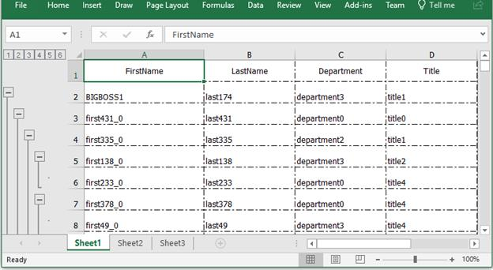

### Enable filters

You can show filters in the exported worksheet by enabling filter for the exported range in the worksheet.



var options = new TreeGridExcelExportingOptions();
options.ExcelVersion = ExcelVersion.Excel2013;
var excelEngine = treeGrid.ExportToExcel(options);
var workBook = excelEngine.Excel.Workbooks[0];
workBook.Worksheets[0].AutoFilters.FilterRange = workBook.Worksheets[0].UsedRange;
StorageFile storageFile = await KnownFolders.SavedPictures.CreateFileAsync("Sample" + ".xlsx", CreationCollisionOption.ReplaceExisting);

if (storageFile != null)
    await workBook.SaveAsAsync(storageFile);



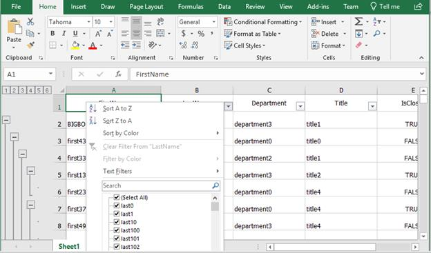

By using the stacked headers, you can specify the range based on the stacked headers count.



var options = new TreeGridExcelExportingOptions();
options.ExcelVersion = ExcelVersion.Excel2013;
var excelEngine = treeGrid.ExportToExcel(options);
var workBook = excelEngine.Excel.Workbooks[0];
var range = "A" + (treeGrid.StackedHeaderRows.Count + 1).ToString() + ":" + workBook.Worksheets[0].UsedRange.End.AddressLocal;
excelEngine.Excel.Workbooks[0].Worksheets[0].AutoFilters.FilterRange = workBook.Worksheets[0].Range[range];
StorageFile storageFile = await KnownFolders.SavedPictures.CreateFileAsync("Sample" + ".xlsx", CreationCollisionOption.ReplaceExisting);

if (storageFile != null)
    await workBook.SaveAsAsync(storageFile);



You can refer to [XlsIO documentation](http://help.syncfusion.com/file-formats/xlsio/worksheet-cells-manipulation#data-filtering).

### Customize the range of cells

You can customize the range of cells after exporting to Excel by directly manipulating the worksheet.



var options = new TreeGridExcelExportingOptions();
options.ExcelVersion = ExcelVersion.Excel2013;
var excelEngine = treeGrid.ExportToExcel(options);
var workBook = excelEngine.Excel.Workbooks[0];
workBook.Worksheets[0].Range["A2:A6"].CellStyle.Color = Colors.LightGray;
workBook.Worksheets[0].Range["A2:A6"].CellStyle.Font.Color = ExcelKnownColors.White;
StorageFile storageFile = await KnownFolders.SavedPictures.CreateFileAsync("Sample" + ".xlsx", CreationCollisionOption.ReplaceExisting);

if (storageFile != null)
    await workBook.SaveAsAsync(storageFile);



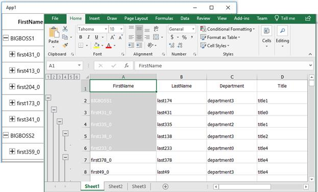

## Performance

Using the[ExcelExportingOptions.CellsExportingEventHandler](https://help.syncfusion.com/cr/uwp/Syncfusion.UI.Xaml.TreeGrid.Converter.TreeGridExcelExportingOptions.html#Syncfusion_UI_Xaml_TreeGrid_Converter_TreeGridExcelExportingOptions_CellsExportingEventHandler) and changing the settings for each cell will consume more memory and time. So, avoid using the `CellsExportingEventHandler` and instead of this, you can do the required settings in the exported sheet.

### Format column without using CellsExportingEventHandler

You can perform cell level customizations such as row-level styling, formatting a particular column in the exported worksheet.
In the following code snippet, NumberFormat for `Employee ID` column is changed in the exported sheet after exporting without using the [CellsExportingEventHandler](https://help.syncfusion.com/cr/uwp/Syncfusion.UI.Xaml.TreeGrid.Converter.TreeGridExcelExportingOptions.html#Syncfusion_UI_Xaml_TreeGrid_Converter_TreeGridExcelExportingOptions_CellsExportingEventHandler).

Reference:
[http://help.syncfusion.com/file-formats/xlsio/working-with-cell-or-range-formatting](http://help.syncfusion.com/file-formats/xlsio/working-with-cell-or-range-formatting)



var options = new TreeGridExcelExportingOptions();
options.TreeGridExportMode = TreeGridExportMode.Value;
options.ExcelVersion = ExcelVersion.Excel2013;
var excelEngine = treeGrid.ExportToExcel(options);
IWorkbook workBook = excelEngine.Excel.Workbooks[0];
workBook.ActiveSheet.Columns[2].NumberFormat = "0.0";




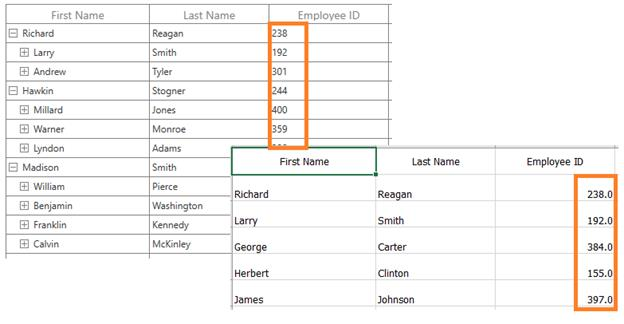

### Alternate row styling without using CellsExportingEventHandler

In the following code snippet, the background color of the rows in Excel is changed based on the row index using conditional formatting for better performance.

Reference:
[http://help.syncfusion.com/file-formats/xlsio/working-with-conditional-formatting](http://help.syncfusion.com/file-formats/xlsio/working-with-conditional-formatting)



var options = new TreeGridExcelExportingOptions();
options.TreeGridExportMode = TreeGridExportMode.Value;
options.ExcelVersion = ExcelVersion.Excel2013;
var excelEngine = treeGrid.ExportToExcel(options);
IWorkbook workBook = excelEngine.Excel.Workbooks[0];
IConditionalFormats condition = workBook.ActiveSheet.Range[2, 1, this.treeGrid.View.Nodes.Count + 1, this.treeGrid.Columns.Count].ConditionalFormats;
IConditionalFormat condition1 = condition.AddCondition();
condition1.FormatType = ExcelCFType.Formula;
condition1.FirstFormula = "MOD(ROW(),2)=0";
condition1.BackColorRGB = System.Drawing.Color.Pink;
IConditionalFormat condition2 = condition.AddCondition();
condition2.FormatType = ExcelCFType.Formula;
condition2.FirstFormula = "MOD(ROW(),2)=1";
condition2.BackColorRGB = System.Drawing.Color.LightGray;




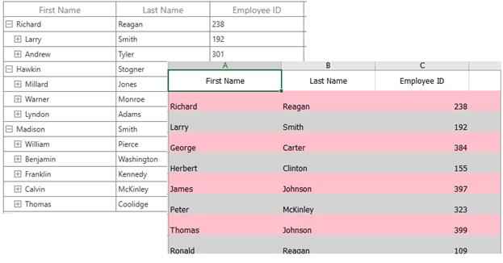

## How to

### Export multiple tree grids to a single Excel sheet

You can export multiple tree grids to a single Excel sheet by merging one tree grid worksheet into another using the `Worksheet.UsedRange.CopyTo` method.



var options = new TreeGridExcelExportingOptions();
options.ExcelVersion = ExcelVersion.Excel2010;

var excelEngine = treeGrid.ExportToExcel(options);
var workBook1 = excelEngine.Excel.Workbooks[0];
var worksheet1 = workBook1.Worksheets[0];

excelEngine = treeGrid1.ExportToExcel(options);
var workBook2 = excelEngine.Excel.Workbooks[0];
var worksheet2 = workBook2.Worksheets[0];

var columnCount = this.treeGrid1.Columns.Count;
//Merge the One TreeGrid WorkSheet into the other TreeGrid WorkSheet
worksheet2.UsedRange.CopyTo(worksheet1[1, columnCount + 1]);

StorageFile storageFile = await KnownFolders.SavedPictures.CreateFileAsync("Sample" + ".xlsx", CreationCollisionOption.ReplaceExisting);

if (storageFile != null)
    await workBook1.SaveAsAsync(storageFile);



### Export the tree grid that is not loaded in view

You can export the tree grid that is not loaded in the view by calling the ApplyTemplate() method before exporting.



var options = new TreeGridExcelExportingOptions();
options.ExcelVersion = ExcelVersion.Excel2010;
treeGrid1.ApplyTemplate();
var excelEngine = treeGrid1.ExportToExcel(options);
var workBook1 = excelEngine.Excel.Workbooks[0];
var worksheet1 = workBook1.Worksheets[0];
          
StorageFile storageFile = await KnownFolders.SavedPictures.CreateFileAsync("Sample" + ".xlsx", CreationCollisionOption.ReplaceExisting);

if (storageFile != null)
    await workBook1.SaveAsAsync(storageFile);



### Export parent and expanded child nodes

By default, all the tree grid nodes will be exported when exporting. You can export only the parent and expanded child nodes by overriding the [ExportNodesToExcel](https://help.syncfusion.com/cr/uwp/Syncfusion.UI.Xaml.TreeGrid.Converter.TreeGridToExcelConverter.html#Syncfusion_UI_Xaml_TreeGrid_Converter_TreeGridToExcelConverter_ExportNodesToExcel_Syncfusion_UI_Xaml_TreeGrid_SfTreeGrid_Syncfusion_UI_Xaml_TreeGrid_TreeNodes_Syncfusion_XlsIO_IWorksheet_Syncfusion_UI_Xaml_TreeGrid_Converter_TreeGridExcelExportingOptions_) method of [TreeGridToExcelConverter](https://help.syncfusion.com/cr/uwp/Syncfusion.UI.Xaml.TreeGrid.Converter.TreeGridToExcelConverter.html) class,



var options = new TreeGridExcelExportingOptions();
options.ExcelVersion = ExcelVersion.Excel2013;
var excelEngine = treeGrid.ExportToExcel(options, true);
var workBook = excelEngine.Excel.Workbooks[0];
StorageFile storageFile = await KnownFolders.SavedPictures.CreateFileAsync("Sample" + ".xlsx", CreationCollisionOption.ReplaceExisting);

if (storageFile != null)
    await workBook.SaveAsAsync(storageFile);

public class TreeGridCustomExcelConverter : TreeGridToExcelConverter
{
    internal bool _excludeNonExpandedNodes;
    public TreeGridCustomExcelConverter(bool excludeNonExpandedNodes) : base()
    {
        _excludeNonExpandedNodes = excludeNonExpandedNodes;
    }

    protected override void ExportNodesToExcel(SfTreeGrid treeGrid, TreeNodes nodes, IWorksheet sheet, TreeGridExcelExportingOptions excelExportingOptions)
    {
        if (!_excludeNonExpandedNodes)
        {
            base.ExportNodesToExcel(treeGrid, nodes, sheet, excelExportingOptions);
        }
        else
        {
            for (int i = 0; i < nodes.Count; i++)
            {
                TreeNode node = nodes[i];
                ExportNodeToExcel(treeGrid, node, sheet, excelExportingOptions);
                if (node.IsExpanded && node.HasChildNodes)
                {
                    node.PopulateChildNodes();
                    ExportNodesToExcel(treeGrid, node.ChildNodes, sheet, excelExportingOptions);
                }
            }
        }
    }
 }



You can download the sample [here](http://www.syncfusion.com/downloads/support/directtrac/general/ze/ExportExcel_ExpandedNodes_UWP1827282364.zip).
