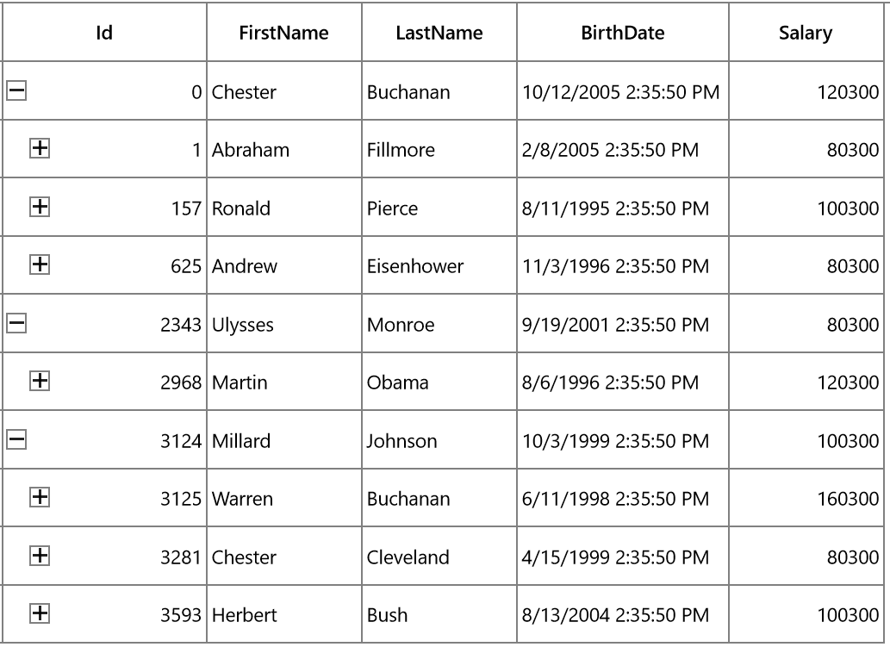

# Filtering in UWP TreeGrid (SfTreeGrid)

## Overview

SfTreeGrid provides support for programmatic filtering. It can be achieved by setting [SfTreeGrid.View.Filter](https://help.syncfusion.com/cr/uwp/Syncfusion.UI.Xaml.TreeGrid.TreeGridView.html#Syncfusion_UI_Xaml_TreeGrid_TreeGridView_Filter) delegate and calling [SfTreeGrid.View.RefreshFilter](https://help.syncfusion.com/cr/uwp/Syncfusion.UI.Xaml.TreeGrid.TreeGridView.html#Syncfusion_UI_Xaml_TreeGrid_TreeGridView_RefreshFilter) method.




public bool FilerNodes(object o)
{
    var data = o as Employee;

    if (data.Salary > 70000)
        return true;
    return false;
}

private void Button_Click(object sender, RoutedEventArgs e)
{
    treeGrid.View.Filter = FilerNodes;
    treeGrid.View.RefreshFilter();
}




Here, `FilterNodes` delegate filters the data based on Salary. `FilterNodes` delegate is assigned to [SfTreeGrid.View.Filter](https://help.syncfusion.com/cr/uwp/Syncfusion.UI.Xaml.TreeGrid.TreeGridView.html#Syncfusion_UI_Xaml_TreeGrid_TreeGridView_Filter) predicate to filter the tree grid. After that, [SfTreeGrid.View.RefreshFilter](https://help.syncfusion.com/cr/uwp/Syncfusion.UI.Xaml.TreeGrid.TreeGridView.html#Syncfusion_UI_Xaml_TreeGrid_TreeGridView_RefreshFilter) method is called to refresh the nodes. If the node satisfies the filter conditions, true will be returned. Else false will be returned.

While filtering, if the node satisfies filter condition, [IsFiltered](https://help.syncfusion.com/cr/uwp/Syncfusion.UI.Xaml.TreeGrid.TreeNode.html#Syncfusion_UI_Xaml_TreeGrid_TreeNode_IsFiltered) property of [TreeNode](https://help.syncfusion.com/cr/uwp/Syncfusion.UI.Xaml.TreeGrid.TreeNode.html) will be set as false. Else, it will be true. If `IsFiltered` value is True, the node will not be displayed in view, else it will be displayed in view.

N> SfTreeGrid refreshes the filtering on property change if [SfTreeGrid.LiveNodeUpdateMode ](https://help.syncfusion.com/cr/uwp/Syncfusion.UI.Xaml.TreeGrid.SfTreeGrid.html#Syncfusion_UI_Xaml_TreeGrid_SfTreeGrid_LiveNodeUpdateMode)property is set as `AllowDataShaping`.

You can download the sample from [here](http://www.syncfusion.com/downloads/support/directtrac/general/ze/FilteringDemo_UWP-1890724267).

## FilterLevel

You can filter the nodes based on level by using [SfTreeGrid.FilterLevel](https://help.syncfusion.com/cr/uwp/Syncfusion.UI.Xaml.TreeGrid.SfTreeGrid.html#Syncfusion_UI_Xaml_TreeGrid_SfTreeGrid_FilterLevel) property.




treeGrid.FilterLevel = FilterLevel.All;




* Root - Filter will be applied to root nodes only in SfTreeGrid.

* All - Filter will be applied to all the nodes in SfTreeGrid.

* Extended - Filter will be applied to all nodes. However, child nodes are filtered only when their parent node is either in an expanded state or matches the filter condition. If a node matches the filter condition, all of its ancestor nodes will be displayed, even if those ancestors do not match the filter condition.

**Root**

Filter will be applied to root nodes only in SfTreeGrid. For other nodes, `IsFiltered` value will be false and they always will be displayed in view.

**All**

Filter will be applied to all the nodes in SfTreeGrid. If the parent node does not match the filter condition, filter will not be applied for child nodes. Else, filter will be applied to its child nodes also.

**Extended**

Filter will be applied to all nodes. However, child nodes are filtered only when their parent node is either in an expanded state or matches the filter condition. If a node matches the filter condition, all of its ancestor nodes will be displayed, even if those ancestors do not match the filter condition, and ancestor node’s `IsFiltered` value will be set to false.

N> It is also possible to change `FilterLevel` at runtime.

## Clear filters

You can clear the filters applied in tree grid by setting `SfTreeGrid.View.Filter` delegate as null and calling `SfTreeGrid.View.RefreshFilter` method.




treeGrid.View.Filter = null;
treeGrid.View.RefreshFilter();




**HasVisibleChildNodes**

You can find whether particular node has child node(s) displayed in a view (matches filtering criteria) or not by using [HasVisibleChildNodes](https://help.syncfusion.com/cr/uwp/Syncfusion.UI.Xaml.TreeGrid.TreeNode.html#Syncfusion_UI_Xaml_TreeGrid_TreeNode_HasVisibleChildNodes) property in [TreeNode](https://help.syncfusion.com/cr/uwp/Syncfusion.UI.Xaml.TreeGrid.TreeNode.html).




var treeNode=treeGrid.View.Nodes[0];
var hasVisibleChildNodes = treeNode.HasVisibleChildNodes;



