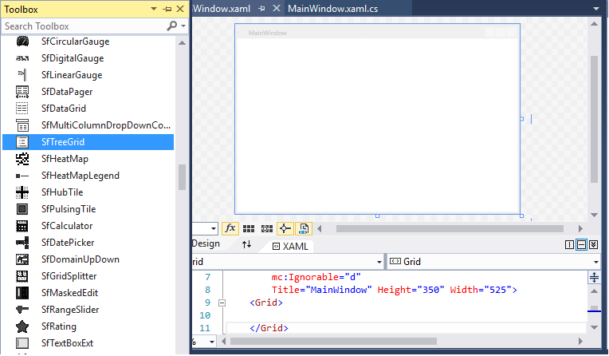
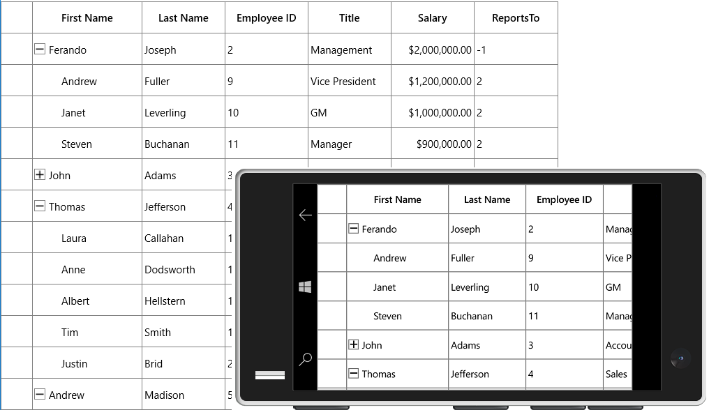
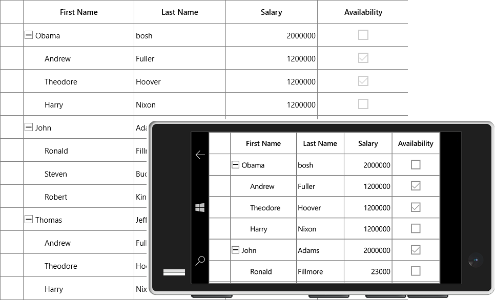

## Getting Started with UWP TreeGrid (SfTreeGrid)

The SfTreeGrid is a data oriented control that displays the self-relational and hierarchical data in tree structure with columns. The data can be loaded on-demand also.

### Assembly Deployment

The following list of assemblies needs to be added as reference to use SfTreeGrid control in any application,

<table>
<tr>
<th>
Required assemblies
</th>
<th>
Description
</th>
</tr>
<tr>
<td>
Syncfusion.Data.UWP
</td>
<td>
Syncfusion.Data.UWP assembly is dependent assembly for Syncfusion.SfGrid.UWP
</td>
</tr>
<tr>
<td>
Syncfusion.SfGrid.UWP
</td>
<td>
Syncfusion.SfGrid.UWP assembly contains classes that handles all UI operations of SfTreeGrid.
SfTreeGrid control present in Syncfusion.UI.Xaml.TreeGrid namespace.
</td>
</tr>
<tr>
<td>
Syncfusion.SfInput.UWP
</td>
<td>
Syncfusion.SfInput.UWP contains various editor controls (such as SfNumericTextBox, SfDateTimeEdit and etc) which are used in SfTreeGrid.
</td>
</tr>
<tr>
<td>
Syncfusion.SfShared.UWP
</td>
<td>
Syncfusion.SfShared.UWP is dependent assembly for Syncfusion.SfInput.UWP.
</td>
</tr>
</table>

In order to use export to excel and export to PDF functionalities of SfTreeGrid control, add the reference to following assemblies,

<table>
<tr>
<th>
Optional Assemblies
</th>
<th>
Description
</th>
</tr>
<tr>
<td>
Syncfusion.SfGridConverter.UWP
</td>
<td>
Syncfusion.SfGridConverter.UWP contains static extension classes for exporting SfTreeGrid to excel and PDF in <code>Syncfusion.UI.Xaml.TreeGrid.Converter</code> namespace.
</td>
</tr>
<tr>
<td>
Syncfusion.XlsIO.UWP
</td>
<td>
Syncfusion.XlsIO.Base.UWP contains fundamental and base classes for creating and manipulating excel files.
</td>
</tr>
<tr>
<td>
Syncfusion.Pdf.UWP
</td>
<td>
Syncfusion.Pdf.UWP contains fundamental and base classes for creating PDF.
</td>
</tr>
</table>

You can refer [here](https://help.syncfusion.com/uwp/installation-and-upgrade/system-requirements) to know the assemblies installation location on your machine.

### Creating simple application with SfTreeGrid

In this walk through, you will create UWP application with SfTreeGrid control.

1. [Creating project](http://help.syncfusion.com/uwp/sftreegrid/getting-started#creating-the-project)
2. [Adding control via Designer](http://help.syncfusion.com/uwp/sftreegrid/getting-started#adding-control-via-designer)
3. [Adding control manually in XAML](http://help.syncfusion.com/uwp/sftreegrid/getting-started#adding-control-manually-in-xaml)
4. [Adding control manually in C# ](http://help.syncfusion.com/uwp/sftreegrid/getting-started#adding-control-manually-in-c)
5. [Binding self-relational data in SfTreeGrid](http://help.syncfusion.com/uwp/sftreegrid/getting-started#binding-self-relational-data-in-sftreegrid)
6. [Binding nested collection](http://help.syncfusion.com/uwp/sftreegrid/getting-started#binding-nested-collection-with-sftreegrid) 
7. [Populate SfTreeGrid in on-demand](http://help.syncfusion.com/uwp/sftreegrid/getting-started#populate-sftreegrid-in-on-demand-unbound-mode)
8. [Populate child nodes asynchronously](http://help.syncfusion.com/uwp/sftreegrid/getting-started#Populate-child-nodes-asynchronously)
9. [Defining Columns](http://help.syncfusion.com/uwp/sftreegrid/getting-started#defining-columns)
10. [Selection](http://help.syncfusion.com/uwp/sftreegrid/getting-started#selection)
11. [Sorting](http://help.syncfusion.com/uwp/sftreegrid/getting-started#sorting)
12. [Editing](http://help.syncfusion.com/uwp/sftreegrid/getting-started#editing)

### Creating the project

Create new Universal Windows Platform project in Visual Studio to display SfTreeGrid with data objects.

### Adding control via Designer

SfTreeGrid control can be added to the application by dragging it from Toolbox and dropping it in Designer view. The required assembly references will be added automatically

### Adding control manually in XAML

In order to add control manually in XAML, do the below steps,

1.Add the below required assembly references to the project or add the Syncfusion UWP SDK to the project as shown in the below image,

* Syncfusion.Data.UWP
* Syncfusion.SfGrid.UWP
* Syncfusion.SfInput.UWP
* Syncfusion.SfShared.UWP

2.Import SfTreeGrid control namespace `Syncfusion.UI.Xaml.TreeGrid` in XAML page.

3.Declare SfTreeGrid control in XAML page.



<Page x:Class="GettingStarted.MainPage"
    xmlns="http://schemas.microsoft.com/winfx/2006/xaml/presentation"
    xmlns:x="http://schemas.microsoft.com/winfx/2006/xaml"
    xmlns:d="http://schemas.microsoft.com/expression/blend/2008"
    xmlns:local="using:GettingStarted"
    xmlns:mc="http://schemas.openxmlformats.org/markup-compatibility/2006"
    xmlns:syncfusion="using:Syncfusion.UI.Xaml.TreeGrid"
    mc:Ignorable="d">

    <Grid Background="{ThemeResource ApplicationPageBackgroundThemeBrush}">
        <syncfusion:SfTreeGrid x:Name="treeGrid" />
    </Grid>
</Page>



### Adding control manually in C#

In order to add control manually in C#, do the below steps,

1.Add the below required assembly references to the project,

* Syncfusion.Data.UWP
* Syncfusion.SfGrid.UWP
* Syncfusion.SfInput.UWP
* Syncfusion.SfShared.UWP

2.Import SfTreeGrid namespace `Syncfusion.UI.Xaml.TreeGrid`.

3.Create SfTreeGrid control instance and add it to the Page.



using Syncfusion.UI.Xaml.TreeGrid;
namespace GettingStarted
{   

    public sealed partial class MainPage : Page
    {

        public MainPage()
        {
            this.InitializeComponent();
            SfTreeGrid treeGrid = new SfTreeGrid();
            Root_Grid.Children.Add(treeGrid);
        }
    }
}



### Binding self-relational data in SfTreeGrid

SfTreeGrid supports to bind self-relational data by setting [SfTreeGrid.ParentPropertyName](https://help.syncfusion.com/cr/uwp/Syncfusion.UI.Xaml.TreeGrid.SfTreeGrid.html#Syncfusion_UI_Xaml_TreeGrid_SfTreeGrid_ParentPropertyName) and [SfTreeGrid.ChildPropertyName](https://help.syncfusion.com/cr/uwp/Syncfusion.UI.Xaml.TreeGrid.SfTreeGrid.html#Syncfusion_UI_Xaml_TreeGrid_SfTreeGrid_ChildPropertyName) properties where tree structure is formed based on these two properties.

`SfTreeGrid.ParentPropertyName` - Denotes the property in data object which is used to identify the root nodes.

`SfTreeGrid.ChildPropertyName` - Denotes the property in data object which is used identify its parent by matching the property value with `ParentPropertyName` property value of other data objects.

The data objects which has unique property value in `SfTreeGrid.ParentPropertyName` or the data objects which has the property value as in [SfTreeGrid.SelfRelationRootValue](https://help.syncfusion.com/cr/uwp/Syncfusion.UI.Xaml.TreeGrid.SfTreeGrid.html#Syncfusion_UI_Xaml_TreeGrid_SfTreeGrid_SelfRelationRootValue) are root nodes.
 
#### Creating Data Model for self-relational collection

SfTreeGrid is a data-bound control. So before create binding to the control, you must create data model for application.

1.Creating data object class named `EmployeeInfo` and declare properties as shown below,



public class EmployeeInfo
{
    int _id;
    string _firstName;
    string _lastName;
    private string _title;
    double? _salary;
    int _reportsTo;

    public int ID
    {
        get { return _id; }
        set { _id = value; }
    }

    public string FirstName
    {
        get { return _firstName; }
        set { _firstName = value; }
    }

    public string LastName
    {
        get { return _lastName; }
        set { _lastName = value; }
    }

    public string Title
    {
        get { return _title; }
        set { _title = value; }
    }

    public double? Salary
    {
        get { return _salary; }
        set { _salary = value; }
    }

    public int ReportsTo
    {
        get { return _reportsTo; }
        set { _reportsTo = value; }
    }
}



N> If you want your data object (EmployeeInfo class) to automatically reflect property changes, then the object must implement [INotifyPropertyChanged](https://docs.microsoft.com/en-us/uwp/api/Windows.UI.Xaml.Data.INotifyPropertyChanged?redirectedfrom=MSDN&view=winrt-19041) interface

2.Create a `ViewModel` class with Employees property and Employees property is initialized with several data objects in constructor.



public class ViewModel
{

    public ViewModel()
    {
        this.Employees = this.GetEmployees();
    }
    private ObservableCollection<EmployeeInfo> _employees;

    public ObservableCollection<EmployeeInfo> Employees
    {
        get { return _employees; }
        set { _employees = value; }
    }
private  ObservableCollection<EmployeeInfo> GetEmployees()
 {
        ObservableCollection<EmployeeInfo> employeeDetails = new ObservableCollection<EmployeeInfo>();
        employeeDetails.Add(new EmployeeInfo() { FirstName = "Fernando", LastName = "Joseph", Title = "Management", Salary = 2000000, ReportsTo = -1, ID = 2 });
        employeeDetails.Add(new EmployeeInfo() { FirstName = "John", LastName = "Adams", Title = "Accounts", Salary = 2000000, ReportsTo = -1, ID = 3 });
        employeeDetails.Add(new EmployeeInfo() { FirstName = "Thomas", LastName = "Jefferson", Title = "Sales", Salary = 300000, ReportsTo = -1, ID = 4 });
        employeeDetails.Add(new EmployeeInfo() { FirstName = "Andrew", LastName = "Madison", Title = "Marketing", Salary = 4000000, ReportsTo = -1, ID = 5 });
        employeeDetails.Add(new EmployeeInfo() { FirstName = "Ulysses", LastName = "Pierce", Title = "HumanResource", Salary = 1500000, ReportsTo = -1, ID = 6 });
        employeeDetails.Add(new EmployeeInfo() { FirstName = "Jimmy", LastName = "Harrison", Title = "Purchasing", Salary = 200000, ReportsTo = -1, ID = 7 });
        employeeDetails.Add(new EmployeeInfo() { FirstName = "Ronald", LastName = "Fillmore", Title = "Production", Salary = 2800000, ReportsTo = -1, ID = 8 });

        //Management
        employeeDetails.Add(new EmployeeInfo() { FirstName = "Andrew", LastName = "Fuller", ID = 9, Salary = 1200000, ReportsTo = 2, Title = "Vice President" });
        employeeDetails.Add(new EmployeeInfo() { FirstName = "Janet", LastName = "Leverling", ID = 10, Salary = 1000000, ReportsTo = 2, Title = "GM" });
        employeeDetails.Add(new EmployeeInfo() { FirstName = "Steven", LastName = "Buchanan", ID = 11, Salary = 900000, ReportsTo = 2, Title = "Manager" });

        //Accounts
        employeeDetails.Add(new EmployeeInfo() { FirstName = "Nancy", LastName = "David", ID = 12, Salary = 850000, ReportsTo = 3, Title = "Accounts Manager" });
        employeeDetails.Add(new EmployeeInfo() { FirstName = "Margaret", LastName = "Peacock", ID = 13, Salary = 700000, ReportsTo = 3, Title = "Accountant" });
        employeeDetails.Add(new EmployeeInfo() { FirstName = "Michael", LastName = "Suyama", ID = 14, Salary = 700000, ReportsTo = 3, Title = "Accountant" });
        employeeDetails.Add(new EmployeeInfo() { FirstName = "Robert", LastName = "King", ID = 15, Salary = 650000, ReportsTo = 3, Title = "Accountant" });

        //Sales
        employeeDetails.Add(new EmployeeInfo() { FirstName = "Laura", LastName = "Callahan", ID = 16, Salary = 900000, ReportsTo = 4, Title = "Sales Manager" });
        employeeDetails.Add(new EmployeeInfo() { FirstName = "Anne", LastName = "Worth", ID = 17, Salary = 800000, ReportsTo = 4, Title = "Sales Representative" });
        employeeDetails.Add(new EmployeeInfo() { FirstName = "Albert", LastName = "Hells", ID = 18, Salary = 750000, ReportsTo = 4, Title = "Sales Representative" });
        employeeDetails.Add(new EmployeeInfo() { FirstName = "Tim", LastName = "Smith", ID = 19, Salary = 700000, ReportsTo = 4, Title = "Sales Representative" });
        employeeDetails.Add(new EmployeeInfo() { FirstName = "Justin", LastName = "Bride", ID = 20, Salary = 700000, ReportsTo = 4, Title = "Sales Representative" });

        //Back Office
        employeeDetails.Add(new EmployeeInfo() { FirstName = "Caroline", LastName = "Patterson", ID = 21, Salary = 800000, ReportsTo = 5, Title = "Receptionist" });
        employeeDetails.Add(new EmployeeInfo() { FirstName = "Xavier", LastName = "Martin", ID = 22, Salary = 700000, ReportsTo = 5, Title = "Mail Clerk" });

        //HR
        employeeDetails.Add(new EmployeeInfo() { FirstName = "Laurent", LastName = "Peri", ID = 23, Salary = 900000, ReportsTo = 6, Title = "HR Manager" });
        employeeDetails.Add(new EmployeeInfo() { FirstName = "Dyes", LastName = "Abash", ID = 24, Salary = 650000, ReportsTo = 6, Title = "HR Assistant" });
        employeeDetails.Add(new EmployeeInfo() { FirstName = "Amy", LastName = "Albert", ID = 25, Salary = 650000, ReportsTo = 6, Title = "HR Assistant" });

        //Purchasing
        employeeDetails.Add(new EmployeeInfo() { FirstName = "Pamela", LastName = "Wolfe", ID = 26, Salary = 600000, ReportsTo = 7, Title = "Purchase Manager" });
        employeeDetails.Add(new EmployeeInfo() { FirstName = "Michael", LastName = "Blythe", ID = 27, Salary = 550000, ReportsTo = 7, Title = "Store Keeper" });
        employeeDetails.Add(new EmployeeInfo() { FirstName = "David", LastName = "Campbell", ID = 28, Salary = 450000, ReportsTo = 7, Title = "Store Keeper" });

        //Production
        employeeDetails.Add(new EmployeeInfo() { FirstName = "Jillian", LastName = "Carson", ID = 29, Salary = 600000, ReportsTo = 8, Title = "Production Manager" });
        employeeDetails.Add(new EmployeeInfo() { FirstName = "Shu", LastName = "Ito", ID = 30, Salary = 550000, ReportsTo = 8, Title = "Production Engineer" });
        employeeDetails.Add(new EmployeeInfo() { FirstName = "Stephen", LastName = "Jingo", ID = 31, Salary = 450000, ReportsTo = 8, Title = "Production Engineer" });

        return employeeDetails;
    }
}



#### Binding to Data
To bind the SfTreeGrid to data, set [SfTreeGrid.ItemsSource](https://help.syncfusion.com/cr/uwp/Syncfusion.UI.Xaml.TreeGrid.SfTreeGrid.html#Syncfusion_UI_Xaml_TreeGrid_SfTreeGrid_ItemsSource) property to an IEnumerable of implementation and to form tree structure from self-relational data, set [SfTreeGrid.ParentPropertyName](https://help.syncfusion.com/cr/uwp/Syncfusion.UI.Xaml.TreeGrid.SfTreeGrid.html#Syncfusion_UI_Xaml_TreeGrid_SfTreeGrid_ParentPropertyName) and [SfTreeGrid.ChildPropertyName](https://help.syncfusion.com/cr/uwp/Syncfusion.UI.Xaml.TreeGrid.SfTreeGrid.html#Syncfusion_UI_Xaml_TreeGrid_SfTreeGrid_ChildPropertyName) properties. Each row is SfTreeGrid is bound to an object in ItemsSource and each column is bound to a property in data object.

Bind the self-relations collection created in the previous step to `SfTreeGrid.ItemsSource` property and set `ParentPropertyName` as `ID` and `ChildPropertyName` as `ReportsTo` to form the tree structure as shown below, 



<Page x:Class="GettingStarted.MainPage"
        xmlns="http://schemas.microsoft.com/winfx/2006/xaml/presentation"
        xmlns:x="http://schemas.microsoft.com/winfx/2006/xaml"
        xmlns:d="http://schemas.microsoft.com/expression/blend/2008"      
        xmlns:local="using:GettingStarted"
        xmlns:mc="http://schemas.openxmlformats.org/markup-compatibility/2006"      
        xmlns:syncfusion="using:Syncfusion.UI.Xaml.TreeGrid"
        mc:Ignorable="d">
    <Page.DataContext>
        <local:ViewModel />
    </Page.DataContext>

    <Grid x:Name="Root_Grid" Background="{ThemeResource ApplicationPageBackgroundThemeBrush}">

        <syncfusion:SfTreeGrid Name="treeGrid"                              
                                AutoExpandMode="RootNodesExpanded"
                                ChildPropertyName="ReportsTo"
                                ItemsSource="{Binding Employees}"
                                ParentPropertyName="ID"
                                SelfRelationRootValue="-1"/>

    </Grid>
</Page> 


namespace GettingStarted
{

public sealed partial class MainPage : Page
{

    public MainPage()
    {
        this.InitializeComponent();
        SfTreeGrid treeGrid = new SfTreeGrid();
        ViewModel viewModel = new ViewModel();
        treeGrid.ItemsSource = viewModel.Employees;      
        treeGrid.ParentPropertyName = "ID";
        treeGrid.ChildPropertyName = "ReportsTo";
        treeGrid.SelfRelationRootValue = -1;
        treeGrid.AutoExpandMode = AutoExpandMode.RootNodesExpanded;
        Root_Grid.Children.Add(treeGrid);
    }
}
}



### Binding Nested collection with SfTreeGrid

SfTreeGrid supports to bind nested or hierarchical collection (where each data object has hierarchy within) by setting the property name to [SfTreeGrid.ChildPropertyName](https://help.syncfusion.com/cr/uwp/Syncfusion.UI.Xaml.TreeGrid.SfTreeGrid.html#Syncfusion_UI_Xaml_TreeGrid_SfTreeGrid_ChildPropertyName) which holds the child collection. 

#### Creating Data Model for nested collection

1.Create data object class named `PersonInfo` and declare properties as shown below, 



public class PersonInfo
{
    private string _firstName;
    private string _lastName;
    private bool _available;
    private double _salary;
    private ObservableCollection<PersonInfo> _children;

    public string FirstName
    {
        get { return _firstName; }
        set { _firstName = value; }
    }

    public string LastName
    {
        get { return _lastName; }
        set { _lastName = value; }
    }

    public bool Availability
    {
        get { return _available; }
        set { _available = value; }
    }

    public double Salary
    {
        get { return _salary; }
        set { _salary = value; }
    }

    public ObservableCollection<PersonInfo> Children
    {
        get { return _children; }
        set { _children = value; }
    }
}




2.Create a `ViewModel` class with PersonDetails property and PersonDetails property is initialized with several data objects in constructor



public class ViewModel 
{

    public ViewModel()
    {
        this.PersonDetails = this. CreatePersonData();
    }
    private ObservableCollection<PersonInfo> _personDetails;

    public ObservableCollection<PersonInfo> PersonDetails
    {
        get { return _personDetails; }
        set { _personDetails = value; }
    }

    private ObservableCollection<PersonInfo> CreatePersonData()
    {
        var personList = new ObservableCollection<PersonInfo>();
        ObservableCollection<PersonInfo> childCollection1 = new ObservableCollection<PersonInfo>();
        childCollection1.Add(new PersonInfo() { FirstName = "Andrew", LastName = "Fuller",Availability=true, Salary = 1200000 });
        childCollection1.Add(new PersonInfo() { FirstName = "Theodore", LastName = "Hoover",Availability=true, Salary = 1200000 });
        childCollection1.Add(new PersonInfo() { FirstName = "Harry", LastName = "Nixon",Availability=false, Salary = 1200000 });
        ObservableCollection<PersonInfo> childCollection2 = new ObservableCollection<PersonInfo>();
        childCollection2.Add(new PersonInfo { FirstName = "Ronald", LastName = "Fillmore", Availability = false, Salary = 23000 });
        childCollection2.Add(new PersonInfo() { FirstName = "Steven", LastName = "Buchanan", Availability = true, Salary = 340000 });
        childCollection2.Add(new PersonInfo() { FirstName = "Robert", LastName = "King", Availability = true, Salary = 32000 });
        personList.Add(new PersonInfo() { FirstName = "Robert", LastName = "bosh",Availability=false, Salary = 2000000, Children = childCollection1 });
        personList.Add(new PersonInfo() { FirstName = "John", LastName = "Adams",Availability=true, Salary = 2000000, Children = childCollection2 });
        personList.Add(new PersonInfo() { FirstName = "Thomas", LastName = "Jefferson",Availability=true, Salary = 300000, Children = childCollection1 });
        personList.Add(new PersonInfo() { FirstName = "Andrew", LastName = "Madison",Availability=false, Salary = 4000000, Children = childCollection2 });
        personList.Add(new PersonInfo() { FirstName = "Ulysses", LastName = "Pierce",Availability=true, Salary = 1500000, Children = childCollection1 });
        personList.Add(new PersonInfo() { FirstName = "Jimmy", LastName = "Harrison",Availability=false, Salary = 200000, Children = childCollection2 });
        personList.Add(new PersonInfo() { FirstName = "Ronald", LastName = "Fillmore", Availability=false,Salary = 2800000, Children = childCollection1 });
            
        return personList;
    }
}



#### Binding to Data

To bind the SfTreeGrid to data, set ItemsSource property to an IEnumerable of implementation and to form tree structure from nested collection data, set [SfTreeGrid.ChildPropertyName](https://help.syncfusion.com/cr/uwp/Syncfusion.UI.Xaml.TreeGrid.SfTreeGrid.html#Syncfusion_UI_Xaml_TreeGrid_SfTreeGrid_ChildPropertyName). Each row in SfTreeGrid is bound to an object in ItemsSource and each column is bound to a property in data object.

Bind the nested collection created in the previous step to [SfTreeGrid.ItemsSource](https://help.syncfusion.com/cr/uwp/Syncfusion.UI.Xaml.TreeGrid.SfTreeGrid.html#Syncfusion_UI_Xaml_TreeGrid_SfTreeGrid_ItemsSource) property and set `ChildPropertyName` as `Children` to form the tree structure as shown below, 



<Page x:Class="NestedCollectionDemo.MainPage"
    xmlns="http://schemas.microsoft.com/winfx/2006/xaml/presentation"
    xmlns:x="http://schemas.microsoft.com/winfx/2006/xaml"
    xmlns:d="http://schemas.microsoft.com/expression/blend/2008"
    xmlns:local="using:NestedCollectionDemo"
    xmlns:mc="http://schemas.openxmlformats.org/markup-compatibility/2006"
    xmlns:syncfusion="using:Syncfusion.UI.Xaml.TreeGrid"
    mc:Ignorable="d">
<Page.DataContext>
    <local:ViewModel />
</Page.DataContext>
<Grid Background="{ThemeResource ApplicationPageBackgroundThemeBrush}">
    <syncfusion:SfTreeGrid Name="treeGrid"
                            ChildPropertyName="Children"
                            ItemsSource="{Binding PersonDetails}">
      
    </syncfusion:SfTreeGrid>
</Grid>
</Page>


namespace NestedCollectionDemo
{

    public sealed partial class MainPage : Page
    {

        public MainPage()
        {
            this.InitializeComponent();
            SfTreeGrid treeGrid = new SfTreeGrid();
            ViewModel viewModel = new ViewModel();
            treeGrid.ItemsSource = viewModel.PersonDetails;
            treeGrid.ChildPropertyName = "Children";
            Root_Grid.Children.Add(treeGrid);
        }
    }
}



### Populate SfTreeGrid in on-demand (unbound mode)

SfTreeGrid support to load the data in on-demand through [SfTreeGrid.RequestTreeItems](https://help.syncfusion.com/cr/uwp/Syncfusion.UI.Xaml.TreeGrid.SfTreeGrid.html) event.  RequestTreeItems event is triggered at the time of loading and when user expand any row at runtime.

In the below example SfTreeGrid is populated through `SfTreeGrid.RequestTreeItems` instead of setting `SfTreeGrid.ItemsSource`. 

#### Creating Data Model

You must create data model for application to populate the SfTreeGrid in on-demand. 

1.Creating data object class named `EmployeeInfo` and declare properties as shown below,



public class EmployeeInfo
{
    int _id;
    string _firstName;
    string _lastName;
    private string _title;
    double? _salary;
    int _reportsTo;

    public int ID
    {
        get { return _id; }
        set { _id = value; }
    }

    public string FirstName
    {
        get { return _firstName; }
        set { _firstName = value; }
    }

    public string LastName
    {
        get { return _lastName; }
        set { _lastName = value; }
    }

    public string Title
    {
        get { return _title; }
        set { _title = value; }
    }

    public double? Salary
    {
        get { return _salary; }
        set { _salary = value; }
    }

    public int ReportsTo
    {
        get { return _reportsTo; }
        set { _reportsTo = value; }
    }
}



2.Create a `ViewModel` class with Employees property and Employees property is initialized with several data objects in constructor.



public class ViewModel
{

    public ViewModel()
    {
        this.Employees = this.GetEmployees();
    }
    private ObservableCollection<EmployeeInfo> _employees;

    public ObservableCollection<EmployeeInfo> Employees
    {
        get { return _employees; }
        set { _employees = value; }
    }

    public ObservableCollection<EmployeeInfo> GetEmployees()
    {
        ObservableCollection<EmployeeInfo> employeeDetails = new ObservableCollection<EmployeeInfo>();
        employeeDetails.Add(new EmployeeInfo() { FirstName = "Fernando", LastName = "Joseph", Title = "Management", Salary = 2000000, ReportsTo = -1, ID = 2 });
        employeeDetails.Add(new EmployeeInfo() { FirstName = "John", LastName = "Adams", Title = "Accounts", Salary = 2000000, ReportsTo = -1, ID = 3 });
        employeeDetails.Add(new EmployeeInfo() { FirstName = "Thomas", LastName = "Jefferson", Title = "Sales", Salary = 300000, ReportsTo = -1, ID = 4 });
        employeeDetails.Add(new EmployeeInfo() { FirstName = "Andrew", LastName = "Madison", Title = "Marketing", Salary = 4000000, ReportsTo = -1, ID = 5 });
        employeeDetails.Add(new EmployeeInfo() { FirstName = "Ulysses", LastName = "Pierce", Title = "HumanResource", Salary = 1500000, ReportsTo = -1, ID = 6 });
        employeeDetails.Add(new EmployeeInfo() { FirstName = "Jimmy", LastName = "Harrison", Title = "Purchasing", Salary = 200000, ReportsTo = -1, ID = 7 });
        employeeDetails.Add(new EmployeeInfo() { FirstName = "Ronald", LastName = "Fillmore", Title = "Production", Salary = 2800000, ReportsTo = -1, ID = 8 });

        //Management
        employeeDetails.Add(new EmployeeInfo() { FirstName = "Andrew", LastName = "Fuller", ID = 9, Salary = 1200000, ReportsTo = 2, Title = "Vice President" });
        employeeDetails.Add(new EmployeeInfo() { FirstName = "Janet", LastName = "Leverling", ID = 10, Salary = 1000000, ReportsTo = 2, Title = "GM" });
        employeeDetails.Add(new EmployeeInfo() { FirstName = "Steven", LastName = "Buchanan", ID = 11, Salary = 900000, ReportsTo = 2, Title = "Manager" });

        //Accounts
        employeeDetails.Add(new EmployeeInfo() { FirstName = "Nancy", LastName = "David", ID = 12, Salary = 850000, ReportsTo = 3, Title = "Accounts Manager" });
        employeeDetails.Add(new EmployeeInfo() { FirstName = "Margaret", LastName = "Peacock", ID = 13, Salary = 700000, ReportsTo = 3, Title = "Accountant" });
        employeeDetails.Add(new EmployeeInfo() { FirstName = "Michael", LastName = "Suyama", ID = 14, Salary = 700000, ReportsTo = 3, Title = "Accountant" });
        employeeDetails.Add(new EmployeeInfo() { FirstName = "Robert", LastName = "King", ID = 15, Salary = 650000, ReportsTo = 3, Title = "Accountant" });

        //Sales
        employeeDetails.Add(new EmployeeInfo() { FirstName = "Laura", LastName = "Callahan", ID = 16, Salary = 900000, ReportsTo = 4, Title = "Sales Manager" });
        employeeDetails.Add(new EmployeeInfo() { FirstName = "Anne", LastName = "Worth", ID = 17, Salary = 800000, ReportsTo = 4, Title = "Sales Representative" });
        employeeDetails.Add(new EmployeeInfo() { FirstName = "Albert", LastName = "Hells", ID = 18, Salary = 750000, ReportsTo = 4, Title = "Sales Representative" });
        employeeDetails.Add(new EmployeeInfo() { FirstName = "Tim", LastName = "Smith", ID = 19, Salary = 700000, ReportsTo = 4, Title = "Sales Representative" });
        employeeDetails.Add(new EmployeeInfo() { FirstName = "Justin", LastName = "Bride", ID = 20, Salary = 700000, ReportsTo = 4, Title = "Sales Representative" });

        //Back Office
        employeeDetails.Add(new EmployeeInfo() { FirstName = "Caroline", LastName = "Patterson", ID = 21, Salary = 800000, ReportsTo = 5, Title = "Receptionist" });
        employeeDetails.Add(new EmployeeInfo() { FirstName = "Xavier", LastName = "Martin", ID = 22, Salary = 700000, ReportsTo = 5, Title = "Mail Clerk" });

        //HR
        employeeDetails.Add(new EmployeeInfo() { FirstName = "Laurent", LastName = "Peri", ID = 23, Salary = 900000, ReportsTo = 6, Title = "HR Manager" });
        employeeDetails.Add(new EmployeeInfo() { FirstName = "Dyes", LastName = "Abash", ID = 24, Salary = 650000, ReportsTo = 6, Title = "HR Assistant" });
        employeeDetails.Add(new EmployeeInfo() { FirstName = "Amy", LastName = "Albert", ID = 25, Salary = 650000, ReportsTo = 6, Title = "HR Assistant" });

        //Purchasing
        employeeDetails.Add(new EmployeeInfo() { FirstName = "Pamela", LastName = "Wolfe", ID = 26, Salary = 600000, ReportsTo = 7, Title = "Purchase Manager" });
        employeeDetails.Add(new EmployeeInfo() { FirstName = "Michael", LastName = "Blythe", ID = 27, Salary = 550000, ReportsTo = 7, Title = "Store Keeper" });
        employeeDetails.Add(new EmployeeInfo() { FirstName = "David", LastName = "Campbell", ID = 28, Salary = 450000, ReportsTo = 7, Title = "Store Keeper" });

        //Production
        employeeDetails.Add(new EmployeeInfo() { FirstName = "Jillian", LastName = "Carson", ID = 29, Salary = 600000, ReportsTo = 8, Title = "Production Manager" });
        employeeDetails.Add(new EmployeeInfo() { FirstName = "Shu", LastName = "Ito", ID = 30, Salary = 550000, ReportsTo = 8, Title = "Production Engineer" });
        employeeDetails.Add(new EmployeeInfo() { FirstName = "Stephen", LastName = "Jingo", ID = 31, Salary = 450000, ReportsTo = 8, Title = "Production Engineer" });

        return employeeDetails;
    }
}



#### Populating TreeGrid
Populate the data for SfTreeGrid in on-demand through [SfTreeGrid.RequestTreeItems](https://help.syncfusion.com/cr/uwp/Syncfusion.UI.Xaml.TreeGrid.SfTreeGrid.html) event. SfTreeGrid gets the root and leaf nodes through this event handler.
TreeGridRequestTreeItemsEventArgs.ParentItem denotes the data object looking for its child nodes. If it is null, it denotes SfTreeGrid requesting root nodes.



ViewModel viewModel = new ViewModel();
treeGrid.RequestTreeItems += TreeGrid_RequestTreeItems;
      
private void TreeGrid_RequestTreeItems(object sender, TreeGridRequestTreeItemsEventArgs args)
{

    if (args.ParentItem == null)
    {
        args.ChildItems = viewModel.Employees.Where(x => x.ReportsTo == -1);
    }

    else
    {
        EmployeeInfo employee = args.ParentItem as EmployeeInfo;

        if (employee != null)
        {
            args.ChildItems = viewModel.GetEmployees().Where(x => x.ReportsTo == employee.ID);
        }
    }
}



You can let SfTreeGrid to populate the data at runtime by calling [SfTreeGrid.RepopulateTree()](https://help.syncfusion.com/cr/uwp/Syncfusion.UI.Xaml.TreeGrid.SfTreeGrid.html#Syncfusion_UI_Xaml_TreeGrid_SfTreeGrid_RepopulateTree) method.

### Populate child nodes asynchronously

SfTreeGrid supports to load the child items asynchronously through [SfTreeGrid.RequestTreeItems](https://help.syncfusion.com/cr/uwp/Syncfusion.UI.Xaml.TreeGrid.SfTreeGrid.html) event. RequestTreeItems event is triggered at the time of loading and when user expand any node at runtime.

In the below example child nodes are populated asynchronously through SfTreeGrid.RequestTreeItems event.

#### Create data model 

1. Create data object class named EmployeeInfo and declare properties as shown below,



public class EmployeeInfo: INotifyPropertyChanged
{
    int _id;
    string _firstName;
    string _lastName;
    private string _title;
    double? _salary;
    int _reportsTo;
      
    public string FirstName
    {
        get { return _firstName; }
        set { _firstName = value; }
    }
    public string LastName
    {
        get { return _lastName; }
        set { _lastName = value; }
    }

    public int ID
    {
        get { return _id; }
        set { _id = value; }
    }
    public string Title
    {
        get { return _title; }
        set { _title = value; }
    }
    public double? Salary
    {
        get { return _salary; }
        set { _salary = value; }
    }
    public int ReportsTo
    {
        get { return _reportsTo; }
        set { _reportsTo = value; }
    }

    #region INotifyPropertyChanged Members

    public event PropertyChangedEventHandler PropertyChanged;

    private void OnPropertyChanged(string propertyName)
    {
        if (PropertyChanged != null)
            PropertyChanged(this, new PropertyChangedEventArgs(propertyName));
    }

    #endregion
}



2. Create a ViewModel class with Employees property is initialized with several data objects in constructor.



public class ViewModel
{
    public ViewModel()
    {
        this.Employees = this.GetParentEmployees();
    }

    private ObservableCollection<EmployeeInfo> _employees;
    public ObservableCollection<EmployeeInfo> Employees
    {
        get { return _employees; }
        set { _employees = value; }
    }

    public ObservableCollection<EmployeeInfo> GetParentEmployees()
    {
        ObservableCollection<EmployeeInfo> employeeDetails = new ObservableCollection<EmployeeInfo>();
        employeeDetails.Add(new EmployeeInfo() { FirstName = "Fernando", LastName = "Joseph", Title = "Management", Salary = 2000000, ReportsTo = -1, ID = 2 });
        employeeDetails.Add(new EmployeeInfo() { FirstName = "John", LastName = "Adams", Title = "Accounts", Salary = 2000000, ReportsTo = -1, ID = 3 });
        employeeDetails.Add(new EmployeeInfo() { FirstName = "Thomas", LastName = "Jefferson", Title = "Sales", Salary = 300000, ReportsTo = -1, ID = 4 });
        employeeDetails.Add(new EmployeeInfo() { FirstName = "Andrew", LastName = "Madison", Title = "Marketing", Salary = 4000000, ReportsTo = -1, ID = 5 });
        employeeDetails.Add(new EmployeeInfo() { FirstName = "Ulysses", LastName = "Pierce", Title = "HumanResource", Salary = 1500000, ReportsTo = -1, ID = 6 });
           
           
        return employeeDetails;
    }

    //internal void async IEnumerable GetEmployees(int iD)
    public async Task<IEnumerable<EmployeeInfo>> GetEmployees(int iD)
    {
        Debug.WriteLine("## ThreadId = " + Environment.CurrentManagedThreadId + " Begin calling viewModel.GetEmployees(ID) ##");

        ObservableCollection<EmployeeInfo> employeeDetails = new ObservableCollection<EmployeeInfo>();

        Debug.WriteLine("## ThreadId = " + Environment.CurrentManagedThreadId + " Before calling await Task.Delay(1000) ##");

        // ====>>> Used to simulate a Web Service that supports the pattern async / await (here we just use Task.Delay() instead
        await Task.Delay(1000);
           

        Debug.WriteLine("## ThreadId = " + Environment.CurrentManagedThreadId + " After calling await Task.Delay(1000) ##");

        if (iD == 2)
        {
            employeeDetails.Add(new EmployeeInfo() { FirstName = "Andrew", LastName = "Fuller", ID = 9, Salary = 1200000, ReportsTo = 2, Title = "Vice President" });
            employeeDetails.Add(new EmployeeInfo() { FirstName = "Janet", LastName = "Leverling", ID = 10, Salary = 1000000, ReportsTo = 2, Title = "GM" });
            employeeDetails.Add(new EmployeeInfo() { FirstName = "Steven", LastName = "Buchanan", ID = 11, Salary = 900000, ReportsTo = 2, Title = "Manager" });
        }
        else if (iD == 3)
        {
            employeeDetails.Add(new EmployeeInfo() { FirstName = "Nancy", LastName = "King", ID = 12, Salary = 850000, ReportsTo = 3, Title = "Accounts Manager" });
            employeeDetails.Add(new EmployeeInfo() { FirstName = "Margaret", LastName = "Peacock", ID = 13, Salary = 700000, ReportsTo = 3, Title = "Accountant" });
            employeeDetails.Add(new EmployeeInfo() { FirstName = "Michael", LastName = "Suyama", ID = 14, Salary = 700000, ReportsTo = 3, Title = "Accountant" });
            employeeDetails.Add(new EmployeeInfo() { FirstName = "Robert", LastName = "King", ID = 15, Salary = 650000, ReportsTo = 3, Title = "Accountant" });
        }

        else if (iD == 4)
        {
            employeeDetails.Add(new EmployeeInfo() { FirstName = "Laura", LastName = "Callahan", ID = 16, Salary = 900000, ReportsTo = 4, Title = "Sales Manager" });
            employeeDetails.Add(new EmployeeInfo() { FirstName = "Anne", LastName = "Dodsworth", ID = 17, Salary = 800000, ReportsTo = 4, Title = "Sales Representative" });
            employeeDetails.Add(new EmployeeInfo() { FirstName = "Albert", LastName = "Hells", ID = 18, Salary = 750000, ReportsTo = 4, Title = "Sales Representative" });
            employeeDetails.Add(new EmployeeInfo() { FirstName = "Tim", LastName = "Smith", ID = 19, Salary = 700000, ReportsTo = 4, Title = "Sales Representative" });
            employeeDetails.Add(new EmployeeInfo() { FirstName = "Justin", LastName = "Bride", ID = 20, Salary = 700000, ReportsTo = 4, Title = "Sales Representative" });
        }
        else if (iD == 5)
        {
            employeeDetails.Add(new EmployeeInfo() { FirstName = "Caroline", LastName = "Patterson", ID = 21, Salary = 800000, ReportsTo = 5, Title = "Receptionist" });
            employeeDetails.Add(new EmployeeInfo() { FirstName = "Xavier", LastName = "Martin", ID = 22, Salary = 700000, ReportsTo = 5, Title = "Mail Clerk" });
        }
        else if (iD == 6)
        {
            employeeDetails.Add(new EmployeeInfo() { FirstName = "Laurent", LastName = "Peregrine", ID = 23, Salary = 900000, ReportsTo = 6, Title = "HR Manager" });
            employeeDetails.Add(new EmployeeInfo() { FirstName = "Syd", LastName = "Abba", ID = 24, Salary = 650000, ReportsTo = 6, Title = "HR Assistant" });
            employeeDetails.Add(new EmployeeInfo() { FirstName = "Amy", LastName = "Albert", ID = 25, Salary = 650000, ReportsTo = 6, Title = "HR Assistant" });
        }
        else if (iD == 9)
        {
            employeeDetails.Add(new EmployeeInfo() { FirstName = "Fuller", LastName = "DC", ID = 19, Salary = 1200000, ReportsTo = 9, Title = "Vice President" });
            employeeDetails.Add(new EmployeeInfo() { FirstName = "Buchanan", LastName = "A", ID = 20, Salary = 1000000, ReportsTo = 9, Title = "GM" });
        }
        else if (iD == 10)
        {
            employeeDetails.Add(new EmployeeInfo() { FirstName = "Sam", LastName = "WQ", ID = 21, Salary = 900000, ReportsTo = 10, Title = "Manager" });
            employeeDetails.Add(new EmployeeInfo() { FirstName = "Robert", LastName = "King", ID = 22, Salary = 650000, ReportsTo = 10, Title = "Accountant" });
        }
        else if (iD == 11)
        {
            employeeDetails.Add(new EmployeeInfo() { FirstName = "Margaret", LastName = "Peacock", ID = 23, Salary = 700000, ReportsTo = 11, Title = "Accountant" });
            employeeDetails.Add(new EmployeeInfo() { FirstName = "Michael", LastName = "Suyama", ID = 24, Salary = 700000, ReportsTo = 11, Title = "Accountant" });
        }

        Debug.WriteLine("## ThreadId = " + Environment.CurrentManagedThreadId + " End calling viewModel.GetEmployees(ID) ##");

        return employeeDetails;
    }
}



#### Populate treegrid

You can populate the child nodes	asynchronously using async and await at runtime when retrieving data from web services or any database. This can be performed by [PopulateChildNodes](https://help.syncfusion.com/cr/uwp/Syncfusion.UI.Xaml.TreeGrid.TreeNode.html#Syncfusion_UI_Xaml_TreeGrid_TreeNode_PopulateChildNodes_System_Collections_Generic_IEnumerable_System_Object__) method from [TreeGridRequestTreeItemsEventArgs.ParentNode](https://help.syncfusion.com/cr/uwp/Syncfusion.UI.Xaml.TreeGrid.TreeGridRequestTreeItemsEventArgs.html#Syncfusion_UI_Xaml_TreeGrid_TreeGridRequestTreeItemsEventArgs_ParentNode) property.



private async void TreeGrid_RequestTreeItems(object sender, TreeGridRequestTreeItemsEventArgs args)
{
    if (args.ParentItem == null)
    {
        args.ChildItems =  viewModel.Employees.Where(x => x.ReportsTo == -1);
    }
    //if ParentItem not null, then set args.ChildList to the child items for the given ParentItem.
    else
    {
        EmployeeInfo ems = args.ParentItem as EmployeeInfo;
              
        if (ems != null)
        {
            await Task.Run(async () =>
            {
                await this.treeGrid.Dispatcher.RunAsync(CoreDispatcherPriority.High, async() =>
                {
                    //Get the child items with time delay
                    var childItems = await viewModel.GetEmployees(ems.ID);

                    //Populate the child nodes based on the child items
                    args.ParentNode.PopulateChildNodes(childItems);
                });
                       
            });
        }
    }
}



You can download the sample [here](https://github.com/SyncfusionExamples/how-to-populate-child-nodes-asynchronously-in-uwp-treegrid).

### Defining Columns

By default, the SfTreeGrid control generates the columns automatically when value assigned to [SfTreeGrid.ItemsSource](https://help.syncfusion.com/cr/uwp/Syncfusion.UI.Xaml.TreeGrid.SfTreeGrid.html#Syncfusion_UI_Xaml_TreeGrid_SfTreeGrid_ItemsSource) property. The type of the column generated depends on the type of data in the column and the attribute of the property the column bound with.

The following table lists the column types and it’s constraints for auto column generation.

<table>
<tr>
<th>
Generated Column Type
</th>
<th>
Data Type / Attribute
</th>
</tr>
<tr>
<td>
{{'[TreeGridTextColumn](https://help.syncfusion.com/cr/uwp/Syncfusion.UI.Xaml.TreeGrid.TreeGridTextColumn.html)'| markdownify }}
</td>
<td>
Property of type String and any other type apart from below specified cases.
</td>
</tr>
<tr>
<td>
{{'[TreeGridNumericColumn](https://help.syncfusion.com/cr/uwp/Syncfusion.UI.Xaml.TreeGrid.TreeGridNumericColumn.html)'| markdownify }}
</td>
<td>
Property of type Int or Double
</td>
</tr>
<tr>
<td>
{{'[TreeGridDateTimeColumn](https://help.syncfusion.com/cr/uwp/Syncfusion.UI.Xaml.TreeGrid.TreeGridDateTimeColumn.html)'| markdownify }}
</td>
<td>
Property of type DateTime
</td>
</tr>
<tr>
<td>
{{'[TreeGridCheckBoxColumn](https://help.syncfusion.com/cr/uwp/Syncfusion.UI.Xaml.TreeGrid.TreeGridCheckBoxColumn.html)'| markdownify }}
</td>
<td>
Property of type Bool
</td>
</tr>
<tr>
<td>
{{'[TreeGridHyperLinkColumn](https://help.syncfusion.com/cr/uwp/Syncfusion.UI.Xaml.TreeGrid.TreeGridHyperlinkColumn.html)'| markdownify }}
</td>
<td>
Property of type Uri
</td>
</tr>
</table>
When columns are auto-generated, you can handle the [SfTreeGrid.AutoGeneratingColumn](https://help.syncfusion.com/cr/uwp/Syncfusion.UI.Xaml.TreeGrid.SfTreeGrid.html) event to customize or cancel the columns before they are added to the SfTreeGrid.

You can prevent the automatic column generation by setting [SfTreeGrid.AutoGenerateColumns](https://help.syncfusion.com/cr/uwp/Syncfusion.UI.Xaml.Grid.SfGridBase.html#Syncfusion_UI_Xaml_Grid_SfGridBase_AutoGenerateColumns) property to false. When `SfTreeGrid.AutoGenerateColumns` property is `false`, you have to define the columns to be displayed as below,



<syncfusion:SfTreeGrid Name="treeGrid"
                            AutoExpandMode="AllNodesExpanded"
                            AutoGenerateColumns="False"
                            ChildPropertyName="Children"
                            ItemsSource="{Binding PersonDetails}">
    <syncfusion:SfTreeGrid.Columns>
        <syncfusion:TreeGridTextColumn HeaderText="First Name" MappingName="FirstName" />
        <syncfusion:TreeGridTextColumn HeaderText="Last Name" MappingName="LastName" />
        <syncfusion:TreeGridTextColumn HeaderText="ID"
                                            MappingName="Id"
                                            TextAlignment="Left" />
    </syncfusion:SfTreeGrid.Columns>
</syncfusion:SfTreeGrid>




Below are the list of column types provided in SfTreeGrid.

<table>
<tr>
<th>
Column Type
</th>
<th>
Comments
</th>
</tr>
<tr>
<td>
TreeGridTextColumn
</td>
<td>
Represents SfTreeGrid column that hosts textual content in its cells.
</td>
</tr>
<tr>
<td>
TreeGridNumericColumn
</td>
<td>
Represents SfTreeGrid column that hosts `SfNumericTextBox`controls in its cells which is used to format and display Numeric values.
</td>
</tr>
<tr>
<td>
TreeGridDateTimeColumn
</td>
<td>
Represents SfTreeGrid column that hosts `SfDatePicker` controls in its cells which is used to display and format DateTime values.
</td>
</tr>
<tr>
<td>
TreeGridComboBoxColumn
</td>
<td>
Represents SfTreeGrid column that hosts `ComboBox`controls in its cells.
</td>
</tr>
<tr>
<td>
TreeGridCheckBoxColumn
</td>
<td>
Represents SfTreeGrid column that hosts `CheckBox` controls in its cells.
</td>
</tr>
<tr>
<td>
TreeGridHyperlinkColumn
</td>
<td>
Represents SfTreeGrid column that hosts `HyperLink` controls in its cells.
</td>
</tr>
<tr>
<td>
TreeGridTemplateColumn
</td>
<td>
Represents SfTreeGrid column that hosts template-specified content in its cells
</td>
</tr>
</table>

### Selection

By default, the entire row is selected when a user clicks a cell in a SfTreeGrid. You can set the [SfTreeGrid.SelectionMode](https://help.syncfusion.com/cr/uwp/Syncfusion.UI.Xaml.Grid.SfGridBase.html#Syncfusion_UI_Xaml_Grid_SfGridBase_SelectionMode) property to specify whether a user can select single row or cell, or multiple rows or cells. 

You can handle the selection operations with the help of [SfTreeGrid.SelectionChanging](https://help.syncfusion.com/cr/uwp/Syncfusion.UI.Xaml.TreeGrid.SfTreeGrid.html) and [SfTreeGrid.SelectionChanged](https://help.syncfusion.com/cr/uwp/Syncfusion.UI.Xaml.TreeGrid.SfTreeGrid.html) events.

### Sorting

By default, you can sort columns in a SfTreeGrid by clicking the column header. You can configure the sorting by setting [SfTreeGrid.SortColumnDescriptions](https://help.syncfusion.com/cr/uwp/Syncfusion.UI.Xaml.Grid.SfGridBase.html#Syncfusion_UI_Xaml_Grid_SfGridBase_SortColumnDescriptions) property.

You can customize sorting by handling the [SfTreeGrid.SortColumnChanging](https://help.syncfusion.com/cr/uwp/Syncfusion.UI.Xaml.TreeGrid.SfTreeGrid.html) and 
[SfTreeGrid.SortColumnChanged](https://help.syncfusion.com/cr/uwp/Syncfusion.UI.Xaml.TreeGrid.SfTreeGrid.html) events. To cancel the default sort, set the Cancel property to true in `SfTreeGrid.SortColumnChanging` event.

### Editing

Editing can be enabled by setting [SfTreeGrid.AllowEditing](https://help.syncfusion.com/cr/uwp/Syncfusion.UI.Xaml.TreeGrid.SfTreeGrid.html) events.
