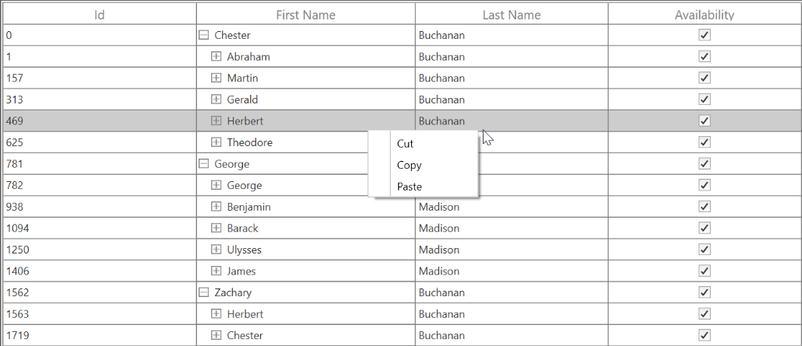
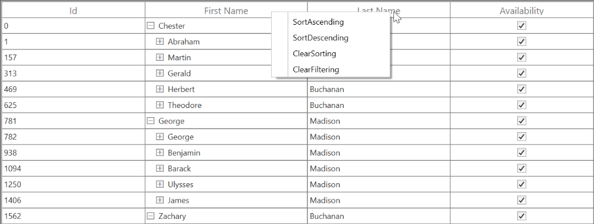
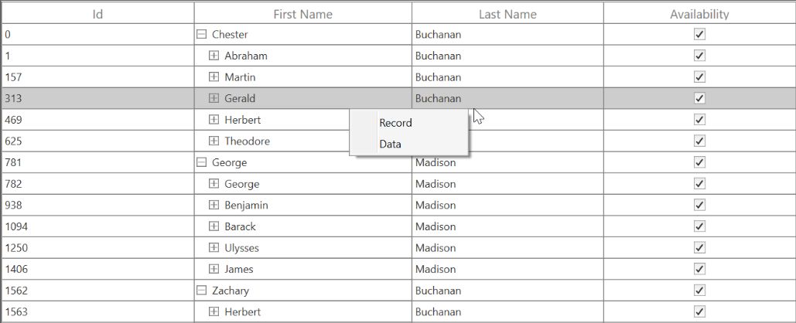
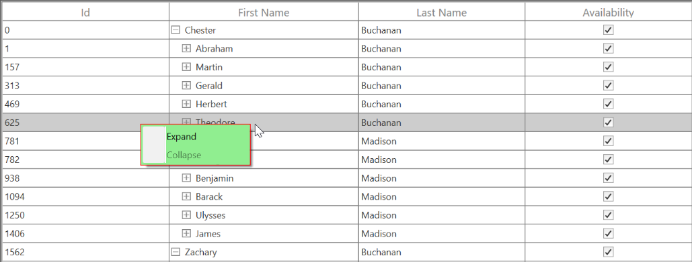

# Interactive Features in UWP SfTreeGrid

## Context menu

SfTreeGrid provides an entirely customizable menu to expose the functionalities on user interface. You can create context menus for different rows in an efficient manner.

The following code example shows the context menu with command bindings.




<ContextMenu Style="{x:Null}">
    <MenuItem Command="{Binding Copy, Source={StaticResource viewModel}}"
          CommandParameter="{Binding}" Header="Copy">
    </MenuItem>
</ContextMenu>




public class BaseCommand : ICommand
{

    #region Fields
    readonly Action<object> _execute;
    readonly Predicate<object> _canExecute;
    #endregion

    #region Constructors
    /// 

    /// Creates a new command that can always execute.
    /// 

    /// <param name="execute">The execution logic.</param>

    public BaseCommand(Action<object> execute)
        : this(execute, null)
    {
    }

    /// 

    /// Creates a new command.
    /// 

    /// <param name="execute">The execution logic.</param>
    /// <param name="canExecute">The execution status logic.</param>

    public BaseCommand(Action<object> execute, Predicate<object> canExecute)
    {

        if (execute == null)
        throw new ArgumentNullException("execute");
        _execute = execute;
        _canExecute = canExecute;
    }
    #endregion
    
    #region ICommand Members

    public bool CanExecute(object parameter)
    {
        return _canExecute == null ? true : _canExecute(parameter);
    }
    
    public event EventHandler CanExecuteChanged
    {
add { CommandManager.RequerySuggested += value; }
        remove { CommandManager.RequerySuggested -= value; }    }
    }

    public void Execute(object parameter)
    {
        _execute(parameter);
    }
    
    #endregion
}

public class EmployeeInfoViewModel : INotifyPropertyChanged
{

    public EmployeeInfoViewModel()
    {
        CopyCommand = new ContextMenuDemo.BaseCommand(ShowMessage);
    }
    
    private ICommand copyCommand

    public ICommand CopyCommand
    {
        get
        {
            return copyCommand;
        }
        set
        {
            copyCommand = value;
        }
    }
    
    public void ShowMessage(object obj)
    {

        if (obj is GridRecordContextMenuInfo)
        {
            var grid = (obj as GridRecordContextMenuInfo).DataGrid;
            grid.GridCopyPaste.Copy();
        }
    }
}




### ContextMenu based on rows

You can set different context menus for SfTreeGrid based on rows.

#### ContextMenu for nodes

You can set the context menu for data rows using the [SfTreeGrid.RecordContextMenu](https://help.syncfusion.com/cr/uwp/Syncfusion.UI.Xaml.Grid.SfGridBase.html#Syncfusion_UI_Xaml_Grid_SfGridBase_RecordContextMenu) property.
  



<syncfusion:SfTreeGrid.RecordContextMenu>
  <ContextMenu>
     <MenuItem x:Name="Cut" Header="Cut" />
     <MenuItem x:Name="Copy" Header="Copy"  />
     <MenuItem x:Name="Paste" Header="Paste" />
     <MenuItem x:Name="Delete" Header="Delete" />
  </ContextMenu>
</syncfusion:SfTreeGrid.RecordContextMenu>




this.treeGrid.RecordContextMenu = new ContextMenu();
this.treeGrid.RecordContextMenu.Items.Add(new MenuItem() { Header = "Cut" });
this.treeGrid.RecordContextMenu.Items.Add(new MenuItem() { Header = "Copy" });
this.treeGrid.RecordContextMenu.Items.Add(new MenuItem() { Header = "Paste" });




When binding the menu item using CommandBinding, you can get the command parameter as [TreeGridNodeContextMenuInfo](https://help.syncfusion.com/cr/uwp/Syncfusion.UI.Xaml.TreeGrid.TreeGridNodeContextMenuInfo.html), which contains the node of the corresponding row.




<syncfusion:SfTreeGrid.RecordContextMenu>
<MenuItem Command="{Binding Copy, Source={StaticResource viewModel}}"              CommandParameter="{Binding}"
              Header="Copy">
    </MenuItem>
</syncfusion:SfTreeGrid.RecordContextMenu>




private static void OnCopyClicked(object obj)
        {
            var contextMenuInfo = obj as TreeGridNodeContextMenuInfo;
            if (contextMenuInfo == null)
                return;
            var grid = contextMenuInfo.TreeGrid;
            grid.GridCopyOption = GridCopyOption.CopyData;
            grid.TreeGridCopyPaste.Copy();
        }




#### ContextMenu for header

You can set the context menu to header using the [SfTreeGrid.HeaderContextMenu](https://help.syncfusion.com/cr/uwp/Syncfusion.UI.Xaml.Grid.SfGridBase.html#Syncfusion_UI_Xaml_Grid_SfGridBase_HeaderContextMenu) property.




<syncfusion:SfTreeGrid.HeaderContextMenu>
    <ContextMenu>
        <MenuItem x:Name=" SortAscending " Header="SortAscending" />
        <MenuItem x:Name=" SortDescending " Header="SortDescending" />
        <MenuItem x:Name=" ClearSorting " Header="ClearSorting" />
        <MenuItem x:Name=" ClearFiltering " Header="ClearFiltering" />
    </ContextMenu>
</syncfusion:SfTreeGrid.HeaderContextMenu>




this.treeGrid.HeaderContextMenu = new ContextMenu();
this.treeGrid.HeaderContextMenu.Items.Add(new MenuItem() { Header = "SortAscending" });
this.treeGrid.HeaderContextMenu.Items.Add(new MenuItem() { Header = "SortDescending" });
this.treeGrid.HeaderContextMenu.Items.Add(new MenuItem() { Header = "ClearSorting" });
this.treeGrid.HeaderContextMenu.Items.Add(new MenuItem() { Header = "ClearFiltering " });




When binding the menu item using CommandBinding, you can get the parameter as [TreeGridColumnContextMenuInfo](https://help.syncfusion.com/cr/uwp/Syncfusion.UI.Xaml.TreeGrid.TreeGridColumnContextMenuInfo.html), which contains a particular GridColumn.




<syncfusion:SfTreeGrid.HeaderContextMenu>
    <MenuItem Command="{Binding Source={x:Static <MenuItem Command="{Binding SortAscending, Source={StaticResource viewModel}}"
              Header="Sort Ascending">
    </MenuItem>
</syncfusion:SfTreeGrid.HeaderContextMenu>




  private static void OnSortAscendingClicked(object obj)
        {
            var contextMenuInfo = obj as TreeGridColumnContextMenuInfo;
            if (contextMenuInfo == null)
                return;
            var grid = contextMenuInfo.TreeGrid;
            var column = contextMenuInfo.Column;
            grid.SortColumnDescriptions.Clear();
            grid.SortColumnDescriptions.Add(new SortColumnDescription() { ColumnName = column.MappingName, SortDirection = ListSortDirection.Ascending });
        }




### ContextMenu for expander

You can set the context menu to header using the [SfTreeGrid.ExpanderContextMenu](https://help.syncfusion.com/cr/uwp/Syncfusion.UI.Xaml.TreeGrid.SfTreeGrid.html#Syncfusion_UI_Xaml_TreeGrid_SfTreeGrid_ExpanderContextMenu) property.




<syncfusion:SfTreeGrid.ExpanderContextMenu>
    <ContextMenu>
        <MenuItem x:Name=" Expand " Header="SortAscending" />
        <MenuItem x:Name=" Collapse" Header="Collapse" />
    </ContextMenu>
</syncfusion:SfTreeGrid.ExpanderContextMenu>




this.treeGrid.ExpanderContextMenu = new ContextMenu();
this.treeGrid.ExpanderContextMenu.Items.Add(new MenuItem() { Header = " Expand" });
this.treeGrid.ExpanderContextMenu.Items.Add(new MenuItem() { Header = "Collapse" });




When binding the menu item using CommandBinding, you can get the parameter as [TreeGridNodeContextMenuInfo](https://help.syncfusion.com/cr/uwp/Syncfusion.UI.Xaml.TreeGrid.TreeGridNodeContextMenuInfo.html), which contains the expander node.




<syncfusion:SfTreeGrid.HeaderContextMenu>
<MenuItem Command="{Binding Expand, Source={StaticResource viewModel}}"    
                                  CommandParameter="{Binding}"                                
 Header="Expand" />    
</syncfusion:SfTreeGrid.HeaderContextMenu>




  private static void OnExpandClicked(object obj)
        {
            var contextMenuInfo = obj as TreeGridNodeContextMenuInfo;
            if (contextMenuInfo == null)
                return;
            var grid = contextMenuInfo.TreeGrid;
            grid.ExpandNode(contextMenuInfo.TreeNode);
        }




### Events

The [TreeGridContextMenuOpening](https://help.syncfusion.com/cr/uwp/Syncfusion.UI.Xaml.TreeGrid.SfTreeGrid.html): Occurs when opening the context menu in SfTreeGrid. [TreeGridContextMenuEventArgs](https://help.syncfusion.com/cr/uwp/Syncfusion.UI.Xaml.TreeGrid.TreeGridContextMenuEventArgs.html) has the following members, which provides information about the `TreeGridContextMenuOpening ` event:
  
[ContextMenu](https://help.syncfusion.com/cr/uwp/Syncfusion.UI.Xaml.TreeGrid.TreeGridContextMenuEventArgs.html#Syncfusion_UI_Xaml_TreeGrid_TreeGridContextMenuEventArgs_ContextMenu) – Gets the corresponding context menu. 
[ContextMenuInfo](https://help.syncfusion.com/cr/uwp/Syncfusion.UI.Xaml.TreeGrid.TreeGridContextMenuEventArgs.html#Syncfusion_UI_Xaml_TreeGrid_TreeGridContextMenuEventArgs_ContextMenuInfo) – Returns the context menu info based on the row that opens the context menu.
[ContextMenuType](https://help.syncfusion.com/cr/uwp/Syncfusion.UI.Xaml.TreeGrid.TreeGridContextMenuEventArgs.html#Syncfusion_UI_Xaml_TreeGrid_TreeGridContextMenuEventArgs__ctor_Windows_UI_Xaml_Controls_MenuFlyout_System_Object_Syncfusion_UI_Xaml_ScrollAxis_RowColumnIndex_Syncfusion_UI_Xaml_TreeGrid_ContextMenuType_System_Object_) –  Returns the type of context menu.
[RowColumnIndex](https://help.syncfusion.com/cr/uwp/Syncfusion.UI.Xaml.TreeGrid.TreeGridContextMenuEventArgs.html#Syncfusion_UI_Xaml_TreeGrid_TreeGridContextMenuEventArgs__ctor_Windows_UI_Xaml_Controls_MenuFlyout_System_Object_Syncfusion_UI_Xaml_ScrollAxis_RowColumnIndex_Syncfusion_UI_Xaml_TreeGrid_ContextMenuType_System_Object_) – RowColumnIndex of the context menu that is currently going to be opened. RowColumnIndex is updated only for the RecordContextMenu and remains empty.
[Handled](https://help.syncfusion.com/cr/uwp/Syncfusion.UI.Xaml.Grid.GridHandledEventArgs.html#Syncfusion_UI_Xaml_Grid_GridHandledEventArgs_Handled) - Indicates whether the TreeGridContextMenuOpening event is handled or not.

### Customizing ContextMenus

#### Changing the menu item when ContextMenu opening

You can use the [TreeGridContextMenuOpening](https://help.syncfusion.com/cr/uwp/Syncfusion.UI.Xaml.TreeGrid.SfTreeGrid.html) event to change the menu item when the context menu opens.




<syncfusion:SfTreeGrid.RecordContextMenu>
    <ContextMenu>
<MenuItem Command="{Binding Cut, Source={StaticResource viewModel}}"   
               CommandParameter="{Binding}"
                  Header="Cut">
        </MenuItem>
<MenuItem Command="{Binding Copy, Source={StaticResource viewModel}}"  
                CommandParameter="{Binding}"
                  Header="Copy">
        </MenuItem>
<MenuItem Command="{Binding Paste, Source={StaticResource viewModel}}" 
                 CommandParameter="{Binding}"
        Header="Paste">
        </MenuItem>
    </ContextMenu>
</syncfusion:SfTreeGrid.RecordContextMenu>




this.treeGrid.TreeGridContextMenuOpening += treeGrid_ TreeGridContextMenuOpening;

void dataGrid_ TreeGridContextMenuOpening (object sender, TreeGridContextMenuEventArgs e)
{
    e.ContextMenu.Items.Clear();

    if(e.ContextMenuType == ContextMenuType.RecordCell)
    {
        e.ContextMenu.Items.Add(new MenuItem() { Header="Record"});
        e.ContextMenu.Items.Add(new MenuItem() { Header = "Data" });
    }
}




####  Changing background to ContextMenu

You can change the appearance of the context menu by customizing the style with TargetType as ContextMenu.




<ContextMenu>
    <MenuItem x:Name="Cut" Header="Expand />
    <MenuItem x:Name="Copy" Header="Collapse" />
</ContextMenu>




