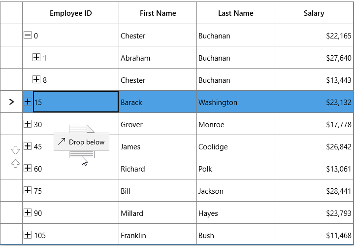
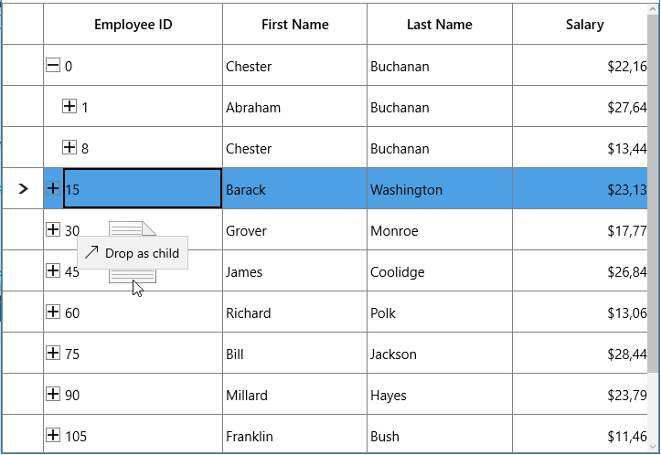
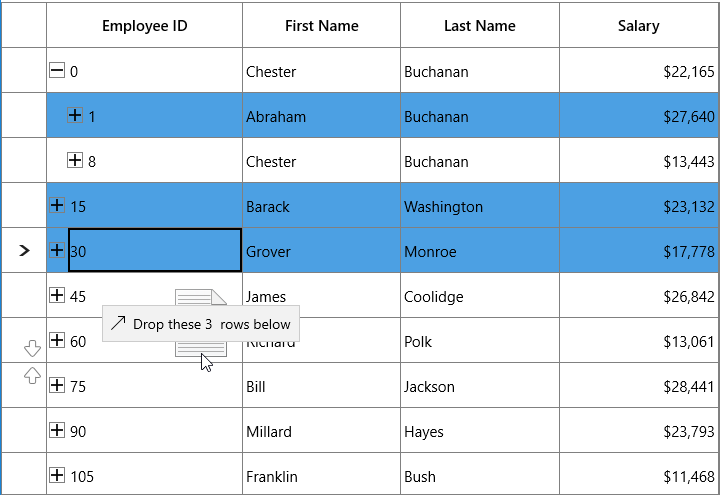

# Row drag and drop in UWP TreeGrid

You can allow end-users to drag and drop the rows in SfTreeGrid and between two SfTreeGrid by setting [SfTreeGrid.AllowDraggingRows](https://help.syncfusion.com/cr/uwp/Syncfusion.UI.Xaml.TreeGrid.SfTreeGrid.html#Syncfusion_UI_Xaml_TreeGrid_SfTreeGrid_AllowDraggingRows) to `true`.It is also possible to drag and drop to and from any other control.



<syncfusion:SfTreeGrid Name="treeGrid" 
                       AllowDraggingRows="True"
                       ChildPropertyName="Children"
                       ItemsSource="{Binding PersonDetails}" />


treeGrid.AllowDraggingRows = true;



While dropping, the dragged node(s) can be added above or below or as a child node based on its drop position. For example, if you drop at the bottom of node, it will be added below the node and if you are dropping over the node, the it will be added as child of that node.

## Auto expanding the node on drag over

When drag over the tree node, if drop position is “Drop as child”, then you can auto expand the corresponding tree node by setting  [TreeGridRowDragDropController.CanAutoExpand](https://help.syncfusion.com/cr/uwp/Syncfusion.UI.Xaml.TreeGrid.TreeGridRowDragDropController.html#Syncfusion_UI_Xaml_TreeGrid_TreeGridRowDragDropController_CanAutoExpand) as `true`. It is also possible to control the delay in expanding the node when drag over using [TreeGridRowDragDropController.AutoExpandDelay](https://help.syncfusion.com/cr/uwp/Syncfusion.UI.Xaml.TreeGrid.TreeGridRowDragDropController.html#Syncfusion_UI_Xaml_TreeGrid_TreeGridRowDragDropController_AutoExpandDelay) property.  Its default value in 3 sec.



treeGrid.RowDragDropController.CanAutoExpand = true;
treeGrid.RowDragDropController.AutoExpandDelay = new TimeSpan(0, 0, 2);



N> When drop position is “Drop as child”, drag indicators will not be shown.

## Dragging multiple nodes

SfTreeGrid allows user to drag multiple selected nodes. You can enable multiple selection by setting  [SfTreeGrid.SelectionMode](https://help.syncfusion.com/cr/uwp/Syncfusion.UI.Xaml.Grid.SfGridBase.html#Syncfusion_UI_Xaml_Grid_SfGridBase_SelectionMode) as `Multiple` or `Extended`.  

## Drag and Drop between TreeGrids

SfTreeGrid provides build built in support for drag and drop nodes between SfTreeGrid’s.

### Disabling drag and drop between TreeGrid

If [SfTreeGrid.AllowDraggingRows](https://help.syncfusion.com/cr/uwp/Syncfusion.UI.Xaml.TreeGrid.SfTreeGrid.html#Syncfusion_UI_Xaml_TreeGrid_SfTreeGrid_AllowDraggingRows) is set to `true`, you can drag and drop nodes between TreeGrids and within TreeGrid. If you want to disable drag and drop from one TreeGrid to another TreeGrid, you need to override target TreeGrid’s [GetDropPosition](https://help.syncfusion.com/cr/uwp/Syncfusion.UI.Xaml.TreeGrid.TreeGridRowDragDropController.html#Syncfusion_UI_Xaml_TreeGrid_TreeGridRowDragDropController_GetDropPosition_Windows_UI_Xaml_DragEventArgs_Syncfusion_UI_Xaml_ScrollAxis_RowColumnIndex_) method in [TreeGridRowDragDropController](https://help.syncfusion.com/cr/uwp/Syncfusion.UI.Xaml.TreeGrid.TreeGridRowDragDropController.html) class.



public class TreeGridRowDragDropControllerExt : TreeGridRowDragDropController
{

    public TreeGridRowDragDropControllerExt(SfTreeGrid treeGrid) : base(treeGrid)
    {
    }

    protected override DropPosition GetDropPosition(DragEventArgs args, RowColumnIndex rowColumnIndex)
    {
        SfTreeGrid sourceTreeGrid = null;

        if (args.DataView.Properties.ContainsKey("SourceTreeGrid"))
            sourceTreeGrid = args.DataView.Properties["SourceTreeGrid"] as SfTreeGrid;

        // Disable drop operation if source tree grid is different.

        if (sourceTreeGrid != TreeGrid)
            return DropPosition.None;
        return base.GetDropPosition(args, rowColumnIndex);
    }
}
treeGrid.RowDragDropController = new TreeGridRowDragDropControllerExt(treeGrid);



If source tree grid and target tree grid are different, drop operation is disabled.

## Customizing Row drag and drop

SfTreeGrid processes row drag and drop operations in [TreeGridRowDragDropController](https://help.syncfusion.com/cr/uwp/Syncfusion.UI.Xaml.TreeGrid.TreeGridRowDragDropController.html) class. You can customize the row drag and drop operations by overriding `TreeGridRowDragDropController` and set it to[SfTreeGrid.RowDragDropController](https://help.syncfusion.com/cr/uwp/Syncfusion.UI.Xaml.TreeGrid.SfTreeGrid.html#Syncfusion_UI_Xaml_TreeGrid_SfTreeGrid_RowDragDropController).

### Disable dragging of certain nodes

If you want to restrict the dragging of specific node, you need to override [ProcessOnDragStarting](https://help.syncfusion.com/cr/uwp/Syncfusion.UI.Xaml.TreeGrid.TreeGridRowDragDropController.html#Syncfusion_UI_Xaml_TreeGrid_TreeGridRowDragDropController_ProcessOnDragStarting_Windows_UI_Xaml_DragStartingEventArgs_Syncfusion_UI_Xaml_ScrollAxis_RowColumnIndex_) method in [TreeGridRowDragDropController](https://help.syncfusion.com/cr/uwp/Syncfusion.UI.Xaml.TreeGrid.TreeGridRowDragDropController.html) class.

Here, drag operation is disabled for root nodes.



public class TreeGridRowDragDropControllerExt : TreeGridRowDragDropController
{

    public TreeGridRowDragDropControllerExt(SfTreeGrid treeGrid) : base(treeGrid)
    {
    }

    protected override void ProcessOnDragStarting(DragStartingEventArgs args, RowColumnIndex rowColumnIndex)
    {
        base.ProcessOnDragStarting(args, rowColumnIndex);

        // Skip dragging of root nodes.

        if (args.Data.Properties.ContainsKey("Nodes"))
        {
            var nodes = args.Data.Properties["Nodes"] as ObservableCollection<TreeNode>;
            var node = nodes.FirstOrDefault(n => n.Level == 0);

            if (node != null)
                args.Cancel = true;
        }
    }         
}



### Disable drop over specific node

If you want to restrict the drop over specific node, you need to override [GetDropPosition](https://help.syncfusion.com/cr/uwp/Syncfusion.UI.Xaml.TreeGrid.TreeGridRowDragDropController.html#Syncfusion_UI_Xaml_TreeGrid_TreeGridRowDragDropController_GetDropPosition_Windows_UI_Xaml_DragEventArgs_Syncfusion_UI_Xaml_ScrollAxis_RowColumnIndex_) method in [TreeGridRowDragDropController](https://help.syncfusion.com/cr/uwp/Syncfusion.UI.Xaml.TreeGrid.TreeGridRowDragDropController.html) class.

Here, drop operation is disabled on leaf nodes.



public class TreeGridRowDragDropControllerExt : TreeGridRowDragDropController
{

    public TreeGridRowDragDropControllerExt(SfTreeGrid treeGrid) : base(treeGrid)
    {
    }

    protected override DropPosition GetDropPosition(DragEventArgs args, RowColumnIndex rowColumnIndex)
    {
        var nodeIndex = TreeGrid.ResolveToNodeIndex(rowColumnIndex.RowIndex);
        var node = TreeGrid.View.GetNodeAt(nodeIndex);

        // Disable drop on leaf nodes.

        if (!node.HasChildNodes)
            return DropPosition.None;
        return base.GetDropPosition(args, rowColumnIndex);
    }
}

treeGrid.RowDragDropController = new TreeGridRowDragDropControllerExt(treeGrid);



### Customizing Drag UI Text

You can customize the drag UI text by overriding the [ProcessOnDragOver](https://help.syncfusion.com/cr/uwp/Syncfusion.UI.Xaml.TreeGrid.TreeGridRowDragDropController.html#Syncfusion_UI_Xaml_TreeGrid_TreeGridRowDragDropController_ProcessOnDragOver_Windows_UI_Xaml_DragEventArgs_Syncfusion_UI_Xaml_ScrollAxis_RowColumnIndex_) method in [TreeGridRowDragDropController](https://help.syncfusion.com/cr/uwp/Syncfusion.UI.Xaml.TreeGrid.TreeGridRowDragDropController.html) class.

 Here, drag UI text is localized based on German language.



public class TreeGridRowDragDropControllerExt : TreeGridRowDragDropController
{

    public TreeGridRowDragDropControllerExt(SfTreeGrid treeGrid) : base(treeGrid)
    {
    }

    protected override void ProcessOnDragOver(DragEventArgs args, RowColumnIndex rowColumnIndex)
    {
        base.ProcessOnDragOver(args, rowColumnIndex);
        var dropPosition = GetDropPosition(args, rowColumnIndex);
        
        if (dropPosition == DropPosition.DropAbove)
            args.DragUIOverride.Caption = "rube fallen";
    }
}
treeGrid.RowDragDropController = new TreeGridRowDragDropControllerExt(treeGrid);



### Customizing dragging nodes

While dragging, all selected nodes will be added to dragging nodes collection. If you want to customize the dragging nodes collection, you need to override [ProcessOnDragOver](https://help.syncfusion.com/cr/uwp/Syncfusion.UI.Xaml.TreeGrid.TreeGridRowDragDropController.html#Syncfusion_UI_Xaml_TreeGrid_TreeGridRowDragDropController_ProcessOnDragOver_Windows_UI_Xaml_DragEventArgs_Syncfusion_UI_Xaml_ScrollAxis_RowColumnIndex_) method in [TreeGridRowDragDropController](https://help.syncfusion.com/cr/uwp/Syncfusion.UI.Xaml.TreeGrid.TreeGridRowDragDropController.html) class.



public class TreeGridRowDragDropControllerExt : TreeGridRowDragDropController
{

    public TreeGridRowDragDropControllerExt(SfTreeGrid treeGrid) : base(treeGrid)
    {
    }

    protected override void ProcessOnDragStarting(DragStartingEventArgs args, RowColumnIndex rowColumnIndex)
    {
        var nodes = new ObservableCollection<TreeNode>();
        var node = this.TreeGrid.GetNodeAtRowIndex(rowColumnIndex.RowIndex);

        if (node == null)
            return;
        nodes.Add(node);
        args.Data.Properties.Add("Nodes", nodes);
        args.Data.Properties.Add("SourceTreeGrid", TreeGrid);
        args.Data.SetText(StandardDataFormats.Text);
        args.DragUI.SetContentFromDataPackage();
    }
}
treeGrid.RowDragDropController = new TreeGridRowDragDropControllerExt(treeGrid);



Here, even though multiple nodes are selected, only dragged node will be added to dragging nodes collection.

## Drag and Drop between ListView and TreeGrid

You can drag the item from ListView and drop into TreeGrid. For this, you need to override [GetDropPosition](https://help.syncfusion.com/cr/uwp/Syncfusion.UI.Xaml.TreeGrid.TreeGridRowDragDropController.html#Syncfusion_UI_Xaml_TreeGrid_TreeGridRowDragDropController_GetDropPosition_Windows_UI_Xaml_DragEventArgs_Syncfusion_UI_Xaml_ScrollAxis_RowColumnIndex_),  [ProcessOnDragOver](https://help.syncfusion.com/cr/uwp/Syncfusion.UI.Xaml.TreeGrid.TreeGridRowDragDropController.html#Syncfusion_UI_Xaml_TreeGrid_TreeGridRowDragDropController_ProcessOnDragOver_Windows_UI_Xaml_DragEventArgs_Syncfusion_UI_Xaml_ScrollAxis_RowColumnIndex_), [ProcessOnDrop](https://help.syncfusion.com/cr/uwp/Syncfusion.UI.Xaml.TreeGrid.TreeGridRowDragDropController.html#Syncfusion_UI_Xaml_TreeGrid_TreeGridRowDragDropController_ProcessOnDrop_Windows_UI_Xaml_DragEventArgs_Syncfusion_UI_Xaml_ScrollAxis_RowColumnIndex_) methods in [TreeGridRowDragDropController](https://help.syncfusion.com/cr/uwp/Syncfusion.UI.Xaml.TreeGrid.TreeGridRowDragDropController.html) class.

In ListView, you need to use DragItemsStarting event and add dragged item.



listView.CanDragItems = true;          
listView.DragItemsStarting += ListView_DragItemsStarting;
listView.DragItemsCompleted += ListView_DragItemsCompleted;

private void ListView_DragItemsStarting(object sender, DragItemsStartingEventArgs e)
{
    e.Data.Properties.Add("DraggedItem", listView.SelectedItem);
    e.Data.SetText(StandardDataFormats.Text);
}

private void ListView_DragItemsCompleted(ListViewBase sender, DragItemsCompletedEventArgs args)
{

    foreach (var item in args.Items)
    {
        (listView.ItemsSource as ObservableCollection<PersonInfo>).Remove(item as PersonInfo);
    }
}





public class TreeGridRowDragDropControllerExt : TreeGridRowDragDropController
{

    public TreeGridRowDragDropControllerExt(SfTreeGrid treeGrid) : base(treeGrid)
    {
    }

    protected override void ProcessOnDrop(DragEventArgs args, RowColumnIndex rowColumnIndex)
    {
        this.TreeGrid.AutoScroller.AutoScrolling = AutoScrollOrientation.None;
        var dropPosition = GetDropPosition(args, rowColumnIndex);

        if (dropPosition != DropPosition.None && rowColumnIndex.RowIndex != -1)
        {
            var draggedItem = GetDraggedItem(args);

            if (this.TreeGrid.View is TreeGridNestedView)
            {
                var treeNode = this.TreeGrid.GetNodeAtRowIndex(rowColumnIndex.RowIndex);

                if (treeNode == null)
                    return;
                var data = treeNode.Item;
                TreeGrid.SelectionController.SuspendUpdates();
                var itemIndex = -1;

                TreeNode parentNode = null;

                if (dropPosition == DropPosition.DropBelow || dropPosition == DropPosition.DropAbove)
                    parentNode = treeNode.ParentNode;

                else if (dropPosition == DropPosition.DropAsChild)
                {

                    if (!treeNode.IsExpanded)
                        TreeGrid.ExpandNode(treeNode);
                    parentNode = treeNode;
                }
                IList sourceCollection = null;

                if (dropPosition == DropPosition.DropBelow || dropPosition == DropPosition.DropAbove)
                {

                    if (treeNode.ParentNode != null)
                    {
                        var collection = TreeGrid.View.GetPropertyAccessProvider().GetValue(treeNode.ParentNode.Item, TreeGrid.ChildPropertyName) as IEnumerable;
                        sourceCollection = GetSourceListCollection(collection);
                    }

                    else
                    {
                        sourceCollection = GetSourceListCollection(TreeGrid.View.SourceCollection);
                    }
                    itemIndex = sourceCollection.IndexOf(data);

                    if (dropPosition == DropPosition.DropBelow)
                    {
                        itemIndex += 1;
                    }
                }

                else if (dropPosition == DropPosition.DropAsChild)
                {
                    var collection = TreeGrid.View.GetPropertyAccessProvider().GetValue(data, TreeGrid.ChildPropertyName) as IEnumerable;
                    sourceCollection = GetSourceListCollection(collection);
                    
                    if (sourceCollection == null)
                    {
                        var list = data.GetType().GetProperty(TreeGrid.ChildPropertyName).PropertyType.CreateNew() as IList;

                        if (list != null)
                        {
                            TreeGrid.View.GetPropertyAccessProvider().SetValue(treeNode.Item, TreeGrid.ChildPropertyName, list);
                            sourceCollection = list;
                        }
                    }
                    itemIndex = sourceCollection.Count;
                }
                sourceCollection.Insert(itemIndex, draggedItem);
                TreeGrid.SelectionController.ResumeUpdates();
                (TreeGrid.SelectionController as TreeGridRowSelectionController).RefreshSelection();
            }
        }
        CloseDragIndicators();

    }
  
    protected override DropPosition GetDropPosition(DragEventArgs args, RowColumnIndex rowColumnIndex)
    {
        bool canDrop = true;
        var p = args.GetPosition(this.TreeGrid);
        var treeNode = this.TreeGrid.GetNodeAtRowIndex(rowColumnIndex.RowIndex);
        ScrollAxisRegion columnRegion = ScrollAxisRegion.Body;
        var treeGridPanel = TreeGrid.GetTreePanel();
  
        if (treeGridPanel.FrozenColumns > 0)
            columnRegion = ScrollAxisRegion.Header;
        var rowRect = treeGridPanel.RangeToRect(ScrollAxisRegion.Body, columnRegion, rowColumnIndex, true, false);
        var node = treeNode;

        if (!canDrop)
            return DropPosition.None;
  
        else if (p.Y > rowRect.Y + 15 && p.Y < rowRect.Y + 35)
        {
            return DropPosition.DropAsChild;
        }
  
        else if (p.Y < rowRect.Y + 15)
        {
            return DropPosition.DropAbove;
        }
  
        else if (p.Y > rowRect.Y + 35)
        {
            return DropPosition.DropBelow;
        }
  
        else
            return DropPosition.Default;
    }

    protected override void ProcessOnDragOver(DragEventArgs args, RowColumnIndex rowColumnIndex)
    {
        autoExpandNode = null;
        var node = this.TreeGrid.GetNodeAtRowIndex(rowColumnIndex.RowIndex);
        var draggedItem = GetDraggedItem(args);
        var dropPosition = GetDropPosition(args, rowColumnIndex);

        if (draggedItem == null)
            return;

        if (dropPosition == DropPosition.None || dropPosition == DropPosition.Default)
        {
            CloseDragIndicators();
            args.AcceptedOperation = DataPackageOperation.None;
            args.DragUIOverride.Caption = "Can't drop here";
            return;
        }

        else if (dropPosition == DropPosition.DropAbove)
        {
            args.DragUIOverride.Caption = "Drop above";
        }

        else if (dropPosition == DropPosition.DropAsChild)
        {
            args.DragUIOverride.Caption = "Drop as child";
        }

        else
        {
            args.DragUIOverride.Caption = "Drop below";
        }
        args.AcceptedOperation = DataPackageOperation.Move;
        ShowDragIndicators(dropPosition, rowColumnIndex);
        args.Handled = true;
    }

    private object GetDraggedItem(DragEventArgs dragEventArgs)
    {

        if (dragEventArgs.DataView.Properties.ContainsKey("DraggedItem"))
            return dragEventArgs.DataView.Properties["DraggedItem"];

        else
            return null;
    }

    internal IList GetSourceListCollection(IEnumerable collection = null)
    {
        IList list = null;

        if (collection == null)
            collection = TreeGrid.View.SourceCollection;

        if ((collection as IList) != null)
        {
            list = collection as IList;
        }
        return list;
    }
}



After dropping in tree grid, dragged item is added to TreeGrid based on the dropped position.
You can download the sample from [here](https://www.syncfusion.com/downloads/support/directtrac/general/ze/DragAndDrop_ListViewAndTreeGrid796052425).
