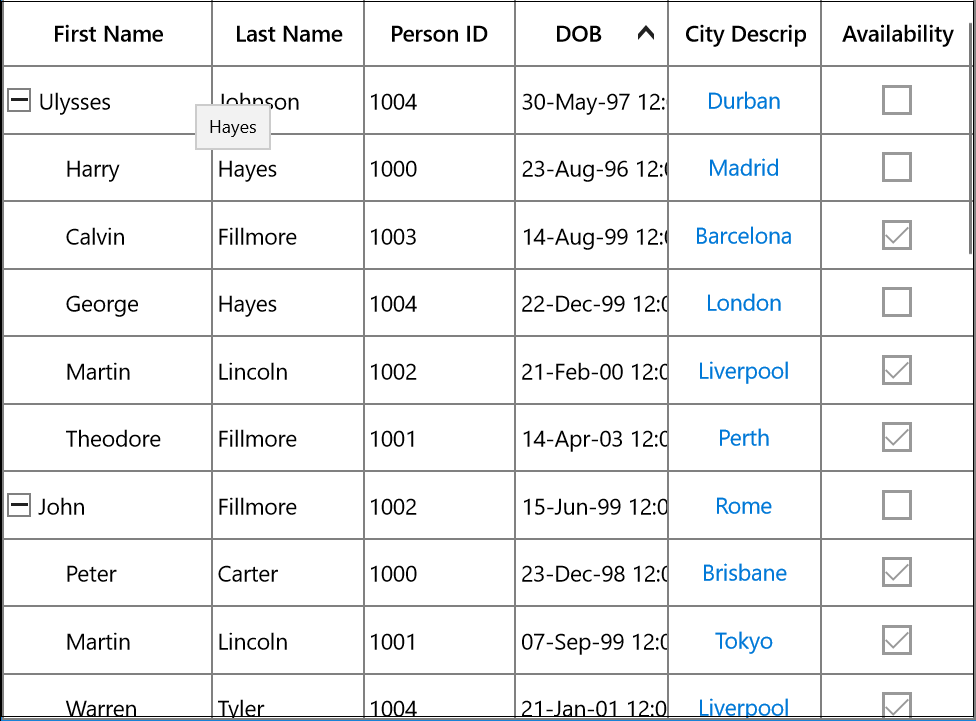
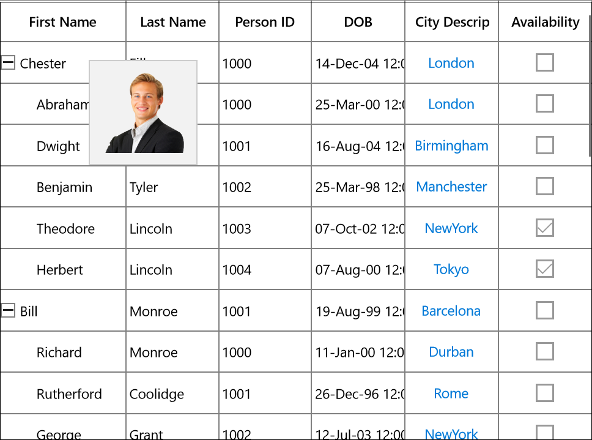
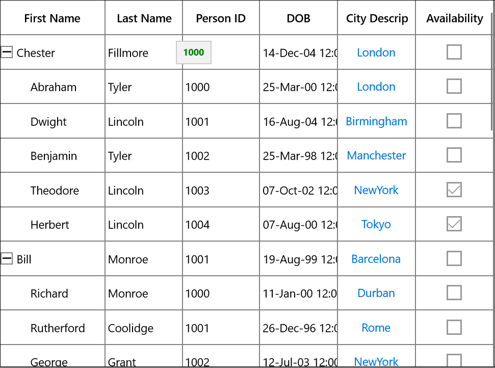
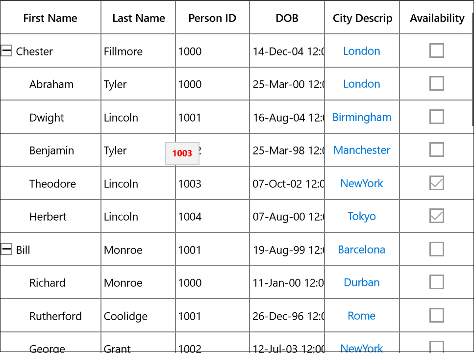

# Tooltip

Tooltip supports showing the pop-up window that displays the information when the mouse hovers over a cell of the SfTreeGrid.

### Record cell tooltip

You can enable tooltip for the TreeGridCell by setting the [SfTreeGrid.ShowToolTip](https://help.syncfusion.com/cr/uwp/Syncfusion.UI.Xaml.Grid.SfGridBase.html#Syncfusion_UI_Xaml_Grid_SfGridBase_ShowToolTip "") property to true.



<syncfusion:SfTreeGrid Name="treeGrid" 
                       AutoExpandMode="RootNodesExpanded"
                       AutoGenerateColumns="False" 
                       ShowToolTip="True"
                       ChildPropertyName="Children"
                       ColumnSizer="Star"
                       ItemsSource="{Binding EmployeeDetails}">



this.treeGrid.ShowToolTip = true;




You can enable the tooltip of a particular column by setting the [TreeGridColumn.ShowToolTip](https://help.syncfusion.com/cr/uwp/Syncfusion.UI.Xaml.Grid.GridColumnBase.html#Syncfusion_UI_Xaml_Grid_GridColumnBase_ShowToolTip "") property to true.



<syncfusion:SfTreeGrid.Columns>
        <syncfusion:TreeGridTextColumn HeaderText="First Name" 
                                       MappingName="FirstName" 
                                       ShowHeaderToolTip="True" />
 </syncfusion:SfTreeGrid.Columns>



this.treeGrid.Columns["FirstName"].ShowToolTip = true;
this.treeGrid.Columns["LastName"].ShowToolTip = true;




**NOTE**
It has higher priority than [SfTreeGrid.ShowToolTip](https://help.syncfusion.com/cr/uwp/Syncfusion.UI.Xaml.Grid.SfGridBase.html#Syncfusion_UI_Xaml_Grid_SfGridBase_ShowToolTip "")

### Header tooltip

You can enable the tooltip of a header cell by setting the [TreeGridColumn.ShowHeaderToolTip](https://help.syncfusion.com/cr/uwp/Syncfusion.UI.Xaml.Grid.GridColumnBase.html#Syncfusion_UI_Xaml_Grid_GridColumnBase_ShowHeaderToolTip) property to true.



<syncfusion:SfTreeGrid.Columns>
                <syncfusion:TreeGridTextColumn 
                                     HeaderText="First Name" 
                                     MappingName="FirstName" 
                                     ShowHeaderToolTip="True" />
</syncfusion:SfTreeGrid.Columns>



this.treeGrid.Columns["FirstName"].ShowHeaderToolTip = true;




### Tooltip customization

You can customize the template of ToolTip by using the [TreeGridColumn.ToolTipTemplate](https://help.syncfusion.com/cr/uwp/Syncfusion.UI.Xaml.Grid.GridColumnBase.html#Syncfusion_UI_Xaml_Grid_GridColumnBase_ToolTipTemplate) and [TreeGridColumn.ToolTipTemplateSelector](https://help.syncfusion.com/cr/uwp/Syncfusion.UI.Xaml.Grid.GridColumnBase.html#Syncfusion_UI_Xaml_Grid_GridColumnBase_ToolTipTemplateSelector) properties. 

#### Customize the tooltip using ToolTipTemplate

You can customize appearance of the tooltip of a particular column by setting the TreeGridColumn.ToolTipTemplate. You can also customize appearance of the header tooltip of a particular column by using the [TreeGridColumn.HeaderToolTipTemplate ](https://help.syncfusion.com/cr/uwp/Syncfusion.UI.Xaml.Grid.GridColumnBase.html#Syncfusion_UI_Xaml_Grid_GridColumnBase_HeaderToolTipTemplate "")property.
The ToolTipTemplate receives the underlying data object as DataContext by default. You can set the [TreeGridColumn.SetCellBoundToolTip](https://help.syncfusion.com/cr/uwp/Syncfusion.UI.Xaml.Grid.GridColumnBase.html#Syncfusion_UI_Xaml_Grid_GridColumnBase_SetCellBoundToolTip) to true to change the DataContext of the tooltip template where it sets the DataContext as DataContextHelper. The [TreeGridDataContextHelper](https://help.syncfusion.com/cr/uwp/Syncfusion.UI.Xaml.TreeGrid.Cells.TreeGridDataContextHelper.html# "") has the following properties to reuse the same template for all the columns:
* [Record:](https://help.syncfusion.com/cr/uwp/Syncfusion.UI.Xaml.Grid.Cells.DataContextHelper.html#Syncfusion_UI_Xaml_Grid_Cells_DataContextHelper_Record) Gets the underlying data record of a row which has the cell.
* [Value:](https://help.syncfusion.com/cr/uwp/Syncfusion.UI.Xaml.Grid.Cells.DataContextHelper.html#Syncfusion_UI_Xaml_Grid_Cells_DataContextHelper_Value) Gets the underlying value of a cell.




<Page.Resources>
        <local:StringToImageConverter x:Key="ImageConverter" />
        <DataTemplate x:Key="TemplateToolTip">
            <Image Height="100" Width="100" Source="{Binding LastName, Converter= {StaticResource ImageConverter}}" />
        </DataTemplate>
 </Page.Resources>

<syncfusion:TreeGridTextColumn HeaderText="Last Name"
                               MappingName="LastName"  
                               ShowToolTip="True" 
                               ToolTipTemplate="{StaticResource TemplateToolTip}"/>



public class StringToImageConverter : IValueConverter
{
       public object Convert(object value, Type targetType, object parameter, string language)
        {
            string image = value.ToString();
            return @"Assets\" + image + @".png";
        }

        public object ConvertBack(object value, Type targetType, object parameter, string language)
        {
            return value;
        }
}




You can get the sample [here](http://www.syncfusion.com/downloads/support/directtrac/general/ze/ToolTipTemplateDemo298673222.zip# "").

#### Customize the ToolTip with ToolTipTemplateSelector

Different tooltip templates can be loaded conditionally in same column based on the data by setting the [TreeGridColumn.ToolTipTemplateSelector ](https://help.syncfusion.com/cr/uwp/Syncfusion.UI.Xaml.Grid.GridColumnBase.html#Syncfusion_UI_Xaml_Grid_GridColumnBase_ToolTipTemplateSelector "")property.




<Page.Resources>
        <DataTemplate x:Key="ToolTip1">
            <Grid>
                <TextBlock Text="{Binding Record.Id}" FontWeight="Bold" Foreground="Red" />
            </Grid>
        </DataTemplate>
        <DataTemplate x:Key="ToolTip2">
            <Grid>
                <TextBlock Text="{Binding Record.Id}" FontWeight="Bold" Foreground="Green"/>
            </Grid>
        </DataTemplate>
 </Page.Resources>
 
<syncfusion:TreeGridTextColumn  HeaderText="Person ID" 
                                MappingName="Id"
                                ShowToolTip="True"  
                                SetCellBoundToolTip="True" >
     <syncfusion:TreeGridTextColumn.ToolTipTemplateSelector>
         <local:ToolTipTemplateSelector  AlternateTemplate="{StaticResource ToolTip2}"  
                            DefaultTemplate="{StaticResource ToolTip1}" />
      </syncfusion:TreeGridTextColumn.ToolTipTemplateSelector>
</syncfusion:TreeGridTextColumn>




The following image shows the DefaultTemplate applied through ToolTipTemplateSelector.

The following image shows the AlternateTemplate applied through  ToolTipTemplateSelector.

You can get the sample [here](http://www.syncfusion.com/downloads/support/directtrac/general/ze/ToolTipTemplateSelectorDemo-651257281.zip# "").

### Events

### CellToolTipOpening event

The [CellToolTipOpening ](https://help.syncfusion.com/cr/uwp/Syncfusion.UI.Xaml.TreeGrid.SfTreeGrid.html)event occurs when any tooltip of the cell is opened. The CellToolTipOpening event receives the [TreeGridCellToolTipOpeningEventArgs ](https://help.syncfusion.com/cr/uwp/Syncfusion.UI.Xaml.TreeGrid.TreeGridCellToolTipOpeningEventArgs.html# "")as argument which has the following properties:
* [Column:](https://help.syncfusion.com/cr/uwp/Syncfusion.UI.Xaml.Grid.CellToolTipOpeningEventArgs.html#Syncfusion_UI_Xaml_Grid_CellToolTipOpeningEventArgs_Column) Gets the hovered cell column in the SfTreeGrid.
* [Node:](https://help.syncfusion.com/cr/uwp/Syncfusion.UI.Xaml.TreeGrid.TreeGridCellToolTipOpeningEventArgs.html#Syncfusion_UI_Xaml_TreeGrid_TreeGridCellToolTipOpeningEventArgs_Node) Gets the hovered cell node.
* [Record:](https://help.syncfusion.com/cr/uwp/Syncfusion.UI.Xaml.Grid.CellToolTipOpeningEventArgs.html#Syncfusion_UI_Xaml_Grid_CellToolTipOpeningEventArgs_Record) Gets the data context of hovered cell.
* [RowColumnIndex:](https://help.syncfusion.com/cr/uwp/Syncfusion.UI.Xaml.Grid.CellToolTipOpeningEventArgs.html#Syncfusion_UI_Xaml_Grid_CellToolTipOpeningEventArgs_RowColumnIndex) Gets the row and column index of the hovered cell.
* [ToolTip:](https://help.syncfusion.com/cr/uwp/Syncfusion.UI.Xaml.Grid.CellToolTipOpeningEventArgs.html#Syncfusion_UI_Xaml_Grid_CellToolTipOpeningEventArgs_ToolTip) Gets the tooltip of the hovered cells.



<syncfusion:SfTreeGrid Name="treeGrid" 
                       AutoExpandMode="RootNodesExpanded"
                       CellToolTipOpening="TreeGrid_CellToolTipOpening"
                       AutoGenerateColumns="False" 
                       ChildPropertyName="Children"
                       ColumnSizer="Star"
                       ItemsSource="{Binding EmployeeDetails}">



this.treeGrid.CellToolTipOpening += TreeGrid_CellToolTipOpening;

private void TreeGrid_CellToolTipOpening(object sender, Syncfusion.UI.Xaml.TreeGrid.TreeGridCellToolTipOpeningEventArgs e)
{

}



