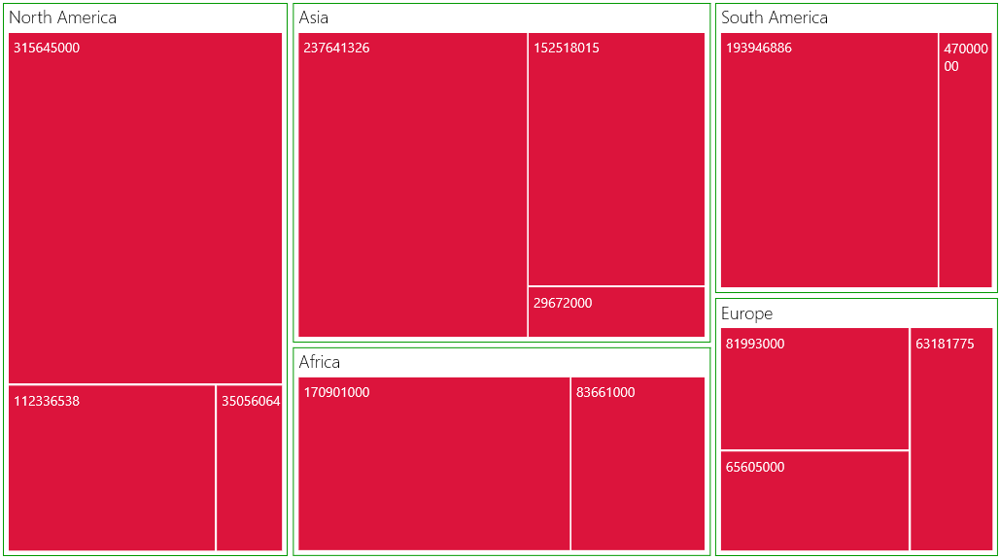
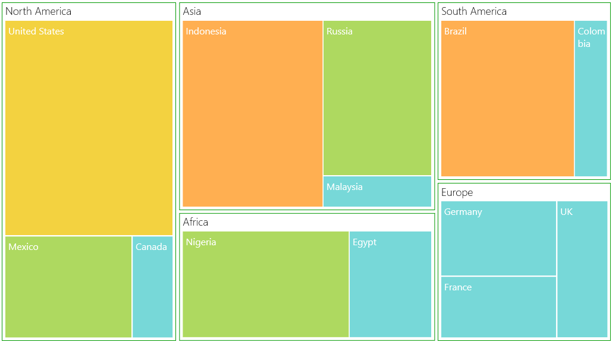
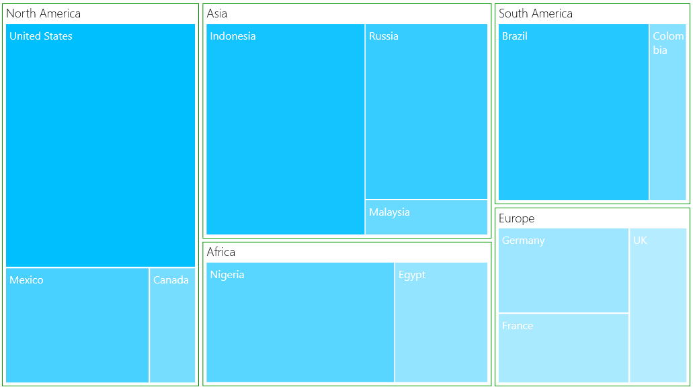
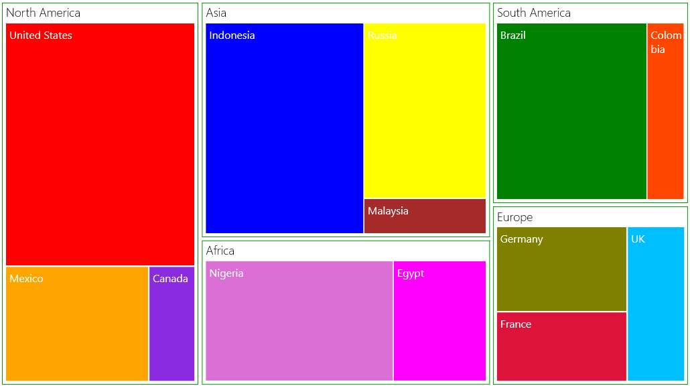

# ColorMapping in UWP TreeMap (SfTreeMap)

ColorMapping is categorized into four different types such as,

* UniColorMapping
* RangeBrushColorMapping
* DesaturationColorMapping
* PaletteColorMapping

## ColorValuePath

`ColorValuePath` of SfTreeMap is a path to a field on the source object, which serves as the "Color" of the object.

### TreeMap ColorMapping:

The leaf nodes of TreeMap can be colored by setting LeafColorMapping of TreeMap.

## UniColorMapping

TreeMap leaf nodes can be colored with the help of Color property specified using UniColorMapping.

Code Sample:



  <syncfusion:SfTreeMap ItemsSource="{Binding PopulationDetails}" 

                       WeightValuePath="Population"                              

                       ColorValuePath="Growth">

            <syncfusion:SfTreeMap.LeafColorMapping>

                <syncfusion:UniColorMapping Color="Crimson"/>

            </syncfusion:SfTreeMap.LeafColorMapping>

            <syncfusion:SfTreeMap.Levels>
                <syncfusion:TreeMapFlatLevel GroupPath="Continent" HeaderHeight="25" GroupGap="5" GroupPadding="5" GroupBackground="Transparent" GroupBorderBrush="#009900" GroupBorderThickness="1">
                    <syncfusion:TreeMapFlatLevel.HeaderTemplate>
                        <DataTemplate>
                            <TextBlock Text="{Binding Header}" Margin="5,0,0,0" Foreground="black" FontSize="18" FontWeight="Light" HorizontalAlignment="Left" VerticalAlignment="Center"/>
                        </DataTemplate>
                    </syncfusion:TreeMapFlatLevel.HeaderTemplate>
                </syncfusion:TreeMapFlatLevel>
            </syncfusion:SfTreeMap.Levels>

        </syncfusion:SfTreeMap>



Leaf Nodes colored by using UniColorMapping
{:.caption}

## RangeBrushColorMapping

The leaf nodes of TreeMap can be colored based upon the range (i.e., From and To) and Brush specified using RangeBrush collection of RangeBrushColorMapping.

Code Sample:



  
        <syncfusion:SfTreeMap ItemsSource="{Binding PopulationDetails}" 

                      WeightValuePath="Population" ColorValuePath="Growth">

            <syncfusion:SfTreeMap.LeafItemSettings>
                <syncfusion:LeafItemSettings>
                    <syncfusion:LeafItemSettings.LabelTemplate>
                        <DataTemplate>
                            <TextBlock Text="{Binding Data.Country}" TextWrapping="Wrap" Foreground="White" FontSize="16" FontWeight="Normal" HorizontalAlignment="Left" VerticalAlignment="Top" Margin="5,5,0,0"/>
                        </DataTemplate>
                    </syncfusion:LeafItemSettings.LabelTemplate>
                </syncfusion:LeafItemSettings>
            </syncfusion:SfTreeMap.LeafItemSettings>

            <syncfusion:SfTreeMap.LeafColorMapping>

                <syncfusion:RangeBrushColorMapping>

                    <syncfusion:RangeBrushColorMapping.Brushes>

                        <syncfusion:RangeBrush From="0" To="1" Color="#77D8D8"/>

                        <syncfusion:RangeBrush From="1" To="2" Color="#AED960"/>

                        <syncfusion:RangeBrush From="2" To="3" Color="#FFAF51"/>

                        <syncfusion:RangeBrush From="3" To="4" Color="#F3D240"/>

                    </syncfusion:RangeBrushColorMapping.Brushes>

                </syncfusion:RangeBrushColorMapping>

            </syncfusion:SfTreeMap.LeafColorMapping>

            <syncfusion:SfTreeMap.Levels>
                <syncfusion:TreeMapFlatLevel GroupPath="Continent" HeaderHeight="25" GroupGap="5" GroupPadding="5" GroupBackground="Transparent" GroupBorderBrush="#009900" GroupBorderThickness="1">
                    <syncfusion:TreeMapFlatLevel.HeaderTemplate>
                        <DataTemplate>
                            <TextBlock Text="{Binding Header}" Margin="5,0,0,0" Foreground="black" FontSize="18" FontWeight="Light" HorizontalAlignment="Left" VerticalAlignment="Center"/>
                        </DataTemplate>
                    </syncfusion:TreeMapFlatLevel.HeaderTemplate>
                </syncfusion:TreeMapFlatLevel>
            </syncfusion:SfTreeMap.Levels>

        </syncfusion:SfTreeMap>
        


Leaf nodes colored by using RangeBrushColorMapping
{:.caption}

## DesaturationColorMapping

The leaf nodes of TreeMap can be colored based upon the Color specified using DesaturationColorMapping. The RangeMinimum and RangeMaximum must be specified to determine the opacity for each leaf node. The opacity of leaf nodes are in the range of From and To mentioned in DesaturationColorMapping.

Code Sample:



  <syncfusion:SfTreeMap ItemsSource="{Binding PopulationDetails}"   
                      WeightValuePath="Population" ColorValuePath="Growth">
            
            <syncfusion:SfTreeMap.LeafItemSettings>
                <syncfusion:LeafItemSettings>
                    <syncfusion:LeafItemSettings.LabelTemplate>
                        <DataTemplate>
                            <TextBlock Text="{Binding Data.Country}" TextWrapping="Wrap" Foreground="White" FontSize="16" FontWeight="Normal" HorizontalAlignment="Left" VerticalAlignment="Top" Margin="5,5,0,0"/>
                        </DataTemplate>
                    </syncfusion:LeafItemSettings.LabelTemplate>
                </syncfusion:LeafItemSettings>
            </syncfusion:SfTreeMap.LeafItemSettings>

            <syncfusion:SfTreeMap.LeafColorMapping>

                <syncfusion:DesaturationColorMapping From="1" To="0.5" 

                                             RangeMinimum="0" RangeMaximum="4" Color="DeepSkyBlue">

                </syncfusion:DesaturationColorMapping>

            </syncfusion:SfTreeMap.LeafColorMapping>

            <syncfusion:SfTreeMap.Levels>

                <syncfusion:TreeMapFlatLevel GroupPath="Continent" GroupGap="5"/>
            </syncfusion:SfTreeMap.Levels>

        </syncfusion:SfTreeMap>



Leaf nodes colored by using DesaturationColorMapping
{:.caption}

## PaletteColorMapping

The leaf nodes are colored by using the brushes mentioned in Colors collection of PaletteColorMapping.

Code Sample:



  <syncfusion:SfTreeMap ItemsSource="{Binding PopulationDetails}"                              

                      WeightValuePath="Population" ColorValuePath="Growth">

            <syncfusion:SfTreeMap.LeafItemSettings>
                <syncfusion:LeafItemSettings>
                    <syncfusion:LeafItemSettings.LabelTemplate>
                        <DataTemplate>
                            <TextBlock Text="{Binding Data.Country}" TextWrapping="Wrap" Foreground="White" FontSize="16" FontWeight="Normal" HorizontalAlignment="Left" VerticalAlignment="Top" Margin="5,5,0,0"/>
                        </DataTemplate>
                    </syncfusion:LeafItemSettings.LabelTemplate>
                </syncfusion:LeafItemSettings>
            </syncfusion:SfTreeMap.LeafItemSettings>

            <syncfusion:SfTreeMap.LeafColorMapping>

                <syncfusion:PaletteColorMapping>

                    <syncfusion:PaletteColorMapping.Colors>

                        <SolidColorBrush Color="Red"/>
                        <SolidColorBrush Color="Blue"/>
                        <SolidColorBrush Color="Green"/>
                        <SolidColorBrush Color="Yellow"/>
                        <SolidColorBrush Color="Orange"/>
                        <SolidColorBrush Color="Orchid"/>
                        <SolidColorBrush Color="Brown"/>
                        <SolidColorBrush Color="BlueViolet"/>
                        <SolidColorBrush Color="OrangeRed"/>
                        <SolidColorBrush Color="Magenta"/>
                        <SolidColorBrush Color="Olive"/>
                        <SolidColorBrush Color="Crimson"/>
                        <SolidColorBrush Color="DeepSkyBlue"/>

                    </syncfusion:PaletteColorMapping.Colors>

                </syncfusion:PaletteColorMapping>

            </syncfusion:SfTreeMap.LeafColorMapping>

            <syncfusion:SfTreeMap.Levels>

                <syncfusion:TreeMapFlatLevel GroupPath="Continent" GroupGap="5"/>

            </syncfusion:SfTreeMap.Levels>

        </syncfusion:SfTreeMap>



Leaf nodes colored by using PaletteColorMapping
{:.caption}
