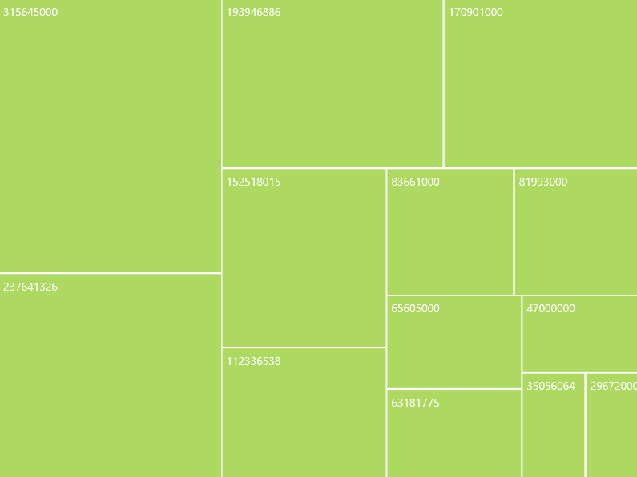

# DataBinding in UWP TreeMap (SfTreeMap)

The SfTreeMap is bound to an external data source to display the data. It supports data sources such as List, ObservableCollection, and so on. The ItemsSource property helps to bind the TreeMap with the collection of objects.

In order to bind the data source of the SfTreeMap, set the `ItemsSource` property and to generate the treemap items, set `WeightValuePath` as shown below.

If the data source implements the ICollectionChanged interface, then SfTreeMap will automatically refresh the view when an item is added, removed, or while the list is cleared. When you add or remove an item in an ObservableCollection, the SfTreeMap automatically refreshes the view, as the ObservableCollection implements the INotifyCollectionChanged. But when you do the same in a List, SfTreeMap will not refresh the view automatically.

If the data model implements the INotifyPropertyChanged interface, then the SfTreeMap responds to the property change in runtime to update the view. 

## WeightValuePath

`WeightValuePath` of SfTreeMap is a path to a field on the source object, which serves as the "weight" of the object.

The SfTreeMap generates treemap items based on the property `WeightValuePath` . It is a bindable property and it decides how to display the treemap items.

TreeMap calculates the size of the object with the help of `WeightValuePath`.

Code Sample:



<Grid Background="{ThemeResource ApplicationPageBackgroundThemeBrush}">
    
    <syncfusion:SfTreeMap Name="TreeMap" ItemsSource="{Binding PopulationDetails}" WeightValuePath="Population" />
</Grid>



N> The specified field must be available in each and every sub class (object) defined in hierarchical (nested) data collection and it should be numerical value.

## ColorValuePath

`ColorValuePath` of SfTreeMap is a path to a field on the source object, which serves as the "Color" of the object.

The SfTreeMap applies colors to the treemap nodes based on the property `ColorValuePath`. It is a bindable property and it decides how to color the treemap node.

Code Sample:



<Grid Background="{ThemeResource ApplicationPageBackgroundThemeBrush}">
    <syncfusion:SfTreeMap Name="TreeMap" ItemsSource="{Binding PopulationDetails}" WeightValuePath="Population" ColorValuePath="Growth" />
</Grid>



N> The specified field must be available in each and every sub class (object) defined in hierarchical (nested) data collection.
