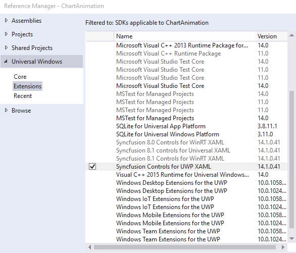

# Getting Started with UWP TreeMap (SfTreeMap)

TreeMap is a growing trend in data visualization. It displays hierarchical information in a series of clustered rectangles, which together represent a whole. The size of each box represents a quantity. TreeMap also can use color to represent any number of values, but it is often used to categorize the various boxes within the treemap.

### Creating TreeMap for Windows Store App

TreeMap is available in the following assembly and namespace.

Assembly: Syncfusion.SfTreeMap.UWP

Namespace: Syncfusion.UI.Xaml.TreeMap

### Adding assembly reference

1. Open the Add Reference window from your project.
2. Choose Windows > Extensions > SyncfusionControls for UWP XAML.

### Add SfTreeMap from Toolbox

Drag and drop the SfTreeMap control from the Toolbox to your application.

Now the SyncfusionControls for UWP XAML reference is added to the application references and the xmlns namespace code is generated in MainWindow.xaml .

Refer to the following code to add a TreeMap in an application:



    <Page
        xmlns="http://schemas.microsoft.com/winfx/2006/xaml/presentation"
        xmlns:x="http://schemas.microsoft.com/winfx/2006/xaml"
        xmlns:local="using:TestSample"
        xmlns:d="http://schemas.microsoft.com/expression/blend/2008"
        xmlns:mc="http://schemas.openxmlformats.org/markup-compatibility/2006"
        xmlns:syncfusion="using:Syncfusion.UI.Xaml.TreeMap"
        x:Class="TestSample.MainPage"
        mc:Ignorable="d">

        <Grid Background="{ThemeResource ApplicationPageBackgroundThemeBrush}">

            <syncfusion:SfTreeMap  />

        </Grid>
    </Page>


### Create Data for TreeMap:

SfTreeMap is a data-bound control. Hence you have to create a data model to bind it to the control.

1.Create data object class and declare properties as shown below 




      
            public class PopulationDetail
            {
                public string Continent { get; set; }
                public string Country { get; set; }
                public double Growth { get; set; }
                public double Population { get; set; }
            }





{{ codesnippet1 | OrderList_Indent_Level_1 }} 

2.Create a ViewModel class and assign data values to the PopulationDetail properties





    public class PopulationViewModel
        {
            public PopulationViewModel()
            {
                this.PopulationDetails = new ObservableCollection<PopulationDetail>();
                PopulationDetails.Add(new PopulationDetail() { Continent = "Asia", Country = "Indonesia", Growth = 3, Population = 237641326 });
                PopulationDetails.Add(new PopulationDetail() { Continent = "Asia", Country = "Russia", Growth = 2, Population = 152518015 });
                PopulationDetails.Add(new PopulationDetail() { Continent = "Asia", Country = "Malaysia", Growth = 1, Population = 29672000 });
                PopulationDetails.Add(new PopulationDetail() { Continent = "North America", Country = "United States", Growth = 4, Population = 315645000 });
                PopulationDetails.Add(new PopulationDetail() { Continent = "North America", Country = "Mexico", Growth = 2, Population = 112336538 });
                PopulationDetails.Add(new PopulationDetail() { Continent = "North America", Country = "Canada", Growth = 1, Population = 35056064 });
                PopulationDetails.Add(new PopulationDetail() { Continent = "South America", Country = "Colombia", Growth = 1, Population = 47000000 });
                PopulationDetails.Add(new PopulationDetail() { Continent = "South America", Country = "Brazil", Growth = 3, Population = 193946886 });
                PopulationDetails.Add(new PopulationDetail() { Continent = "Africa", Country = "Nigeria", Growth = 2, Population = 170901000 });
                PopulationDetails.Add(new PopulationDetail() { Continent = "Africa", Country = "Egypt", Growth = 1, Population = 83661000 });
                PopulationDetails.Add(new PopulationDetail() { Continent = "Europe", Country = "Germany", Growth = 1, Population = 81993000 });
                PopulationDetails.Add(new PopulationDetail() { Continent = "Europe", Country = "France", Growth = 1, Population = 65605000 });
                PopulationDetails.Add(new PopulationDetail() { Continent = "Europe", Country = "UK", Growth = 1, Population = 63181775 });
            }

            public ObservableCollection<PopulationDetail> PopulationDetails
            {
                get;
                set;
            }

        }





{{ codesnippet2 | OrderList_Indent_Level_1 }} 

### Populating data to the TreeMap

1.Setting DataContext to the MainWindow




    public partial class MainWindow : Window
    {
        public MainWindow()
        {
            InitializeComponent();
            this.TreeMap.DataContext = new PopulationViewModel();
        }
    }

 



{{ codesnippet3 | OrderList_Indent_Level_1 }} 

2.Assigning ItemsSource to the TreeMap control






    <Page x:Class="App.MainPage"

      xmlns="http://schemas.microsoft.com/winfx/2006/xaml/presentation"

      xmlns:x="http://schemas.microsoft.com/winfx/2006/xaml"

      xmlns:local="using:App"

      xmlns:syncfusion="using:Syncfusion.UI.Xaml.TreeMap"

      mc:Ignorable="d">

    <Grid Background="{StaticResource ApplicationPageBackgroundThemeBrush}">

            <syncfusion:SfTreeMap Name="TreeMap" ItemsSource="{Binding PopulationDetails}" >

            </syncfusion:SfTreeMap>

    </Grid>

    </Page>







{{ codesnippet4 | OrderList_Indent_Level_1 }} 

3.Sizing TreeMapItem by using WeightValuePath  

The SfTreeMap generates treemap items based on the property `WeightValuePath` . It is a bindable property and it decides how to display the treemap items.

TreeMap calculates the size of the object with the help of `WeightValuePath`. WeightValuePath value `Population` has been assigned from one of the above DataModel field.  



    <Grid Background="{ThemeResource ApplicationPageBackgroundThemeBrush}">
        <syncfusion:SfTreeMap Name="TreeMap" ItemsSource="{Binding PopulationDetails}" WeightValuePath="Population" >

        </syncfusion:SfTreeMap>
    </Grid>



N>  The specified field must be available in each and every sub class (object) defined in hierarchical (nested) data collection and it should be numerical value.

You can find the complete getting started sample from this [link](https://github.com/SyncfusionExamples/SfTreeMap_GettingStarted_UWP).

