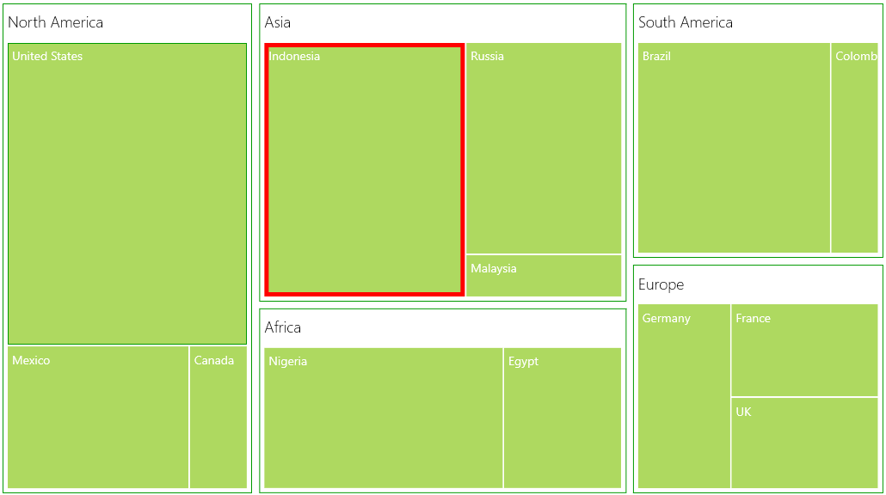
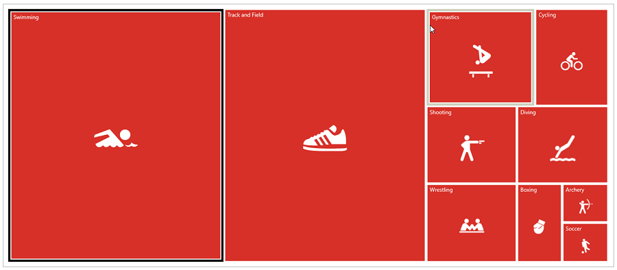

# Selection in UWP TreeMap (SfTreeMap)

While selecting a leaf node, you can highlight it by setting `HighlightOnSelection` property of SfTreeMap to “True”. The border of highlight on selection can be customized by HighlightBorderBrush and HighlightBorderThickness properties of SfTreeMap.

Code Sample:



    <syncfusion:SfTreeMap ItemsSource="{Binding PopulationDetails}"

                        WeightValuePath="Population" ColorValuePath="Growth"

                        HighlightOnSelection="True" 

                        HighlightBorderBrush="red" 

                        HighlightBorderThickness="5">

                <syncfusion:SfTreeMap.LeafItemSettings>
                    <syncfusion:LeafItemSettings>
                        <syncfusion:LeafItemSettings.LabelTemplate>
                            <DataTemplate>
                                <TextBlock Text="{Binding Data.Country}" Foreground="White" FontSize="14" FontWeight="Normal" HorizontalAlignment="Left" VerticalAlignment="Top" Margin="5,5,0,0"/>
                            </DataTemplate>

                        </syncfusion:LeafItemSettings.LabelTemplate>
                    </syncfusion:LeafItemSettings>
                </syncfusion:SfTreeMap.LeafItemSettings>

                <syncfusion:SfTreeMap.Levels>
                    <syncfusion:TreeMapFlatLevel GroupPath="Continent" GroupPadding="5" GroupBackground="Transparent" GroupBorderBrush="#009900" GroupBorderThickness="1" GroupGap="8" HeaderHeight="40">
                        <syncfusion:TreeMapFlatLevel.HeaderTemplate>
                            <DataTemplate>
                            
                                    <TextBlock Text="{Binding Header}" Margin="5,0,0,0" Foreground="black" FontSize="18" FontWeight="Light" HorizontalAlignment="Left" VerticalAlignment="Center"/>
                            
                            </DataTemplate>
                        </syncfusion:TreeMapFlatLevel.HeaderTemplate>
                    </syncfusion:TreeMapFlatLevel>

                </syncfusion:SfTreeMap.Levels>

            </syncfusion:SfTreeMap>



## Programmatic Selection

The `SelectedItems` property allows you select the shapes programmatically without tapping or touching them.

To select a shape and deselect it from the same collection programmatically, just add the shape that is to be selected to the selected items collection.

The following code sample demonstrates how to select and deselect a shape.



 <syncfusion:SfTreeMap x:Name="TreeMap"  Margin="10"  HighlightOnSelection="True" HighlightBorderBrush="Black"
                                      HighlightBorderThickness="5"
                                      ItemsSource="{Binding OlympicMedalsDetails}"
                                      WeightValuePath="TotalMedals" ColorValuePath="GoldMedals" 
                                   >





   private void Button_Click(object sender, RoutedEventArgs e)
        {
            OlympicMedalsViewModel viewModel = (sender as Button).DataContext as OlympicMedalsViewModel;
            TreeMap.SelectedItems.Add(viewModel.OlympicMedalsDetails[0]);
        }



## Events

The SelectionChanged event is fired when the leaf node selection is changed. The item added in the collection is passed as an SelectionChangedEventArgs.



  TreeMap.SelectionChanged += TreeMap_SelectionChanged;

  private void TreeMap_SelectionChanged(object sender, SelectionChangedEventArgs e)
        {
            txtBlock.Text = (e.AddedItems[0] as OlympicMedals).GameName;           
        }
  


