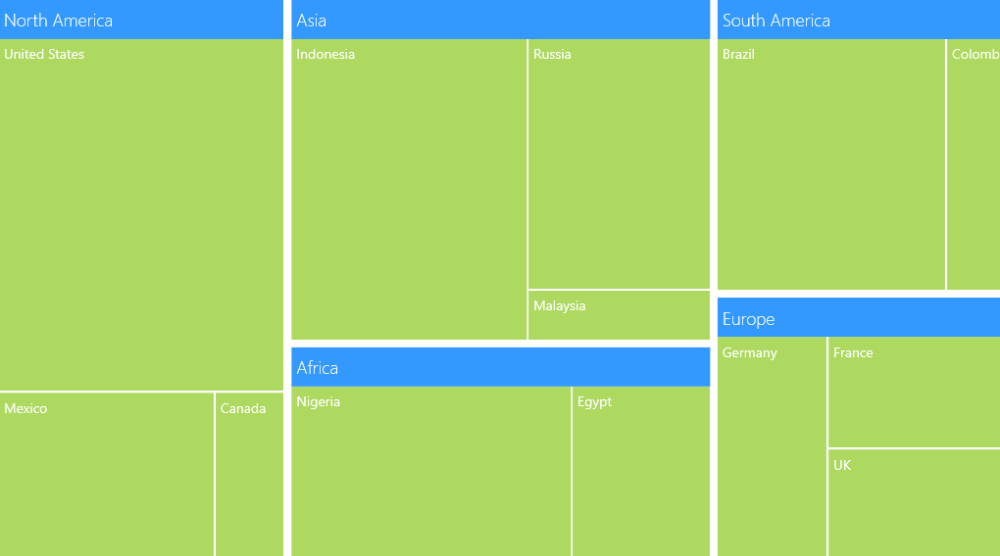
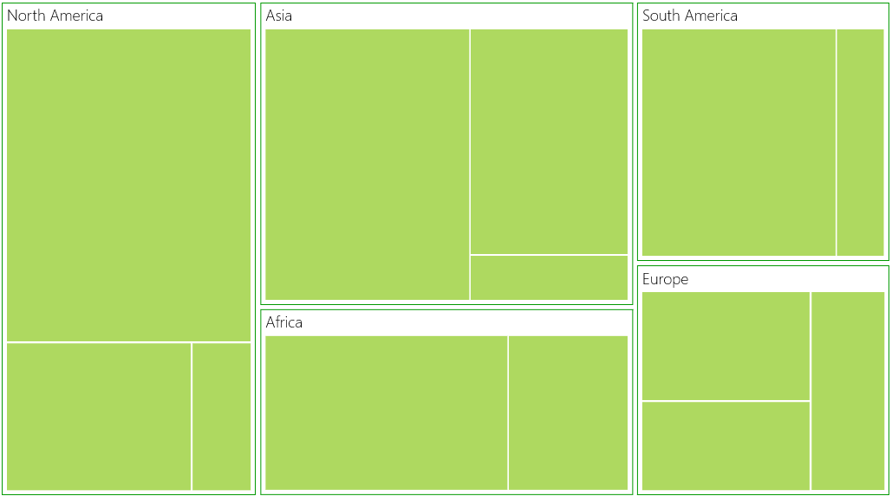
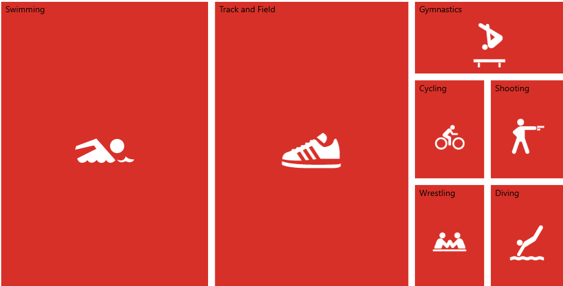

# Templates in UWP TreeMap (SfTreeMap)

## Headers

To show headers in TreeMap, you can set the `HeaderHeight` property of TreeMapLevel. For customizing default Header appearance, you can specify the `HeaderTemplate`.

### Headers with TreeMap Flat Collection:

If `HeaderTemplate` is specified for TreeMapLevel, then the header can be bound by referring Header object to the data template.

Code Sample:



    <Grid Background="{StaticResource ApplicationPageBackgroundThemeBrush}">

        <Grid.DataContext>

            <local:PopulationViewModel/>

        </Grid.DataContext>

        <syncfusion:SfTreeMap ItemsSource="{Binding PopulationDetails}" 

                        WeightValuePath="Population" ColorValuePath="Growth">

            <syncfusion:SfTreeMap.LeafItemSettings>
                <syncfusion:LeafItemSettings>
                    <syncfusion:LeafItemSettings.LabelTemplate>
                        <DataTemplate>
                            <TextBlock Text="{Binding Data.Country}" Foreground="White" FontSize="14" FontWeight="Normal" HorizontalAlignment="Left" VerticalAlignment="Top" Margin="5,5,0,0"/>
                        </DataTemplate>

                    </syncfusion:LeafItemSettings.LabelTemplate>
                </syncfusion:LeafItemSettings>
            </syncfusion:SfTreeMap.LeafItemSettings>

            <syncfusion:SfTreeMap.Levels>
                <syncfusion:TreeMapFlatLevel GroupPath="Continent" GroupGap="8" HeaderHeight="40">
                    <syncfusion:TreeMapFlatLevel.HeaderTemplate>
                        <DataTemplate>
                            <Border Background="#3399ff">
                                <TextBlock Text="{Binding Header}" Margin="5,0,0,0" Foreground="white" FontSize="18" FontWeight="Light" HorizontalAlignment="Left" VerticalAlignment="Center"/>
                            </Border>
                        </DataTemplate>
                    </syncfusion:TreeMapFlatLevel.HeaderTemplate>
                </syncfusion:TreeMapFlatLevel>

            </syncfusion:SfTreeMap.Levels>

        </syncfusion:SfTreeMap>

    </Grid>



TreeMap with Headers
{:.caption}

### Headers with TreeMap Hierarchical Collection:

For TreeMap with Hierarchical Collection, `HeaderPath` must be specified. The header can be bound by referring Data.<FieldName> to the data template where FieldName refers to the field of object specified in the particular treemap level.

Code Sample:

 

    <Grid Background="{StaticResource ApplicationPageBackgroundThemeBrush}">

    <Grid.Resources>

        <local:CountrySalesCollection x:Key="countrySalesCollection"/>

    </Grid.Resources>

    <syncfusion:SfTreeMap ItemsSource="{Binding Source={StaticResource countrySalesCollection}}" WeightValuePath="Sales" ColorValuePath="Expense">

        <syncfusion:SfTreeMap.Levels>

            <syncfusion:TreeMapHierarchicalLevel ChildPath="RegionalSalesCollection" ChildGap="10" HeaderHeight="25" HeaderPath="Name">

            </syncfusion:TreeMapHierarchicalLevel>

        </syncfusion:SfTreeMap.Levels>

    </syncfusion:SfTreeMap>

     </Grid>



## Labels

To show labels in TreeMap, `ShowLabels` of TreeMapLevel should be enabled to True. For customizing default label appearance, you can specify `LabelTemplate`.

###  Labels with TreeMap Flat Collection:

If `LabelTemplate` is specified for TreeMapLevel, then the label can be bound by referring Label object to the data template.

Code Sample:



    <Grid Background="{StaticResource ApplicationPageBackgroundThemeBrush}">

        <Grid.DataContext>

            <local:PopulationViewModel/>

        </Grid.DataContext>

        <syncfusion:SfTreeMap ItemsSource="{Binding PopulationDetails}"

                          WeightValuePath="Population" 

                          ColorValuePath="Growth">
            
            <syncfusion:SfTreeMap.LeafItemSettings>
                <syncfusion:LeafItemSettings ShowLabels="False">
                    <syncfusion:LeafItemSettings.LabelTemplate>
                        <DataTemplate>
                            <TextBlock Text="{Binding Data.Country}" Foreground="White" FontSize="14" FontWeight="Normal" HorizontalAlignment="Left" VerticalAlignment="Top" Margin="5,5,0,0"/>
                        </DataTemplate>

                    </syncfusion:LeafItemSettings.LabelTemplate>
                </syncfusion:LeafItemSettings>
            </syncfusion:SfTreeMap.LeafItemSettings>

            <syncfusion:SfTreeMap.Levels>

                <syncfusion:TreeMapFlatLevel GroupPath="Continent" GroupGap="5" GroupBorderBrush="#6600ff" GroupBorderThickness="2" ShowLabels="True"/>

            </syncfusion:SfTreeMap.Levels>

        </syncfusion:SfTreeMap>

    </Grid>



TreeMap with Labels
{:.caption}

### Labels with TreeMap Hierarchical Collection:

TreeMap with Hierarchical Collection, `LabelPath` must be specified. The label can be bound by referring Data.FieldName to the data template where FieldName refers to the field of object specified in the particular treemap level.

Code Sample:



    <Grid Background="{StaticResource ApplicationPageBackgroundThemeBrush}">

    <Grid.Resources>

        <local:CountrySalesCollection x:Key="countrySalesCollection"/>

    </Grid.Resources>

    <syncfusion:SfTreeMap ItemsSource="{Binding Source={StaticResource countrySalesCollection}}"

                      WeightValuePath="Sales" ColorValuePath="Expense">

        <syncfusion:SfTreeMap.Levels>

            <syncfusion:TreeMapHierarchicalLevel ChildPath="RegionalSalesCollection" ChildGap="10" ChildBorderBrush="#6600ff" ChildBorderThickness="2" ShowLabels="True" LabelPath="Name">

            </syncfusion:TreeMapHierarchicalLevel>

        </syncfusion:SfTreeMap.Levels>

    </syncfusion:SfTreeMap>

     </Grid>



# Templates in UWP TreeMap (SfTreeMap)

`LeafLabelPath` of SfTreeMap is a path to a field on the source object, which serves as the "label" of the object.

Code Sample:



    <Grid Background="{StaticResource ApplicationPageBackgroundThemeBrush}">

        <Grid.DataContext>

            <local:PopulationViewModel/>

        </Grid.DataContext>

        <syncfusion:SfTreeMap ItemsSource="{Binding PopulationDetails}" 
                              WeightValuePath="Population"
                              LeafLabelPath="Country”/>

    </Grid>
	


N>  The specified field must be available in each and every sub class (object) defined in hierarchical (nested) data collection.

# Templates in UWP TreeMap (SfTreeMap)

You can customize leaf nodes by assigning data template to `LeafTemplate` of SfTreeMap. 

Code Sample:



     <Grid Background="{StaticResource ApplicationPageBackgroundThemeBrush}"> 
        <Grid.DataContext> 
            <local:OlympicMedalsViewModel/>
        </Grid.DataContext> 
        <syncfusion:SfTreeMap ItemsSource="{Binding OlympicMedalsDetails}" Margin="50" WeightValuePath="TotalMedals" ColorValuePath="GoldMedals">
            <syncfusion:SfTreeMap.LeafTemplate> 
                <DataTemplate> 
                    <Border BorderBrush="Transparent" BorderThickness="3" Background="#D73028">
                        <Image Source="{Binding Data.GameImgSource}" HorizontalAlignment="Center" VerticalAlignment="Center" Margin="0,25,0,0" Stretch="None"/>
                    </Border>
                </DataTemplate>
            </syncfusion:SfTreeMap.LeafTemplate> 
        <syncfusion:SfTreeMap.Levels>
            <syncfusion:TreeMapFlatLevel GroupPath="GameName" ShowLabels="True">
                <syncfusion:TreeMapFlatLevel.LabelTemplate> 
                    <DataTemplate>       
                        <TextBlock Padding="10 5 0 0" Text="{Binding Label}" FontSize="20" HorizontalAlignment="Left" VerticalAlignment="Top"/> 
                    </DataTemplate>         
                </syncfusion:TreeMapFlatLevel.LabelTemplate> 
            </syncfusion:TreeMapFlatLevel>  
        </syncfusion:SfTreeMap.Levels> 
        </syncfusion:SfTreeMap>
     </Grid>



       
       public class OlympicMedalsViewModel
    {
		public ObservableCollection<OlympicMedals> OlympicMedalsDetails
		{ get; set; }
        public OlympicMedalsViewModel()
        {        
			this.OlympicMedalsDetails = new ObservableCollection<OlympicMedals>();
			this.OlympicMedalsDetails.Add(new OlympicMedals { Country = "US", GameName = "Swimming", GoldMedals = 16, SilverMedals = 9, BronzeMedals = 6, TotalMedals = 31, GameImgSource = new BitmapImage(new Uri("ms-appx:/Assets/Swimming.png")) });
            this.OlympicMedalsDetails.Add(new OlympicMedals { Country = "US", GameName = "Track and Field", GoldMedals = 9, SilverMedals = 13, BronzeMedals = 7, TotalMedals = 29, GameImgSource = new BitmapImage(new Uri("ms-appx:/Assets/TrackAndField.png")) });
            this.OlympicMedalsDetails.Add(new OlympicMedals { Country = "US", GameName = "Gymnastics", GoldMedals = 3, SilverMedals = 1, BronzeMedals = 2, TotalMedals = 6, GameImgSource = new BitmapImage(new Uri("ms-appx:/Assets/Gymnastics.png")) });
            this.OlympicMedalsDetails.Add(new OlympicMedals { Country = "US", GameName = "Cycling", GoldMedals = 1, SilverMedals = 2, BronzeMedals = 1, TotalMedals = 4, GameImgSource = new BitmapImage(new Uri("ms-appx:/Assets/Cycling.png")) });   
			this.OlympicMedalsDetails.Add(new OlympicMedals { Country = "US", GameName = "Shooting", GoldMedals = 3, SilverMedals = 0, BronzeMedals = 1, TotalMedals = 4, GameImgSource = new BitmapImage(new Uri("ms-appx:/Assets/Shooting.png")) }); 
			this.OlympicMedalsDetails.Add(new OlympicMedals { Country = "US", GameName = "Wrestling", GoldMedals = 2, SilverMedals = 0, BronzeMedals = 2, TotalMedals = 4, GameImgSource = new BitmapImage(new Uri("ms-appx:/Assets/Wrestling.png")) }); 
			this.OlympicMedalsDetails.Add(new OlympicMedals { Country = "US", GameName = "Diving", GoldMedals = 1, SilverMedals = 1, BronzeMedals = 2, TotalMedals = 4, GameImgSource = new BitmapImage(new Uri("ms-appx:/Assets/Diving.png")) });
		}  
	} 
	public class OlympicMedals
    {
		public string Country { get; set; }
        public string GameName { get; set; } 
		public double GoldMedals { get; set; }
        public double SilverMedals { get; set; }
        public double BronzeMedals { get; set; }
        public double TotalMedals { get; set; }
        public ImageSource GameImgSource { get; set; }
	}



