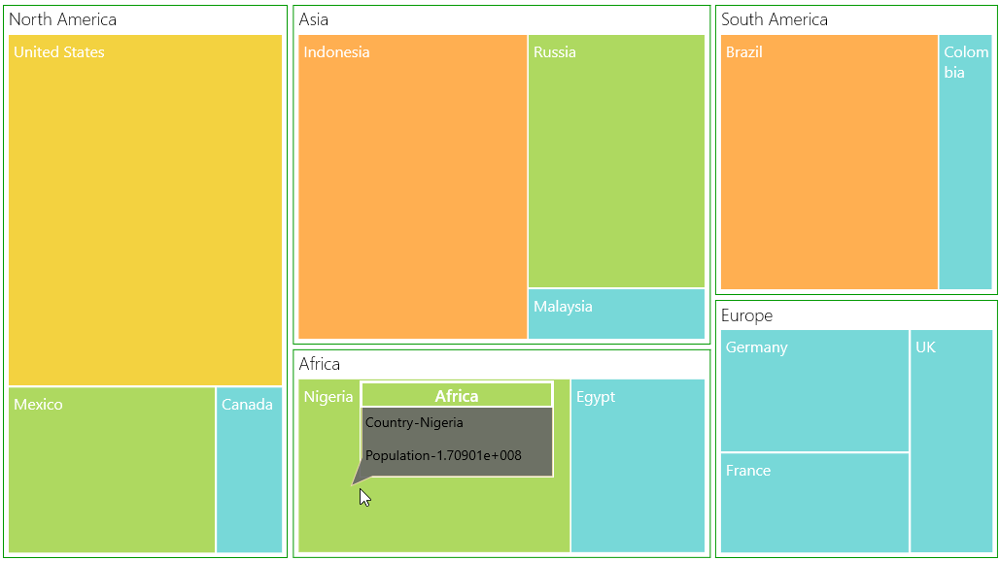

# Tooltip in UWP TreeMap (SfTreeMap)

You can enable ToolTip for TreeMap by setting ShowToolTip to “True”. For modifying default appearance of ToolTip, ToolTipTemplate can be specified.

## Code Sample:



    <Grid Background="{StaticResource ApplicationPageBackgroundThemeBrush}">

        <Grid.DataContext>

            <local:PopulationViewModel/>

        </Grid.DataContext>

        <syncfusion:SfTreeMap ItemsSource="{Binding PopulationDetails}" 

                      WeightValuePath="Population" ColorValuePath="Growth"

                      ShowToolTip="True">

            <syncfusion:SfTreeMap.LeafItemSettings>
                <syncfusion:LeafItemSettings>
                    <syncfusion:LeafItemSettings.LabelTemplate>
                        <DataTemplate>
                            <TextBlock Text="{Binding Data.Country}" TextWrapping="Wrap" Foreground="White" FontSize="16" FontWeight="Normal" HorizontalAlignment="Left" VerticalAlignment="Top" Margin="5,5,0,0"/>
                        </DataTemplate>
                    </syncfusion:LeafItemSettings.LabelTemplate>
                </syncfusion:LeafItemSettings>
            </syncfusion:SfTreeMap.LeafItemSettings>

            <syncfusion:SfTreeMap.ToolTipTemplate>

                <DataTemplate>

                    <Grid  BorderBrush="White" BorderThickness="1" Height="100" Width="200">

                        <Path Margin="-10,0,0,-10" Data="M0,0 L360,0 L360,200 L20,200 L-20,220 L0,160 L0,0 z" Fill="#666666" Stroke="Wheat" Opacity="0.9" Stretch="Fill"/>

                        <StackPanel>

                            <Grid BorderBrush="white" BorderThickness="2" Background="{Binding MappedColor}" >

                                <TextBlock Text="{Binding Data.Continent}" Foreground= "White" FontWeight="SemiBold" FontSize="17" TextAlignment="Center"/>

                            </Grid>

                            <StackPanel >

                                <StackPanel Orientation="Horizontal" Margin="5">

                                    <TextBlock Text="Country" FontSize="14"/>

                                    <TextBlock Text="-" FontSize="14"/>

                                    <TextBlock Text="{Binding Data.Country}" FontSize="14"/>

                                </StackPanel>

                                <StackPanel Orientation="Horizontal" Margin="5,10,5,5">

                                    <TextBlock Text="Population" FontSize="14"/>

                                    <TextBlock Text="-" FontSize="14"/>

                                    <TextBlock Text="{Binding Data.Population}" FontSize="14"/>

                                </StackPanel>

                            </StackPanel>

                        </StackPanel>

                    </Grid>

                </DataTemplate>

            </syncfusion:SfTreeMap.ToolTipTemplate>

            <syncfusion:SfTreeMap.LeafColorMapping>

                <syncfusion:RangeBrushColorMapping>

                    <syncfusion:RangeBrushColorMapping.Brushes>

                        <syncfusion:RangeBrush From="0" To="1" Color="#77D8D8"/>

                        <syncfusion:RangeBrush From="1" To="2" Color="#AED960"/>

                        <syncfusion:RangeBrush From="2" To="3" Color="#FFAF51"/>

                        <syncfusion:RangeBrush From="3" To="4" Color="#F3D240"/>

                    </syncfusion:RangeBrushColorMapping.Brushes>

                </syncfusion:RangeBrushColorMapping>

            </syncfusion:SfTreeMap.LeafColorMapping>

            <syncfusion:SfTreeMap.Levels>
                    <syncfusion:TreeMapFlatLevel GroupPath="Continent" HeaderHeight="25" GroupGap="5" GroupPadding="5" GroupBackground="Transparent" GroupBorderBrush="#009900" GroupBorderThickness="1">
                        <syncfusion:TreeMapFlatLevel.HeaderTemplate>
                            <DataTemplate>
                                <TextBlock Text="{Binding Header}" Margin="5,0,0,0" Foreground="black" FontSize="18" FontWeight="Light" HorizontalAlignment="Left" VerticalAlignment="Center"/>
                            </DataTemplate>
                        </syncfusion:TreeMapFlatLevel.HeaderTemplate>
                    </syncfusion:TreeMapFlatLevel>
                </syncfusion:SfTreeMap.Levels>

        </syncfusion:SfTreeMap>

    </Grid>



The following screen shot shows a tree map with a tool tip.

ToolTip on TreeMap
{:.caption}
