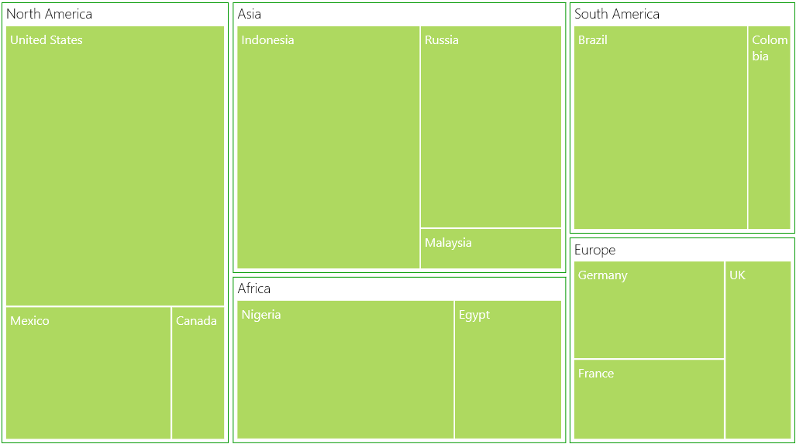
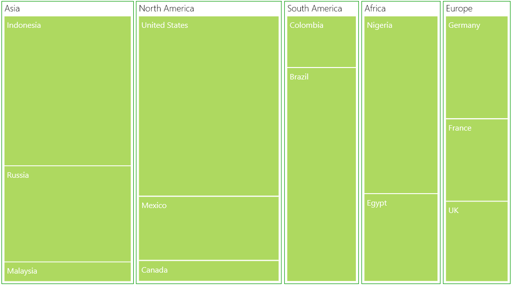
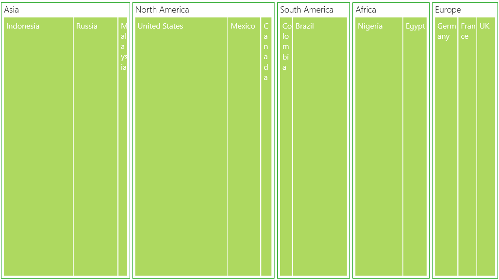
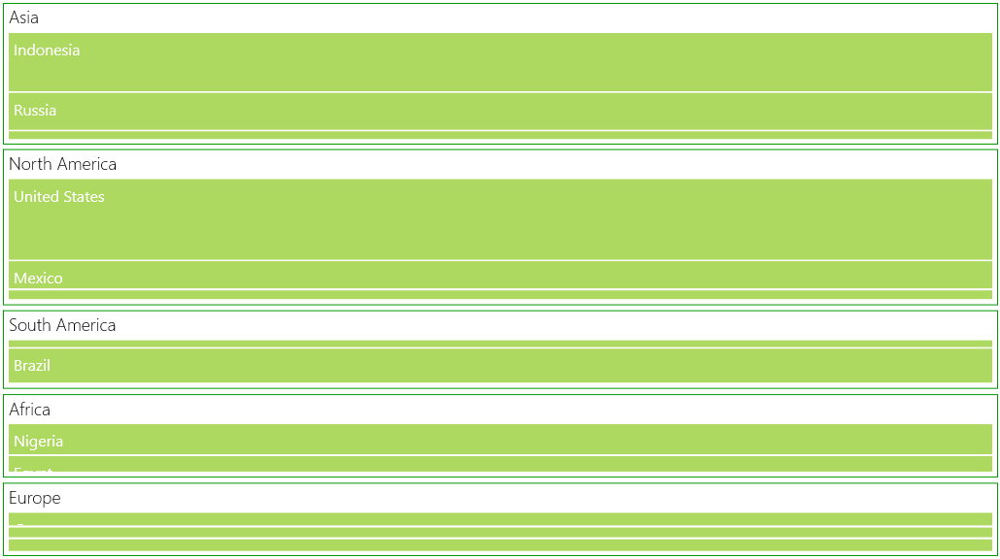

# TreeMap Layout in UWP TreeMap (SfTreeMap)

The `ItemsLayoutMode` for SfTreeMap specifies the layout mode of the treemap items. This layout is applied for all the tree map levels. There are four different treemap layouts such as,

## Squarified Layout

In this layout the data is visualized in the form of square-like rectangles with best aspect ratio.

The following code illustrates how to set a squarified in Treemap.

Code Sample:



    <Grid Background="{StaticResource ApplicationPageBackgroundThemeBrush}">

        <Grid.DataContext>

            <local:PopulationViewModel/>

        </Grid.DataContext>

        <syncfusion:SfTreeMap ItemsSource="{Binding PopulationDetails}"
                            ItemsLayoutMode="Squarified"
                            WeightValuePath="Population"  
                            ColorValuePath="Growth">

            <syncfusion:SfTreeMap.LeafItemSettings>
                <syncfusion:LeafItemSettings>
                    <syncfusion:LeafItemSettings.LabelTemplate>
                        <DataTemplate>
                            <TextBlock Text="{Binding Data.Country}" TextWrapping="Wrap" Foreground="White" FontSize="16" FontWeight="Normal" HorizontalAlignment="Left" VerticalAlignment="Top" Margin="5,5,0,0"/>
                        </DataTemplate>
                    </syncfusion:LeafItemSettings.LabelTemplate>
                </syncfusion:LeafItemSettings>
            </syncfusion:SfTreeMap.LeafItemSettings>

            <syncfusion:SfTreeMap.Levels>
                <syncfusion:TreeMapFlatLevel GroupPath="Continent" HeaderHeight="25" GroupGap="5" GroupPadding="5" GroupBackground="Transparent" GroupBorderBrush="#009900" GroupBorderThickness="1">
                    <syncfusion:TreeMapFlatLevel.HeaderTemplate>
                        <DataTemplate>
                                <TextBlock Text="{Binding Header}" Margin="5,0,0,0" Foreground="black" FontSize="18" FontWeight="Light" HorizontalAlignment="Left" VerticalAlignment="Center"/>                           
                        </DataTemplate>
                    </syncfusion:TreeMapFlatLevel.HeaderTemplate>
                </syncfusion:TreeMapFlatLevel>
            </syncfusion:SfTreeMap.Levels>
        </syncfusion:SfTreeMap>

    </Grid>



The following screen shot illustrates a squarified layout.

squarified layout
{:.caption}

## SliceAndDiceAuto Layout

In this layout the data is visualized in the form of long-thin rectangles with high aspect ratio, which can be displayed either vertically or horizontally.

The following code illustrates how to set a slice and dice layout in Treemap.

Code Sample:



   <Grid Background="{StaticResource ApplicationPageBackgroundThemeBrush}">

        <Grid.DataContext>

            <local:PopulationViewModel/>

        </Grid.DataContext>

        <syncfusion:SfTreeMap ItemsSource="{Binding PopulationDetails}"
                            ItemsLayoutMode="SliceAndDiceAuto"
                            WeightValuePath="Population"  
                            ColorValuePath="Growth">

                            . . .

        </syncfusion:SfTreeMap>

    </Grid>


	
The following screen shot illustrates a slice-and-dice layout.

slice-and-dice layout
{:.caption}

## SliceAndDiceHorizontal Layout

The following code illustrates how to set a slice and dice layout horizontally in Treemap.

Code Sample:



    <Grid Background="{StaticResource ApplicationPageBackgroundThemeBrush}">

        <Grid.DataContext>

            <local:PopulationViewModel/>

        </Grid.DataContext>

        <syncfusion:SfTreeMap ItemsSource="{Binding PopulationDetails}"
                            ItemsLayoutMode="SliceAndDiceHorizontal"
                            WeightValuePath="Population"  
                            ColorValuePath="Growth">

                                . . .

        </syncfusion:SfTreeMap>

    </Grid>



The following screen shot shows a Slice-and-dice treemap in horizontal layout.

Slice-and-dice treemap in horizontal layout
{:.caption}

## SliceAndDiceVertical Layout

The following code illustrates how to set a slice and dice layout vertically in Treemap.

Code Sample:



   <Grid Background="{StaticResource ApplicationPageBackgroundThemeBrush}">

        <Grid.DataContext>

            <local:PopulationViewModel/>

        </Grid.DataContext>

        <syncfusion:SfTreeMap ItemsSource="{Binding PopulationDetails}"
                            ItemsLayoutMode="SliceAndDiceVertical"
                            WeightValuePath="Population"  
                            ColorValuePath="Growth">

                                . . .

        </syncfusion:SfTreeMap>

    </Grid>



The following screen shot shows a Slice-and-dice treemap in vertical layout.

Slice-and-dice treemap in vertical layout
{:.caption}
