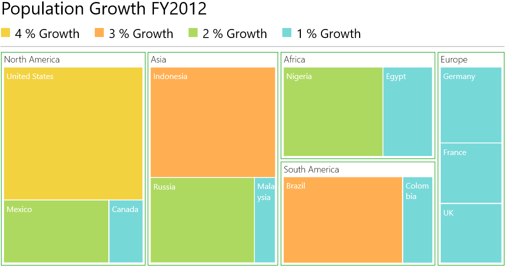

# TreeMap Legend in UWP TreeMap (SfTreeMap)

TreeMap legend is used to easily demonstrate about the color value of leaf nodes. But this legend could be appropriate only for the treemap having leaf nodes colored by using `RangeBrushColorMapping`. The labels of the legend item can be customized by specifying `LegendLabel` of RangeBrush mentioned in the Brushes of RangeBrushColorMapping.

The icon of legend item can be set by `LegendIconStyle` of TreeMapLegend. Custom legend icon can be set by assigning DataTemplate to `LegendIconTemplate` with LegendIconStyle as `Custom`.

The width and height of the legend icon can be modified by setting `LegendIconWidth` and `LegendIconHeight` of TreeMapLegend.

The legend can be positioned to Left, Right, Top or Bottom of TreeMap with the help of LegendPosition property.

Code Sample:



  <syncfusion:SfTreeMap ItemsSource="{Binding PopulationDetails}" 

                      WeightValuePath="Population" ColorValuePath="Growth"

                      Margin="10" Name="TreeMap">

            <syncfusion:SfTreeMap.LeafItemSettings>
                <syncfusion:LeafItemSettings>
                    <syncfusion:LeafItemSettings.LabelTemplate>
                        <DataTemplate>
                            <TextBlock Text="{Binding Data.Country}" TextWrapping="Wrap" Foreground="White" FontSize="16" FontWeight="Normal" HorizontalAlignment="Left" VerticalAlignment="Top" Margin="5,5,0,0"/>
                        </DataTemplate>
                    </syncfusion:LeafItemSettings.LabelTemplate>
                </syncfusion:LeafItemSettings>
            </syncfusion:SfTreeMap.LeafItemSettings>

            <syncfusion:SfTreeMap.Legend>

                <syncfusion:TreeMapLegend Margin="0 5" LegendItemMargin="0 0 20 10" LegendItemElementMargin="0 0 10 0" BorderThickness="0,0,0,2" BorderBrush="#CCCCCC" HorizontalAlignment="Left" LegendIconStyle="Rectangle" LegendIconHeight="18" LegendIconWidth="18" FontSize="25" Width="{Binding ActualWidth, ElementName=TreeMap}">

                    <syncfusion:TreeMapLegend.Header>

                        <TextBlock Text="Population Growth FY2012" FontSize="35"                                   Margin="0,0,0,10"/>

                    </syncfusion:TreeMapLegend.Header>

                </syncfusion:TreeMapLegend>

            </syncfusion:SfTreeMap.Legend>

            <syncfusion:SfTreeMap.LeafColorMapping>

                <syncfusion:RangeBrushColorMapping>

                    <syncfusion:RangeBrushColorMapping.Brushes>

                        <syncfusion:RangeBrush Color="#77D8D8" From="0" To="1" LegendLabel="1 % Growth"/>

                        <syncfusion:RangeBrush Color="#AED960" From="1" To="2" LegendLabel="2 % Growth"/>

                        <syncfusion:RangeBrush Color="#FFAF51" From="2" To="3" LegendLabel="3 % Growth"/>

                        <syncfusion:RangeBrush Color="#F3D240" From="3" To="4" LegendLabel="4 % Growth"/>

                    </syncfusion:RangeBrushColorMapping.Brushes>

                </syncfusion:RangeBrushColorMapping>

            </syncfusion:SfTreeMap.LeafColorMapping>

            <syncfusion:SfTreeMap.Levels>
                <syncfusion:TreeMapFlatLevel GroupPath="Continent" HeaderHeight="25" GroupGap="5" GroupPadding="5" GroupBackground="Transparent" GroupBorderBrush="#009900" GroupBorderThickness="1">
                    <syncfusion:TreeMapFlatLevel.HeaderTemplate>
                        <DataTemplate>
                            <TextBlock Text="{Binding Header}" Margin="5,0,0,0" Foreground="black" FontSize="18" FontWeight="Light" HorizontalAlignment="Left" VerticalAlignment="Center"/>
                        </DataTemplate>
                    </syncfusion:TreeMapFlatLevel.HeaderTemplate>
                </syncfusion:TreeMapFlatLevel>
            </syncfusion:SfTreeMap.Levels>

        </syncfusion:SfTreeMap>



TreeMap with Legend
{:.caption}

