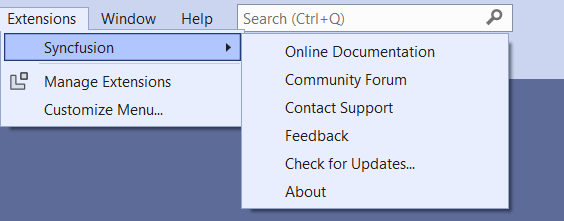
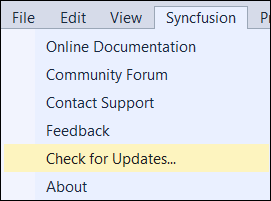
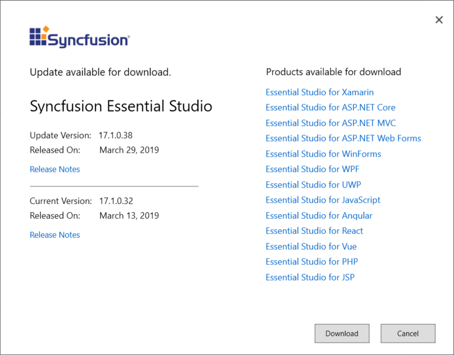

# Check for Updates in Syncfusion&reg; Essential Studio&reg; UWP

Syncfusion&reg; provides the Extensions to update most recent version of the Essential Studio&reg; release. So that, you always get the latest features, fixes, and improvements by installing the latest version.

I> The Syncfusion&reg; Check for updates is available from v17.1.0.32.

You can check updates availability in Visual Studio, and then install the update version if required.

1. Choose **Extensions->Syncfusion -> Check for Updates…** in the Visual Studio menu.

   

   N> In Visual Studio 2017, you can see the Syncfusion&reg; menu directly in the Visual Studio menu.

   
   
2. When there is an update, **Update** dialog box opens.

   

3. You can download the Syncfusion&reg; Essential Studio&reg; from the Syncfusion&reg; website by selecting **Download**.
