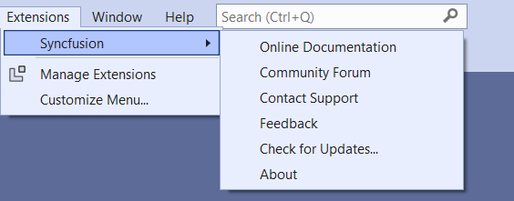
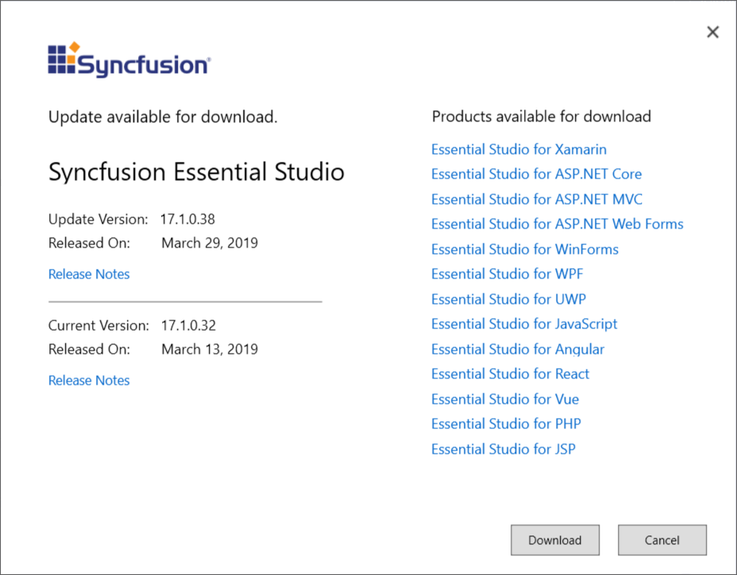

# Check for Updates in Syncfusion® Essential Studio® UWP

Syncfusion® provides the extensions to update to the most recent version of the Essential Studio® release, so that you always get the latest features, fixes, and improvements by installing the latest version.

I> The Syncfusion® Check for Updates is available from v17.1.0.32.

You can check for update availability in Visual Studio, and then install the update if required.

1. Choose **Extensions->Syncfusion® -> Check for Updates…** in the Visual Studio menu.

   

   N> In Visual Studio 2017, you can see the Syncfusion® menu directly in the Visual Studio menu.

   
   
2. When there is an update, **Update** dialog box opens.

   

3. You can download the Syncfusion® Essential® Studio from the Syncfusion® website by selecting **Download**.
