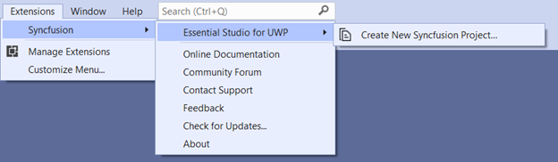
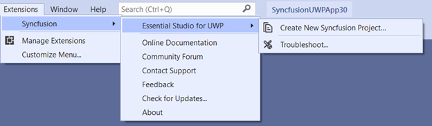

# UWP Syncfusion Extensions Overview
 
The Syncfusion UWP Visual Studio Extensions can be accessed through the Syncfusion Menu to create and configure the project with Syncfusion references in Visual Studio. The Syncfusion UWP Extensions supports from Microsoft Visual Studio 2017.

N> Syncfusion Extension is published in Visual Studio Marketplace. We provided Separate Syncfusion UWP Extension support for Visual Studio 2022 and Visual Studio 2019 or lower. Please refer below Visual Marketplace link.

[Visual Studio 2022](https://marketplace.visualstudio.com/items?itemName=SyncfusionInc.UWPVSExtensions)

[Visual Studio 2019 or lower](https://marketplace.visualstudio.com/items?itemName=SyncfusionInc.UWP-Extensions)

I> The Syncfusion UWP menu option is available from v17.1.0.32.

The Syncfusion provides the following extension supports in Visual Studio:

1.	[Create Project](https://help.syncfusion.com/uwp/Visual-Studio-Integration/visual-studio-integration/create-project): Create the Syncfusion UWP application by adding required Syncfusion assemblies/NuGet based on the control chosen.
2.	[Troubleshooting](https://help.syncfusion.com/uwp/Visual-Studio-Integration/visual-studio-integration/troubleshooting): Troubleshoots the project with the Syncfusion configuration and apply the fix like, wrong Framework Syncfusion assembly added to the project or missing any Syncfusion dependent assembly of a referred assembly.

**No project selected in Visual Studio**

**Selected Syncfusion UWP application in Visual Studio**

N> In Visual Studio 2017, you can see the Syncfusion menu directly in the Visual Studio menu.

