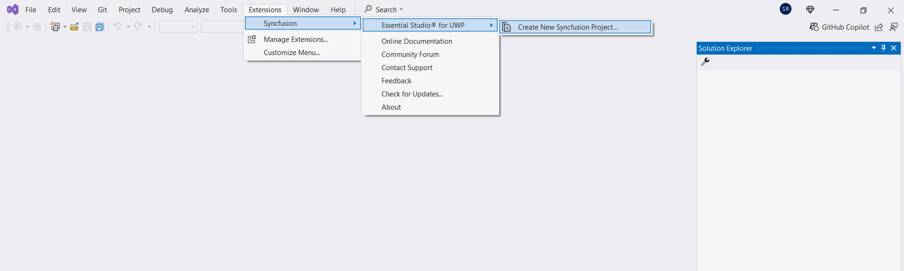
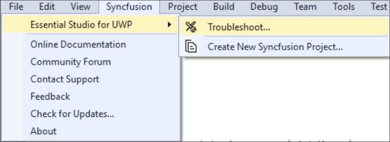

# UWP Syncfusion&reg; Extensions Overview
 
The Syncfusion&reg; UWP Visual Studio Extensions can be accessed through the Syncfusion&reg; Menu to create and configure the project with Syncfusion&reg; references in Visual Studio. The Syncfusion&reg; UWP Extensions supports from Microsoft Visual Studio 2017.

N> Syncfusion&reg; Extension is published in Visual Studio Marketplace. We provided Separate Syncfusion&reg; UWP Extension support for Visual Studio 2022 and Visual Studio 2019 or lower. Please refer below Visual Marketplace link.

[Visual Studio 2022](https://marketplace.visualstudio.com/items?itemName=SyncfusionInc.UWPVSExtensions)

[Visual Studio 2019 or lower](https://marketplace.visualstudio.com/items?itemName=SyncfusionInc.UWP-Extensions)

I> The Syncfusion&reg; UWP menu option is available from v17.1.0.32.

The Syncfusion&reg; provides the following extension supports in Visual Studio:

1.	[Create Project](https://help.syncfusion.com/uwp/Visual-Studio-Integration/Visual-Studio-Extensions/Create-Project): Create the Syncfusion&reg; UWP application by adding required Syncfusion&reg; assemblies/NuGet based on the control chosen.
2.	[Troubleshooting](https://help.syncfusion.com/uwp/Visual-Studio-Integration/Visual-Studio-Extensions/Troubleshooting): Troubleshoots the project with the Syncfusion&reg; configuration and apply the fix like, wrong Framework Syncfusion&reg; assembly added to the project or missing any Syncfusion&reg; dependent assembly of a referred assembly.

**No project selected in Visual Studio**

**Selected Syncfusion&reg; UWP application in Visual Studio**

N> In Visual Studio 2017, you can see the Syncfusion&reg; menu directly in the Visual Studio menu.

