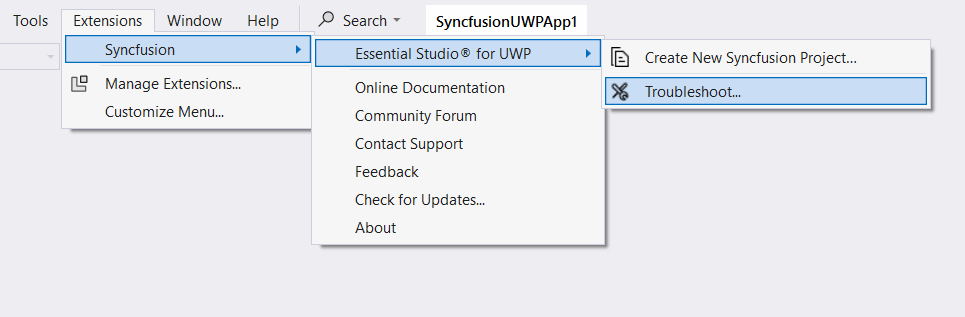

# Overview
 
The Syncfusion UWP Visual Studio Extensions can be accessed through the Syncfusion Menu to create and configure the project with Syncfusion references in Visual Studio. The Syncfusion UWP Extensions supports Microsoft Visual Studio 2017.

N> Syncfusion Extension is published in Visual Studio Marketplace. You can download UWP Extensions [here](https://marketplace.visualstudio.com/items?itemName=SyncfusionInc.UWP-Extensions).

I> The Syncfusion UWP menu option is available from v17.1.0.32.

The Syncfusion provides the following extension supports in Visual Studio:

1.	[Create Project](https://help.syncfusion.com/uwp/Visual-Studio-Integration/Visual-Studio-Extensions/Create-Project): To create the Syncfusion UWP application by adding required Syncfusion assemblies/NuGet based on the control chosen.
2.	[Troubleshooter](https://help.syncfusion.com/uwp/Visual-Studio-Integration/Visual-Studio-Extensions/Troubleshooting): Troubleshoot the project with the Syncfusion configuration and apply the fix like, wrong Framework Syncfusion assembly added to the project or missing any Syncfusion dependent assembly of a referred assembly.

**No project selected in Visual Studio**

**Selected Syncfusion UWP application in Visual Studio**

N> In Visual Studio 2019, Syncfusion menu is available under Extension in Visual Studio menu.

The Syncfusion UWP Visual Studio Extensions are installed along with the following setups,

* Essential Studio for Enterprise Edition with the platform UWP
* Essential Studio for UWP

N> The Syncfusion UWP Project Templates provide Visual Studio 2015 support from v15.3.0.26 to v16.4.0.52.

