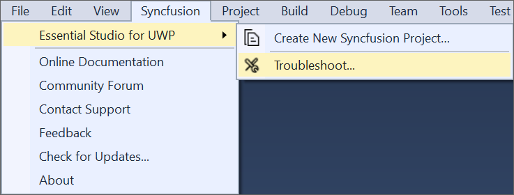
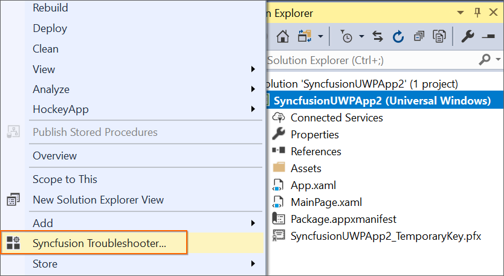
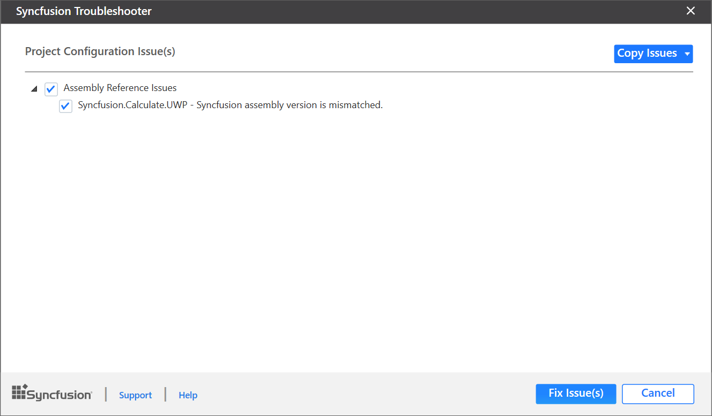

# Troubleshoot the project

Troubleshoot the project with the Syncfusion configuration and apply the fix like, wrong .NET Framework version of added Syncfusion assembly to the project or missing any Syncfusion dependent assembly of a referred assembly. The Syncfusion Troubleshooter can do the following:

* Report the Configuration issues.  

* Apply the solution

## Report the Configuration issues

The following steps help you to utilize the Syncfusion Troubleshooter by Visual Studio. 

> Before use the Syncfusion Troubleshooter for UWP, check whether the **UWP Extensions - Syncfusion** installed or not in Visual Studio Extension Manager by clicking on the **Extensions -> Manage Extensions -> Installed** for Visual Studio 2019 or later and for Visual Studio 2017 **Tools -> Extensions and Updates -> Installed**.

1. To open Syncfusion Troubleshooter Wizard, follow either one of the options below: 
   
   **Option 1:**  
   Open an existing Syncfusion UWP Application, Click **Extensions->Syncfusion Menu** and choose **Essential Studio for UWP > Troubleshoot…** in Visual Studio.

   

   N> In Visual Studio 2017, you can see the Syncfusion menu directly in the Visual Studio menu.

   

   **Option 2:**  
   Right-click the Project file in Solution Explorer, then select the command **Syncfusion Troubleshooter…**

   

2. Now, analyze the project and it will report the project configuration issues of Syncfusion controls in the Troubleshooter dialog if any issues found. If the project does not have any configuration issues, the dialog box will show there is no configuration changes required in following areas:

     * Syncfusion assembly references.

     * Syncfusion NuGet Packages. 

   

I> The Syncfusion Troubleshooter command will be visible only for Syncfusion projects that means the project should contain Syncfusion assemblies or Syncfusion NuGet packages referred.

The Syncfusion Troubleshooter handles the following project configuration issues: 

1. Assembly Reference Issues.

2. NuGet related Issues.

### Assembly Reference Issues

The Syncfusion Troubleshooter deals with the following assembly reference issues in Syncfusion Projects. 

1. Dependent assemblies are missing for referred assemblies from project. 

   **For Instance:**  : If “Syncfusion.SfSpreadsheet.UWP” assembly referred in project and “Syncfusion.SfColorPickers.UWP” (dependent of Syncfusion.SfSpreadsheet.UWP) not referred in project, the Syncfusion Troubleshooter will show dependent assembly missing.

   

2. Syncfusion assembly version mismatched. Compare to all Syncfusion assembly’s versions in the same project. If found any Syncfusion assembly version inconsistency, the Syncfusion Troubleshooter will show Syncfusion assemblies version mismatched. 

   **For Instance:**  If “Syncfusion.Calculate.UWP” assembly (v17.1450.0.32) referred in project, but other Syncfusion assemblies referred assembly version is v17.1450.0.38. The Syncfusion Troubleshooter will show Syncfusion assembly version mismatched.

   

### NuGet Issues

The Syncfusion Troubleshooter deals with the following NuGet package related issues in Syncfusion projects. 

1. Multiple versions of Syncfusion NuGet Packages are installed. If Syncfusion NuGet Package version is differ from other Syncfusion NuGet Package version, the Syncfusion Troubleshooter will show Syncfusion NuGet package version is mismatched. 

   **For Instance:** Syncfusion UWP platform packages installed multiple version (v16.4.0.54 & v17.1.0.38), Syncfusion Troubleshooter will be shown Syncfusion package version mismatched.
 
   

## Apply the solution

1. After loading the Syncfusion Troubleshooter dialog, check the corresponding check box of the issue to be resolved. Then click the “Fix Issue(s)” button. 

   

2. A dialog appears, which will ask to take a backup of the project before performing the troubleshooting process. If you need to backup the project before troubleshooting, click “Yes” button. 

   

3. Wait for a while, the Syncfusion Troubleshooter is resolving the selected issues. After the troubleshooting process completed, there will be a status message in the Visual Studio status bar as “Troubleshooting process completed successfully”.

   

4. Then, Syncfusion licensing registration required message box will be shown, if you installed the trial setup or NuGet packages since Syncfusion introduced the licensing system from 2018 Volume 2 (v16.2.0.41) Essential Studio release. Navigate to the  [help topic](https://help.syncfusion.com/common/essential-studio/licensing/overview#how-to-generate-syncfusion-license-key), which is shown in the licensing message box to generate and register the Syncfusion license key to your project. Refer to this [blog](https://blog.syncfusion.com/post/Whats-New-in-2018-Volume-2-Licensing-Changes-in-the-1620x-Version-of-Essential-Studio.aspx) post for understanding the licensing changes introduced in Essential Studio.   

   