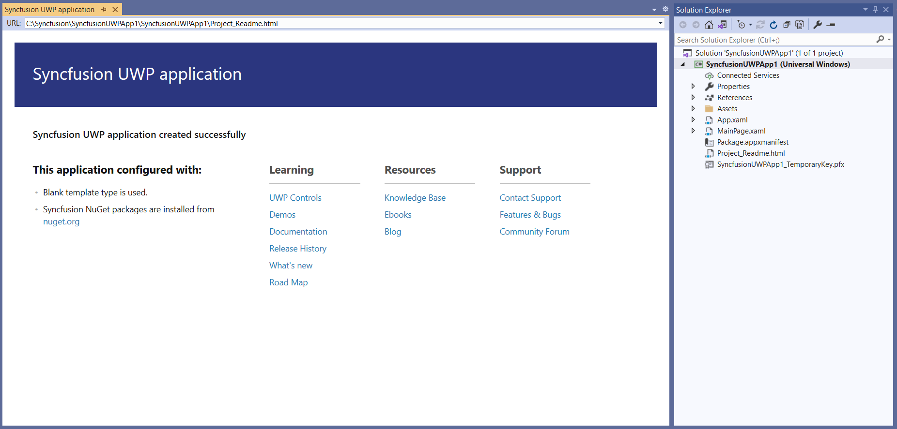

# Create UWP application

Syncfusion provides the **Visual Studio Project Templates** for the Syncfusion UWP platform to create the Syncfusion UWP Application adding required Syncfusion assemblies/NuGet based on the control chosen.  

I> The Syncfusion UWP project templates are available from v15.3.0.26.  

Use the following steps to create the Syncfusion UWP project through the Visual Studio Project Template:

> Before use the Syncfusion UWP Project Template, check whether the **UWP Extensions - Syncfusion** installed or not in Visual Studio Extension Manager by clicking on the Tools -> Extensions and Updates -> Installed for Visual Studio 2017 or lower and for Visual Studio 2019 by clicking on the Extensions -> Manage Extensions -> Installed.

1. To create a Syncfusion UWP project, follow either one of the options below:

   **Option 1:**   
   Click **Syncfusion Menu** and choose **Essential Studio for UWP > Create New Syncfusion Project…** in **Visual Studio**.
   
   

   N> In Visual Studio 2019, Syncfusion menu is available under Extensions in Visual Studio menu.

   **Option 2:**  
   Choose **File > New > Project** and navigate to **Syncfusion > Windows Universal > Syncfusion Universal Windows Application** in **Visual Studio**.

   

2. Name the **Project** and choose the destination location if required, then click **OK**. 

3. Then Project Configuration Wizard appears. Choose the options to configure the Syncfusion Universal Windows Application by using the following Project Configuration dialog.

   **Project configurations**

   **Language:** Select the language, either Visual C# or Visual Basic.

   **Reference Type:** Select the reference type of UWP Project, either Assemblies or SDK.

   **Target Version:** Choose the Target Version of the UWP platform that your project is targeting. This sets the **TargetPlatformVersion** setting in your project file.

   **Minimum Version:** Choose the Minimum Version of the UWP platform that your project can work with. This sets the **TargetPlatformMinVersion** setting in your project file.

   **Template Type:** Select the template type of UWP Project, either Blank or Hamburger Menu or Hamburger Menu (MVVM).

   **Components:** Choose the required Syncfusion components to configure.
   
   
   
   N> If SDK is chosen as the reference type, then all the Syncfusion UWP controls will be added. So, you no need to select any components.
   
4. After click **Create** button, the Syncfusion UWP Application is created with required SDK/references and pages.

   

   

5. Then, Syncfusion licensing registration required message box will be shown, if you installed the trial setup or NuGet packages since Syncfusion introduced the licensing system from 2018 Volume 2 (v16.2.0.41) Essential Studio release. Navigate to the  [help topic](https://help.syncfusion.com/common/essential-studio/licensing/license-key#how-to-generate-syncfusion-license-key), which is shown in the licensing message box to generate and register the Syncfusion license key to your project. Refer to this [blog](https://blog.syncfusion.com/post/Whats-New-in-2018-Volume-2-Licensing-Changes-in-the-1620x-Version-of-Essential-Studio.aspx) post for understanding the licensing changes introduced in Essential Studio.

      

