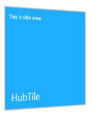

# HubTileBase

`HubTileBase` is the base of all the four tiles under Syncfusion.SfHubTile.UWP assembly. It provides some basic functionalities that are found in the live tiles of windows 8 start screen. The following support are common and applicable to all the tiles such as `SfHubTile`, `SfMosaicTile`,
 `SfSplitMosaicTile` and `SfPulsingTile`.

## Dealing with flip effect

On pressing, the tile is flipped based on the point of press. This behavior can be customized using `RotationDepth`, `TilePressDuration` and `ScaleDepth` properties.

### Rotation Depth

Rotation depth can be used to customize the depth of the flip effect while pressing the edges of the tile.





<notification:SfHubTile x:Name="hubTile" Foreground="White" 

RotationDepth="40"

Title="This is title area."

Header="HubTile" /> 
   








hubTile.RotationDepth = 40.0;





hubTile.RotationDepth = 40.0





### Scale Depth

Scale depth can be used to customize the depth of the flip effect while pressing the center of tile.





<notification:SfHubTile x:Name="hubTile" Foreground="White" 

ScaleDepth="1.2

Title="This is title area."

Header="HubTile" />









hubTile.ScaleDepth = 1.2;





hubTile.ScaleDepth = 1.2





### Tile press duration

Tile press duration is the time taken for the tile press animation to take place. Tile press animation happens separately for pointer down and pointer up. It can be set using `TilePressDuration` property in `HubTileBase`. 





<notification:SfPulsingTile x:Name="pulsingTile" TilePressDuration="0:0:5"/>









pulsingTile.TilePressDuration = TimeSpan.FromSeconds(5);





pulsingTile.TilePressDuration = TimeSpan.FromSeconds(5)





### Disabling flip effect 

The flip effect can be enabled or disabled using `OverrideDefaultStates` property. To disable this press behavior, set the `OverrideDefaultStates` property to `true`. 





<notification:SfHubTile x:Name="hubTile" Header="HubTile" OverrideDefaultStates="true"/>









hubTile.OverrideDefaultStates = true;





hubTile.OverrideDefaultStates = True





## Pausing and resuming animations 

A tile is said to be frozen when the animation pauses until it is resumed. All the hub tiles can be frozen and unfrozen using `IsFrozen` property from HubTileBase class. 

### IsFrozen 

`IsFrozen` property is used to freeze and unfreeze a single tile i.e., freezing the animation. By default, `IsFrozen` is false and set to true for freezing the tile. Here is an example code for freezing `SfHubTile`.





<notification:SfHubTile x:Name="hubTile" Interval="0:0:1" IsFrozen="true"

ImageSource="Assets/New Mail.png" 

Title="This is title area."

Header="HubTile">

<notification:SfHubTile.HubTileTransitions>

<transitions:RotateTransition/>

<transitions:SlideTransition/>

<transitions:FadeTransition/>

</notification:SfHubTile.HubTileTransitions>

</notification:SfHubTile>









hubTile.IsFrozen = true;





hubTile.IsFrozen = True





### Group name

Several hub tiles can be grouped using the property `GroupName`. A group of tiles can be frozen by a single line of code using the `GroupName`. 





<notification:SfHubTile x:Name="hubTileOne" GroupName="Applications"

ImageSource="Assets/New Mail.png"

Title="This is title area."

Header="HubTile"/>

<notification:SfHubTile x:Name="hubTileTwo" GroupName="Applications"

ImageSource="Assets/New Mail.png"

Title="This is title area."

Header="HubTile"/>









hubTileOne.GroupName="Applications";

hubTileTwo.GroupName="Applications";





hubTileOne.GroupName="Applications"

hubTileTwo.GroupName="Applications"





## HubTileService

The helper class `HubTileService` provides a way to freeze and unfreeze the animation in single or a group of tiles.

### Pausing and resuming transitions 

A tile is said to be frozen when the animation pauses as it is and resumes after unfreezing. All the hub tiles can be frozen and unfrozen using `Freeze` and `Unfreeze` methods in `HubTileService` class. 

**Freezing the tile**

`Freeze` method is used to freeze a single or a group of tiles. There are two definitions for `Freeze` method. They are

* Void Freeze(HubTileBase tile) – used to freeze a tile





HubTileService.Freeze(hubTile);





HubTileService.Freeze(hubTile)





* Void Freeze(string groupname) – used to freeze a group of tile





HubTileService.Freeze("Applications");





HubTileService.Freeze("Applications")





**Unfreezing the tile**

`UnFreeze` method is used to unfreeze a single or a group of tiles. There are two definitions for `UnFreeze` method. They are

* Void UnFreeze(HubTileBase tile) – used to unfreeze a tile





HubTileService.UnFreeze(hubTile);





HubTileService.UnFreeze(hubTile)





* Void UnFreeze(string groupname) – used to unfreeze a group of tile





HubTileService.UnFreeze("Applications");





HubTileService.UnFreeze("Applications")





## Press notification

When tile is pressed, it is notified by `Click` event. It also provides Command and CommandParameter support.

### Click event

When a tile is pressed `Click` event is fired.





<notification:SfPulsingTile x:Name="pulsingTile" Click="pulsingTile_Click"/>









private void pulsingTile_Click(object sender, RoutedEventArgs e)

{

}





Private Sub pulsingTile_Click(ByVal sender As Object, ByVal e As RoutedEventArgs)

End Sub





### Command and CommandParameter

`Command` and `CommandParameter` properties are used instead of `Click` event in MVVM pattern. 





<notification:SfPulsingTile Command="{Binding Command}" CommandParameter="Hello"/> 









public MainPage()

{

this.InitializeComponent();

command= new Syncfusion.UI.Xaml.Utils.DelegateCommand(MyCommand);

DataContext = this;

}

private ICommand command;

public ICommand Command

{

get { return command; }

set { command = value;}

}

public async void MyCommand(object parameter)

{

MessageDialog dialog = new MessageDialog(parameter.ToString());

await dialog.ShowAsync();

}





Public Sub New()

Me.InitializeComponent()

command_Renamed= New Syncfusion.UI.Xaml.Utils.DelegateCommand(AddressOf MyCommand)

DataContext = Me

End Sub

Private command_Renamed As ICommand

Public Property Command() As ICommand

Get
	Return command_Renamed
End Get

Set(ByVal value As ICommand)
	command_Renamed = value
End Set

End Property

Public Async Sub MyCommand(ByVal parameter As Object)

Dim dialog As New MessageDialog(parameter.ToString())

Await dialog.ShowAsync()

End Sub





## Appearance and Styling

### AccentBrush

`AccentBrush` property is used to decorate the hot spots of control with a solid color.





<notification:SfHubTile x:Name="hubTile" AccentBrush="CornflowerBlue"

ImageSource="Assets/New Mail.png" 

Title="This is title area."

Header="HubTile">

</notification:SfHubTile>









hubTile.AccentBrush = new SolidColorBrush(Windows.UI.Colors.CornflowerBlue);





hubTile.AccentBrush = New SolidColorBrush(Windows.UI.Colors.CornflowerBlue)





### TitleStyle

Title text is customized with `TitleStyle` property. It can be set as follows:





<notification:SfPulsingTile Title="Pulsing tile">

<notification:SfPulsingTile.TitleStyle>

</notification:SfPulsingTile.TitleStyle>

</notification:SfPulsingTile>





