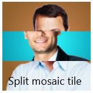
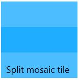

# SfSplitMosaicTile

## Overview

`SfSplitMosaicTile` control provides a way to integrate a tile similar to contacts group tile in Windows Phone home screen in application. It displays a collection of images in 3 horizontally stretched tiles. Each tile flip itself randomly to bring a new image.

### Features

Show images with flip transition effect 

## Getting Started

This section explains how to create mosaic picture with split transition using `SfSplitMosaicTile`.  

### Adding SfSplitMosaicTile control

Create a Universal Windows Platform project in Visual Studio and refer to the following assemblies.

* Syncfusion.SfHubTile.UWP

* Syncfusion.SfShared.UWP

1.Include the namespace for Syncfusion.SfHubTile.UWP assembly in MainPage.xaml





<Page xmlns="http://schemas.microsoft.com/winfx/2006/xaml/presentation"
      xmlns:x="http://schemas.microsoft.com/winfx/2006/xaml"
	  xmlns:notification="using:Syncfusion.UI.Xaml.Controls.Notification">
	  
</Page>





2.Now add the `SfSplitMosaicTile` control with a required optimal name using the included namespace





<notification:SfSplitMosaicTile x:Name="splitMosaicTile">





SfSplitMosaicTile splitMosaicTile = new SfSplitMosaicTile();





Dim splitMosaicTile As New SfSplitMosaicTile()





### Adding images to SfSplitMosaicTile

Store the images in project and set the properties `Header` and `ImageList` as given below:





<notification:SfSplitMosaicTile Width="183" Height="173"
                                Header="Split mosaic tile">
								
<notification:SfSplitMosaicTile.ImageList>

<notification:ImageList>

<x:String>Assets/employee10.png</x:String>
<x:String>Assets/employee11.png</x:String>
<x:String>Assets/employee12.png</x:String>
<x:String>Assets/employee13.png</x:String>
<x:String>Assets/employee1.png</x:String>
<x:String>Assets/employee2.png</x:String>
<x:String>Assets/employee3.png</x:String>
<x:String>Assets/employee4.png</x:String>
<x:String>Assets/employee5.png</x:String>
<x:String>Assets/employee6.png</x:String>
<x:String>Assets/employee7.png</x:String>
<x:String>Assets/employee8.png</x:String>
<x:String>Assets/employee9.png</x:String>

</notification:ImageList>

</notification:SfSplitMosaicTile.ImageList>

</notification:SfSplitMosaicTile>





## Configuring the tile

`SfSplitMosaicTile` can be configured with header and images as follows:

### Setting the header

`Header` property is used to set a display text at the bottom of the tile.





<notification:SfSplitMosaicTile Header="Split mosaic tile" x:Name="splitMosaicTile"/>









splitMosaicTile.Header = "Mosaic Tile";





splitMosaicTile.Header = "Mosaic Tile"





## Adding image collection

### Specifying BitmapImage or Image URLs

`IsBitmapImageList` property is used to specify whether the image location is given as URL or image source. Image sources are preferred when images are retrieved from folders like Downloads, Picture library, Video library, Document library and Music library.

### Setting Image URLs

`ImageList` property is used to set a collection of image URL that are to be displayed in tile. IsBitmapImageList property must be set to false while using image URLs otherwise images does not appear in mosaic tile.





<Page xmlns:x=http://schemas.microsoft.com/winfx/2006/xaml
      xmlns:notification="using:Syncfusion.UI.Xaml.Controls.Notification">

<Grid Background="{ThemeResource ApplicationPageBackgroundThemeBrush}">

<notification:SfSplitMosaicTile Header="Split mosaic tile"
                                x:Name="splitMosaicTile"
								IsBitmapImageList="false" >
								
<notification:SfSplitMosaicTile.ImageList>

<notification:ImageList>

<x:String>Assets/employee10.png</x:String>
<x:String>Assets/employee11.png</x:String>
<x:String>Assets/employee12.png</x:String>
<x:String>Assets/employee13.png</x:String>
<x:String>Assets/employee1.png</x:String>
<x:String>Assets/employee2.png</x:String>
<x:String>Assets/employee3.png</x:String>
<x:String>Assets/employee4.png</x:String>
<x:String>Assets/employee5.png</x:String>
<x:String>Assets/employee6.png</x:String>
<x:String>Assets/employee7.png</x:String>
<x:String>Assets/employee8.png</x:String>
<x:String>Assets/employee9.png</x:String>

</notification:ImageList>

</notification:SfSplitMosaicTile.ImageList>

</notification:SfSplitMosaicTile>

</Grid>

</Page>









splitMosaicTile.ImageList = new ImageList();

splitMosaicTile.ImageList.Add("Assets/employee10.png");

splitMosaicTile.ImageList.Add("Assets/employee11.png");

splitMosaicTile.ImageList.Add("Assets/employee12.png");

splitMosaicTile.ImageList.Add("Assets/employee13.png");

splitMosaicTile.ImageList.Add("Assets/employee1.png");

splitMosaicTile.ImageList.Add("Assets/employee2.png");

splitMosaicTile.ImageList.Add("Assets/employee3.png");

splitMosaicTile.ImageList.Add("Assets/employee4.png");

splitMosaicTile.ImageList.Add("Assets/employee5.png");

splitMosaicTile.ImageList.Add("Assets/employee6.png");

splitMosaicTile.ImageList.Add("Assets/employee7.png");

splitMosaicTile.ImageList.Add("Assets/employee8.png");

splitMosaicTile.ImageList.Add("Assets/employee9.png");





splitMosaicTile.ImageList = New ImageList()

splitMosaicTile.ImageList.Add("Assets/employee10.png")

splitMosaicTile.ImageList.Add("Assets/employee11.png")

splitMosaicTile.ImageList.Add("Assets/employee12.png")

splitMosaicTile.ImageList.Add("Assets/employee13.png")

splitMosaicTile.ImageList.Add("Assets/employee1.png")

splitMosaicTile.ImageList.Add("Assets/employee2.png")

splitMosaicTile.ImageList.Add("Assets/employee3.png")

splitMosaicTile.ImageList.Add("Assets/employee4.png")

splitMosaicTile.ImageList.Add("Assets/employee5.png")

splitMosaicTile.ImageList.Add("Assets/employee6.png")

splitMosaicTile.ImageList.Add("Assets/employee7.png")

splitMosaicTile.ImageList.Add("Assets/employee8.png")

splitMosaicTile.ImageList.Add("Assets/employee9.png")





### Setting ImageSource

`BitmapImageList` property is used to set a collection of image sources that are to be displayed in the tile. IsBitmapImageList property must be set to true while using image sources otherwise images does not appear in mosaic tile.





<notification:SfSplitMosaicTile Header="Split mosaic tile"
                                IsBitmapImageList="true"
								x:Name="splitMosaicTile"/>









public MainPage()

{

this.InitializeComponent();
 
BitmapImageList list = new BitmapImageList();

for(int i=1; i<=13;i++)

list.Add(new Image() { Source = new BitmapImage() { UriSource = new Uri("ms-appx:///Assets/employee"+i+".png", UriKind.Absolute) } });

splitMosaicTile.BitmapImageList = list;

}





Public Sub New()

Me.InitializeComponent()

Dim list As New BitmapImageList()

For i As Integer = 1 To 13

list.Add(New Image() With {
	.Source = New BitmapImage() With {.UriSource = New Uri("ms-appx:///Assets/employee" & i & ".png", UriKind.Absolute)}
})
Next i

splitMosaicTile.BitmapImageList = list

End Sub





## Checking image existence

Image URLs can be checked for existence using CheckForExistence method before adding to avoid duplicate images. This method returns true if the URL already exists otherwise false.





splitMosaicTile.CheckForExistence("Assets/employee1.png");





splitMosaicTile.CheckForExistence("Assets/employee1.png")





## Setting interval for flip transition

`Animation` interval for flip transition can be changed using Interval property. It can be set as follows:





<notification:SfSplitMosaicTile x:Name="splitMosaicTile" Interval="0:0:5"/>









splitMosaicTile.Interval = TimeSpan.FromSeconds(5);





splitMosaicTile.Interval = TimeSpan.FromSeconds(5)





Flip effect customization, tile click & command, pausing and resuming animation, AccentBrush,TitleStyle topics are available under HubTileBase section.

