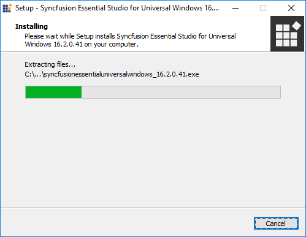
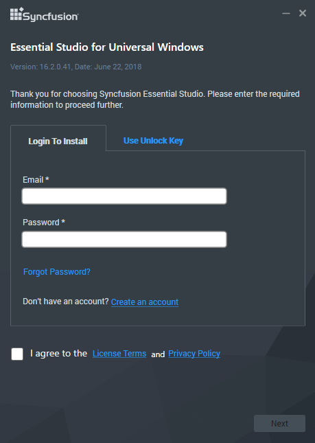
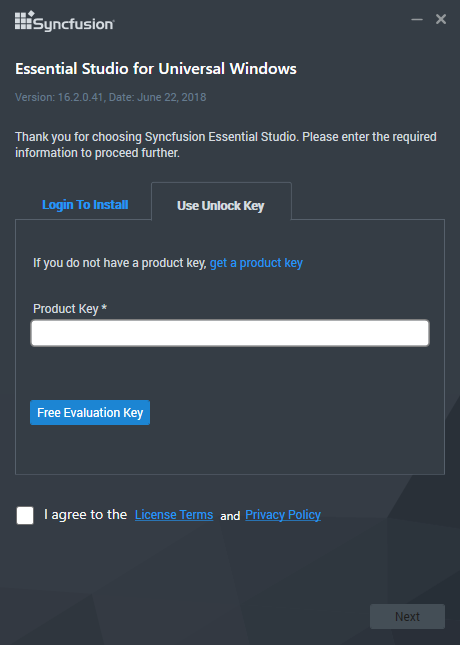
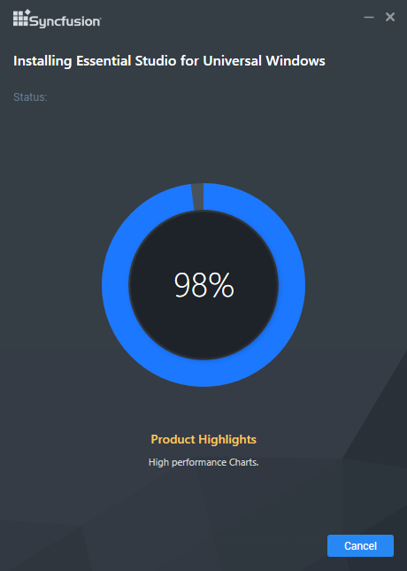
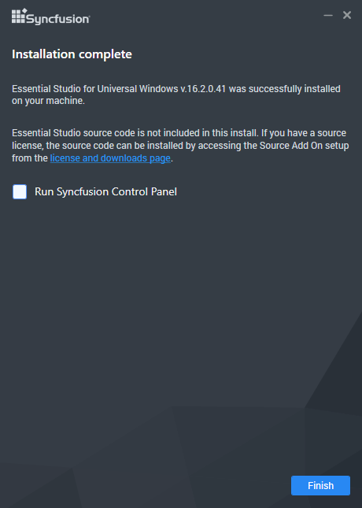

# Installation using Offline Installer

## Installing with UI   

The following procedure illustrates how to install Essential Studio UWP platform.

1. Close all the running Visual Studio instances.

2. Double-click the Syncfusion UWP platform Setup file. The Setup Wizard opens and extracts the package automatically.

   

   N> The Setup wizard extracts the syncfusionessentialuwp_(version).exe dialog, displaying the unzip operation of the package.

3. You have two options to unlock the Syncfusion setup:

   
* *Login To Install*
   
* *Use Unlock Key*
   
   
   
   **Login To Install**
   
   You should enter your Syncfusion Direct-Trac login credentials. If you don't have Syncfusion Direct-Trac login credentials, then you can click on Sign Up to a create new account. Else if you forgot your password, click on Reset Password to create new password. Here Email address and Password is validated and the Platform Selection window opens.

      

   **Use Unlock Key**
   
   You should use the Syncfusion License/Trial key. Trial key is valid for 30 days and the installer won't accept the expired trial key. Licensed customer can generate key from [here](https://www.syncfusion.com/kb/2326).

      

4. After reading the License Terms and Conditions, check the **I agree to the License Terms and Conditions** check box.

5. Click Next. Select the Installation, Samples Folder and Advanced Options screen opens. To install in the displayed default location, click Install

    

    N> From the 2018 Volume 2 release, Syncfusion has changed the install and samples location 
	   **Default Install location:** {ProgramFilesFolder}\Syncfusion\{Platform}\{version}
	   **Default Samples location:** C:\Users\Public\Documents\Syncfusion\{platform}\{version}
	   However, you can change the locations by clicking browse button.

   * Select the **Install Syncfusion Samples** check box to install Syncfusion samples, or leave the check box clear, when you do not want to install Syncfusion samples.
   * Select the **Install Syncfusion Extensions** checkbox to configure the Syncfusion Extensions in Visual Studio or clear this check box when you do not want to configure the Syncfusion Extensions in Visual Studio.

6.  Click Install.

    

7. The Completed screen is displayed once the Xamarin platform is installed.

    

8. Select the **Run Syncfusion Control Panel** check box to launch the Syncfusion Control Panel after installing.

9. Click Finish. Syncfusion Xamarin platform is installed in your system and the Syncfusion Essential Studio [Syncfusion Control Panel](http://help.syncfusion.com/common/essential-studio/utilities#dashboard ) is launched automatically.

## Installing in silent mode

The Syncfusion Essential Studio Platform Installer supports installing/uninstalling the setup through Command Line. The following sections illustrate this ability. 

### Command Line Installation

Follow the steps below to install through Command Line in Silent mode.

1. Double-click the Syncfusion Essential Studio platform setup file. The Setup Wizard opens and extracts the package automatically. 
2. The syncfusionessentialuwp_(version).exe file is extracted into the Temp folder.
3. Run %temp%. The Temp folder will open. The syncfusionessentialuwp_(version).exe file is available in one of the folders.
4. Copy the extracted syncfusionessentialuwp_(version).exe file in local drive.
5. Cancel the Wizard.
6. Open the Command Prompt in administrator mode and pass the following arguments.

   
   **Arguments:** “Setup file path\SyncfusionEssentialStudio(platform)_(version).exe” /Install silent /PIDKEY:“(product unlock key)” [/log “{Log file path}”] [/InstallPath:{Location to install}] [/InstallSamples:{true/false}] [/InstallAssemblies:{true/false}] [/UninstallExistAssemblies:{true/false}] [/InstallToolbox:{true/false}]

   N> [..] – Arguments inside the square brackets are optional.

   **Example:** “D:\Temp\syncfusionessentialuwp_x.x.x.x.exe” /Install silent /PIDKEY:“product unlock key” /log “C:\Temp\EssentialStudio_Platform.log” /InstallPath:C:\Syncfusion\x.x.x.x /InstallSamples:true /InstallAssemblies:true /UninstallExistAssemblies:true /InstallToolbox:true

	
7. Setup is installed.

   N> x.x.x.x needs to be replaced with the Essential Studio version and the Product Unlock Key needs to be replaced with the Unlock Key for that version.
   

### Command Line Uninstallation

Syncfusion Essential Studio supports uninstalling the setup through Command Line in Silent mode. The following steps illustrate this. 

1. When you do not have the extracted setup (syncfusionessentialuwp_(version).exe) then follow the steps from 2 to 7.
2. Double-click the Syncfusion Essential Studio platform setup file. The Setup Wizard opens and extracts the package automatically.
3. The syncfusionessentialuwp_(version).exe file is extracted into the Temp folder.
4. Run %temp%. The Temp folder will open. The syncfusionessentialuwp_(version).exe file is available in one of the folders.
5. Copy the syncfusionessentialuwp_(version).exe file in local drive. 
6. Cancel the Wizard.
7. Open the Command Prompt in administrator mode and pass the following arguments.
   
   **Arguments:** “Copied setup file path\syncfusionessentialuwp_(version).exe” /uninstall silent 

   **Example:** “D:\Temp\syncfusionessentialuwp_x.x.x.x.exe" /uninstall silent

8. Setup is uninstalled.

   N> x.x.x.x needs to be replaced with the Essential Studio version installed in your machine.
   
   
## Explore the libraries package

You can find the Syncfusion libraries, samples and NuGet from the installed location in Windows.

{Essential Studio installed location}\Syncfusion\Essential Studio\{version}\Xamarin

* **"lib"** folder - e.g., C:\Program Files (x86)\Syncfusion\Essential Studio\16.2.0.41\Xamarin\lib

   It contains all the required libraries for Xamarin.iOS, Xamarin.Android, and Xamarin.Forms projects.
   
* **"nuget"** folder - e.g., C:\Users\Public\Documents\Syncfusion\16.2.0.41\Xamarin\nuget

   It contains the above libraries as NuGet packages. The same NuGet packages also can be configured from online [nuget.org](https://api.nuget.org/v3/index.json).
   
* **"sample"** folder - e.g., C:\Users\Public\Documents\Syncfusion\16.2.0.41\Xamarin\sample

   It contains the sample applications for our controls in Xamarin.iOS, Xamarin.Android, and Xamarin.Forms platforms in iOS, Android, and Forms folders, respectively.

The "Forms" directory includes,

* Individual control sample folders: It contains the samples for individual controls such as SfChart, SfDataGrid, etc. Since they represent the individual controls, these samples are light-weighted. You can check the samples for your required controls alone faster with minimum deployment time.

* “nuget” folder: It contains the compiled assemblies of the above samples as NuGet package. It is referred in the common sample browser as explained in the next step.

* “SampleBrowser” folder: It contains common sample browser, which refers the individual control's samples as NuGet package. Run this to see the demo samples of all the controls in single application.

* It also contains showcase samples such as Patient Monitor, Server Monitor, and Invoice.

### Add reference to the project

You can then add the assembly references to the respective projects such as PCL, XForms.Droid, XForms.iOS and XForms.UWP. You can find the dependencies for each control from this [link](https://help.syncfusion.com/uwp/introduction/control-dependencies).

I> After adding the reference, currently, an additional step is required for iOS and UWP projects. For example, if we are using SfKanban, we need to call the Init method of SfKanbanRenderer as shown in this [KB article](https://www.syncfusion.com/kb/7171).

I> For UWP alone, one more additional step is required if the project is built in release mode with .NET Native tool chain enabled. For example, if we are using SfKanban, you can refer the [KB article](https://www.syncfusion.com/kb/7170) for more details.

## Copy Local

Copying assemblies to local folder is supported by Syncfusion components. It can be achieved by setting the assembly’s Copy Local property to true, so that it can be copied to Bin\Release, Bin\Debug folders. The files .exe, .dll, .xml, .pri, rd.xml, .xaml  are copied to client machines.

## Installed Location

The following table represents installed location of Assemblies and Samples.

<table>
<tr>
<td>
**Assemblies/Samples**</td><td>
**Installed location**</td></tr>
<tr>
<td>
SDK package</td><td>
C:\Program Files (x86)\Syncfusion\Essential Studio\Universal Windows\{{ site.releaseversion }}\10.0\SDK</td></tr>
<tr>
<td>
Assemblies</td><td>
C:\Program Files (x86)\Syncfusion\Essential Studio\Universal Windows\{{ site.releaseversion }}\Assemblies for Universal Windows\10.0</td></tr>
<tr>
<td>
Samples</td><td>
[drive]:\Users\Public\Documents\Syncfusion\EssentialStudio\UWP\{{ site.releaseversion }}\SampleBrowser</td></tr>
</table>

N> In above table, Latest Essential Studio version details has been provided. User can refer installed Essential Studio version instead of mentioned version.

