# Adornments

Chart adornments are used to display values related to a chart segment element. Values from data point(x, y) or other custom properties from a data source can be displayed. 

You can initialize the adornment as in the below code snippet:





<syncfusion:ColumnSeries  Interior="#777777"

ItemsSource="{Binding Demands}"  

XBindingPath="Demand" 

YBindingPath="Year2011">

<syncfusion:ColumnSeries.AdornmentsInfo>

<syncfusion:ChartAdornmentInfo></syncfusion:ChartAdornmentInfo>

</syncfusion:ColumnSeries.AdornmentsInfo>

</syncfusion:ColumnSeries>





ColumnSeries series = new ColumnSeries()
{

    ItemsSource = new ViewModel().Demands,

    XBindingPath = "Demand",

    YBindingPath = "Year2011",

    Interior = new SolidColorBrush(Color.FromRgb(0x77, 0x77, 0x77))

};

ChartAdornmentInfo adornmentInfo = new ChartAdornmentInfo();

series.AdornmentsInfo = adornmentInfo;

chart.Series.Add(series);





Each adornment can be represented by the following:

* Marker- Displays the desired symbol at the (X, Y) point.
* Label - Displays the segment label content at the (X, Y) point.
* ConnectorLine - Line used to connect the (X, Y) point and the label element.

The following topics discuss briefly about various adornment customization.

## Marker

To enable the marker in adornments you have to set the `ShowMarker` property as True. By default, there is no symbol displayed, you have to add the desired symbol using Symbol property.

The following code example demonstrates the column series with Diamond symbol:





<syncfusion:ColumnSeries  Interior="#777777"

ItemsSource="{Binding Demands}"  

XBindingPath="Demand" 

YBindingPath="Year2011">

<syncfusion:ColumnSeries.AdornmentsInfo>

<syncfusion:ChartAdornmentInfo ShowMarker="True" SymbolInterior="Black" Symbol="Diamond"></syncfusion:ChartAdornmentInfo>

</syncfusion:ColumnSeries.AdornmentsInfo>

</syncfusion:ColumnSeries>    





ColumnSeries series = new ColumnSeries()
{

    ItemsSource = new ViewModel().Demands,

    XBindingPath = "Demand",

    YBindingPath = "Year2011",

    Interior = new SolidColorBrush(Color.FromRgb(0x77, 0x77, 0x77))

};

ChartAdornmentInfo adornmentInfo = new ChartAdornmentInfo()
{

    ShowMarker = true,

    SymbolInterior = new SolidColorBrush(Colors.Black),

    Symbol = ChartSymbol.Diamond

};

series.AdornmentsInfo = adornmentInfo;

chart.Series.Add(series);





### Customization

SfChart provide support more customization for markers in adornments. 

You can customize the marker size using `SymbolHeight` and `SymbolWidth` property. Also the marker fill color and stroke can be customized using `SymbolInterior` and `SymbolStroke`.





<syncfusion:LineSeries  Interior="#777777"

ItemsSource="{Binding Demands}"  

XBindingPath="Demand" 

YBindingPath="Year2011">

<syncfusion:LineSeries.AdornmentsInfo>

<syncfusion:ChartAdornmentInfo SymbolStroke="Black"

SymbolInterior="DarkGray"

SymbolWidth="10"                                                   

SymbolHeight="10"

Symbol="Ellipse"></syncfusion:ChartAdornmentInfo>

</syncfusion:LineSeries.AdornmentsInfo>

</syncfusion:LineSeries>   





LineSeries series = new LineSeries()
{

    ItemsSource = new ViewModel().Demands,

    XBindingPath = "Demand",

    YBindingPath = "Year2011",

    Interior = new SolidColorBrush(Color.FromRgb(0x77, 0x77, 0x77))

};

ChartAdornmentInfo adornmentInfo = new ChartAdornmentInfo()
{

    ShowMarker = true,

    SymbolStroke = new SolidColorBrush(Colors.Black),

    SymbolInterior = new SolidColorBrush(Colors.DarkGray),

    SymbolHeight = 10,

    SymbolWidth = 10,

    Symbol = ChartSymbol.Ellipse

};

series.AdornmentsInfo = adornmentInfo;

chart.Series.Add(series);





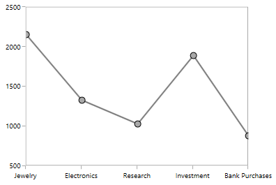

**Custom Template**

You can also provide the template for the symbol using `SymbolTemplate` property as in the below code snippet.





<syncfusion:SfChart>

    <syncfusion:SfChart.Resources>

         <DataTemplate x:Key="symbolTemplate">

            <Grid>

                <Grid Name="backgroundGrid" Width="24" Height="24" Visibility="Visible">

                     <Ellipse Fill="#FFE2DBDB" Name="Fill" Visibility="Visible" />

                </Grid>

                     <Path Stretch="Uniform" Fill="#FF0F0E0E" Width="24" Height="24" Margin="0,0,0,0" RenderTransformOrigin="0.5,0.5">

                          <Path.Data>

                            <PathGeometry FillRule="Nonzero" Figures="M23.9296875,10.6165618896484L20.759765625,11.2200794219971 18.09375,
                            13.0306243896484 16.283203125,15.6966400146484 15.6796875,18.8665618896484 16.283203125,
                            22.0423431396484 18.09375,24.7259368896484 20.759765625,26.5540618896484 23.9296875,27.1634368896484 27.1025371551514,
                            26.5540618896484 29.77734375,24.7259368896484 31.5966796875,22.0423431396484 32.203125,18.8665618896484 31.5966796875,
                            15.6966400146484 29.77734375,13.0306243896484 27.1025371551514,11.2200794219971 23.9296875,10.6165618896484z M25.265625,
                            7.35874938964844L26.6953125,9.86656188964844 29.3671875,8.64781188964844 29.765625,11.4837493896484 32.7421875,
                            11.2728118896484 32.015625,14.1790618896484 34.921875,14.9759368896484 33.1875,17.4134368896484 35.578125,
                            19.1478118896484 33.140625,20.7884368896484 34.640625,23.3665618896484 31.8046875,23.9759368896484 32.3203125,
                            26.9759368896484 29.4375,26.5540618896484 28.921875,29.4837493896484 26.25,27.9603118896484 24.75,
                            30.4681243896484 22.8046875,28.2181243896484 20.5078125,30.0228118896484 19.5703125,27.1634368896484 16.640625,
                            28.0306243896484 16.875,25.1009368896484 13.875,24.7728118896484 15.140625,22.1478118896484 12.421875,
                            20.7415618896484 14.5546875,18.6790618896484 12.4921875,16.5228118896484 15.2578125,15.3040618896484 14.203125,
                            12.5384368896484 17.1328125,12.3978118896484 17.1328125,9.42124938964844 19.921875,10.4056243896484 21.046875,
                            7.61656188964844 23.296875,9.49156188964844 25.265625,7.35874938964844z" />

                        </Path.Data>

                        <Path.RenderTransform>

                            <TransformGroup>

                                    <TransformGroup.Children>

                                        <RotateTransform Angle="0" />

                                        <ScaleTransform ScaleX="1" ScaleY="1" />

                                    </TransformGroup.Children>

                                </TransformGroup>

                            </Path.RenderTransform>

                        </Path>

                    </Grid>

                </DataTemplate>

     </syncfusion:SfChart.Resources>

            
    <syncfusion:ColumnSeries  Label="2011" Interior="#777777"
                                      
                              ItemsSource="{Binding Demands}"  
                                
                              XBindingPath="Demand" 
                                      
                              YBindingPath="Year2011">

         <syncfusion:ColumnSeries.AdornmentsInfo>

                    <syncfusion:ChartAdornmentInfo AdornmentsPosition="Top"
                    
                                                   SymbolTemplate="{StaticResource symbolTemplate}">

                    </syncfusion:ChartAdornmentInfo>

         </syncfusion:ColumnSeries.AdornmentsInfo>

    </syncfusion:ColumnSeries>

</syncfusion:SfChart>
        




ColumnSeries series = new ColumnSeries()
{

    ItemsSource = new ViewModel().Demands,

    XBindingPath = "Demand",

    YBindingPath = "Year2011",

    Label = "2011",

    Interior = new SolidColorBrush(Color.FromRgb(0x77, 0x77, 0x77))

};

ChartAdornmentInfo adornmentInfo = new ChartAdornmentInfo()
{

    AdornmentsPosition = AdornmentsPosition.Top,

    SymbolTemplate = chart.Resources["symbolTemplate"] as DataTemplate

};

series.AdornmentsInfo = adornmentInfo;

chart.Series.Add(series);





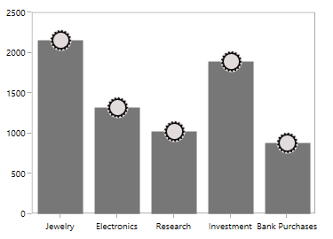

## Label

Label represents the text in the adornments which helps to identify the segment based on it y or x value. You can enable the label by setting `ShowLabel` property as true as in the below code example.





<syncfusion:ColumnSeries  Label="2011" Interior="#777777"

ItemsSource="{Binding Demands}"  

XBindingPath="Demand" 

YBindingPath="Year2011">

<syncfusion:ColumnSeries.AdornmentsInfo>

<syncfusion:ChartAdornmentInfo AdornmentsPosition="Top" ShowLabel="True" >

</syncfusion:ChartAdornmentInfo>

</syncfusion:ColumnSeries.AdornmentsInfo>

</syncfusion:ColumnSeries>





ColumnSeries series = new ColumnSeries()
{

    ItemsSource = new ViewModel().Demands,

    XBindingPath = "Demand",

    YBindingPath = "Year2011",

    Label = "2011",

    Interior = new SolidColorBrush(Color.FromRgb(0x77, 0x77, 0x77))

};

ChartAdornmentInfo adornmentInfo = new ChartAdornmentInfo()
{

    AdornmentsPosition = AdornmentsPosition.Top,

    ShowLabel = true

};

series.AdornmentsInfo = adornmentInfo;

chart.Series.Add(series);





### Defining the Label Content

SfChart provides the support to customize the label content using `SegmentLabelContent` property. This property allows you to define the value to be displayed as adornment label.

**XValue**





<syncfusion:ColumnSeries  Label="2011" Interior="#777777"

ItemsSource="{Binding Demands}"  

XBindingPath="Demand" 

YBindingPath="Year2011">

<syncfusion:ColumnSeries.AdornmentsInfo>

<syncfusion:ChartAdornmentInfo AdornmentsPosition="Top" SegmentLabelContent="XValue" ShowLabel="True" >

</syncfusion:ChartAdornmentInfo>

</syncfusion:ColumnSeries.AdornmentsInfo>

</syncfusion:ColumnSeries>





ColumnSeries series = new ColumnSeries()
{

    ItemsSource = new ViewModel().Demands,

    XBindingPath = "Demand",

    YBindingPath = "Year2011",

    Label = "2011",

    Interior = new SolidColorBrush(Color.FromRgb(0x77, 0x77, 0x77))

};

ChartAdornmentInfo adornmentInfo = new ChartAdornmentInfo()
{

    AdornmentsPosition = AdornmentsPosition.Top,

    ShowLabel = true,

    SegmentLabelContent = LabelContent.XValue

};

series.AdornmentsInfo = adornmentInfo;

chart.Series.Add(series);





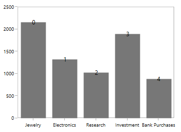

N>For CategoryAxis, the x values will be taken as the index since it is an indexed based axis. If it is a numerical axis or date time the corresponding x value will be displayed.

**Percentage**





<syncfusion:ColumnSeries  Label="2011" Interior="#777777"

ItemsSource="{Binding Demands}"  

XBindingPath="Demand" 

YBindingPath="Year2011">

<syncfusion:ColumnSeries.AdornmentsInfo>

<syncfusion:ChartAdornmentInfo AdornmentsPosition="Top" SegmentLabelContent="Percentage" ShowLabel="True" >

</syncfusion:ChartAdornmentInfo>

</syncfusion:ColumnSeries.AdornmentsInfo>

</syncfusion:ColumnSeries>





ColumnSeries series = new ColumnSeries()
{

    ItemsSource = new ViewModel().Demands,

    XBindingPath = "Demand",

    YBindingPath = "Year2011",

    Label = "2011",

    Interior = new SolidColorBrush(Color.FromRgb(0x77, 0x77, 0x77))

};

ChartAdornmentInfo adornmentInfo = new ChartAdornmentInfo()
{

    AdornmentsPosition = AdornmentsPosition.Top,

    ShowLabel = true,

    SegmentLabelContent = LabelContent.Percentage

};

series.AdornmentsInfo = adornmentInfo;

chart.Series.Add(series);





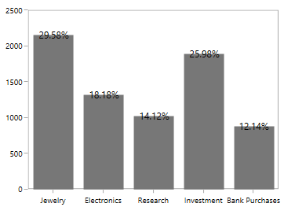

**YofTot**





<syncfusion:ColumnSeries  ItemsSource="{Binding Demands}"  

XBindingPath="Demand" 

YBindingPath="Year2011">

<syncfusion:ColumnSeries.AdornmentsInfo>

<syncfusion:ChartAdornmentInfo AdornmentsPosition="Top" SegmentLabelContent="YofTot" ShowLabel="True" >

</syncfusion:ChartAdornmentInfo>

</syncfusion:ColumnSeries.AdornmentsInfo>

</syncfusion:ColumnSeries>





ColumnSeries series = new ColumnSeries()
{

    ItemsSource = new ViewModel().Demands,

    XBindingPath = "Demand",

    YBindingPath = "Year2011",

    Label = "2011",

    Interior = new SolidColorBrush(Color.FromRgb(0x77, 0x77, 0x77))

};

ChartAdornmentInfo adornmentInfo = new ChartAdornmentInfo()
{

    AdornmentsPosition = AdornmentsPosition.Top,

    ShowLabel = true,

    SegmentLabelContent = LabelContent.YofTot

};

series.AdornmentsInfo = adornmentInfo;

chart.Series.Add(series);





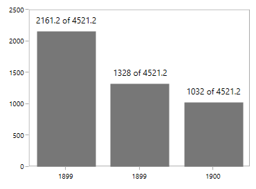

**DateTime**





<syncfusion:ColumnSeries ItemsSource="{Binding Demands}"   XBindingPath="Date"  

YBindingPath="Year2011">

<syncfusion:ColumnSeries.AdornmentsInfo>

<syncfusion:ChartAdornmentInfo ShowLabel="True" 

SegmentLabelContent="DateTime" >

</syncfusion:ChartAdornmentInfo>

</syncfusion:ColumnSeries.AdornmentsInfo>

</syncfusion:ColumnSeries>





ColumnSeries series = new ColumnSeries()
{

    ItemsSource = new ViewModel().Demands,

    XBindingPath = "Date",

    YBindingPath = "Year2011",
};

ChartAdornmentInfo adornmentInfo = new ChartAdornmentInfo()
{

    ShowLabel = true,

    SegmentLabelContent = LabelContent.DateTime

};

series.AdornmentsInfo = adornmentInfo;

chart.Series.Add(series);





N> If you are having DateTimeAxis then the corresponding date time value will be displayed. In case of category or numerical axis the value will be converted to OADate.

**LabelContentPath**

LabelContentPath property by default displays the y value. If you need to specify the value other than y value you can define the `LabelTemplate` where you can retrieve the adornment value of every segment. 

The following code example demonstrates displaying the string value which is taken as x values.





<syncfusion:PieSeries ItemsSource="{Binding Demands}" XBindingPath="Demand"  YBindingPath="Year2011">

<syncfusion:PieSeries.AdornmentsInfo>

<syncfusion:ChartAdornmentInfo ShowLabel="True"  ShowConnectorLine="True" 

SegmentLabelContent="LabelContentPath"

LabelPosition="Auto"

Foreground="Black"  >

<syncfusion:ChartAdornmentInfo.LabelTemplate>

<DataTemplate >

<Border CornerRadius="2" BorderBrush="Black" BorderThickness="1" Background="LightGray" >

<TextBlock HorizontalAlignment="Center" FontSize="11" Foreground="Black" Text="{Binding Converter={StaticResource con}}"></TextBlock>

</Border>

</DataTemplate>

</syncfusion:ChartAdornmentInfo.LabelTemplate>

</syncfusion:ChartAdornmentInfo>

</syncfusion:PieSeries.AdornmentsInfo>

</syncfusion:PieSeries>





public class convert : IValueConverter

{

public object Convert(object value, Type targetType, object parameter, System.Globalization.CultureInfo culture)

{

    ChartPieAdornment adornment= value as ChartPieAdornment;

    return (adornment.Item as GoldDemand).Demand ;

}

public object ConvertBack(object value, Type targetType, object parameter, System.Globalization.CultureInfo culture)

{

return value;

}

}





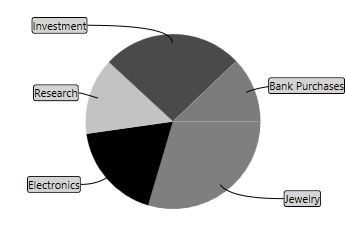

**Label Rotation**

`LabelRotationAngle` property is used to define the angle to which the label has to rotate. The following code demonstrates the label rotating angle.





<syncfusion:ColumnSeries.AdornmentsInfo>

<syncfusion:ChartAdornmentInfo  ShowLabel="True" LabelPosition="Outer" LabelRotationAngle="45" >

</syncfusion:ChartAdornmentInfo>

</syncfusion:ColumnSeries.AdornmentsInfo>





ChartAdornmentInfo adornmentInfo = new ChartAdornmentInfo()
{

    ShowLabel = true,

    LabelPosition = AdornmentsLabelPosition.Outer,

    LabelRotationAngle = 45

};





### Customization

The following properties are used to customize the adornment label.

* `BorderBrush`
* `BorderThickness`
* `Margin`
* `FontStyle`
* `FontSize`
* `Foreground`
* `FontFamily`

The following code example demonstrates the customization of label using the above properties:





<syncfusion:ColumnSeries  Label="2011"

Interior="#777777"

ItemsSource="{Binding Demands}" 

XBindingPath="Date"  

YBindingPath="Year2011">

<syncfusion:ColumnSeries.AdornmentsInfo>

<syncfusion:ChartAdornmentInfo ShowLabel="True" LabelPosition="Outer" 

Foreground="Black" 

FontSize="11"

Background="DarkGray"

FontFamily="Calibri"

BorderBrush="Black"

BorderThickness="1"

Margin="1"

FontStyle="Italic" 

>

</syncfusion:ChartAdornmentInfo>

</syncfusion:ColumnSeries.AdornmentsInfo>

</syncfusion:ColumnSeries>





ChartAdornmentInfo adornmentInfo = new ChartAdornmentInfo()
{

    ShowLabel = true,

    LabelPosition = AdornmentsLabelPosition.Outer,

    Foreground = new SolidColorBrush(Colors.Black),

    BorderBrush = new SolidColorBrush(Colors.Black),

    Background = new SolidColorBrush(Colors.DarkGray),

    BorderThickness = new Thickness(1),

    Margin = new Thickness(1),

    FontStyle = FontStyles.Italic,

    FontFamily = new FontFamily("Calibri"),

    FontSize = 11

};

series.AdornmentsInfo = adornmentInfo;





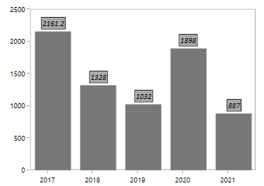

## Applying Series Brush

`UseSeriesPalette` property is used to set the interior of the series to the adornment background. 

For Accumulation like Pie, Doughnut, Funnel and Pyramid the segment interior color will be reflected in adornment background.





<syncfusion:PieSeries.AdornmentsInfo>

<syncfusion:ChartAdornmentInfo ShowLabel="True" Foreground="White" UseSeriesPalette="True" ShowConnectorLine="True" ConnectorHeight="20">

</syncfusion:ChartAdornmentInfo>

</syncfusion:PieSeries.AdornmentsInfo>





ChartAdornmentInfo adornmentInfo = new ChartAdornmentInfo()
{

    ShowLabel = true,

    Foreground = new SolidColorBrush(Colors.White),

    UseSeriesPalette = true,

    ShowConnectorLine = true,

    ConnectorHeight = 20

};

series.AdornmentsInfo = adornmentInfo;





The default appearance of the label can be customized using `LabelTemplate` property as in the below code example:



<syncfusion:ColumnSeries  Label="2011"

Interior="#777777"

ItemsSource="{Binding Demands}" 

XBindingPath="Demand"  

YBindingPath="Year2011">

<syncfusion:ColumnSeries.AdornmentsInfo>

<syncfusion:ChartAdornmentInfo ShowLabel="True" LabelPosition="Outer">

<syncfusion:ChartAdornmentInfo.LabelTemplate>

<DataTemplate>

<Grid>

<Grid.RowDefinitions>

<RowDefinition Height="15" ></RowDefinition>

<RowDefinition Height="15"></RowDefinition>

</Grid.RowDefinitions>

<Grid Name="backgroundGrid" Width="24" Height="24" Visibility="Collapsed" />

<Path Grid.Row="0"  Stretch="Uniform" Fill="#FF0F0E0E" Width="24" Height="24" Margin="0,0,0,0" RenderTransformOrigin="0.5,0.5">

<Path.Data>

<PathGeometry FillRule="Nonzero" Figures="M22.5,15.8899993896484L37.5,30.8899993896484 7.5,30.8899993896484 22.5,15.8899993896484z" />

</Path.Data>

<Path.RenderTransform>

<TransformGroup>

<TransformGroup.Children>

<RotateTransform Angle="0" />

<ScaleTransform ScaleX="1" ScaleY="1" />

</TransformGroup.Children>

</TransformGroup>

</Path.RenderTransform>

</Path>

<TextBlock Grid.Row="1" Text="{Binding}" FontSize="11" Foreground="Black"></TextBlock>

</Grid>

</DataTemplate>

</syncfusion:ChartAdornmentInfo.LabelTemplate>

</syncfusion:ChartAdornmentInfo>

</syncfusion:ColumnSeries.AdornmentsInfo>

</syncfusion:ColumnSeries>



## Label Format

`SegmentLabelFormat` property allows you to provide formatting for the labels.

In the following image, you can see the decimal position will be rounded off to two digits by default.

The following code example demonstrates the rounding off the y value having three decimal digits:





<syncfusion:ColumnSeries  Label="2011"

Interior="#777777"

ItemsSource="{Binding Demands}" 

XBindingPath="Demand"  

YBindingPath="Year2011">

<syncfusion:ColumnSeries.AdornmentsInfo>

<syncfusion:ChartAdornmentInfo ShowLabel="True" SegmentLabelFormat="0.000" AdornmentsPosition="Top">

</syncfusion:ChartAdornmentInfo>

</syncfusion:ColumnSeries.AdornmentsInfo>

</syncfusion:ColumnSeries>





ChartAdornmentInfo adornmentInfo = new ChartAdornmentInfo()
{

    ShowLabel = true,

    AdornmentsPosition = AdornmentsPosition.Top,

    SegmentLabelFormat = "0.000"

};





## Adding Connector Line to Adornments

You can add connector line for the adornments using `ShowConnectorLine` property. Also this connector line can be customized using `ConnectorHeight`, `ConnectorLineStyle` and `ConnectorRotationAngle` properties.

The following code example shows the customization option for connector line:





<syncfusion:ColumnSeries.AdornmentsInfo>

<syncfusion:ChartAdornmentInfo  ShowLabel="True" LabelPosition="Outer"
                                ShowConnectorLine="True" ConnectorHeight="10" 
                                ConnectorRotationAngle="90">
</syncfusion:ChartAdornmentInfo>

</syncfusion:ColumnSeries.AdornmentsInfo>





ChartAdornmentInfo adornmentInfo = new ChartAdornmentInfo()
{

    ShowLabel = true,

    LabelPosition = AdornmentsLabelPosition.Outer,

    ShowConnectorLine = true,

    ConnectorHeight = 10,

    ConnectorRotationAngle = 90

};

series.AdornmentsInfo = adornmentInfo;





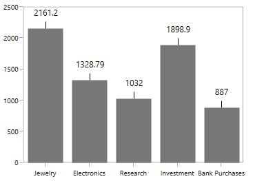

### Connector Height and Rotation

You can customize the connector line height and also line can be rotated to any specified angle.

### Connector Line Style

You can define the style for the connector line using `ConnectorLineStyle` properties.





<syncfusion:ChartAdornmentInfo.ConnectorLineStyle>

</syncfusion:ChartAdornmentInfo.ConnectorLineStyle>





Style style = new Style() { TargetType = typeof(Path) };

Setter strokeDash = new Setter()
{

    Property = Path.StrokeProperty,

    Value = new SolidColorBrush(Colors.Red)

};

Setter stroke = new Setter()
{

    Property = Path.StrokeDashArrayProperty,

    Value = new DoubleCollection() { 10, 7, 5 }

};

style.Setters.Add(strokeDash);

style.Setters.Add(stroke);

ChartAdornmentInfo adornmentInfo = new ChartAdornmentInfo()
{

    ShowLabel = true,

    ShowConnectorLine =true,

    ConnectorHeight = 20,

    ConnectorLineStyle = style

};

series.AdornmentsInfo = adornmentInfo;





### Connector Type

`ConnectorType` property in AccumulationSeries is used to determine the type of line for the connector. This property is only for AccumulationSeries like PieSeries, DoughnutSeries, PyramidSeries and FunnelSeries.

**Line**

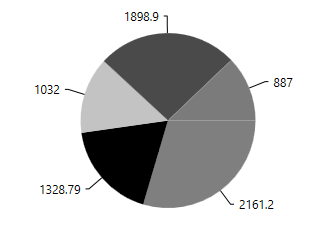

**Bezier**





<syncfusion:PieSeries ConnectorType="Bezier" LabelPosition="Outside"

ItemsSource="{Binding Demands}"   

XBindingPath="Demand"  EnableSmartLabels="True"

YBindingPath="Year2011">

<syncfusion:PieSeries.AdornmentsInfo>

<syncfusion:ChartAdornmentInfo ShowLabel="True" ConnectorHeight="17" ShowConnectorLine="True" >

</syncfusion:ChartAdornmentInfo>

</syncfusion:PieSeries.AdornmentsInfo>

</syncfusion:PieSeries>





PieSeries series = new PieSeries()
{

    ItemsSource = new ViewModel().Data,

    XBindingPath = "XValue",

    YBindingPath = "YValue",

    Label = "2011",

    EnableSmartLabels = true,

    ConnectorType = ConnectorMode.Bezier,

    LabelPosition = CircularSeriesLabelPosition.Outside

};

ChartAdornmentInfo adornmentInfo = new ChartAdornmentInfo()
{

    ShowLabel = true,

    ShowConnectorLine = true,

    ConnectorHeight = 17

};

series.AdornmentsInfo = adornmentInfo;

chart.Series.Add(series);





## Positioning the Adornments

The positioning of adornments inside the series is defined using `AdornmentPosition` property. 

* `Top`- Positions the Adornment at the top edge point of a chart segment.
* `Bottom`- Positions the Adornment at the bottom edge point of a chart segment.
* `TopAndBottom`- Positions the Adornment at the center point of a chart segment.

N> This behavior varies based on the type chart series.

The following code example explains the positioning of adornments in the middle of the segment.





<syncfusion:ColumnSeries.AdornmentsInfo>

<syncfusion:ChartAdornmentInfo AdornmentsPosition="TopAndBottom" 

ShowMarker="True" Symbol="Ellipse">

</syncfusion:ChartAdornmentInfo>

</syncfusion:ColumnSeries.AdornmentsInfo>





ChartAdornmentInfo adornmentInfo = new ChartAdornmentInfo()
{

    AdornmentsPosition = AdornmentsPosition.TopAndBottom,

    ShowMarker = true,

    Symbol = ChartSymbol.Ellipse

};

series.AdornmentsInfo = adornmentInfo;





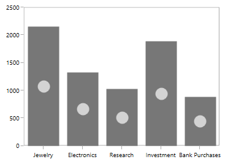

Also you can define the label alignment using  `HorizontalAlignment` and `VerticalAlignment` properties and the following code example demonstrates the labels positioned using horizontal and vertical alignment.





<syncfusion:ColumnSeries.AdornmentsInfo>

<syncfusion:ChartAdornmentInfo  ShowLabel="True" LabelPosition="Default" HorizontalAlignment="Right" VerticalAlignment="Top">

</syncfusion:ChartAdornmentInfo>

</syncfusion:ColumnSeries.AdornmentsInfo>





ChartAdornmentInfo adornmentInfo = new ChartAdornmentInfo()
{

    LabelPosition = AdornmentsLabelPosition.Default,

    ShowLabel = true,

    HorizontalAlignment = HorizontalAlignment.Right,

    VerticalAlignment = VerticalAlignment.Top

};

series.AdornmentsInfo = adornmentInfo;





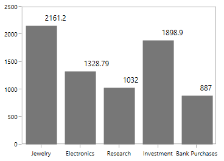

### Advanced Positioning

Other than the above positioning options, SfChart providing additional customization option to position the adornments smartly based on series types using `LabelPosition` property.

The following are the values for this property: 

* Default
* Auto
* Inner
* Outer
* Center

The following section shows few examples for this LabelPosition behavior with respect to the series.

**Column Series**

LabelPosition as Center





<syncfusion:ColumnSeries.AdornmentsInfo>

<syncfusion:ChartAdornmentInfo  ShowLabel="True" LabelPosition="Center">

</syncfusion:ChartAdornmentInfo>

</syncfusion:ColumnSeries.AdornmentsInfo>





ColumnSeries series = new ColumnSeries();

ChartAdornmentInfo adornmentInfo = new ChartAdornmentInfo()
{

ShowLabel = true,

LabelPosition = AdornmentsLabelPosition.Center

};

series.AdornmentsInfo = adornmentInfo;





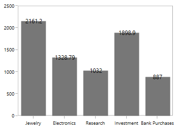

LabelPosition as Inner





<syncfusion:ColumnSeries.AdornmentsInfo>

<syncfusion:ChartAdornmentInfo  ShowLabel="True" LabelPosition="Inner">

</syncfusion:ChartAdornmentInfo>

</syncfusion:ColumnSeries.AdornmentsInfo>





ColumnSeries series = new ColumnSeries();

ChartAdornmentInfo adornmentInfo = new ChartAdornmentInfo()
{

    ShowLabel = true,

    LabelPosition = AdornmentsLabelPosition.Inner

};

series.AdornmentsInfo = adornmentInfo;





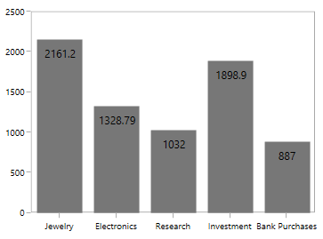

LabelPosition as Outer





<syncfusion:ColumnSeries.AdornmentsInfo>

<syncfusion:ChartAdornmentInfo  ShowLabel="True" LabelPosition="Outer">

</syncfusion:ChartAdornmentInfo>

</syncfusion:ColumnSeries.AdornmentsInfo>





ColumnSeries series = new ColumnSeries();

ChartAdornmentInfo adornmentInfo = new ChartAdornmentInfo()
{

    ShowLabel = true,

    LabelPosition = AdornmentsLabelPosition.Outer

};

series.AdornmentsInfo = adornmentInfo;





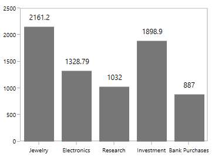

**Line Series**

LabelPosition as Auto





<syncfusion:SplineSeries.AdornmentsInfo>

<syncfusion:ChartAdornmentInfo  ShowLabel="True" LabelPosition="Auto">

</syncfusion:ChartAdornmentInfo>

</syncfusion:SplineSeries.AdornmentsInfo>





SplineSeries series = new SplineSeries();

ChartAdornmentInfo adornmentInfo = new ChartAdornmentInfo()
{

    ShowLabel = true,

    LabelPosition = AdornmentsLabelPosition.Auto

};

series.AdornmentsInfo = adornmentInfo;

chart.Series.Add(series);





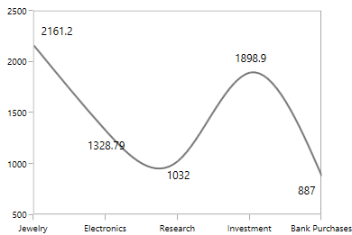

LabelPosition as Inner





<syncfusion:SplineSeries.AdornmentsInfo>

<syncfusion:ChartAdornmentInfo  ShowLabel="True" LabelPosition="Inner">

</syncfusion:ChartAdornmentInfo>

</syncfusion:SplineSeries.AdornmentsInfo>





SplineSeries series = new SplineSeries();

ChartAdornmentInfo adornmentInfo = new ChartAdornmentInfo()
{

    ShowLabel = true,

    LabelPosition = AdornmentsLabelPosition.Inner

};

series.AdornmentsInfo = adornmentInfo;

chart.Series.Add(series);





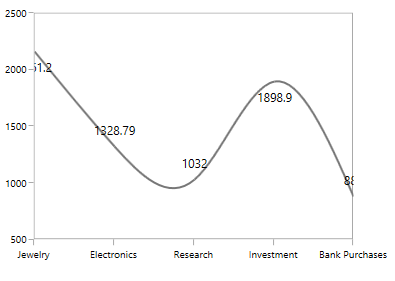

LabelPosition as Outer





<syncfusion:SplineSeries.AdornmentsInfo>

<syncfusion:ChartAdornmentInfo  ShowLabel="True" LabelPosition="Outer">

</syncfusion:ChartAdornmentInfo>

</syncfusion:SplineSeries.AdornmentsInfo>





SplineSeries series = new SplineSeries();

ChartAdornmentInfo adornmentInfo = new ChartAdornmentInfo()
{

    ShowLabel = true,

    LabelPosition = AdornmentsLabelPosition.Outer

};

series.AdornmentsInfo = adornmentInfo;

chart.Series.Add(series);





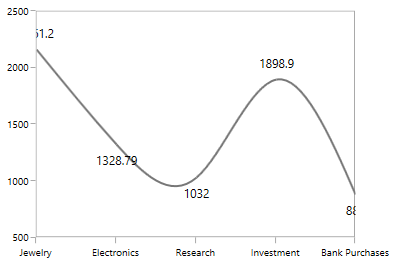

LabelPosition as Center





<syncfusion:SplineSeries.AdornmentsInfo>

<syncfusion:ChartAdornmentInfo  ShowLabel="True" LabelPosition="Center">

</syncfusion:ChartAdornmentInfo>

</syncfusion:SplineSeries.AdornmentsInfo>





SplineSeries series = new SplineSeries();

ChartAdornmentInfo adornmentInfo = new ChartAdornmentInfo()
{

    ShowLabel = true,

    LabelPosition = AdornmentsLabelPosition.Center

};

series.AdornmentsInfo = adornmentInfo;

chart.Series.Add(series);





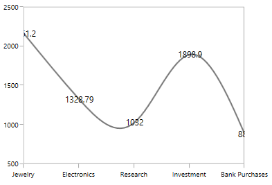

## Smart Labels for Accumulation Series

When you have more datapoints in Pie or Doughnut series, the adornment labels might get overlap with each other. SfChart provides built-in support to avoid these overlapping by using `EnableSmartLabels` property.

The following code example demonstrates the EnableSmartLabels property:





<chart:PieSeries EnableAnimation="False" x:Name="DouughnutSeries" 

ExplodeAll="True" ExplodeRadius="3" Palette="Custom"

EnableSmartLabels="True"

XBindingPath="Category" ItemsSource="{Binding Tax}" 

Label="Tax" YBindingPath="Percentage">

<chart:PieSeries.AdornmentsInfo>

<chart:ChartAdornmentInfo HorizontalAlignment="Center"

VerticalAlignment="Center" ShowLabel="True" ShowConnectorLine="True" UseSeriesPalette="True"

>

</chart:ChartAdornmentInfo>

</chart:PieSeries.AdornmentsInfo>





PieSeries series = new PieSeries()
{

    ItemsSource = new ViewModel().Tax,

    XBindingPath = "Category",

    YBindingPath = "Percentage",

    Label = "Tax",

    EnableSmartLabels = true,

    ExplodeAll = true ,

    ExplodeRadius = 3,

    Palette = ChartColorPalette.Custom,

};

ChartAdornmentInfo adornmentInfo = new ChartAdornmentInfo()
{

    ShowLabel = true,

    ShowConnectorLine = true,

    UseSeriesPalette = true,

    HorizontalAlignment = HorizontalAlignment.Center,

    VerticalAlignment = VerticalAlignment.Center

};

series.AdornmentsInfo = adornmentInfo;

chart.Series.Add(series);





