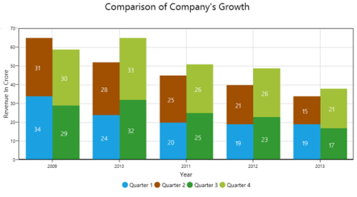

# Overview

SfChart provides a perfect way to visualize data with a high level of user interactivity that focuses on development, productivity and simplicity of use. SfChart also provides a wide variety of charting features that are used to visualize large quantities of data, flexible data binding and user customization.

SfChart
{:.caption}

## Key features of SfChart:

* SfChart supports 38 different types of series, ranging from simple bar series to complex financial charts. Each type of chart represents a unique style of representing data that is more user friendly and has greater UI visualization.
* Capable of rendering large amounts of data in a few milliseconds (ms). It is one of the fastest charts in the market.
* Allows you to map data from the specified path, by the data binding concept.
* Interactive zooming is done by enabling touch mode that allows you to explore portions of large charts in detail, with excellent performance.
* Track data points using crosshairs and track ball behaviour. When you need more information about a particular segment in a chart, a little mouseover on the series provides more information including tooltip, crosshairs and track ball behavior.
* Supports 10 different types of technical indicators that determine financial, stock or economic trends by analyzing a set of recorded data. 
* Supports multiple axes that can be stacked and spanned for multiple panes.
* SfChart provides support to render multiple series at the same time, with options to compare and visualize two different chart series, simultaneously.
* User friendly customization support. SfChart provides various options for you to customize chart features, axis, labels, legends, series, etc., and visualize them accordingly. 

###Document Organization & Conventions

This section provides details about the functionalities and features that help you understand and use SfChart better. It is organized into the following sections:

Getting Started – This section helps you get started with SfChart and deploy it in your application.

Features – The features of the chart are illustrated with the help of use case scenarios, code examples and screenshots under this section.

FAQ – This section contains commonly asked questions related to SfChart.

The following conventions are used in the following user guide to help you identify key points and features.

<table>
<tr>
<th>
Convention</th><th>
Icon</th><th>
Description</th></tr>
<tr>
<td>
Note</td><td>
{{ '' | markdownify }}
</td><td>
Represents important information related to the product and its associates.</td></tr>
<tr>
<td>
Example</td><td>
Example:</td><td>
Represents an example.</td></tr>
<tr>
<td>
Tip</td><td>
{{ '' | markdownify }}

</td><td>
Represents useful hints that help you use SfChart’s features and functionalities.</td></tr>
</table>

