# Technical Indicator

Technical indicators are the base of technical analysis, which is used to determine the future market trends. 

## Adding Technical Indicators to the Chart

Technical indicator merely an another type meta series. The following steps illustrates how to add the technical indicators to the chart:

### Initializing Indicator

Create the instance for any technical indicator and add it to the `TechnicalIndicators` collection. 

Here for instance, the [AccumulationDistributionIndicator](#accumulationdistributionindicator) is added.



<chart:SfChart.TechnicalIndicators>

<chart:AccumulationDistributionIndicator>

</chart:AccumulationDistributionIndicator>

</chart:SfChart.TechnicalIndicators>



### Binding the Data

Next you need to bind the property path for the open, high, low and close along with x value binding property.



<chart:SfChart.TechnicalIndicators>

<chart:AccumulationDistributionIndicator Open="Open" Close="Close" High="High" Low="Low">                    

</chart:AccumulationDistributionIndicator>

</chart:SfChart.TechnicalIndicators>



### Specifying the ItemsSource



<chart:SfChart.TechnicalIndicators>

<chart:AccumulationDistributionIndicator Open="Open" Close="Close"      High="High" 

Low="Low"  ItemsSource="{Binding StockPriceDetails}" 

XBindingPath="Date">                    

</chart:AccumulationDistributionIndicator>

</chart:SfChart.TechnicalIndicators>



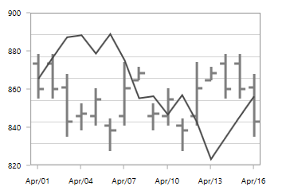

The following sections covers all the different types of technical indicators available in SfChart.

Most of the indicators are having the `Period` and `SignalLineColor` properties as common, in which Period property indicates the moving average period and the SignalLineColor defines the color for the respective indicator line.

## Average True Range

You can define the `AverageTrueRangeIndicator` using the following code example



<chart:SfChart.TechnicalIndicators>

<chart:AverageTrueRangeIndicator ItemsSource="{Binding  ViewModel1}"    

Period="3" XBindingPath="Date" Volume="Volume"

SignalLineColor="Black" High="High" Low="Low"

Open="Open" Close="Close"/ >

</chart:SfChart.TechnicalIndicators>



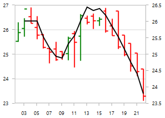

## Simple Average 

The following code example demonstrates the usage of `SimpleAverageIndicator`.



<chart:SfChart.TechnicalIndicators>

<chart:SimpleAverageIndicator ItemsSource="{Binding  ViewModel1}"  Period="3"     

SignalLineColor="Black" XBindingPath="Date" 

Volume="Volume"  

High="High" Low="Low" Open="Open" Close="Close" >

</chart:SimpleAverageIndicator >

</chart:SfChart.TechnicalIndicators>



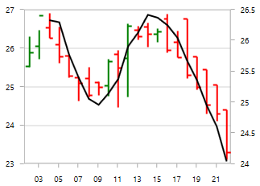

## RSI 

The Relative Strength Index(RSI) indicators are having additional two lines other than signal line, which indicate the overbought and oversold region. 

The `UpperLineColor` property is used to define the color for the line indicating overbought region and the `LowerLineColor` property is used to define the color for the line indicating oversold region.

To define the `RSITechnicalIndicator`, you can use the following code example:



<chart:SfChart.TechnicalIndicators>

<chart:RSITechnicalIndicator 

ItemsSource="{Binding  ViewModel1}"  Period="3"   

SignalLineColor="Black" XBindingPath="Date" Volume="Volume"  

UpperLineColor="Blue" LowerLineColor="Red"                  

High="High" Low="Low" Open="Open" Close="Close"/>

</chart:SfChart.TechnicalIndicators>



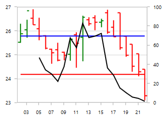

## Momentum 

This indicator having two lines momentum line and center line. No signal line in this indicator. You can define momentum technical indicator using the following code example.

The `MomentumLineColor` property and `CenterLineColor` property are used to define the color for the momentum and center line respectively.



<chart:SfChart.TechnicalIndicators>

<chart:MomentumTechnicalIndicator ItemsSource="{Binding  ViewModel1}"     

Period="3" CenterLineColor="red" XBindingPath="Date"        

Volume="Volume" MomentumLineColor="Black"

High="High" Low="Low" Open="Open" Close="Close"/ >

</chart:SfChart.TechnicalIndicators>



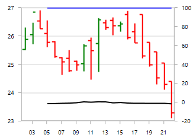

## Stochastic 

This indicator is used to measure the range and momentum of price movements. It contains `KPeriod` and `DPeriod` property defining the ‘K’ percentage and ‘D’ percentage respectively.No signal line in this indicator.

The `UpperLineColor`, `LowerLineColor` and `PeriodLineColor` property are used to define the brushes for the Stochastic indicator lines.

You can define stochastic technical indicator using the following code example:



<chart:SfChart.TechnicalIndicators>

<chart:StochasticTechnicalIndicator ItemsSource="{Binding  ViewModel1}" 

Period="3" SignalLineColor="Black" KPeriod="8" DPeriod="5"

XBindingPath="Date" Volume="Volume" UpperLineColor="Blue"

LowerLineColor="Purple" PeriodLineColor="Red"

High="High" Low="Low" Open="Open" Close="Close"/>

</chart:SfChart.TechnicalIndicators>



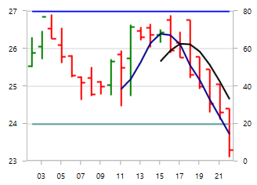

## Exponential Average

The `ExponentialAverageIndicator` is similar to [SimpleAverageIndicator](#_simple-average) and this can be defined using the following code examples.



<chart:SfChart.TechnicalIndicators>

<chart:ExponentialAverageIndicator  ItemsSource="{Binding  ViewModel1}"    

Period="3" XBindingPath="Date" Volume="Volume"

SignalLineColor="Black" High="High" Low="Low"

Open="Open" Close="Close"/ >

</chart:SfChart.TechnicalIndicators>



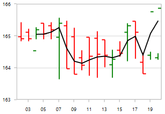

## Triangular Average 

The `TriangularAverageIndicator` can be defined as in the following code example.



<chart:SfChart.TechnicalIndicators>

<chart:TriangularAverageIndicator  ItemsSource="{Binding  ViewModel1}"    

Period="3" XBindingPath="Date" Volume="Volume"

SignalLineColor="Black" High="High" Low="Low"

Open="Open" Close="Close"/ >

</chart:SfChart.TechnicalIndicators>



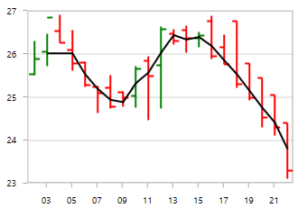

## Accumulation Distribution 

The following code example help you to add `AccumulationDistributionIndicator`.



<chart:SfChart.TechnicalIndicators>

<chart:AccumulationDistributionIndicator 

ItemsSource="{Binding  ViewModel1}" 

XBindingPath="Date" Volume="Volume"    

SignalLineColor="Black" High="High" Low="Low" 

Open="Open" Close="Close" >                 

</chart:AccumulationDistributionIndicator >

</chart:SfChart.TechnicalIndicators>



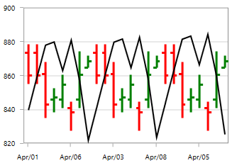

## Bollinger Band

This indicator also having `UpperLineColor`, `LowerLineColor` and `SignalLineColor` property for defining the brushes for the indicator lines.

You can define the `BollingerBandIndicator` using the following code example:



<chart:SfChart.TechnicalIndicators>

<chart:BollingerBandIndicator 

ItemsSource="{Binding  ViewModel1}" Period="3"  

UpperLineColor="Blue" LowerLineColor="Red"

XBindingPath="Date" Volume="Volume" SignalLineColor="Black" 

High="High" Low="Low" Open="Open" Close="Close"/>

</chart:SfChart.TechnicalIndicators>



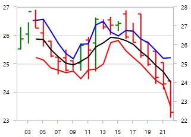

## MACD 

This is mostly using indicator having `ShortPeriod` and `LongPeriod` for defining the motion of the indicator.

Other than signal line, MACD is having convergence and divergence line. The brushes for these lines can be defined using `ConvergenceLineColor` and `DivergenceLineColor`.

Also you can draw line, histogram MACD or both using the `Type` property, which defines the type of MACD to be drawn.

You can define the `MACDTechnicalIndicator` using the following code example:



<chart:SfChart.TechnicalIndicators>

<chart:MACDTechnicalIndicator ItemsSource="{Binding  ViewModel1}" 

Type="Line"  ShortPeriod="2" Period="3" LongPeriod="6"

ConvergenceLineColor="Red" DivergenceLineColor="Blue"

XBindingPath="Date" Volume="Volume" SignalLineColor="Black" 

High="High" Low="Low" Open="Open" Close="Close" >

</chart:MACDTechnicalIndicator >

</chart:SfChart.TechnicalIndicators>



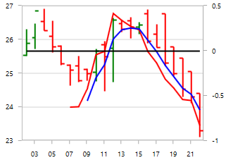

