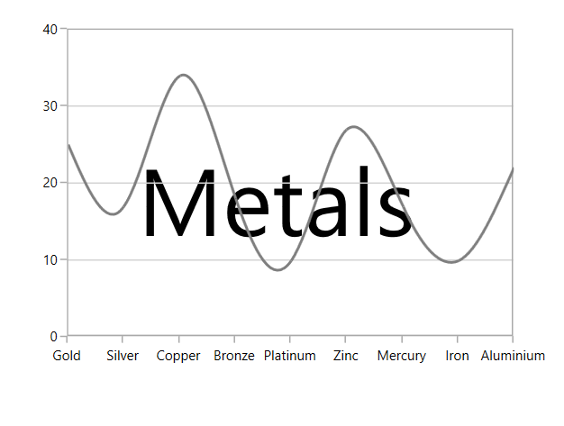
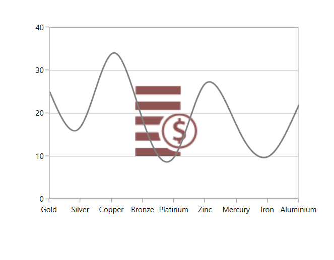

# Watermark

SfChart provides watermark support which is used to add text or images to the chart area. The major application of watermark is to define the copyright information of the user it belongs to.

This section is to help you understand how to use the `Watermark` in your chart.

## Adding text watermark

You can add the text to chart background using the Content property of Watermark.

The following code example explains how to set your custom text as Watermark.



<chart:SfChart.Watermark>

<chart:Watermark VerticalAlignment="Center"         

HorizontalAlignment="Center" >

<chart:Watermark.Content>

<TextBlock Text="Metals"  

FontSize="70"

Foreground="Black" >

</TextBlock>

</chart:Watermark.Content>

</chart:Watermark>

</chart:SfChart.Watermark>



## Adding image watermark

You can also set images as Watermark as in below code snippet.



<chart:SfChart.Watermark>

<chart:Watermark VerticalAlignment="Center"               

HorizontalAlignment="Center" >

<chart:Watermark.Content>

<Image Source="demands.png" Height="175" Width="175"/>

</chart:Watermark.Content>

</chart:Watermark>

</chart:SfChart.Watermark>



