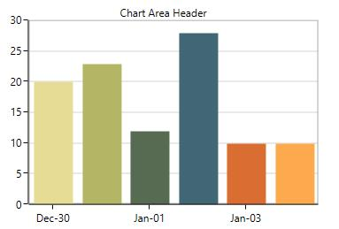
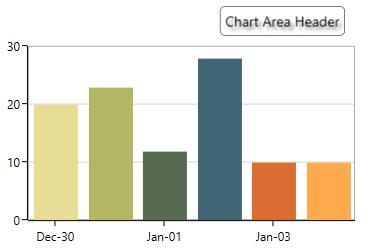
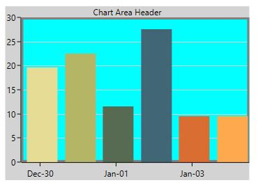
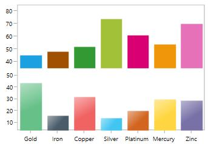
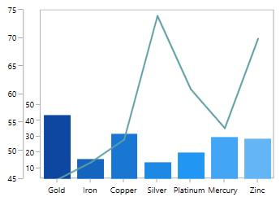
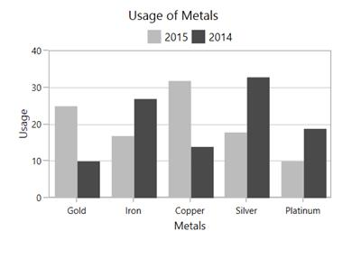
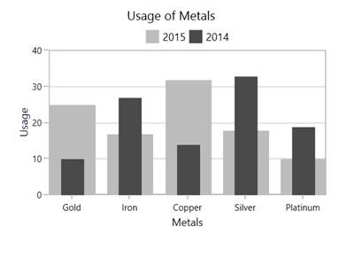

# Area	

Chart area represents the entire chart and all its elements. It’s a virtual rectangular area that includes all the chart elements like axis, legends, series etc. 

The following are the major properties of chart(SfChart):

* [`PrimaryAxis`](http://help.syncfusion.com/uwp/sfchart/axis) –  Gets or sets the horizontal x axis for the chart.
* [`SecondaryAxis`](http://help.syncfusion.com/uwp/sfchart/axis) –  Gets or sets the vertical y axis for the chart.
* [`Legend`](http://help.syncfusion.com/uwp/sfchart/legend) –  Gets or sets the legend for the chart.
* [`Series`](http://help.syncfusion.com/uwp/sfchart/series) –  Gets or sets the list of series in the chart.
* [`TechnicalIndicators`](http://help.syncfusion.com/uwp/sfchart/technical-indicators) –  Gets or sets the various financial indicators for the chart.
* [`Behaviors`](http://help.syncfusion.com/uwp/sfchart/interactive-features)–  Used to add one more interactive features to the chart.

## Chart Header

Header property is used to define the title for the chart. This allows you to add any object (.Net object) as content for chart title. 





<syncfusion:SfChart  Header="Usage of Metals" />





SfChart chart = new SfChart();

chart.Header = "Usage of Metals";





Header can be positioned left or right side of the chart using [`HorizontalHeaderAlignment`](https://help.syncfusion.com/cr/cref_files/uwp/Syncfusion.SfChart.UWP~Syncfusion.UI.Xaml.Charts.ChartBase~HorizontalHeaderAlignment.html) property.

Also you can add more customization for the header as below: 





<chart:SfChart.Header>

<Border BorderThickness="0.5" BorderBrush="Black" Margin="10" CornerRadius="5">

<TextBlock FontSize="14" Text="Chart Area Header" Margin="5">

<TextBlock.Effect>

<DropShadowEffect Color="Black" 

Opacity="0.5" />

</TextBlock.Effect>

</TextBlock>

</Border>

</chart:SfChart.Header>





Border border = new Border()
{

    BorderThickness = new Thickness(0.5),

    BorderBrush = new SolidColorBrush(Colors.Black),

    Margin = new Thickness(10),

    CornerRadius = new CornerRadius(5)

};

TextBlock textBlock = new TextBlock()
{

Text = "Chart Area Header",

Margin = new Thickness(5),

FontSize = 14

};

textBlock.Effect = new DropShadowEffect()
{

Color = Colors.Black,

Opacity = 0.5

};

border.Child = textBlock;

chart.Header = border;





N> Here, HorizontalHeaderAlignment is set as ‘Right’.

## Area Customization

SfChart provides the properties like [`AreaBorderBrush`](https://help.syncfusion.com/cr/cref_files/uwp/Syncfusion.SfChart.UWP~Syncfusion.UI.Xaml.Charts.SfChart~AreaBorderBrush.html), [`AreaBorderThickness`](https://help.syncfusion.com/cr/cref_files/uwp/Syncfusion.SfChart.UWP~Syncfusion.UI.Xaml.Charts.SfChart~AreaBorderThickness.html), [`AreaBackground`](https://help.syncfusion.com/cr/cref_files/uwp/Syncfusion.SfChart.UWP~Syncfusion.UI.Xaml.Charts.SfChart~AreaBackground.html) and `Background` for customizing the plot area.

The following code examples illustrates the usage of these properties:





<chart:SfChart Height="250" Width="350" 

Header="Chart Area Header" 

AreaBackground="Cyan" 

Background="LightGray" 

AreaBorderBrush="Gray" 

AreaBorderThickness="3" >





SfChart chart = new SfChart();

chart.Header = "Chart Area Header";

chart.AreaBackground = new SolidColorBrush(Colors.Cyan);

chart.Background = new SolidColorBrush(Colors.LightGray);

chart.AreaBorderBrush = new SolidColorBrush(Colors.Gray);

chart.AreaBorderThickness = new Thickness(3);





## Multiple Area 

You can split plot area into multiple rows and columns using [`ChartRowDefinition`](https://help.syncfusion.com/cr/cref_files/uwp/Syncfusion.SfChart.UWP~Syncfusion.UI.Xaml.Charts.ChartRowDefinition.html) and [`ChartColumnDefinition`](https://help.syncfusion.com/cr/cref_files/uwp/Syncfusion.SfChart.UWP~Syncfusion.UI.Xaml.Charts.ChartColumnDefinition.html) like Grid panel’s row and column definition. 

The following code example demonstrates, how you can create multiple panes in the chart area:





<chart:SfChart >

<!--Adding row definition to the chart-->

<chart:SfChart.RowDefinitions>

<chart:ChartRowDefinition/>

<chart:ChartRowDefinition/>

</chart:SfChart.RowDefinitions>

<!--Adding column definition to the chart-->

<chart:SfChart.ColumnDefinitions>

<chart:ChartColumnDefinition/>

<chart:ChartColumnDefinition/>

</chart:SfChart.ColumnDefinitions>

<chart:SfChart.PrimaryAxis>

<chart:CategoryAxis chart:ChartBase.ColumnSpan="2"/>

</chart:SfChart.PrimaryAxis>

<chart:SfChart.SecondaryAxis>

<chart:NumericalAxis  PlotOffset="13" chart:ChartBase.ColumnSpan="2" />

</chart:SfChart.SecondaryAxis>

<chart:ColumnSeries Palette="LightCandy"

ItemsSource="{Binding SneakersDetail}"         

XBindingPath="Brand" 

YBindingPath="ItemsCount1" 

/>

<chart:ColumnSeries Palette="Metro"

ItemsSource="{Binding SneakersDetail}"  

XBindingPath="Brand" 

YBindingPath="ItemsCount" >

<chart:ColumnSeries.YAxis>

<chart:NumericalAxis  PlotOffset="10"

chart:SfChart.Row="1" >

</chart:NumericalAxis>

</chart:ColumnSeries.YAxis>

</chart:ColumnSeries>

</chart:SfChart>





SfChart chart = new SfChart();

chart.RowDefinitions.Add(new ChartRowDefinition());

chart.RowDefinitions.Add(new ChartRowDefinition());

chart.ColumnDefinitions.Add(new ChartColumnDefinition());

chart.ColumnDefinitions.Add(new ChartColumnDefinition());

CategoryAxis xAxis = new CategoryAxis();

ChartBase.SetColumnSpan(xAxis, 2);

chart.PrimaryAxis = xAxis;

NumericalAxis yAxis = new NumericalAxis();

yAxis.PlotOffset = 13;

ChartBase.SetColumnSpan(yAxis, 2);

chart.SecondaryAxis = yAxis;

ColumnSeries columnSeries1 = new ColumnSeries()
{

    ItemsSource = new ViewModel().SneakersDetail,

    XBindingPath = "Brand",

    YBindingPath = "ItemsCount",

    Palette = ChartColorPalette.LightCandy,

};

NumericalAxis axis = new NumericalAxis();

axis.PlotOffset = 10;

SfChart.SetRow(axis, 1);

ColumnSeries columnSeries2 = new ColumnSeries()
{
    
    ItemsSource = new ViewModel().SneakersDetail,

    XBindingPath = "Brand",

    YBindingPath = "ItemsCount1",

    Palette = ChartColorPalette.Metro,

    YAxis = axis

};

chart.Series.Add(columnSeries1);

chart.Series.Add(columnSeries2);





## Column Span and Row Span

These can be used to specify the number of column or rows up to which the axis can extend. Same like Grid’s RowSpan or ColumnSpan property, it is also an attached property.

You can set the row span in chart like the following code example.





<chart:SfChart>

<!--Adding row definition to the chart-->

<chart:SfChart.RowDefinitions>

<chart:ChartRowDefinition/>

<chart:ChartRowDefinition/>

</chart:SfChart.RowDefinitions>

<chart:SfChart.PrimaryAxis>

<chart:CategoryAxis  chart:ChartBase.RowSpan="2" 

chart:SfChart.Row="0"

TickLinesPosition="Outside">                                                              

</chart:CategoryAxis>

</chart:SfChart.PrimaryAxis>

<chart:SfChart.SecondaryAxis>

<chart:NumericalAxis />

</chart:SfChart.SecondaryAxis>

<chart:ColumnSeries XBindingPath="Brand"

ItemsSource="{Binding SneakersDetail}"  

YBindingPath="ItemsCount1" 

/>

<chart:LineSeries Interior="CadetBlue" XBindingPath="Brand"

ItemsSource="{Binding SneakersDetail}"   

YBindingPath="ItemsCount">

<chart:LineSeries.YAxis>

<chart:NumericalAxis chart:ChartBase.RowSpan="2">

</chart:NumericalAxis>

</chart:LineSeries.YAxis>              

</chart:LineSeries>

</chart:SfChart>





SfChart chart = new SfChart();

chart.RowDefinitions.Add(new ChartRowDefinition());

chart.RowDefinitions.Add(new ChartRowDefinition());

chart.ColumnDefinitions.Add(new ChartColumnDefinition());

chart.ColumnDefinitions.Add(new ChartColumnDefinition());

CategoryAxis xAxis = new CategoryAxis();

xAxis.TickLinesPosition = AxisElementPosition.Outside;

ChartBase.SetColumnSpan(xAxis, 2);

SfChart.SetRow(xAxis, 0);

chart.PrimaryAxis = xAxis;

NumericalAxis yAxis = new NumericalAxis();

ChartBase.SetColumnSpan(yAxis, 2);

chart.SecondaryAxis = yAxis;

ColumnSeries columnSeries1 = new ColumnSeries()
{

    ItemsSource = new ViewModel().SneakersDetail,

    XBindingPath = "Brand",

    YBindingPath = "ItemsCount1",

};

NumericalAxis axis = new NumericalAxis();

axis.PlotOffset = 10;

ChartBase.SetColumnSpan(axis, 2);

LineSeries lineSeries = new LineSeries()
{

    ItemsSource = new ViewModel().SneakersDetail,

    XBindingPath = "Brand",

    YBindingPath = "ItemsCount",

    Interior = new SolidColorBrush(Colors.CadetBlue),

    YAxis = axis

};

chart.Series.Add(columnSeries1);

chart.Series.Add(lineSeries);





## Placing Series Side-By-Side

It defines the placement pattern of bar type series like [`Column`](https://help.syncfusion.com/cr/cref_files/uwp/Syncfusion.SfChart.UWP~Syncfusion.UI.Xaml.Charts.ColumnSeries.html), [`Bar`](https://help.syncfusion.com/cr/cref_files/uwp/Syncfusion.SfChart.UWP~Syncfusion.UI.Xaml.Charts.BarSeries.html), [`RangeColumn`](https://help.syncfusion.com/cr/cref_files/uwp/Syncfusion.SfChart.UWP~Syncfusion.UI.Xaml.Charts.RangeColumnSeries.html), etc. 

It is a Boolean property and its default value is true so the segment will be placed adjacent to each other (Clustered).

The following code example and image illustrates the placement of series while setting [`SideBySideSeriesPlacement`](https://help.syncfusion.com/cr/cref_files/uwp/Syncfusion.SfChart.UWP~Syncfusion.UI.Xaml.Charts.ChartBase~SideBySideSeriesPlacement.html) as false.





<chart:SfChart x:Name="columnChart" AreaBorderBrush="DarkGray" 

Header="Usage of Metals"  

SideBySideSeriesPlacement="False"

AreaBorderThickness="1,1,1,1">

<chart:SfChart.PrimaryAxis>

<chart:CategoryAxis  Header="Metals"/>

</chart:SfChart.PrimaryAxis>

<chart:SfChart.SecondaryAxis>

<chart:NumericalAxis Header="Usage" />                            

</chart:SfChart.SecondaryAxis>

<chart:SfChart.Legend>

<chart:ChartLegend Visibility="Visible" />

</chart:SfChart.Legend>

<chart:ColumnSeries Interior="#bcbcbc"

ItemsSource="{Binding SneakersDetail}" Label="2015"  

XBindingPath="Brand" 

YBindingPath="ItemsCount" />

<chart:ColumnSeries ItemsSource="{Binding SneakersDetail}"  

SegmentSpacing="0.5"

Interior="#4a4a4a"  XBindingPath="Brand" 

Label="2014" YBindingPath="Position"/>            

</chart:SfChart>





SfChart chart = new SfChart();

chart.Header = "Usage of Metals";

chart.AreaBorderBrush = new SolidColorBrush(Colors.DarkGray);

chart.SideBySideSeriesPlacement = false;

chart.AreaBorderThickness = new Thickness(1);

chart.PrimaryAxis = new CategoryAxis()
{

    Header = "Medals"

};

chart.SecondaryAxis = new NumericalAxis()
{

    Header = "Usage"

};

chart.Legend = new ChartLegend()
{

    Visibility = Visibility.Visible

};

ColumnSeries columnSeries1 = new ColumnSeries()
{

    ItemsSource = new ViewModel().SneakersDetail,

    XBindingPath = "Brand",

    YBindingPath = "ItemsCount",

    Label = "2015",

    Interior = new SolidColorBrush(Color.FromRgb(0xbc, 0xbc, 0xbc)),

};

ColumnSeries columnSeries2 = new ColumnSeries()
{

    ItemsSource = new ViewModel().SneakersDetail,

    XBindingPath = "Brand",

    YBindingPath = "Position",

    Label = "2014",

    SegmentSpacing = 0.5,

    Interior = new SolidColorBrush(Color.FromRgb(0x4a, 0x4a, 0x4a)),

};

chart.Series.Add(columnSeries1);

chart.Series.Add(columnSeries2);





N>As the series will be placed one over the other(overlapped), to differentiate between the series the [`SegmentSpacing`](https://help.syncfusion.com/cr/cref_files/uwp/Syncfusion.SfChart.UWP~Syncfusion.UI.Xaml.Charts.ISegmentSpacing~SegmentSpacing.html) is used.

## Serialization

SfChart supports serialization and deserialization for save the settings of the chart and reload. 

This can be done using [`Serialize`](https://help.syncfusion.com/cr/cref_files/uwp/Syncfusion.SfChart.UWP~Syncfusion.UI.Xaml.Charts.ChartBase~Serialize.html) and [`Deserialize`](https://help.syncfusion.com/cr/cref_files/uwp/Syncfusion.SfChart.UWP~Syncfusion.UI.Xaml.Charts.ChartBase~Deserialize.html) methods as in below code example:





<chart:SfChart Margin="10" x:Name="chart" Header="Defect Rates">

<chart:SfChart.Annotations>

    <chart:RectangleAnnotation X1="0" X2="2" Y1="20" 

                               Y2="30" CanDrag="True"
                               
                               CanResize="True"/>

</chart:SfChart.Annotations>

<chart:SfChart.PrimaryAxis>

    <chart:CategoryAxis Header="X Axis" />

</chart:SfChart.PrimaryAxis>

<chart:SfChart.SecondaryAxis>

    <chart:NumericalAxis Header="Y Axis" />

</chart:SfChart.SecondaryAxis>

<chart:ColumnSeries ItemsSource="{Binding CategoricalDatas}" 

                    XBindingPath="Category"

                    YBindingPath="Value">

</chart:ColumnSeries>

</chart:SfChart>

Serialized Chart

<SfChart Header="Defect Rates" Name="chart" Margin="10,10,10,10" Width="500" Height="420"
         xmlns="http://schemas.syncfusion.com/wpf"
         xmlns:s="clr-namespace:System;assembly=mscorlib"
         xmlns:av="http://schemas.microsoft.com/winfx/2006/xaml/presentation">

<SfChart.PrimaryAxis>

    <CategoryAxis Header="X Axis">

        <CategoryAxis.StripLines>
             <ChartStripLines />
        </CategoryAxis.StripLines>

    </CategoryAxis>

</SfChart.PrimaryAxis>

<SfChart.SecondaryAxis>

    <NumericalAxis Header="Y Axis">

        <NumericalAxis.StripLines>
            <ChartStripLines />
        </NumericalAxis.StripLines>

    </NumericalAxis>

</SfChart.SecondaryAxis>

<SfChart.Behaviors>
    <ChartBehaviorsCollection />
</SfChart.Behaviors>

<SfChart.Annotations>

    <AnnotationCollection>

        <RectangleAnnotation CanDrag="True" CanResize="True">
            <RectangleAnnotation.Y2>
                <s:Int32>30</s:Int32>
            </RectangleAnnotation.Y2>
            <RectangleAnnotation.X2>
                <s:Int32>2</s:Int32>
            </RectangleAnnotation.X2>
            <RectangleAnnotation.X1>
                <s:Int32>0</s:Int32>
            </RectangleAnnotation.X1>
            <RectangleAnnotation.Y1>
                <s:Int32>20</s:Int32>
            </RectangleAnnotation.Y1>
        </RectangleAnnotation>

    </AnnotationCollection>

</SfChart.Annotations>

<SfChart.ColumnDefinitions>
    <ChartColumnDefinitions />
</SfChart.ColumnDefinitions>

<SfChart.RowDefinitions>
    <ChartRowDefinitions />
</SfChart.RowDefinitions>

<ColumnSeries YBindingPath="Value"  
              ItemsSource="{av:Binding Path=CategoricalData}"
              XBindingPath="Category"
              Name="series"
              xmlns="http://schemas.syncfusion.com/wpf"
              xmlns:av="http://schemas.microsoft.com/winfx/2006/xaml/presentation">

<ColumnSeries.Trendlines>
    <ChartTrendLineCollection />
</ColumnSeries.Trendlines>

<ColumnSeries.LegendIconTemplate>
    <av:DataTemplate>
        <av:Rectangle Stretch="Fill"
        Fill="{av:Binding Path=Interior}"
        Stroke="{av:Binding Path=Stroke}"
        StrokeThickness="{av:Binding Path=StrokeThickness}" />
    </av:DataTemplate>
</ColumnSeries.LegendIconTemplate>

</ColumnSeries>

</SfChart>





SfChart chart = new SfChart();

chart.Header = "Defect Rates";

chart.PrimaryAxis = new CategoryAxis()
{

    Header = "X Axis"

};

chart.SecondaryAxis = new NumericalAxis()
{

    Header = "Y Axis"

};

RectangleAnnotation annotation = new RectangleAnnotation()
{

    X1 = 0, X2 = 2,

    Y1 = 20, Y2 = 30,

    CanDrag = true, CanResize = true

};

chart.Annotations.Add(annotation);

ColumnSeries columnSeries = new ColumnSeries()
{

    ItemsSource = new ViewModel().Data,

    XBindingPath = "XValue",

    YBindingPath = "YValue"

};

chart.Series.Add(columnSeries);

string filePath = System.IO.Directory.GetParent(@"../").FullName + "\\chart.xml";

chart.Serialize();





## Clone or copy the chart

More like serialization, you can use [`Clone`](https://help.syncfusion.com/cr/cref_files/uwp/Syncfusion.SfChart.UWP~Syncfusion.UI.Xaml.Charts.ICloneable~Clone.html) method for SfChart control state persistence. This method creates a copy of the chart instance.





var chartCopy = chart.Clone() as SfChart;

grid.Children.Add(chartCopy as SfChart);

//Here, 'grid' is an empty container in the application to hold the chart. 





T> You can use this method for copy and paste like requirement, by cloning chart upon copy and reload while pasting.

## Deferred real-time updates

You can hold and resume the series updates in dynamic update scenarios using the below methods.

[`SuspendSeriesNotification`](https://help.syncfusion.com/cr/cref_files/uwp/Syncfusion.SfChart.UWP~Syncfusion.UI.Xaml.Charts.ChartBase~SuspendSeriesNotification.html)

[`ResumeSeriesNotification`](https://help.syncfusion.com/cr/cref_files/uwp/Syncfusion.SfChart.UWP~Syncfusion.UI.Xaml.Charts.ChartBase~ResumeSeriesNotification.html)

## Chart events

SfChart provides the following list of events.

### SelectionChanging

The [`SelectionChanging`](https://help.syncfusion.com/cr/cref_files/uwp/Syncfusion.SfChart.UWP~Syncfusion.UI.Xaml.Charts.ChartBase~SelectionChanging_EV.html) event is triggered before the data point is selected. You can restrict a data point from being selected, by canceling this event, by setting Cancel property in the event argument to true. The argument contains the following information.

* [`SelectedSeries`](https://help.syncfusion.com/cr/cref_files/uwp/Syncfusion.SfChart.UWP~Syncfusion.UI.Xaml.Charts.ChartSelectionChangingEventArgs~SelectedSeries.html) - Used to get the series of selected data point.
* [`SelectedSegments`](https://help.syncfusion.com/cr/cref_files/uwp/Syncfusion.SfChart.UWP~Syncfusion.UI.Xaml.Charts.ChartSelectionChangingEventArgs~SelectedSegments.html) - Used to get or set the segments collection of selected series.
* [`SelectedSegment`](https://help.syncfusion.com/cr/cref_files/uwp/Syncfusion.SfChart.UWP~Syncfusion.UI.Xaml.Charts.ChartSelectionChangingEventArgs~SelectedSegment.html) - Used to get the segment of selected data point.
* [`SelectedIndex`](https://help.syncfusion.com/cr/cref_files/uwp/Syncfusion.SfChart.UWP~Syncfusion.UI.Xaml.Charts.ChartSelectionChangingEventArgs~SelectedIndex.html) - Used to get the selected data point index.
* [`PreviousSelectedIndex`](https://help.syncfusion.com/cr/cref_files/uwp/Syncfusion.SfChart.UWP~Syncfusion.UI.Xaml.Charts.ChartSelectionChangingEventArgs~PreviousSelectedIndex.html) - Used to get the previous selected data point index.
* [`IsSelected`](https://help.syncfusion.com/cr/cref_files/uwp/Syncfusion.SfChart.UWP~Syncfusion.UI.Xaml.Charts.ChartSelectionChangingEventArgs~IsSelected.html) - Used to get the value indicating whether the segment or series is selected.
* [`IsDataPointSelection`](https://help.syncfusion.com/cr/cref_files/uwp/Syncfusion.SfChart.UWP~Syncfusion.UI.Xaml.Charts.ChartSelectionChangingEventArgs~IsDataPointSelection.html) - Used to get the value indicating whether the selection is segment selection or series selection.
* [`Cancel`](https://help.syncfusion.com/cr/cref_files/uwp/Syncfusion.SfChart.UWP~Syncfusion.UI.Xaml.Charts.ChartSelectionChangingEventArgs~Cancel.html) - Used to set the value indicating whether the selection should be canceled.

### SelectionChanged

The [`SelectionChanged`](https://help.syncfusion.com/cr/cref_files/uwp/Syncfusion.SfChart.UWP~Syncfusion.UI.Xaml.Charts.ChartBase~SelectionChanged_EV.html) event is triggered after a data point is selected. The argument contains the following information.

* [`SelectedSeries`](https://help.syncfusion.com/cr/cref_files/uwp/Syncfusion.SfChart.UWP~Syncfusion.UI.Xaml.Charts.ChartSelectionChangedEventArgs~SelectedSeries.html) - Used to get the series of selected data point. 
* [`SelectedSegments`](https://help.syncfusion.com/cr/cref_files/uwp/Syncfusion.SfChart.UWP~Syncfusion.UI.Xaml.Charts.ChartSelectionChangedEventArgs~SelectedSegments.html) - Used to get the segments collection of selected series.
* [`SelectedSegment`](https://help.syncfusion.com/cr/cref_files/uwp/Syncfusion.SfChart.UWP~Syncfusion.UI.Xaml.Charts.ChartSelectionChangedEventArgs~SelectedSegment.html) - Used to get the segment of selected data point.
* [`SelectedIndex`](https://help.syncfusion.com/cr/cref_files/uwp/Syncfusion.SfChart.UWP~Syncfusion.UI.Xaml.Charts.ChartSelectionChangedEventArgs~SelectedIndex.html) - Used to get the selected data point index.
* [`PreviousSelectedSeries`](https://help.syncfusion.com/cr/cref_files/uwp/Syncfusion.SfChart.UWP~Syncfusion.UI.Xaml.Charts.ChartSelectionChangedEventArgs~PreviousSelectedSeries.html) - Used to get the previous selected series.
* [`PreviousSelectedSegments`](https://help.syncfusion.com/cr/cref_files/uwp/Syncfusion.SfChart.UWP~Syncfusion.UI.Xaml.Charts.ChartSelectionChangedEventArgs~PreviousSelectedSegments.html) - Used to get the segments collection of previous selected series.
* [`PreviousSelectedSegment`](https://help.syncfusion.com/cr/cref_files/uwp/Syncfusion.SfChart.UWP~Syncfusion.UI.Xaml.Charts.ChartSelectionChangedEventArgs~PreviousSelectedSegment.html) - Used to get the segment of previous selected data point.
* [`PreviousSelectedIndex`](https://help.syncfusion.com/cr/cref_files/uwp/Syncfusion.SfChart.UWP~Syncfusion.UI.Xaml.Charts.ChartSelectionChangedEventArgs~PreviousSelectedIndex.html) - Used to get the previous selected data point index.
* [`OldPointInfo`](https://help.syncfusion.com/cr/cref_files/uwp/Syncfusion.SfChart.UWP~Syncfusion.UI.Xaml.Charts.ChartSelectionChangedEventArgs~OldPointInfo.html) - Used to get the previous selected segment item value.
* [`NewPointInfo`](https://help.syncfusion.com/cr/cref_files/uwp/Syncfusion.SfChart.UWP~Syncfusion.UI.Xaml.Charts.ChartSelectionChangedEventArgs~NewPointInfo.html) - Used to get the selected segment item value.
* [`IsSelected`](https://help.syncfusion.com/cr/cref_files/uwp/Syncfusion.SfChart.UWP~Syncfusion.UI.Xaml.Charts.ChartSelectionChangedEventArgs~IsSelected.html) - Used to get the value indicating whether the segment or series is selected.
* [`IsDataPointSelection`](https://help.syncfusion.com/cr/cref_files/uwp/Syncfusion.SfChart.UWP~Syncfusion.UI.Xaml.Charts.ChartSelectionChangedEventArgs~IsDataPointSelection.html) - Used to get the value indicating whether the selection is segment selection or series selection.
* [`SelectedSeriesCollection`](https://help.syncfusion.com/cr/cref_files/uwp/Syncfusion.SfChart.UWP~Syncfusion.UI.Xaml.Charts.ChartSelectionChangedEventArgs~SelectedSeriesCollection.html) - Used to get the series collection which has been selected through rectangle selection or mouse interaction.

### ZoomChanging

The [`ZoomChanging`](https://help.syncfusion.com/cr/cref_files/uwp/Syncfusion.SfChart.UWP~Syncfusion.UI.Xaml.Charts.SfChart~ZoomChanging_EV.html) event is triggered when the user starts zooming the chart, and this is a cancelable event. The argument contains the following information.

* [`Axis`](https://help.syncfusion.com/cr/cref_files/uwp/Syncfusion.SfChart.UWP~Syncfusion.UI.Xaml.Charts.ZoomEventArgs~Axis.html) - Instance of the axis whose range is changed because of zooming. This event is triggered for each axis in the chart.
* [`Cancel`](https://help.syncfusion.com/cr/cref_files/uwp/Syncfusion.SfChart.UWP~Syncfusion.UI.Xaml.Charts.ZoomChangingEventArgs~Cancel.html) - Used to set the value indicating whether the zooming should be canceled.
* [`CurrentFactor`](https://help.syncfusion.com/cr/cref_files/uwp/Syncfusion.SfChart.UWP~Syncfusion.UI.Xaml.Charts.ZoomEventArgs~CurrentFactor.html) - Used to get the current zoom factor of the axis.
* [`CurrentPosition`](https://help.syncfusion.com/cr/cref_files/uwp/Syncfusion.SfChart.UWP~Syncfusion.UI.Xaml.Charts.ZoomEventArgs~CurrentPosition.html) - Used to get the current zoom position of the axis.
* [`OldRange`](https://help.syncfusion.com/cr/cref_files/uwp/Syncfusion.SfChart.UWP~Syncfusion.UI.Xaml.Charts.ZoomEventArgs~OldRange.html) - Used to get the old visible range of the axis.
* [`PreviousFactor`](https://help.syncfusion.com/cr/cref_files/uwp/Syncfusion.SfChart.UWP~Syncfusion.UI.Xaml.Charts.ZoomEventArgs~PreviousFactor.html) - Used to get the previous zoom factor of the axis.
* [`PreviousPosition`](https://help.syncfusion.com/cr/cref_files/uwp/Syncfusion.SfChart.UWP~Syncfusion.UI.Xaml.Charts.ZoomEventArgs~PreviousPosition.html) - Used to get the previous zoom position of the axis.

### ZoomChanged

The [`ZoomChanged`](https://help.syncfusion.com/cr/cref_files/uwp/Syncfusion.SfChart.UWP~Syncfusion.UI.Xaml.Charts.SfChart~ZoomChanged_EV.html) event is triggered after the zooming is completed. The argument contains the following information.

* [`Axis`](https://help.syncfusion.com/cr/cref_files/uwp/Syncfusion.SfChart.UWP~Syncfusion.UI.Xaml.Charts.ZoomEventArgs~Axis.html) - Instance of the axis whose range is changed because of zooming. This event is triggered for each axis in the chart.
* [`CurrentFactor`](https://help.syncfusion.com/cr/cref_files/uwp/Syncfusion.SfChart.UWP~Syncfusion.UI.Xaml.Charts.ZoomEventArgs~CurrentFactor.html) - Used to get the current zoom factor of the axis.
* [`CurrentPosition`](https://help.syncfusion.com/cr/cref_files/uwp/Syncfusion.SfChart.UWP~Syncfusion.UI.Xaml.Charts.ZoomEventArgs~CurrentPosition.html) - Used to get the current zoom position of the axis.
* [`OldRange`](https://help.syncfusion.com/cr/cref_files/uwp/Syncfusion.SfChart.UWP~Syncfusion.UI.Xaml.Charts.ZoomEventArgs~OldRange.html) - Used to get the old visible range of the axis.
* [`NewRange`](https://help.syncfusion.com/cr/cref_files/uwp/Syncfusion.SfChart.UWP~Syncfusion.UI.Xaml.Charts.ZoomChangedEventArgs~NewRange.html) - Used to get the new visible range of the axis.
* [`PreviousFactor`](https://help.syncfusion.com/cr/cref_files/uwp/Syncfusion.SfChart.UWP~Syncfusion.UI.Xaml.Charts.ZoomEventArgs~PreviousFactor.html) - Used to get the previous zoom factor of the axis.
* [`PreviousPosition`](https://help.syncfusion.com/cr/cref_files/uwp/Syncfusion.SfChart.UWP~Syncfusion.UI.Xaml.Charts.ZoomEventArgs~PreviousPosition.html) - Used to get the previous zoom position of the axis.

### SelectionZoomingStart

The [`SelectionZoomingStart`](https://help.syncfusion.com/cr/cref_files/uwp/Syncfusion.SfChart.UWP~Syncfusion.UI.Xaml.Charts.SfChart~SelectionZoomingStart_EV.html) event is triggered when the user starts the selection zooming. The argument contains the following information.

* [`ZoomRect`](https://help.syncfusion.com/cr/cref_files/uwp/Syncfusion.SfChart.UWP~Syncfusion.UI.Xaml.Charts.SelectionZoomingEventArgs~ZoomRect.html) - Used to get the initial bounds of the selected region.

### SelectionZoomingEnd

The [`SelectionZoomingEnd`](https://help.syncfusion.com/cr/cref_files/uwp/Syncfusion.SfChart.UWP~Syncfusion.UI.Xaml.Charts.SfChart~SelectionZoomingEnd_EV.html) event is triggered after selection zooming ends. The argument contains the following information.

* [`ZoomRect`](https://help.syncfusion.com/cr/cref_files/uwp/Syncfusion.SfChart.UWP~Syncfusion.UI.Xaml.Charts.SelectionZoomingEventArgs~ZoomRect.html) - Used to get the final bounds of the selected region.

### SelectionZoomingDelta

The [`SelectionZoomingDelta`](https://help.syncfusion.com/cr/cref_files/uwp/Syncfusion.SfChart.UWP~Syncfusion.UI.Xaml.Charts.SfChart~SelectionZoomingDelta_EV.html) event is triggered while selecting a region to be zoomed, and this is a cancelable event. The argument contains the following information.

* [`ZoomRect`](https://help.syncfusion.com/cr/cref_files/uwp/Syncfusion.SfChart.UWP~Syncfusion.UI.Xaml.Charts.SelectionZoomingEventArgs~ZoomRect.html) - Used to get the final bounds of the selected region.
* [`Cancel`](https://help.syncfusion.com/cr/cref_files/uwp/Syncfusion.SfChart.UWP~Syncfusion.UI.Xaml.Charts.SelectionZoomingDeltaEventArgs~Cancel.html) - Used to set the value indicating whether the selection zooming should be canceled.

### PanChanging

The [`PanChanging`](https://help.syncfusion.com/cr/cref_files/uwp/Syncfusion.SfChart.UWP~Syncfusion.UI.Xaml.Charts.SfChart~PanChanging_EV.html) event is triggered when the user starts panning the chart, and this is a cancelable event. The argument contains the following information.

* [`Axis`](https://help.syncfusion.com/cr/cref_files/uwp/Syncfusion.SfChart.UWP~Syncfusion.UI.Xaml.Charts.PanningEventArgs~Axis.html) - Instance of the axis whose range is changed while panning. This event is triggered for each axis in the chart.
* [`Cancel`](https://help.syncfusion.com/cr/cref_files/uwp/Syncfusion.SfChart.UWP~Syncfusion.UI.Xaml.Charts.PanChangingEventArgs~Cancel.html) - Used to set a value indicating whether the panning should be canceled.
* [`NewZoomPosition`](https://help.syncfusion.com/cr/cref_files/uwp/Syncfusion.SfChart.UWP~Syncfusion.UI.Xaml.Charts.PanningEventArgs~NewZoomPosition.html) - Used to get the new zoom position of the axis.
* [`OldZoomPosition`](https://help.syncfusion.com/cr/cref_files/uwp/Syncfusion.SfChart.UWP~Syncfusion.UI.Xaml.Charts.PanChangingEventArgs~OldZoomPosition.html) - Used to get the old zoom position of the axis.

### PanChanged

The [`PanChanged`](https://help.syncfusion.com/cr/cref_files/uwp/Syncfusion.SfChart.UWP~Syncfusion.UI.Xaml.Charts.SfChart~PanChanged_EV.html)

* [`Axis`](https://help.syncfusion.com/cr/cref_files/uwp/Syncfusion.SfChart.UWP~Syncfusion.UI.Xaml.Charts.PanningEventArgs~Axis.html) - Instance of the axis whose range is changed while panning. This event is triggered for each axis in the chart.
* [`NewZoomPosition`](https://help.syncfusion.com/cr/cref_files/uwp/Syncfusion.SfChart.UWP~Syncfusion.UI.Xaml.Charts.PanningEventArgs~NewZoomPosition.html) - Used to get the new zoom position of the axis.
 
### ResetZooming

The [`ResetZooming`](https://help.syncfusion.com/cr/cref_files/uwp/Syncfusion.SfChart.UWP~Syncfusion.UI.Xaml.Charts.SfChart~ResetZooming_EV.html)

* [`Axis`](https://help.syncfusion.com/cr/cref_files/uwp/Syncfusion.SfChart.UWP~Syncfusion.UI.Xaml.Charts.ResetZoomEventArgs~Axis.html) - Instance of the axis whose range is changed while panning. This event is triggered for each axis in the chart.
* [`Cancel`](https://help.syncfusion.com/cr/cref_files/uwp/Syncfusion.SfChart.UWP~Syncfusion.UI.Xaml.Charts.ResetZoomEventArgs~Cancel.html) - Used to set a value indicating whether the panning should be canceled.
* [`PreviousZoomRange`](https://help.syncfusion.com/cr/cref_files/uwp/Syncfusion.SfChart.UWP~Syncfusion.UI.Xaml.Charts.ResetZoomEventArgs~PreviousZoomRange.html) - Used to get the previous visible range of the axis.

**See also**

`PointToValue`

`ValueToPoint`

