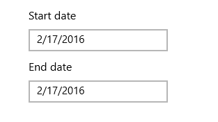
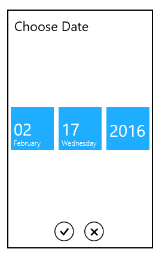

# Overview

The SfDatePicker control allows the user to select date values in a touch friendly manner.

### Normal view:

### Expanded view:

### Key Features

Formatting – The Control displays  the selected Date value in a various formats.

Date Selector – The drop-down portion used for selecting the date can be customized.

