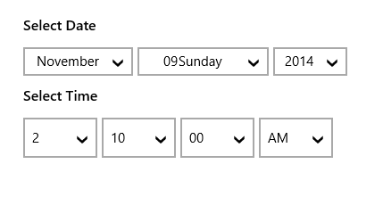

# Overview

The SfDateTimeCombo control displays each part of a date or time in a separate DateTimeItem drop-down list that can be edited. This control can be used to manipulate DateTime objects, using a familiar drop-down list in a touch-friendly manner.

### Key Features

Formatting – The control displays the selected date value in a various formats.

Customization – Each DateTimeItem displayed in this control contains date or time parts that can be customized.

