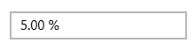
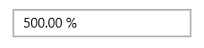

# Percent Display Mode

With the PercentDisplayMode property, you can specify how to display numeric data in Percent mode. It provides the following options:

* Value: Displays the value with percentage symbol.
* Compute: Displays the computed value with percentage symbol.

The following code example and screen shots illustrate the usage of the PercentDisplayMode property.





<Grid Background="{StaticResource ApplicationPageBackgroundThemeBrush}">

<syncfusion:SfNumericTextBox x:Name="numericTextBox" HorizontalAlignment="Center" VerticalAlignment="Center" Width="200" Value="5" FormatString="P" PercentDisplayMode="Value"/>

</Grid>









 numericTextBox.PercentDisplayMode = Syncfusion.UI.Xaml.Controls.Input.PercentDisplayMode.Value;





 numericTextBox.PercentDisplayMode = Syncfusion.UI.Xaml.Controls.Input.PercentDisplayMode.Value









<Grid Background="{StaticResource ApplicationPageBackgroundThemeBrush}">

<syncfusion:SfNumericTextBox HorizontalAlignment="Center" x:Name="numericTextBox"

VerticalAlignment="Center" Width="200" Value="5" FormatString="P"

PercentDisplayMode="Compute"/>

</Grid>









 numericTextBox.PercentDisplayMode = Syncfusion.UI.Xaml.Controls.Input.PercentDisplayMode.Compute;





 numericTextBox.PercentDisplayMode = Syncfusion.UI.Xaml.Controls.Input.PercentDisplayMode.Compute





