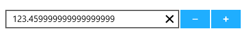

# ParsingMode

Value of the SfNumericUpDown gets parsed based on ParsingMode property. ParsingMode is of type Parsers which is enum of Double and Decimal. DefaultValue for ParsingMode is Double.





<Page xmlns:editors="using:Syncfusion.UI.Xaml.Controls.Input">

    <Grid Background="{StaticResource ApplicationPageBackgroundThemeBrush}">

        <editors:SfNumericUpDown HorizontalAlignment="Center" x:Name="numericUpDown"

                                 VerticalAlignment="Center"

                                 Width="250" 

                                 ParsingMode="Decimal"

                                 Value="123.459999999999999999"/>

    </Grid>

</Page>









numericUpDown.ParsingMode = Syncfusion.UI.Xaml.Controls.Input.Parsers.Decimal;





numericUpDown.ParsingMode = Syncfusion.UI.Xaml.Controls.Input.Parsers.Decimal





