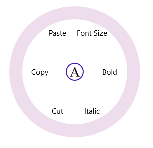

# Icon  

The Icon property of the SfRadialMenu is used to customize the icon displayed in the center of RadialMenu circle.   





<navigation:SfRadialMenu IsOpen="True" >

<navigation:SfRadialMenu.Icon>

                <Grid Background="White">

                    <Image Source="ms-appx:///Assets/text.png" Width="20"  

 	 	 	                Stretch="Uniform"/>

                </Grid>

            </navigation:SfRadialMenu.Icon>

 </navigation:SfRadialMenu>









 SfRadialMenu radialMenu = new SfRadialMenu() { IsOpen = true };

 Grid _grid = new Grid() { Background = new SolidColorBrush(Colors.White) };

 Image img = new Image() { Width = 20, Stretch = Stretch.Uniform };

 img.Source = new BitmapImage(new Uri(@"ms-appx:///Assets/text.png", UriKind.RelativeOrAbsolute)) ;

 _grid.Children.Add(img);

 radialMenu.Icon = _grid;





Dim radialMenu As New SfRadialMenu() With {.IsOpen = True}

 Dim _grid As New Grid() With {.Background = New SolidColorBrush(Colors.White)}

 Dim img As New Image() With {
	 .Width = 20,
	 .Stretch = Stretch.Uniform
 }

 img.Source = New BitmapImage(New Uri("ms-appx:///Assets/text.png", UriKind.RelativeOrAbsolute))

 _grid.Children.Add(img)

 radialMenu.Icon = _grid





