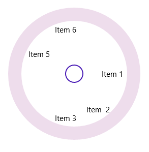

# Layout Types

There are two different layout types available for SfRadialMenu. 

* Default
* Custom

Both the layout types divide the available space equally among all the children in the circular panel.

## Default

Number of segments in the panel is determined by children count in the level. Hence segment count in each hierarchical level differs. RadialMenuItem is arranged in the sequential order as added in the RadialMenu.

## Custom

Number of segments in the panel is determined by VisibleSegmentsCount property. Hence segment count in all the hierarchical levels are same. RadialMenuItem is arranged in any order based on the SegmentIndex property.

## VisibleSegmentsCount

VisibleSegmentsCount property is used to specify the number of segments available in circular panel. When children count is greater than the value given in VisibleSegmentsCount property then overflowing children are not arranged in the panel. When children count is lesser than VisibleSegmentsCount property then remaining segments are left free.




<navigation:SfRadialMenu LayoutType="Custom" VisibleSegmentsCount="7" />









SfRadialMenu radialMenu = new SfRadialMenu();
radialMenu.LayoutType = LayoutType.Custom;
radialMenu.VisibleSegmentsCount = 7; 
 




SfRadialMenu radialMenu = new SfRadialMenu()
radialMenu.LayoutType = LayoutType.Custom
radialMenu.VisibleSegmentsCount = 7
 




## SegmentIndex

SegmentIndex property is used to specify the index of the SfRadialMenuItem in circular panel. Based on the index, the RadialMenuItems are inserted in the segment. When SegmentIndex is not specified for a RadialMenuItem (or) two or more RadialMenuItems having the same SegmentIndex, then the menu item is arranged in the next available free segment. 



 <navigation:SfRadialMenu LayoutType="Custom" VisibleSegmentsCount="7" />
 <navigation:SfRadialMenuItem Header="Item  2" SegmentIndex="1" />
 <navigation:SfRadialMenuItem Header="Item 5" SegmentIndex="4" /> 
 <navigation:SfRadialMenuItem Header="Item 1" SegmentIndex="0" />
 <navigation:SfRadialMenuItem Header="Item 6" SegmentIndex="5" />
 <navigation:SfRadialMenuItem Header="Item 3" SegmentIndex="2" />
 </navigation:SfRadialMenu> 








SfRadialMenu radialMenu = new SfRadialMenu();
radialMenu.LayoutType = LayoutType.Custom;
radialMenu.VisibleSegmentsCount = 7;          
radialMenu.Items.Add(new SfRadialMenuItem() { Header = "Item 2", SegmentIndex = 1 });
radialMenu.Items.Add(new SfRadialMenuItem() { Header = "Item 5", SegmentIndex = 4 });
radialMenu.Items.Add(new SfRadialMenuItem() { Header = "Item 1", SegmentIndex = 0 });
radialMenu.Items.Add(new SfRadialMenuItem() { Header = "Item 6", SegmentIndex = 5 });
radialMenu.Items.Add(new SfRadialMenuItem() { Header = "Item 3", SegmentIndex = 2 });





Dim radialMenu As New SfRadialMenu()
radialMenu.LayoutType = LayoutType.Custom
radialMenu.VisibleSegmentsCount = 7
radialMenu.Items.Add(New SfRadialMenuItem() With {
	.Header = "Item 2",
	.SegmentIndex = 1
})
radialMenu.Items.Add(New SfRadialMenuItem() With {
	.Header = "Item 5",
	.SegmentIndex = 4
})
radialMenu.Items.Add(New SfRadialMenuItem() With {
	.Header = "Item 1",
	.SegmentIndex = 0
})
radialMenu.Items.Add(New SfRadialMenuItem() With {
	.Header = "Item 6",
	.SegmentIndex = 5
})
radialMenu.Items.Add(New SfRadialMenuItem() With {
	.Header = "Item 3",
	.SegmentIndex = 2
})





