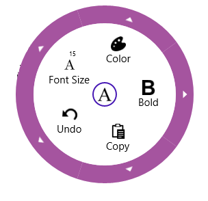

# Overview  

The SfRadialMenu displays a hierarchical menu in a circular layout optimized for touch devices. Typically used as a context menu, it can expose more menu items in the same space than traditional menus. 

### Key Features

* Items Source – Any business object collection can be bound to control. 
* Commanding – Each item can be bound to a command that could perform an action. 
* Color Palette – Easy to form radial color palette layout. 
