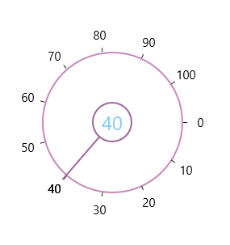

# Content Template

The ContentTemplate  property can be used to customize the content of the SfRadialSlider. 



  <syncfusion:SfRadialSlider

            Content="{Binding RelativeSource={RelativeSource Self}, Path=Value}"

            x:Name="rSlider1">

            <syncfusion:SfRadialSlider.ContentTemplate>

                <DataTemplate>

                  <TextBlock Text="{Binding}" FontSize="24" Foreground="LightSkyBlue"/>

                </DataTemplate>

            </syncfusion:SfRadialSlider.ContentTemplate>

  </syncfusion:SfRadialSlider>



