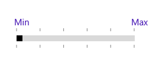
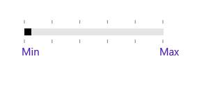
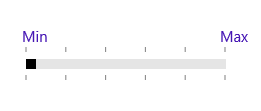
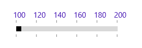
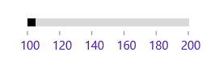
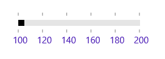
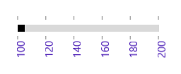

# Label Support

This feature allows users to display labels for custom values given in the CustomLabels collection when the ShowCustomLabels property is set to true. It also displays labels for all of the tick values when ShowValueLabels is set to true.

<table>
<tr>
<th>
Property</th><th>
Description</th></tr>
<tr>
<td>
CustomLabels</td><td>
It describes an observable collection of items that contains the custom labels and the values for which the labels should be displayed.</td></tr>
<tr>
<td>
ShowCustomLabels</td><td>
This property allows us to display custom labels for particular values based on CustomLabels collection.</td></tr>
<tr>
<td>
ShowValueLabels</td><td>
This property allows us to display labels for the ticks.</td></tr>
<tr>
<td>
LabelPlacement</td><td>
This property specifies the position of the custom label placement.</td></tr>
<tr>
<td>
ValuePlacement</td><td>
This property specifies the position of the label for all of the ticks.</td></tr>
<tr>
<td>
LabelOrientation</td><td>
LabelOrientation specifies the orientation of the labels as either horizontal or vertical.</td></tr>
</table>

## CustomLabels

CustomLabels is an observable collection of items which contains the Label and Value properties. We have to create an observable collection of items by specifying the custom labels for corresponding values as shown in the following code sample:





this.customCollection.Add(new Items(){label = "Min", value= 100});

this.customCollection.Add(new Items() { label = "Max", value = 200 });

private ObservableCollection<Items> customCollection = new ObservableCollection<Items>();

public ObservableCollection<Items> CustomCollection

{

get { return customCollection; }

set { customCollection = value; }

}





  Me.customCollection_Renamed.Add(New Items() With {
	.label = "Min",
	.value= 100
})

Me.customCollection_Renamed.Add(New Items() With {
	.label = "Max",
	.value = 200
})

private ObservableCollection(Of Items) customCollection_Renamed = New ObservableCollection(Of Items)()

public ObservableCollection(Of Items) CustomCollection

If True Then

Get
	Return customCollection_Renamed
End Get

Set
	customCollection_Renamed = value
End Set

End If





In the following sample, we have bound the CustomCollection property to CustomLabels property in the RangeSlider control, which populates the custom labels collection:





<editors:SfRangeSlider x:Name="rangeSlider" Width="200" Minimum="100" Maximum="200" TickFrequency="20" TickPlacement="Outside" ShowCustomLabels="True" CustomLabels="{Binding CustomCollection}" />





## ShowCustomLabels

The default value of ShowCustomLabels is false. When set to true, it will display the custom labels for particular values based on the CustomLabels collection.





<editors:SfRangeSlider x:Name="rangeSlider" Width="200" Minimum="100" Maximum="200" TickFrequency="20" TickPlacement="Outside" ShowCustomLabels="True" CustomLabels="{Binding CustomCollection}" />









   rangeSlider.ShowCustomLabels = true;





   rangeSlider.ShowCustomLabels = True





## LabelPlacement

LabelPlacement property describes the position of the custom labels for particular values mentioned in the CustomLabels collection. Available options for this property are:

1. BottomRight
2. TopLeft

The following code sample shows the usage of the LabelPlacement property. The output is displayed in the corresponding images.





<editors:SfRangeSlider x:Name="rangeSlider" Width="200" Minimum="100" Maximum="200" TickFrequency="20" TickPlacement="Outside" ShowCustomLabels="True" CustomLabels="{Binding CustomCollection}" LabelPlacement="BottomRight"/>









   rangeSlider.LabelPlacement = Syncfusion.UI.Xaml.Controls.Input.LabelPlacement.BottomRight;





   rangeSlider.LabelPlacement = Syncfusion.UI.Xaml.Controls.Input.LabelPlacement.BottomRight









<editors:SfRangeSlider x:Name="rangeSlider" Width="200" Minimum="100" Maximum="200" TickFrequency="20" TickPlacement="Outside" ShowCustomLabels="True" 

CustomLabels="{Binding CustomCollection}" LabelPlacement="TopLeft"/>









   rangeSlider.LabelPlacement = Syncfusion.UI.Xaml.Controls.Input.LabelPlacement.TopLeft;





   rangeSlider.LabelPlacement = Syncfusion.UI.Xaml.Controls.Input.LabelPlacement.TopLeft





## ShowValueLabels

The default value of the ShowValueLabels property is false. When set to true, it will display the label for all the ticks based on the ValuePlacement property.





<editors:SfRangeSlider x:Name="rangeSlider" Width="200" Minimum="100"   Maximum="200" TickFrequency="20" TickPlacement="BottomRight" ShowValueLabels="True"/>









   rangeSlider.ShowValueLabels = true;





  rangeSlider.ShowValueLabels = True





## ValuePlacement

The ValuePlacement property describes the position of the labels for all the ticks. Available options for this property are:

1. BottomRight
2. TopLeft

The following code sample shows the usage of ValuePlacement property. The output is displayed in the corresponding images.





<editors:SfRangeSlider x:Name="rangeSlider" Width="200" Minimum="100" Maximum="200" TickFrequency="20" TickPlacement="Outside" ShowValueLabels="True" ValuePlacement="TopLeft"/>









   rangeSlider.ValuePlacement = Syncfusion.UI.Xaml.Controls.Input.ValuePlacement.TopLeft;





  rangeSlider.ValuePlacement = Syncfusion.UI.Xaml.Controls.Input.ValuePlacement.TopLeft









<editors:SfRangeSlider x:Name="rangeSlider" Width="200" Minimum="100" Maximum="200" TickFrequency="20" TickPlacement="Outside" ShowValueLabels="True" ValuePlacement="BottomRight"/>









   rangeSlider.ValuePlacement = Syncfusion.UI.Xaml.Controls.Input.ValuePlacement.BottomRight;





  rangeSlider.ValuePlacement = Syncfusion.UI.Xaml.Controls.Input.ValuePlacement.BottomRight





## LabelOrientation

The LabelOrientation property describes the orientation of the labels for both ticks and custom labels. Available options for this property are:

1. Horizontal
2. Vertical

The following code sample shows the usage of LabelOrientation property. The output is displayed in the corresponding images.





<editors:SfRangeSlider x:Name="rangeSlider" Width="200" Minimum="100" Maximum="200" TickFrequency="20" TickPlacement="Outside" ShowValueLabels="True" LabelOrientation="Horizontal"/>









   rangeSlider.LabelOrientation = Orientation.Horizontal;





  rangeSlider.LabelOrientation = Orientation.Horizontal









<editors:SfRangeSlider x:Name="rangeSlider" Width="200" Minimum="100" Maximum="200" TickFrequency="20" TickPlacement="Outside" ShowValueLabels="True" LabelOrientation="Vertical"/>









   rangeSlider.LabelOrientation = Orientation.Vertical;





  rangeSlider.LabelOrientation = Orientation.Vertical





## Customizing label font

The range slider control provides the `FontFamily`, `FontWeight` , `FontStyle` and `FontSize` properties to customize the value text and custom label text.





<editors:SfRangeSlider x:Name="rangeSlider" Width="300" FontFamily="Times New Roman" FontSize="15" FontStyle="Normal" FontWeight="Bold" Minimum="100" Maximum="200" TickFrequency="20" TickPlacement="Outside" ShowValueLabels="True" LabelOrientation="Horizontal"/>









   rangeSlider.FontSize = 15;
   rangeSlider.FontStyle = Windows.UI.Text.FontStyle.Normal;
   rangeSlider.FontWeight = Windows.UI.Text.FontWeights.Bold;
   rangeSlider.FontFamily = new FontFamily("Times New Roman");





   rangeSlider.FontSize = 15
   rangeSlider.FontStyle = Windows.UI.Text.FontStyle.Normal
   rangeSlider.FontWeight = Windows.UI.Text.FontWeights.Bold
   rangeSlider.FontFamily = new FontFamily("Times New Roman")





